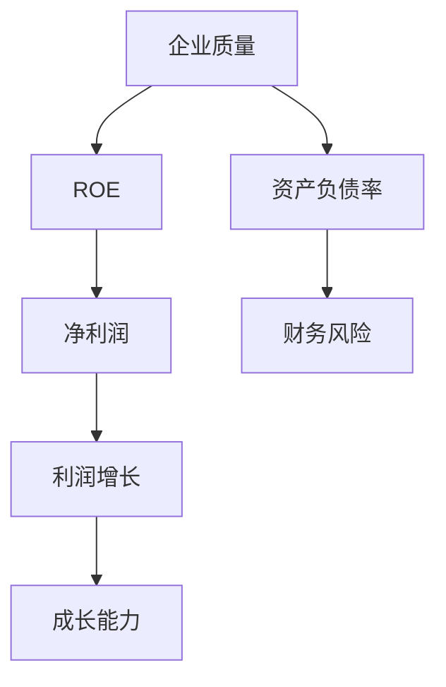
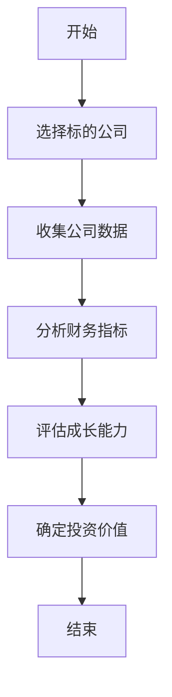
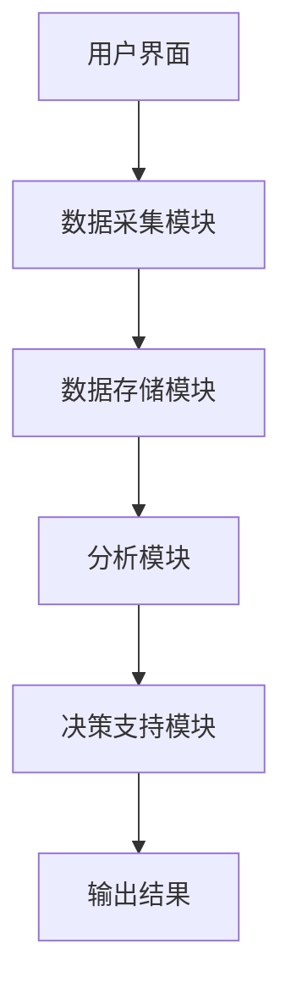
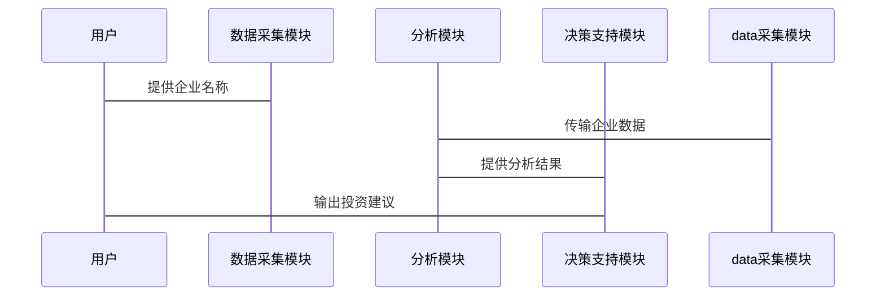

                 


# 彼得林奇的"质量成长"投资案例

## 关键词  
彼得林奇，质量成长投资，投资案例，投资策略，投资分析，投资系统，投资成功

## 摘要  
本文深入探讨了彼得林奇的"质量成长"投资理念，结合实际案例和系统分析，揭示其成功背后的逻辑和方法。通过详细的技术分析、算法原理和系统架构，本文为投资者提供了可操作的实战指南。

---

# 第1章: 质量成长投资的定义与背景

## 1.1 投资的定义与核心要素

### 1.1.1 投资的基本概念  
投资是通过将资金分配到不同资产类别中，以实现资产增值的过程。核心要素包括风险、收益、时间和资产类别。

### 1.1.2 股票投资的核心要素  
- 股票的基本属性：所有权、收益分配权、市场流动性。  
- 股票投资的核心要素：公司基本面、行业地位、财务健康状况、市场估值。  

### 1.1.3 质量成长投资的背景与现状  
质量成长投资是一种结合企业质量和成长能力的投资策略，起源于20世纪70年代，至今仍被广泛应用于机构投资和个人投资中。

## 1.2 彼得林奇的投资理念

### 1.2.1 彼得林奇的生平简介  
彼得·林奇是美国著名投资经理人，以其在富达基金（Fidelity）的卓越表现闻名。他强调长期投资和深入研究企业的基本面。

### 1.2.2 质量成长投资的定义  
质量成长投资是指选择具有高成长潜力且具备优秀质量特征的公司进行投资，关注企业的盈利能力和行业地位。

### 1.2.3 质量成长投资的核心思想  
- 投资于优秀企业的长期成长。  
- 通过深入分析企业基本面，寻找具有持续竞争优势的公司。  

## 1.3 质量成长投资的哲学基础

### 1.3.1 长期投资与价值发现  
质量成长投资强调长期持有优质资产，避免短期市场波动的干扰。

### 1.3.2 市场波动与投资机会  
市场波动为投资者提供了低位买入优质资产的机会，但需要结合企业基本面进行判断。

### 1.3.3 投资者心理与决策  
投资者心理偏差（如过度恐惧和贪婪）会影响决策，因此理性分析和纪律性是投资成功的关键。

---

# 第2章: 质量成长投资的核心概念与联系

## 2.1 质量成长投资的核心要素

### 2.1.1 企业质量的核心指标  
- 盈利能力：净利润率、ROE（净资产收益率）。  
- 财务健康状况：资产负债率、现金流情况。  
- 行业地位：市场占有率、竞争优势。  

### 2.1.2 成长能力的关键特征  
- 收入增长率：收入连续增长的公司具有更强的成长潜力。  
- 净利润增长率：净利润持续增长表明公司盈利能力提升。  

### 2.1.3 估值的合理性分析  
- 市盈率（P/E）：股价与每股收益的比率，用于评估股票的估值水平。  
- 市净率（P/B）：股价与每股净资产的比率，用于评估股票的估值合理性。  

## 2.2 核心概念之间的关系

### 2.2.1 企业质量与成长能力的对比表格  
| 指标类型 | 质量指标 | 成长指标 |
|----------|----------|----------|
| 盈利能力 | ROE      | 净利润增长率 |
| 财务状况 | 负债率    | 现金流状况 |
| 行业地位 | 市场占有率 | 市场潜力 |

### 2.2.2 质量与成长的实体关系图（Mermaid流程图）  


---

# 第3章: 质量成长投资的算法原理

## 3.1 质量成长投资的分析方法

### 3.1.1 基本面分析法  
基本面分析法通过分析企业的财务报表（收入表、资产负债表、现金流量表）来评估企业的盈利能力和财务健康状况。

### 3.1.2 财务指标评估法  
通过计算关键财务指标（如ROE、净利润增长率）来评估企业的质量和成长能力。

### 3.1.3 市场趋势分析法  
结合市场趋势和行业周期，判断企业的成长潜力。

## 3.2 算法流程图（Mermaid）



## 3.3 财务指标计算示例（Python代码）

### 示例1：ROE计算
```python
def calculate_roe(net_income, equity):
    return net_income / equity

net_income = 1000000  # 净利润（单位：元）
equity = 5000000      # 净资产（单位：元）
roe = calculate_roe(net_income, equity)
print(f"ROE: {roe * 100}%")  # 输出：ROE: 20.0%
```

### 示例2：净利润增长率计算
```python
def calculate_growth(revenue_current, revenue_previous):
    return (revenue_current - revenue_previous) / revenue_previous * 100

revenue_current = 15000000  # 当前收入（单位：元）
revenue_previous = 10000000 # 上期收入（单位：元）
growth = calculate_growth(revenue_current, revenue_previous)
print(f"净利润增长率：{growth}%")  # 输出：净利润增长率：50%
```

## 3.4 数学模型与公式

### 示例：ROE公式
$$\text{ROE} = \frac{\text{净利润}}{\text{净资产}}$$

### 示例：净利润增长率公式
$$\text{净利润增长率} = \frac{\text{当前净利润} - \text{上期净利润}}{\text{上期净利润}} \times 100\%$$

---

# 第4章: 质量成长投资的系统架构与设计

## 4.1 系统分析与功能设计

### 4.1.1 问题场景介绍  
投资者需要一个系统化的工具来筛选和评估具有质量成长特性的企业。

### 4.1.2 系统功能设计  
- 数据采集模块：收集企业财务数据和市场数据。  
- 分析模块：计算关键财务指标，评估企业质量和成长能力。  
- 决策支持模块：提供投资建议和风险提示。  

## 4.2 系统架构设计（Mermaid架构图）



## 4.3 系统接口与交互设计（Mermaid序列图）



---

# 第5章: 项目实战与案例分析

## 5.1 项目环境与工具安装

### 5.1.1 环境要求  
- Python 3.8及以上版本  
- 数据分析库：Pandas、NumPy  
- 可视化库：Matplotlib、Seaborn  

### 5.1.2 工具安装  
```bash
pip install pandas numpy matplotlib seaborn
```

## 5.2 系统核心实现源代码

### 示例：数据采集模块
```python
import pandas as pd

def collect_data(company_name):
    # 模拟从数据库或API获取数据
    data = {
        ' revenue': [10000000, 15000000],
        'net_income': [1000000, 1500000],
        'equity': [5000000, 7500000]
    }
    return pd.DataFrame(data)

data = collect_data("Apple")
print(data)
```

### 示例：分析模块
```python
import pandas as pd

def analyze_roe(data):
    roe = data['net_income'] / data['equity']
    return roe

def analyze_growth(revenue_data):
    growth = (revenue_data['revenue'].diff() / revenue_data['revenue'].shift()).fillna(0)
    return growth

data = pd.DataFrame({
    'revenue': [10000000, 15000000],
    'net_income': [1000000, 1500000],
    'equity': [5000000, 7500000]
})

roe = analyze_roe(data)
growth = analyze_growth(data)
print(f"ROE: {roe}")
print(f"净利润增长率: {growth}")
```

## 5.3 案例分析与详细解读

### 案例：某科技公司投资分析  
通过分析该公司的ROE和净利润增长率，评估其质量和成长能力，最终得出投资建议。

## 5.4 项目小结  
通过实战案例，展示了如何利用系统化的分析方法进行质量成长投资。

---

# 第6章: 最佳实践与注意事项

## 6.1 投资策略的注意事项

### 6.1.1 风险控制  
- 分散投资：避免过度集中于单一行业或公司。  
- 定期复盘：评估投资组合的表现并及时调整。  

### 6.1.2 深入研究  
- 了解公司的商业模式和竞争优势。  
- 关注行业动态和政策变化。  

## 6.2 系统设计的优化建议

### 6.2.1 数据来源可靠性  
确保数据来源的准确性和时效性。  
### 6.2.2 系统可扩展性  
设计模块化架构，方便未来功能扩展。

## 6.3 投资成功的关键因素

### 6.3.1 长期视角  
避免短期市场波动的干扰，关注企业的长期成长。  
### 6.3.2 知识积累  
持续学习和研究，提升自己的投资能力。  

## 6.4 拓展阅读  
推荐书籍和资源，帮助读者进一步深入学习质量成长投资。

---

# 第7章: 小结与展望

## 7.1 总结  
本文通过详细分析彼得林奇的质量成长投资理念，结合系统设计和实战案例，为投资者提供了可操作的投资方法。

## 7.2 未来展望  
随着人工智能和大数据技术的发展，质量成长投资将更加依赖于系统化的分析和数据驱动的决策。

---

通过以上目录结构，我们可以看到，本文从理论到实践，层层递进，为读者提供了全面的质量成长投资分析框架。

