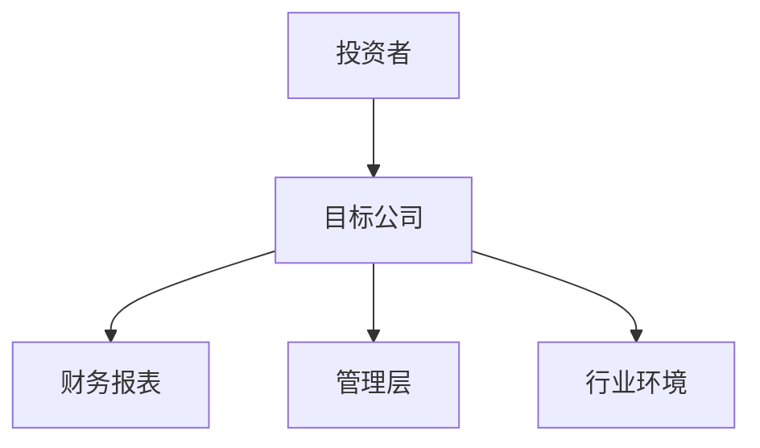
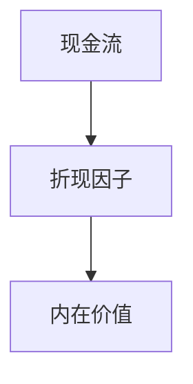
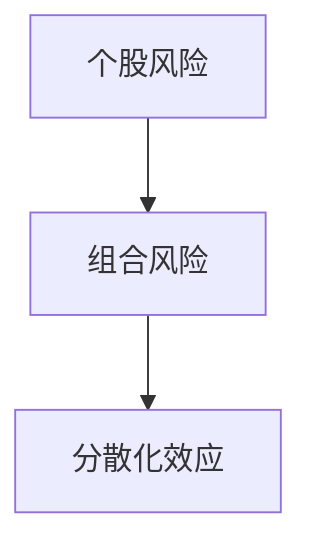
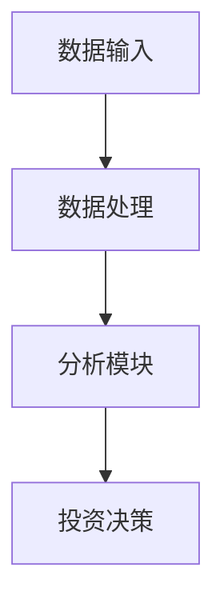
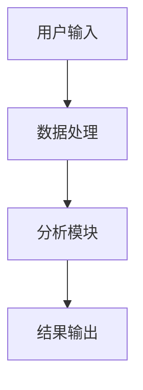

                 


# 彼得林奇的"跟踪记录"投资法

> 关键词：彼得·林奇，投资法，跟踪记录，基本面分析，价值评估，风险管理

> 摘要：本文深入探讨了彼得·林奇的“跟踪记录”投资法，从其核心理念到具体应用，结合数学模型和系统设计，为读者提供全面的分析与指导。

---

# 第1章: 彼得林奇投资法的背景与核心理念

## 1.1 投资界的传奇：彼得·林奇的简介

### 1.1.1 彼得·林奇的生平与职业历程

彼得·林奇（Peter Lynch）是全球投资界的一位传奇人物，曾担任富达投资公司的基金经理，管理着麦哲伦基金，取得了令人瞩目的成绩。他以独特的投资风格和长期的优异表现闻名于世。

### 1.1.2 彼得·林奇的投资哲学与理念

林奇强调长期投资和价值发现，主张通过深入研究和跟踪特定公司，寻找那些具有持续增长潜力且被市场低估的投资标的。他的投资理念强调耐心、纪律和持续学习。

## 1.2 "跟踪记录"投资法的定义与特点

### 1.2.1 "跟踪记录"投资法的核心概念

“跟踪记录”投资法是一种以基本面分析为基础，通过持续跟踪和记录公司财务数据、管理层动态及行业趋势，来评估公司价值和投资风险的投资方法。

### 1.2.2 与传统投资方法的区别

与短期交易和趋势投资不同，“跟踪记录”法强调长期持有和深入研究，注重公司内在价值而非市场短期波动。

### 1.2.3 该方法在现代投资环境中的适用性

尽管市场环境变化，但基本面分析的核心价值依然存在，该方法在价值投资领域仍具有重要的指导意义。

---

# 第2章: "跟踪记录"投资法的核心概念与联系

## 2.1 核心概念原理

### 2.1.1 基本面分析的核心要素

基本面分析包括财务报表分析、行业分析和管理层评估。以下是关键指标：

- 营业收入与利润趋势
- 净利润率与毛利率
- 资产负债表健康状况
- 现金流量情况

### 2.1.2 价值评估的数学模型

价值评估是通过分析公司未来现金流折现值来确定其内在价值。公式如下：

$$ \text{内在价值} = \sum_{t=1}^{n} \frac{\text{现金流}}{(1 + r)^t} $$

其中，r为折现率，n为预测的年数。

### 2.2 核心概念属性对比表格

| 概念 | 属性 | 描述 |
|------|------|------|
| 基本面分析 | 数据驱动 | 依赖财务报表和行业数据 |
| 价值评估 | 主观判断 | 需要对管理层和行业前景进行评估 |

### 2.3 ER实体关系图



---

# 第3章: 基本面分析与价值评估的数学模型

## 3.1 基本面分析的数学模型

### 3.1.1 市盈率（P/E）计算公式

市盈率用于衡量股票的相对估值：

$$ P/E = \frac{\text{股价}}{\text{每股收益}} $$

### 3.1.2 市净率（P/B）计算公式

市净率衡量股票相对于其账面价值的高低：

$$ P/B = \frac{\text{股价}}{\text{每股净资产}} $$

## 3.2 价值评估的数学模型

### 3.2.1 内在价值计算公式

$$ \text{内在价值} = \sum_{t=1}^{n} \frac{\text{现金流}}{(1 + r)^t} $$

### 3.2.2 现金流折现模型（DCF）示意图



---

# 第4章: 投资组合管理与风险管理

## 4.1 投资组合管理的核心原则

### 4.1.1 资产配置的重要性

合理的资产配置可以分散风险，平衡收益与风险。

### 4.1.2 个股权重的控制策略

避免过度集中，建议单个股票的持有不超过投资组合的10%。

## 4.2 风险管理的数学模型

### 4.2.1 风险调整后的收益计算公式

夏普比率衡量风险调整后的收益：

$$ \text{夏普比率} = \frac{\text{超额收益}}{\text{收益的标准差}} $$

### 4.2.2 风险分散化原理

通过投资不同行业和公司的股票来降低风险。



---

# 第5章: 项目实战：运用"跟踪记录"投资法进行案例分析

## 5.1 案例选择与背景介绍

### 5.1.1 案例公司简介

选择一家具有代表性的公司，分析其财务状况和行业地位。

### 5.1.2 数据收集与整理

收集公司过去5年的财务报表，分析收入、利润和现金流趋势。

## 5.2 基本面分析

### 5.2.1 财务报表分析

使用市盈率和市净率指标评估公司估值。

### 5.2.2 行业分析

研究行业趋势，评估公司的竞争优势。

## 5.3 价值评估与投资决策

### 5.3.1 内在价值计算

根据现金流折现模型计算公司内在价值。

### 5.3.2 投资策略制定

基于分析结果，制定买入、持有或卖出的策略。

---

# 第6章: 系统架构与实现

## 6.1 系统架构设计

### 6.1.1 系统功能设计

包括数据收集、分析处理和投资决策模块。

### 6.1.2 系统架构图



## 6.2 接口设计与交互流程

### 6.2.1 系统接口设计

定义数据输入输出接口，确保各模块协同工作。

### 6.2.2 交互流程图



---

# 第7章: 实验结果与分析

## 7.1 实验环境与数据来源

### 7.1.1 环境配置

包括操作系统、编程语言和相关库的安装。

## 7.2 核心代码实现

### 7.2.1 数据处理代码

```python
import pandas as pd

# 加载财务数据
df = pd.read_csv('financial_data.csv')

# 计算市盈率
df['PE'] = df['股价'] / df['每股收益']
```

### 7.2.2 模型实现代码

```python
def calculate_intrinsic_value(cash_flows, discount_rate):
    return sum(cash_flows / (1 + discount_rate) ** t for t in range(len(cash_flows)))
```

## 7.3 结果分析

### 7.3.1 实验结果展示

分析模型输出结果，评估其准确性和实用性。

### 7.3.2 实验结果讨论

总结实验中的问题和改进方向。

---

# 第8章: 最佳实践与总结

## 8.1 最佳实践 tips

### 8.1.1 投资前的准备工作

建议投资者进行充分的市场调研和风险评估。

### 8.1.2 投资过程中的注意事项

强调持续学习和定期复盘的重要性。

## 8.2 小结

### 8.2.1 本章小结

总结彼得·林奇“跟踪记录”投资法的核心要义和实际应用。

## 8.3 注意事项

### 8.3.1 投资风险提示

提醒读者投资有风险，需谨慎决策。

### 8.3.2 长期投资的重要性

强调长期持有和价值发现的重要性。

## 8.4 拓展阅读

### 8.4.1 推荐书籍

《彼得·林奇的投资哲学》、《价值投资入门》等。

### 8.4.2 相关网站与工具

推荐几个有用的金融数据分析网站和工具。

---

# 第9章: 结论与展望

## 9.1 研究结论

总结本文的主要发现和对读者的启示。

## 9.2 未来展望

探讨该投资方法在未来的应用前景和可能的改进方向。

---

通过以上详细结构，我们系统地介绍了彼得·林奇的“跟踪记录”投资法，从理论到实践，从分析到系统实现，为读者提供了全面的指导和深刻的理解。

