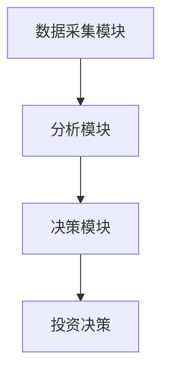

                 

# 彼得林奇的"逆向思维"在新兴市场债券投资中的运用

> 关键词：彼得林奇、逆向思维、新兴市场、债券投资、风险管理、系统化策略

> 摘要：本文探讨了彼得林奇的逆向思维在新兴市场债券投资中的应用，分析了新兴市场的特点、债券类型及投资挑战。结合逆向思维的三个阶段，详细阐述了市场情绪分析、债券估值及投资策略的制定，并提出了系统化的投资策略和风险管理方法。通过实证分析和案例研究，验证了逆向思维的有效性，并总结了最佳实践和未来研究方向。

---

## 第一章: 彼得林奇逆向思维的定义与核心理念

### 1.1 逆向思维的定义

逆向思维是一种不同于传统思维方式的策略，强调从反方向入手解决问题。在投资领域，逆向思维意味着在市场恐慌时寻找机会，在市场乐观时保持警惕。

### 1.2 彼得林奇逆向思维的核心理念

彼得林奇是逆向思维的杰出代表，他强调：
1. **市场情绪分析**：识别市场的非理性情绪，如过度恐慌或乐观。
2. **寻找低估机会**：在市场低迷时，寻找被低估的资产。
3. **长期视角**：关注长期价值，而非短期波动。

### 1.3 逆向思维在投资中的应用价值

通过逆向思维，投资者可以在市场底部买入，在顶部卖出，实现超额收益。这种策略尤其适用于新兴市场，因其波动性更大，逆向思维的潜在收益也更高。

---

## 第二章: 新兴市场债券投资的特点与挑战

### 2.1 新兴市场的定义与特点

新兴市场通常指经济发展迅速、但尚未达到发达国家水平的国家。这些市场的特点是：
- **高增长潜力**：新兴市场经济增长快，投资机会多。
- **高波动性**：市场波动较大，受外部因素影响显著。
- **复杂性**：政治、经济和政策环境不稳定。

### 2.2 新兴市场债券的类型

新兴市场的债券种类多样，主要包括：
1. **国家债券**：由政府发行，风险较低，但受国家政策影响。
2. **企业债券**：由企业发行，风险较高，但收益也更高。
3. **其他债券类型**：如可转换债券、垃圾债券等。

### 2.3 新兴市场债券投资的挑战

新兴市场债券投资面临多重挑战：
- **市场波动性**：市场波动剧烈，影响债券价格。
- **政治风险**：政策变化和政治不稳定可能导致债券贬值。
- **经济周期影响**：经济周期波动对债券收益有直接影响。

---

## 第三章: 逆向思维在新兴市场债券投资中的应用

### 3.1 逆向思维与市场情绪分析

#### 3.1.1 市场情绪的识别方法

市场情绪可以通过多种指标衡量，如债券收益率、交易量和投资者情绪指数。彼得林奇强调，市场情绪的非理性是投资机会的来源。

#### 3.1.2 市场情绪与债券价格的关系

市场情绪与债券价格呈反相关关系。当市场情绪高涨时，债券价格可能被高估；当市场情绪低落时，债券价格可能被低估。

#### 3.1.3 如何利用市场情绪制定投资策略

在市场情绪低落时，投资者应寻找被低估的债券；在市场情绪高涨时，应警惕潜在风险。

### 3.2 逆向思维与债券估值

#### 3.2.1 债券估值的基本原理

债券估值基于其未来现金流的现值。公式为：
$$
V = \frac{C}{(1+r)^n}
$$
其中，$C$为现金流，$r$为折现率，$n$为时间。

#### 3.2.2 如何识别市场低估的债券

通过比较债券的市场价与理论价值，识别被低估的债券。例如，若市场价低于理论价值，债券可能被低估。

#### 3.2.3 债券估值的数学模型

使用CAPM模型评估债券的预期收益：
$$
r = r_f + β(r_m - r_f)
$$
其中，$r_f$为无风险利率，$r_m$为市场预期收益，$β$为债券的贝塔系数。

### 3.3 逆向思维与投资策略制定

#### 3.3.1 投资策略的制定步骤

1. **分析市场情绪**：识别市场低估或高估的情况。
2. **评估债券估值**：计算理论价值，比较市场价。
3. **制定投资计划**：在低估时买入，在高估时卖出。

#### 3.3.2 在新兴市场中应用逆向思维

新兴市场的波动性为逆向思维提供了更多机会。投资者应关注市场低迷时期，寻找被低估的债券。

#### 3.3.3 投资策略的动态调整

根据市场变化，动态调整投资策略。例如，在市场情绪转向乐观时，逐步减少持仓。

---

## 第四章: 系统化的逆向思维投资策略

### 4.1 投资系统的设计与构建

#### 4.1.1 系统设计的基本原则

投资系统应具备以下原则：
1. **数据驱动**：基于历史数据和实时数据进行分析。
2. **模块化**：系统应分为数据采集、分析、决策三个模块。
3. **可扩展性**：系统应能适应新兴市场的复杂性。

#### 4.1.2 系统架构的模块划分

- **数据采集模块**：收集债券市场数据。
- **分析模块**：评估债券估值和市场情绪。
- **决策模块**：制定投资策略。

#### 4.1.3 投资系统的量化分析

使用量化模型评估债券的预期收益和风险。例如，使用回归模型分析债券收益率与市场波动性的关系。

### 4.2 系统架构设计

使用Mermaid绘制系统架构图：

---

## 第五章: 风险管理与逆向思维

### 5.1 风险管理的重要性

在新兴市场，风险管理是投资成功的关键。逆向思维下，投资者需识别潜在风险并制定应对策略。

### 5.2 逆向思维下的风险管理策略

1. **分散投资**：避免过度集中于单一债券或市场。
2. **设定止损点**：在市场波动较大时，设定止损点以控制损失。
3. **定期评估**：定期审查投资组合，调整持仓。

---

## 第六章: 实证分析与案例研究

### 6.1 实证分析

通过历史数据验证逆向思维策略的有效性。例如，分析2008年全球金融危机期间，逆向思维策略在新兴市场债券投资中的表现。

### 6.2 案例分析

案例：2010年，某新兴市场因政局不稳导致债券价格大幅下跌。逆向思维投资者在价格低点买入，随后市场恢复，获得超额收益。

---

## 第七章: 总结与展望

### 7.1 总结

彼得林奇的逆向思维为新兴市场债券投资提供了有效策略。通过分析市场情绪、估值和制定投资计划，投资者可以在波动的市场中获利。

### 7.2 展望

未来研究可进一步探讨逆向思维与其他投资策略的结合，如结合机器学习进行市场预测。

### 7.3 最佳实践 tips

- **保持耐心**：逆向思维需要长期坚持，避免短期波动影响决策。
- **持续学习**：关注市场变化，提升分析能力。
- **谨慎操作**：在新兴市场中，风险较高，需谨慎操作。

---

通过以上章节，读者可以全面了解彼得林奇的逆向思维在新兴市场债券投资中的应用，掌握从理论到实践的完整投资策略。

