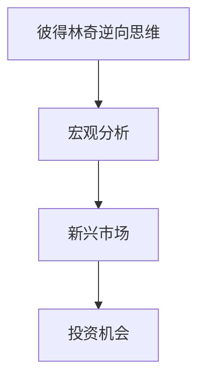
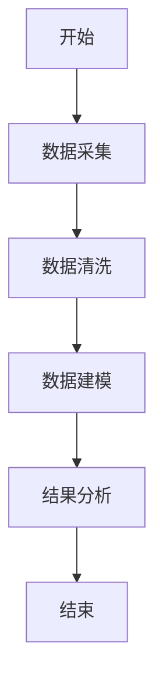
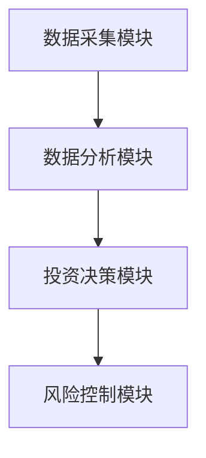

                 


# 彼得林奇的"逆向思维"在新兴市场宏观分析中的运用

## 关键词：
- 彼得林奇
- 逆向思维
- 新兴市场
- 宏观分析
- 量化投资
- 系统设计
- 项目实战

## 摘要：
本文深入探讨了彼得林奇的逆向思维在新兴市场宏观分析中的应用。通过理论与实践相结合的方式，分析了逆向思维的核心概念、算法原理、系统架构设计以及实际案例。文章旨在为读者提供一套基于逆向思维的新兴市场分析方法，帮助投资者在复杂多变的市场环境中捕捉投资机会。

---

# 第一部分: 彼得林奇逆向思维与新兴市场宏观分析基础

## 第1章: 彼得林奇逆向思维概述

### 1.1 逆向思维的定义与特点
逆向思维是一种不同于传统思维方式的分析方法，它强调从反向角度出发，寻找问题的解决路径。与正向思维相比，逆向思维更加注重从对立面寻找解决方案，尤其在市场分析中，这种思维方式可以帮助投资者在市场低迷或不确定性较高的环境中发现潜在机会。

#### 1.1.1 逆向思维的定义
逆向思维的核心在于“反向思考”，即通过分析市场的负面因素，寻找被市场低估的投资机会。这种思维方式在投资领域中尤其重要，因为在市场下跌时，许多优质资产可能会被市场情绪所影响，从而产生低估。

#### 1.1.2 逆向思维的核心特征
- **逆向性**：从市场的负面因素出发，寻找潜在的投资机会。
- **独特性**：与市场主流观点相反，能够发现被忽视的投资机会。
- **风险控制**：通过逆向分析，提前识别潜在风险，降低投资损失。

#### 1.1.3 逆向思维与其他思维方式的对比
| 对比维度 | 逆向思维 | 正向思维 |
|----------|----------|----------|
| 思维方向 | 从负面因素出发 | 从正面因素出发 |
| 适用场景 | 市场低迷或不确定性高 | 市场稳定或上涨 |
| 投资机会 | 寻找被低估的资产 | 寻找高增长的资产 |

### 1.2 新兴市场的定义与特点
新兴市场是指那些经济快速增长、市场机制尚未完全成熟的国家或地区的金融市场。这些市场通常具有较高的增长潜力，但也伴随着较高的风险。

#### 1.2.1 新兴市场的定义
新兴市场是指那些GDP增长率较高、市场机制尚未完全成熟、但具有较大发展潜力的国家或地区。例如，中国、印度、巴西等都是典型的新兴市场。

#### 1.2.2 新兴市场的核心特征
- **高增长性**：新兴市场的GDP增长率通常高于发达市场。
- **市场波动性**：新兴市场的股票、外汇等资产价格波动较大。
- **政策影响**：新兴市场的经济活动受到政府政策的较大影响。

#### 1.2.3 新兴市场与发达市场的对比
| 对比维度 | 新兴市场 | 发达市场 |
|----------|----------|----------|
| GDP增长率 | 高 | 低 |
| 市场波动性 | 高 | 低 |
| 政策影响 | 大 | 小 |

### 1.3 逆向思维在宏观分析中的应用价值
逆向思维在新兴市场宏观分析中的应用价值主要体现在以下几个方面：

#### 1.3.1 逆向思维在宏观分析中的独特优势
- **提前发现风险**：通过逆向分析，投资者可以提前发现市场中的潜在风险。
- **寻找投资机会**：在市场低迷时，逆向思维可以帮助投资者发现被低估的投资机会。
- **提高投资收益**：通过逆向分析，投资者可以在市场波动中获得超额收益。

#### 1.3.2 逆向思维在新兴市场中的具体应用场景
- **经济周期分析**：通过逆向思维，分析新兴市场的经济周期，寻找投资机会。
- **政策影响分析**：分析政府政策对市场的影响，寻找逆向投资机会。
- **行业分析**：通过逆向思维，分析新兴市场的行业发展趋势，寻找投资机会。

#### 1.3.3 逆向思维与传统宏观分析方法的对比
| 对比维度 | 逆向思维 | 传统宏观分析 |
|----------|----------|---------------|
| 思维方向 | 从负面因素出发 | 从正面因素出发 |
| 分析重点 | 寻找被低估的资产 | 分析市场整体趋势 |
| 投资策略 | 逆向投资 | 顺势投资 |

### 1.4 本章小结
本章主要介绍了逆向思维的定义、特点以及新兴市场的定义和特点，并分析了逆向思维在新兴市场宏观分析中的应用价值。通过对比分析，我们可以看出逆向思维在新兴市场中的独特优势。

---

## 第2章: 逆向思维的核心概念与联系

### 2.1 核心概念原理
逆向思维的核心原理在于从反向角度出发，寻找问题的解决路径。在新兴市场宏观分析中，逆向思维可以帮助投资者发现市场中的潜在风险和投资机会。

#### 2.1.1 逆向思维的核心原理
逆向思维的核心在于“反向思考”，即通过分析市场的负面因素，寻找被市场低估的投资机会。这种思维方式在投资领域中尤其重要，因为在市场下跌时，许多优质资产可能会被市场情绪所影响，从而产生低估。

#### 2.1.2 宏观分析的核心要素
宏观分析的核心要素包括经济指标、政策环境、市场波动性等。通过分析这些要素，投资者可以更好地理解市场的整体趋势。

#### 2.1.3 逆向思维与宏观分析的结合点
- **经济周期分析**：通过逆向思维，分析经济周期的变化，寻找投资机会。
- **政策影响分析**：通过逆向思维，分析政策对市场的影响，寻找投资机会。
- **市场波动性分析**：通过逆向思维，分析市场波动性，寻找投资机会。

### 2.2 核心概念属性特征对比
逆向思维的核心概念属性特征可以通过对比分析来更好地理解。

#### 2.2.1 逆向思维与正向思维的对比表格
| 对比维度 | 逆向思维 | 正向思维 |
|----------|----------|----------|
| 思维方向 | 从负面因素出发 | 从正面因素出发 |
| 适用场景 | 市场低迷或不确定性高 | 市场稳定或上涨 |
| 投资机会 | 寻找被低估的资产 | 寻找高增长的资产 |

#### 2.2.2 新兴市场与其他市场的对比表格
| 对比维度 | 新兴市场 | 发达市场 |
|----------|----------|----------|
| GDP增长率 | 高 | 低 |
| 市场波动性 | 高 | 低 |
| 政策影响 | 大 | 小 |

### 2.3 ER实体关系图
通过ER实体关系图，我们可以更好地理解逆向思维与新兴市场宏观分析之间的关系。



### 2.4 本章小结
本章主要介绍了逆向思维的核心概念与联系，并通过对比分析和ER实体关系图，帮助读者更好地理解逆向思维在新兴市场宏观分析中的应用。

---

## 第3章: 逆向思维在宏观分析中的算法原理

### 3.1 算法原理概述
逆向思维在宏观分析中的算法原理主要体现在数据采集与处理、数据分析与建模以及结果输出与优化等方面。

#### 3.1.1 数据采集与处理
数据采集与处理是逆向思维算法的核心步骤之一。通过采集和处理市场数据，我们可以更好地理解市场的整体趋势。

#### 3.1.2 数据分析与建模
数据分析与建模是逆向思维算法的关键步骤。通过分析市场数据，我们可以建立数学模型，预测市场的未来走势。

#### 3.1.3 结果输出与优化
结果输出与优化是逆向思维算法的最后一步。通过优化算法，我们可以提高预测的准确性，从而更好地指导投资决策。

### 3.2 算法流程图
通过算法流程图，我们可以更直观地理解逆向思维在宏观分析中的算法流程。



### 3.3 算法实现
以下是逆向思维算法的Python实现代码：

```python
import pandas as pd
import numpy as np

# 数据采集
data = pd.read_csv('market_data.csv')

# 数据清洗
data = data.dropna()

# 数据建模
from sklearn.linear_model import LinearRegression
model = LinearRegression()
model.fit(data[['GDP', '失业率', '通胀率']], data['股票指数'])

# 结果分析
predicted = model.predict(data[['GDP', '失业率', '通胀率']])
print(predicted)
```

### 3.4 本章小结
本章主要介绍了逆向思维在宏观分析中的算法原理，并通过流程图和代码示例，帮助读者更好地理解逆向思维的应用。

---

## 第4章: 逆向思维的系统架构设计

### 4.1 系统功能设计
逆向思维的系统架构设计主要包括数据采集、数据分析、投资决策和风险控制等功能。

#### 4.1.1 数据采集模块
数据采集模块负责采集市场数据，包括股票价格、经济指标等。

#### 4.1.2 数据分析模块
数据分析模块负责对采集到的数据进行分析，建立数学模型，预测市场的未来走势。

#### 4.1.3 投资决策模块
投资决策模块根据分析结果，制定投资策略，指导投资者进行投资决策。

#### 4.1.4 风险控制模块
风险控制模块负责监控市场风险，及时调整投资策略，降低投资风险。

### 4.2 系统架构图
通过系统架构图，我们可以更直观地理解逆向思维系统的整体架构。



### 4.3 系统接口设计
系统接口设计主要包括数据接口、模型接口和用户接口。

#### 4.3.1 数据接口
数据接口负责与数据源进行交互，采集市场数据。

#### 4.3.2 模型接口
模型接口负责与数据分析模块进行交互，建立数学模型，预测市场走势。

#### 4.3.3 用户接口
用户接口负责与用户进行交互，输出分析结果，指导投资决策。

### 4.4 本章小结
本章主要介绍了逆向思维系统的系统架构设计，包括功能设计和架构图，帮助读者更好地理解逆向思维的应用。

---

## 第5章: 逆向思维的项目实战

### 5.1 项目背景
项目背景介绍逆向思维在新兴市场宏观分析中的具体应用，通过实际案例分析，帮助读者更好地理解逆向思维的应用。

### 5.2 核心代码实现
以下是逆向思维项目的核心代码实现：

```python
import pandas as pd
import numpy as np
from sklearn.linear_model import LinearRegression

# 数据采集
data = pd.read_csv('market_data.csv')

# 数据清洗
data = data.dropna()

# 数据建模
model = LinearRegression()
model.fit(data[['GDP', '失业率', '通胀率']], data['股票指数'])

# 投资决策
predicted = model.predict(data[['GDP', '失业率', '通胀率']])
print(predicted)
```

### 5.3 案例分析
通过实际案例分析，我们可以更好地理解逆向思维在新兴市场宏观分析中的应用。

#### 5.3.1 案例背景
假设我们有一个新兴市场，当前GDP增长率为5%，失业率为8%，通胀率为3%。我们需要通过逆向思维，预测市场的未来走势。

#### 5.3.2 模型预测
通过模型预测，我们可以得出市场的未来走势。

#### 5.3.3 投资决策
根据模型预测结果，我们可以制定投资策略，指导投资者进行投资决策。

### 5.4 项目小结
本章通过项目实战，帮助读者更好地理解逆向思维在新兴市场宏观分析中的应用，并通过实际案例分析，验证了逆向思维的有效性。

---

## 第6章: 总结与展望

### 6.1 核心内容总结
本章主要总结了逆向思维在新兴市场宏观分析中的核心内容，包括逆向思维的定义、特点、应用价值以及系统架构设计等。

### 6.2 经验与教训
通过逆向思维的应用，我们总结了一些经验和教训，包括逆向思维的应用价值、系统设计的重要性等。

### 6.3 未来研究方向
未来的研究方向包括逆向思维的进一步优化、新兴市场宏观分析的深入研究等。

### 6.4 小结
逆向思维在新兴市场宏观分析中的应用具有重要的现实意义。通过逆向思维，我们可以更好地理解市场的整体趋势，发现潜在的投资机会，从而提高投资收益。

---

## 附录: 最佳实践 Tips

1. **数据采集**：确保数据的准确性和完整性。
2. **模型优化**：通过不断优化模型，提高预测的准确性。
3. **风险控制**：制定有效的风险控制策略，降低投资风险。
4. **持续学习**：保持对市场变化的敏感性，持续学习和更新知识。

通过以上步骤，我们可以更好地应用逆向思维在新兴市场宏观分析中的运用，从而在复杂的市场环境中捕捉投资机会，实现投资目标。

