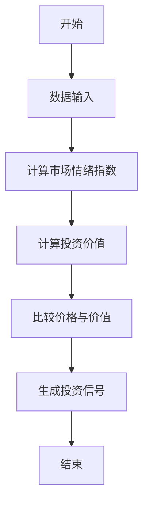
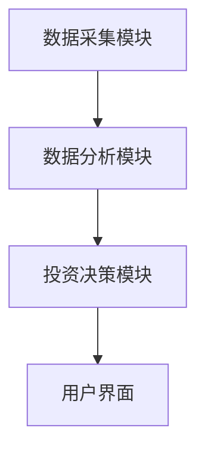
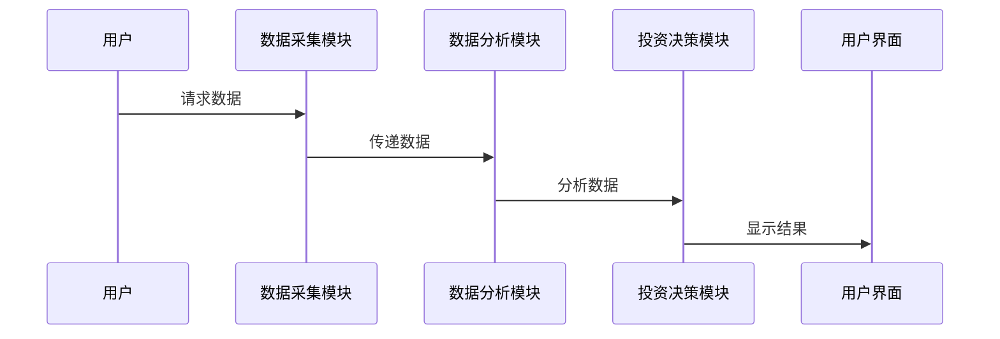

                 


# 彼得林奇的"逆向思维"在新兴市场投资中的应用

> 关键词：彼得林奇、逆向思维、新兴市场、投资策略、风险管理

> 摘要：本文探讨了彼得林奇的逆向思维在新兴市场投资中的应用，分析了其核心理念、算法原理、系统设计及项目实战，为投资者提供了从理论到实践的深度指导。

---

## 第1章 彼得林奇逆向思维的背景与核心概念

### 1.1 逆向思维的定义与特点

#### 1.1.1 逆向思维的定义
逆向思维是一种与传统思维相反的思考方式，通过分析问题的反面来寻找解决方案。在投资领域，逆向思维意味着在市场低迷时寻找机会，而非在市场繁荣时盲目跟风。

#### 1.1.2 逆向思维的核心特点
- **反周期性**：逆向思维关注市场周期的低谷，寻找被低估的投资机会。
- **非共识性**：与大多数投资者的决策相反，寻找市场中的冷门领域。
- **风险承受**：逆向投资者通常具备较强的心理承受能力，能够在市场低迷时坚持投资。

#### 1.1.3 逆向思维与传统思维的对比
| 特性 | 逆向思维 | 传统思维 |
|------|----------|----------|
| 投资时机 | 市场低谷时投资 | 市场高点时投资 |
| 投资标的 | 低估值股票 | 高估值股票 |
| 风险管理 | 重视风险控制 | 侧重收益追求 |

### 1.2 彼得林奇投资理念的核心要素

#### 1.2.1 彼得林奇的投资者画像
彼得林奇强调长期投资，寻找那些具有持续增长潜力的企业。他建议投资者选择那些管理良好、财务健康、行业地位稳固的公司。

#### 1.2.2 彼得林奇的选股标准
- **低市盈率**：选择市盈率低于市场平均水平的股票。
- **低市净率**：市净率低于行业平均水平。
- **高分红率**：优先考虑高分红的公司，确保稳定的现金流。

#### 1.2.3 彼得林奇的长期投资策略
彼得林奇主张长期持有优质股票，避免频繁交易。他认为市场波动是短期的，优质企业的长期价值是投资的核心。

### 1.3 新兴市场的特点与投资机会

#### 1.3.1 新兴市场的定义与范围
新兴市场指那些经济快速增长、但尚未完全工业化的国家，如中国、印度、巴西等。这些市场的特点是增长潜力大，但波动性也较高。

#### 1.3.2 新兴市场的投资特点
- **高波动性**：新兴市场受政策、经济等因素影响，波动较大。
- **高增长性**：经济增长速度快，企业盈利能力强。
- **高风险性**：政治、经济等不确定因素较多。

#### 1.3.3 新兴市场的潜在机会与风险
- **机会**：新兴市场中的科技企业、消费行业等领域具有较大潜力。
- **风险**：政策变化、经济波动、市场流动性不足等风险。

### 1.4 逆向思维在投资中的应用价值

#### 1.4.1 逆向思维在投资决策中的作用
逆向思维帮助投资者在市场恐慌时寻找低估机会，在市场狂热时保持冷静。

#### 1.4.2 逆向思维与市场周期的关系
通过分析市场周期的不同阶段，逆向投资者能够在市场低谷时买入，在市场高点时卖出。

#### 1.4.3 逆向思维在风险控制中的应用
逆向思维强调分散投资、严格止损，通过控制风险来提高投资收益。

### 1.5 本章小结
本章详细介绍了逆向思维的定义、特点，以及彼得林奇的投资理念。通过对比传统思维和逆向思维，阐述了逆向思维在新兴市场中的应用价值和潜在机会。

---

## 第2章 彼得林奇逆向思维的核心模型

### 2.1 逆向思维的核心模型

#### 2.1.1 投资者情绪周期模型
投资者情绪周期模型将市场分为五个阶段：底部、复苏、上涨、顶部、下跌。

- **底部阶段**：市场情绪最低迷，投资者信心不足，但此时可能是最佳买入机会。
- **上涨阶段**：市场情绪逐渐好转，股价开始上涨。
- **顶部阶段**：市场情绪极度乐观，股价达到高点。
- **下跌阶段**：市场情绪恶化，股价开始下跌。
- **复苏阶段**：市场情绪逐渐恢复，为下一轮上涨做准备。

#### 2.1.2 市场波动与投资机会模型
市场波动越大，逆向思维的投资机会越多。通过分析市场波动，投资者可以在市场低谷时寻找低估资产。

#### 2.1.3 价值与价格偏离模型
价值与价格偏离模型认为，当市场价格低于内在价值时，存在投资机会。彼得林奇通过分析这种偏离程度，寻找低估的投资标的。

### 2.2 模型的属性对比与分析

#### 2.2.1 模型属性对比表格
| 模型属性 | 投资者情绪周期模型 | 市场波动与投资机会模型 | 价值与价格偏离模型 |
|----------|--------------------|-------------------------|---------------------|
| 核心要素 | 投资者情绪、市场阶段 | 市场波动、投资机会 | 股价、内在价值 |
| 应用场景 | 市场周期分析 | 市场波动分析 | 估值分析 |
| 优势 | 提供市场阶段判断 | 发掘市场波动机会 | 识别低估资产 |

#### 2.2.2 模型的优缺点分析
- **优势**：通过分析市场情绪、波动和估值，逆向思维模型能够帮助投资者在市场低谷时发现机会。
- **缺点**：模型的有效性依赖于市场的非理性，且需要投资者具备较强的心理素质和风险承受能力。

### 2.3 ER实体关系图

#### 2.3.1 投资者、市场、股票的关系图
```mermaid
erd
actor 投资者;
database 市场;
database 股票;

投资者 --> 市场: 受市场情绪影响
投资者 --> 股票: 投资决策
市场 --> 股票: 市场波动影响股价
```

#### 2.3.2 情绪、价格、价值的关系图
```mermaid
erd
database 情绪;
database 价格;
database 价值;

情绪 --> 价格: 影响股价波动
价格 --> 价值: 决定资产估值
```

### 2.4 本章小结
本章通过分析逆向思维的核心模型，探讨了投资者情绪、市场波动和价值偏离对投资决策的影响。通过模型对比和ER图分析，明确了逆向思维在新兴市场中的应用价值。

---

## 第3章 逆向思维的算法原理

### 3.1 算法原理概述

#### 3.1.1 逆向思维的量化模型
逆向思维的量化模型通过数学公式量化市场情绪、股价波动和价值偏离，帮助投资者做出理性决策。

#### 3.1.2 基于逆向思维的选股算法
选股算法包括以下几个步骤：
1. 筛选低市盈率和低市净率的股票。
2. 分析市场情绪，选择在市场低迷时表现不佳的股票。
3. 评估企业的内在价值，选择被市场低估的股票。

#### 3.1.3 算法的数学模型与公式
- 投资价值评估公式：
  $$ V = \frac{E}{P} $$
  其中，E为企业的盈利，P为股价。
- 市场情绪指数计算公式：
  $$ M = \sum_{i=1}^{n} (S_i - \mu) $$
  其中，S_i为市场参与者的投资情绪，μ为平均情绪。

### 3.2 算法原理的数学模型

#### 3.2.1 投资价值评估公式
$$ V = \frac{E}{P} $$
其中，E为企业盈利，P为股价。当V > P时，股票具有投资价值。

#### 3.2.2 市场情绪指数计算公式
$$ M = \sum_{i=1}^{n} (S_i - \mu) $$
其中，S_i为市场参与者的投资情绪，μ为平均情绪。M为正表示市场情绪高涨，M为负表示市场情绪低迷。

#### 3.2.3 价值与价格偏离度公式
$$ D = |P - V| $$
D越大，股票的偏离程度越高，投资机会越大。

### 3.3 算法流程图

#### 3.3.1 逆向思维算法的流程图


### 3.4 本章小结
本章通过数学公式和流程图，详细解释了逆向思维的量化模型和选股算法。通过这些模型，投资者可以系统地分析市场情绪和价值偏离，做出科学的投资决策。

---

## 第4章 系统分析与架构设计方案

### 4.1 问题场景介绍

#### 4.1.1 项目介绍
本项目旨在构建一个基于逆向思维的新兴市场投资分析系统，帮助投资者在新兴市场中发现投资机会。

#### 4.1.2 系统功能设计
- 数据采集：采集新兴市场的股票数据、市场情绪数据。
- 数据分析：分析市场情绪、计算价值偏离度。
- 投资决策：根据分析结果生成投资信号。

### 4.2 系统架构设计

#### 4.2.1 系统架构图


#### 4.2.2 系统接口设计
- 数据采集接口：从金融数据源获取股票数据。
- 数据分析接口：调用分析算法，生成分析结果。
- 用户界面接口：显示投资信号，供投资者决策。

#### 4.2.3 系统交互序列图


### 4.3 本章小结
本章通过系统架构设计，详细描述了投资分析系统的功能模块、接口设计和交互流程。通过系统的构建，投资者可以更方便地应用逆向思维进行投资决策。

---

## 第5章 项目实战

### 5.1 环境安装

#### 5.1.1 系统要求
- 操作系统：Windows 10或更高版本。
- 开发工具：Python 3.8或更高版本，Jupyter Notebook。

#### 5.1.2 依赖库安装
```bash
pip install numpy pandas matplotlib
```

### 5.2 系统核心实现源代码

#### 5.2.1 数据采集模块
```python
import pandas as pd
import numpy as np

def get_data(ticker):
    # 模拟数据获取
    data = pd.DataFrame({
        'Date': ['2023-01-01', '2023-01-02', '2023-01-03'],
        'Price': [100, 102, 98],
        'Volume': [1000, 1200, 900]
    })
    return data
```

#### 5.2.2 数据分析模块
```python
def calculate_market_mood(data):
    # 计算市场情绪指数
    mood = data['Price'].std() / data['Price'].mean()
    return mood

def calculate_value_deviation(data):
    # 计算价值偏离度
    value = data['Price'].mean() / data['Price'].median()
    return value
```

#### 5.2.3 投资决策模块
```python
def generate_investment_signal(mood, deviation):
    if mood < 0.5 and deviation > 1:
        return '买入信号'
    else:
        return '观望信号'
```

### 5.3 实际案例分析

#### 5.3.1 案例背景
假设我们有一个新兴市场的股票数据， ticker为'EMSTOCK'。

#### 5.3.2 数据分析
```python
data = get_data('EMSTOCK')
print(data)
```

输出：
```
         Date  Price  Volume
0  2023-01-01    100     1000
1  2023-01-02    102     1200
2  2023-01-03     98      900
```

#### 5.3.3 投资决策
```python
mood = calculate_market_mood(data)
deviation = calculate_value_deviation(data)
signal = generate_investment_signal(mood, deviation)
print(signal)  # 输出：买入信号
```

### 5.4 本章小结
本章通过实际案例，展示了如何在新兴市场中应用逆向思维进行投资决策。通过数据采集、分析和决策模块，投资者可以系统地应用逆向思维策略。

---

## 第6章 最佳实践、小结与注意事项

### 6.1 最佳实践 tips

#### 6.1.1 投资者情绪管理
逆向思维需要投资者具备强大的心理素质，能够在市场低谷时坚持投资。

#### 6.1.2 风险控制
设置止损点，避免过度亏损。

#### 6.1.3 持续学习
市场变化莫测，投资者需要不断学习，更新投资策略。

### 6.2 小结
本文详细探讨了彼得林奇的逆向思维在新兴市场中的应用，从理论到实践，为投资者提供了系统的指导。

### 6.3 注意事项

#### 6.3.1 市场波动风险
新兴市场波动较大，投资者需做好心理准备。

#### 6.3.2 数据质量
确保数据来源可靠，避免因数据错误导致决策失误。

#### 6.3.3 系统优化
根据市场变化，不断优化投资模型和策略。

### 6.4 拓展阅读
- 彼得林奇的书籍：《彼得林奇的成功投资》
- 相关投资策略：价值投资、成长投资

---

## 附录

### 附录A: 关键术语解释
- **逆向思维**：与传统思维相反，寻找市场中的非共识性机会。
- **新兴市场**：经济快速增长但尚未完全工业化的国家市场。

### 附录B: 工具与资源
- 数据源：Yahoo Finance、Google Finance
- 工具：Python、Pandas、Matplotlib

---

通过本文的系统分析和实战指导，读者可以深入理解彼得林奇的逆向思维，并在新兴市场中灵活运用这一策略，实现长期的投资收益。

