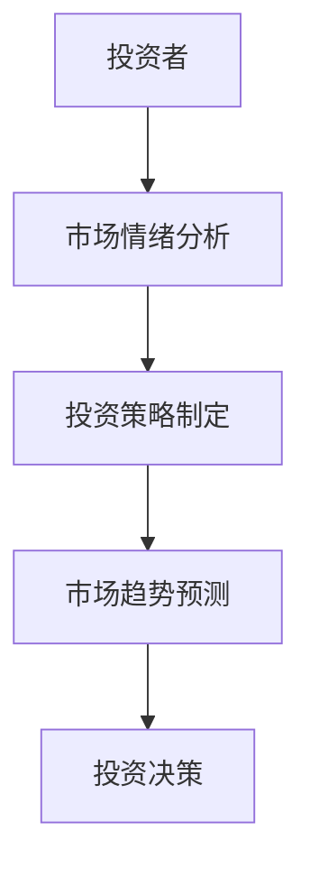
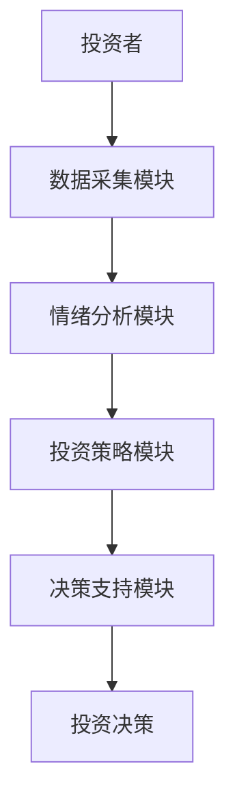

                 


# 彼得林奇的"逆向思维"在新股投资中的应用

## 关键词：
- 彼得林奇
- 逆向思维
- 新股投资
- 投资策略
- 市场情绪

## 摘要：
本文深入探讨了彼得林奇的逆向思维在新股投资中的应用。通过分析逆向思维的定义、原理及其在投资决策中的作用，结合数学模型和实际案例，本文详细阐述了如何利用逆向思维在市场波动中寻找投资机会，优化投资组合，提高投资收益。

---

## 目录大纲

### 第一章：彼得林奇与逆向思维概述

#### 1.1 彼得林奇的投资理念
- 1.1.1 彼得林奇的生平简介
  - 早年经历与职业历程
  - 作为基金经理的辉煌成就
- 1.1.2 彼得林奇的投资哲学
  - 价值投资的核心理念
  - 长期投资与风险管理
- 1.1.3 彼得林奇的成功案例分析
  - 典型投资案例解析
  - 成功背后的逻辑与启示

#### 1.2 逆向思维的定义与特点
- 1.2.1 逆向思维的定义
  - 与传统思维的对比
  - 逆向思维在投资中的独特性
- 1.2.2 逆向思维的核心特征
  - 独立性
  - 抗干扰性
  - 前瞻性
- 1.2.3 逆向思维与传统投资思维的区别
  - 从跟随市场到独立判断
  - 逆向思维的优势与局限性

#### 1.3 逆向思维在新股投资中的应用背景
- 1.3.1 新股投资的特殊性
  - 新股市场的波动性与不确定性
  - 新股投资者的行为特点
- 1.3.2 逆向思维在新股投资中的优势
  - 利用市场恐慌寻找低估机会
  - 在市场冷清时布局优质股票
- 1.3.3 逆向思维在新股投资中的风险与挑战
  - 如何避免逆向思维的陷阱
  - 风险控制的策略与方法

---

### 第二章：逆向思维的核心概念与联系

#### 2.1 核心概念原理
- 2.1.1 逆向思维的数学模型
  - 市场情绪与股票价值的关系
  - 市盈率、市净率等指标的逆向应用
- 2.1.2 逆向思维的逻辑框架
  - 从市场情绪到投资决策的推理过程
  - 逆向思维的实施步骤与策略
- 2.1.3 逆向思维与市场情绪的关系
  - 市场情绪的周期性分析
  - 逆向思维如何应对市场情绪的波动

#### 2.2 核心概念属性特征对比表格
| 概念       | 独特性 | 抗干扰性 | 前瞻性 |
|------------|--------|----------|--------|
| 逆向思维   | 高     | 强       | 中     |
| 市场情绪   | 低     | 弱       | 无     |

#### 2.3 ER实体关系图
```mermaid
erd
    Investor(investor_id, name, investment_strategy)
    Market(market_id, time, sentiment)
    Strategy(strategy_id, name, description)
    Investment(investor_id, stock_id, amount)
    Stock(stock_id, name, market_value)
```

---

### 第三章：逆向思维的算法原理

#### 3.1 算法原理讲解
- 3.1.1 市场情绪分析算法
  - 数据采集与处理
  - 情绪指标的计算与评估
- 3.1.2 逆向投资决策算法
  - 基于逆向思维的投资策略模型
  - 算法的实现步骤与流程
- 3.1.3 市场趋势预测算法
  - 时间序列分析方法
  - 逆向思维在趋势预测中的应用

#### 3.2 算法流程图


#### 3.3 Python代码实现
```python
import pandas as pd

def calculate_sentiment(data):
    # 计算市场情绪指数
    sentiment = data['price'].pct_change().mean() * 100
    return sentiment

def inverse_strategy(data):
    # 逆向投资策略实现
    sentiment = calculate_sentiment(data)
    if sentiment < -5:
        return "买入"
    elif sentiment > 5:
        return "卖出"
    else:
        return "观望"

# 示例数据
data = pd.DataFrame({
    'price': [100, 98, 95, 90, 85],
    'volume': [1000, 800, 600, 400, 200]
})

result = inverse_strategy(data)
print(result)  # 输出: "买入"
```

---

### 第四章：系统分析与架构设计

#### 4.1 系统功能设计
- 4.1.1 数据采集模块
  - 数据源的选择与获取
  - 数据清洗与预处理
- 4.1.2 情绪分析模块
  - 基于NLP的情感分析算法
  - 情绪指标的量化与评估
- 4.1.3 投资策略模块
  - 逆向思维策略的实现
  - 策略的参数化与配置
- 4.1.4 决策支持模块
  - 投资组合优化
  - 风险管理与控制

#### 4.2 系统架构图


---

### 第五章：项目实战与案例分析

#### 5.1 项目实战
- 5.1.1 环境安装与配置
  - Python与相关库的安装
  - 数据源的获取与处理
- 5.1.2 核心代码实现
  - 逆向思维算法的代码实现
  - 投资组合优化的代码实现
- 5.1.3 实际案例分析
  - 选取具体新股案例进行分析
  - 投资策略的应用与效果评估

#### 5.2 案例分析
- 5.2.1 案例背景
  - 新股市场的现状与趋势
  - 案例公司基本情况介绍
- 5.2.2 投资策略实施
  - 基于逆向思维的投资决策过程
  - 投资组合的构建与调整
- 5.2.3 结果解读
  - 投资收益与风险的对比分析
  - 策略的有效性与可优化空间

---

### 第六章：总结与展望

#### 6.1 最佳实践
- 逆向思维的应用技巧与注意事项
- 风险控制的策略与方法
- 投资组合优化的建议

#### 6.2 小结
- 逆向思维在新股投资中的重要性
- 本文的核心观点与主要结论

#### 6.3 注意事项
- 逆向思维的局限性与适用场景
- 数据分析中的潜在问题与解决方案
- 投资者心理与行为对策略的影响

#### 6.4 拓展阅读
- 相关书籍与文献推荐
- 逆向思维在其他投资领域的应用
- 未来研究方向与展望

---

通过以上章节的详细分析与讲解，本文系统地探讨了彼得林奇的逆向思维在新股投资中的应用，结合理论与实践，为投资者提供了科学的投资决策参考。

