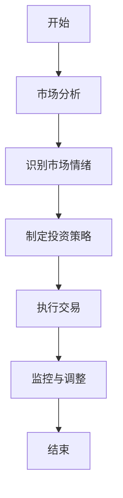
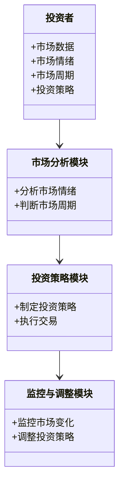

                 


# 彼得林奇的"逆向思维"在牛熊市的应用

> 关键词：逆向思维、彼得·林奇、投资策略、牛熊市、市场情绪、价值投资

> 摘要：本文深入探讨了彼得·林奇的逆向思维在牛熊市中的应用，通过分析其投资理念、核心概念、算法原理、系统架构以及实际案例，为投资者提供了一套在不同市场周期中利用逆向思维进行投资决策的策略。文章结合理论与实践，详细阐述了逆向思维的优势、挑战及实现方法，帮助投资者在复杂多变的市场中找到获利的机会。

---

## 第一部分: 彼得·林奇的“逆向思维”概述

### 第1章: 彼得·林奇与逆向思维的背景

#### 1.1 彼得·林奇的生平与投资理念

彼得·林奇（Peter Lynch）是美国著名的投资经理人，被誉为“共同基金先生”，曾管理富达麦哲伦基金长达13年，创造了年化收益率29%的惊人成绩。他的投资理念以“逆向思维”为核心，主张在市场恐慌时买入，在市场狂热时卖出。这种策略不仅帮助他在牛熊市中取得了卓越的业绩，也为无数投资者提供了宝贵的经验。

**1.1.1 彼得·林奇的早期经历**

林奇的职业生涯始于1969年，当时他加入富达投资公司，最初负责分析股票，后来逐步晋升为基金经理。他的成功并非源于运气，而是对市场的深刻理解以及独特的投资方法。

**1.1.2 林奇的投资哲学与核心观点**

林奇强调，成功的投资取决于对市场的独立思考和对价值的深入分析。他认为，市场情绪往往会导致投资者做出非理性决策，而逆向思维则可以帮助投资者在市场底部买入，在市场顶部卖出。

**1.1.3 逆向思维在投资中的重要性**

逆向思维的核心在于反市场情绪操作。在牛市中，市场情绪高涨，投资者往往盲目追涨；在熊市中，市场情绪低落，投资者往往恐慌抛售。林奇认为，这种情绪波动是市场的机会，逆向思维可以帮助投资者在市场底部发现低估资产，在市场顶部规避风险。

#### 1.2 逆向思维的定义与特点

**1.2.1 逆向思维的定义**

逆向思维是一种与市场主流观点相反的投资策略。它强调在市场估值过高时卖出，在市场估值过低时买入。这种策略需要投资者具备强大的心理素质和对市场的深刻理解。

**1.2.2 逆向思维与传统投资策略的区别**

传统投资策略通常基于技术分析或基本面分析，而逆向思维则强调反市场情绪操作。传统策略可能在市场趋势中获利，但在市场反转时可能遭受重大损失；逆向思维则通过逆市操作，捕捉市场波动带来的机会。

**1.2.3 逆向思维的核心要素**

逆向思维的核心要素包括对市场情绪的准确判断、对市场估值的深刻理解以及对投资标的独立分析能力。投资者需要具备逆市场情绪的能力，能够在市场恐慌时保持冷静，在市场狂热时保持理性。

#### 1.3 逆向思维在牛熊市中的应用背景

**1.3.1 牛市与熊市的定义与特征**

牛市是指市场整体呈现上涨趋势，投资者情绪高涨，市场估值普遍偏高。熊市则是指市场整体呈现下跌趋势，投资者情绪低落，市场估值普遍偏低。

**1.3.2 逆向思维在牛熊市中的独特价值**

在牛市中，逆向思维可以帮助投资者在市场高估时卖出，避免高位被套；在熊市中，逆向思维可以帮助投资者在市场低估时买入，捕捉市场反转的机会。

**1.3.3 逆向思维与市场情绪的关系**

逆向思维的核心在于反市场情绪操作。市场情绪通常与市场走势相反，因此逆向思维能够帮助投资者在市场情绪低落时买入，在市场情绪高涨时卖出。

### 第2章: 逆向思维的核心概念与联系

#### 2.1 核心概念原理

逆向思维的数学模型可以用以下公式表示：

$$ P = \frac{1}{(1 + r)^t} $$

其中，P为当前价格，r为市场收益率，t为时间。该公式表明，市场的实际价值与未来现金流的现值密切相关，而逆向思维通过分析市场情绪和估值水平，能够在市场偏离实际价值时进行逆向操作。

#### 2.2 概念属性特征对比表格

以下是逆向思维与顺势思维的对比：

| 对比维度       | 逆向思维              | 顺势思维              |
|----------------|----------------------|----------------------|
| 投资理念       | 反市场情绪，寻找低估机会 | 随市场趋势，顺势操作   |
| 适用场景       | 牛市顶部和熊市底部     | 牛市上升和熊市下降     |
| 风险控制       | 高，需要严格止损      | 低，跟随市场趋势       |
| 收益潜力       | 高，捕捉市场反转      | 中等，随市场趋势波动   |

#### 2.3 ER实体关系图架构

以下是逆向思维的实体关系图：


### 第3章: 逆向思维的算法原理讲解

#### 3.1 算法原理

逆向思维的算法流程如下：

1. 分析市场情绪，判断市场周期。
2. 如果市场情绪高涨，处于牛市顶部，执行卖出操作。
3. 如果市场情绪低落，处于熊市底部，执行买入操作。
4. 定期监控市场情绪，调整投资策略。



#### 3.2 算法实现

以下是逆向思维策略的Python代码实现：

```python
def inverse_thinking_strategy(market_data):
    # 分析市场情绪
    market_sentiment = analyze_sentiment(market_data)
    # 判断市场周期
    if market_sentiment == 'bear':
        return 'buy'
    elif market_sentiment == 'bull':
        return 'sell'
    else:
        return 'hold'

def analyze_sentiment(market_data):
    # 假设market_data是市场数据，包括价格、成交量等
    # 使用技术指标分析市场情绪，例如使用RSI、MACD等
    pass
```

---

## 第二部分: 逆向思维的系统分析与架构设计

### 第4章: 系统分析与架构设计方案

#### 4.1 问题场景介绍

在实际投资中，市场情绪复杂多变，投资者需要一个能够实时分析市场情绪、判断市场周期、制定投资策略的系统。

#### 4.2 系统功能设计

以下是系统的功能模块：



#### 4.3 系统架构设计

以下是系统的架构设计：


---

## 第三部分: 逆向思维的项目实战

### 第5章: 项目实战

#### 5.1 实际案例分析

假设当前市场处于牛市顶部，市场情绪高涨，投资者情绪乐观。根据逆向思维策略，投资者应卖出股票，规避市场风险。

#### 5.2 代码实现与解读

以下是逆向思维策略的Python代码实现：

```python
def inverse_thinking_strategy(market_data):
    # 分析市场情绪
    market_sentiment = analyze_sentiment(market_data)
    # 判断市场周期
    if market_sentiment == 'bear':
        return 'buy'
    elif market_sentiment == 'bull':
        return 'sell'
    else:
        return 'hold'

def analyze_sentiment(market_data):
    # 假设market_data是市场数据，包括价格、成交量等
    # 使用技术指标分析市场情绪，例如使用RSI、MACD等
    pass
```

---

## 第四部分: 总结与展望

### 第6章: 总结与展望

#### 6.1 小结

逆向思维是一种在牛熊市中获利的重要策略，通过反市场情绪操作，投资者可以在市场低估时买入，在市场高估时卖出，从而实现超额收益。

#### 6.2 投资建议

投资者在实际操作中，应结合市场实际情况，灵活运用逆向思维策略。同时，需要注意市场情绪的波动，及时调整投资策略，避免因市场反转而造成重大损失。

#### 6.3 注意事项

逆向思维需要投资者具备强大的心理素质和对市场的深刻理解。在实际操作中，投资者应严格遵守投资纪律，避免因市场波动而做出非理性决策。

#### 6.4 拓展阅读

推荐阅读彼得·林奇的《彼得·林奇的成功投资》、《股市漫步》等书籍，深入理解逆向思维的投资理念和实际应用。

---

通过本文的详细讲解，读者可以全面理解彼得·林奇的逆向思维在牛熊市中的应用，并能够在实际投资中灵活运用这一策略，实现长期稳定的收益。

