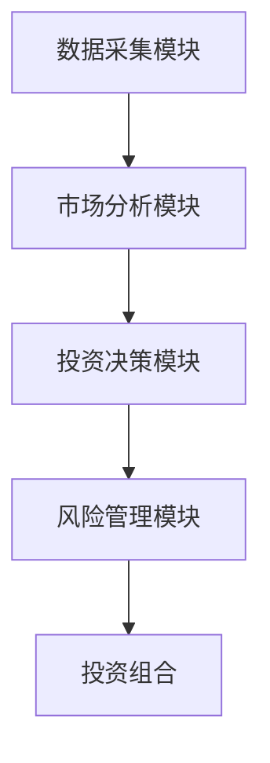

                 


# 彼得林奇的"逆向思维"投资技巧

> 关键词：逆向思维投资、彼得林奇、市场情绪分析、投资策略、风险管理、价值评估

> 摘要：本文详细探讨了彼得林奇的逆向思维投资技巧，从理论基础到算法实现，再到系统架构和实战案例，全面解析了逆向思维在投资中的应用。通过本文的学习，读者可以掌握逆向思维的核心原理，学会如何在市场波动中捕捉投资机会，制定有效的投资策略，并通过实际案例分析和代码实现，提升自己的投资能力。

---

## 第一部分: 彼得林奇逆向思维投资技巧概述

### 第1章: 逆向思维投资的基本概念

#### 1.1 逆向思维在投资中的定义与特点

逆向思维是一种与传统思维相反的思维方式，它强调在市场参与者情绪低落时寻找机会，在情绪高涨时保持谨慎。在投资领域，逆向思维的核心在于“反向操作”，即在市场恐慌时买入，在市场狂热时卖出。

- **定义**：逆向思维是一种基于市场情绪分析的投资策略，通过识别市场非理性行为来寻找投资机会。
- **特点**：
  - **反周期性**：逆向思维关注市场的周期性波动，寻找价格偏离价值的点。
  - **低风险高回报**：通过在市场底部买入，在顶部卖出，获得超额回报。
  - **逆人性**：逆向思维需要投资者克服贪婪和恐惧，做出与市场情绪相反的决策。

#### 1.2 彼得林奇逆向思维投资的背景与意义

彼得·林奇是逆向思维投资的代表人物之一。他在任职富达基金期间，通过逆向思维策略取得了卓越的投资业绩。逆向思维投资的意义在于：

- **发现市场错配机会**：当市场情绪过于悲观时，许多优质资产会被低估，此时买入可以获得超额收益。
- **降低投资风险**：通过逆向操作，投资者可以在市场恐慌时降低持仓成本，在市场狂热时规避风险。

---

### 第2章: 逆向思维投资的核心原理

#### 2.1 投资者心理与市场情绪分析

投资者的心理波动直接影响市场情绪，而市场情绪的波动为逆向思维投资提供了机会。

- **投资者心理分析模型**：
  - **乐观偏差**：投资者倾向于相信市场上涨的概率高于实际情况。
  - **损失厌恶**：投资者对损失的敏感程度高于对收益的敏感程度。
  - **从众心理**：投资者倾向于跟随市场主流观点，导致市场情绪的放大。

- **市场情绪周期性波动规律**：
  - **市场情绪的周期性**：市场情绪通常呈现周期性波动，从乐观到悲观，再从悲观到乐观。
  - **情绪指标**：通过市场成交量、涨跌幅度等指标，可以量化市场情绪。

#### 2.2 逆向思维投资的数学模型

逆向思维投资的核心在于量化市场情绪，并将其与资产的真实价值进行对比，寻找投资机会。

- **投资决策的数学表达式**：
  - 市场情绪指数：$S = \frac{V_{\text{当前}}}{V_{\text{历史平均}}}$，其中$S > 1$表示市场情绪高涨，$S < 1$表示市场情绪低迷。
  - 投资决策：当$S < 0.8$时，买入；当$S > 1.2$时，卖出。

- **市场情绪指数的计算公式**：
  - 市场情绪指数可以通过成交量、波动率等指标加权计算。
  - 示例：$S = \alpha \times V + \beta \times W$，其中$\alpha$和$\beta$是权重系数。

---

### 第3章: 逆向思维投资策略的算法实现

#### 3.1 逆向思维投资算法概述

逆向思维投资算法的核心在于识别市场情绪与资产价值的偏离，并据此制定投资策略。

- **算法的基本思路**：
  1. 数据采集：获取历史价格、成交量等数据。
  2. 市场情绪分析：计算市场情绪指数。
  3. 价值评估：计算资产的内在价值。
  4. 投资决策：根据市场情绪与价值评估结果，制定买入或卖出策略。

- **算法的实现步骤**：
  1. 数据预处理：清洗和标准化数据。
  2. 市场情绪指标计算：使用统计方法计算市场情绪指数。
  3. 价值评估：使用DCF模型或其他方法评估资产价值。
  4. 投资决策：根据市场情绪与价值评估结果，制定投资策略。

#### 3.2 逆向思维投资算法的代码实现

以下是一个简单的逆向思维投资算法的Python代码示例：

```python
import pandas as pd
import numpy as np

# 示例数据：假设我们有一个股票的历史收盘价数据
data = {'Date': ['2023-01-01', '2023-01-02', '2023-01-03', '2023-01-04', '2023-01-05'],
         'Close': [100, 98, 102, 105, 95]}
df = pd.DataFrame(data)

# 计算市场情绪指数（简化版）
# 假设市场情绪指数基于价格波动率
df['Log_Return'] = np.log(df['Close'].pct_change().add(1))
df['Volatility'] = df['Log_Return'].std()

# 市场情绪指数计算
market_emotion_index = df['Volatility'] / df['Volatility'].mean()

# 价值评估（简化版，假设使用市盈率）
df['PE'] = df['Close'] / df['Earnings']  # 假设'Earnings'列已计算

# 投资决策
# 当市场情绪指数低于历史平均时，买入；高于时，卖出
current_emotion = market_emotion_index[-1]
if current_emotion < 0.8:
    print("买入信号")
elif current_emotion > 1.2:
    print("卖出信号")
else:
    print("观望")
```

---

### 第4章: 逆向思维投资系统的架构设计

#### 4.1 系统功能模块划分

逆向思维投资系统通常包括以下几个功能模块：

- **数据采集模块**：负责采集市场数据，包括价格、成交量、财务数据等。
- **市场分析模块**：计算市场情绪指数，分析市场趋势。
- **投资决策模块**：根据市场情绪与价值评估结果，制定投资策略。
- **风险管理模块**：监控投资组合风险，调整持仓比例。

#### 4.2 系统架构图



---

### 第5章: 逆向思维投资的实战案例分析

#### 5.1 案例背景与目标

以某股票为例，分析逆向思维投资策略的应用。

- **案例目标**：通过逆向思维策略，寻找该股票的买入机会。
- **数据来源**：该股票的历史价格、成交量、财务数据等。

#### 5.2 案例分析与实现

- **数据处理**：清洗数据，计算市场情绪指数和价值评估指标。
- **市场情绪分析**：识别市场情绪低迷的阶段。
- **价值评估**：计算股票的内在价值。
- **投资决策**：在市场情绪低迷且价值被低估时买入。

---

### 第6章: 逆向思维投资的最佳实践与注意事项

#### 6.1 投资策略的优化与调整

- **策略优化方法**：
  - 增加更多的市场情绪指标。
  - 结合其他投资策略（如基本面分析）。
- **策略调整时机**：
  - 定期回顾策略表现，及时调整参数。
  - 根据市场环境变化，动态调整策略。

---

通过本文的详细分析，读者可以全面了解彼得林奇逆向思维投资技巧的核心原理和实际应用。逆向思维投资不仅是一种策略，更是一种需要耐心和纪律的投资方式。在实际操作中，投资者需要结合市场环境和个人风险承受能力，灵活运用逆向思维策略，才能在复杂多变的市场中获得长期稳定的收益。

