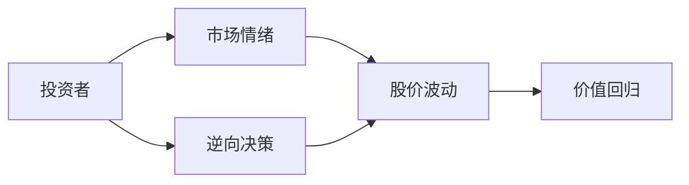
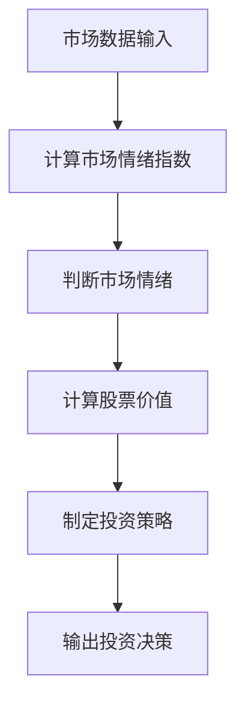
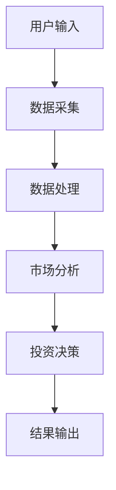

                 


# 彼得林奇的"逆向投资"思想

## 关键词：逆向投资，彼得林奇，投资策略，市场分析，价值投资

## 摘要：彼得林奇的逆向投资思想是一种在市场低迷时买入，市场高涨时卖出的投资策略，强调长期投资和价值发现。本文从技术角度分析逆向投资的算法原理、数学模型和系统架构，并结合实际案例，详细讲解逆向投资的实战技巧。

---

# 第一部分: 彼得林奇逆向投资思想的基础概述

## 第1章: 逆向投资的核心概念

### 1.1 彼得林奇与逆向投资

#### 1.1.1 彼得林奇的背景与投资理念
彼得·林奇是美国著名投资经理人，以其在波士顿基金的卓越表现闻名。他强调长期投资、价值发现和逆向思维。

#### 1.1.2 逆向投资的定义与核心思想
逆向投资是指在市场低迷时买入，市场高涨时卖出，与市场情绪相反的策略。

#### 1.1.3 逆向投资与传统投资的区别
传统投资跟随市场趋势，逆向投资则反其道而行之，强调逆市场情绪操作。

### 1.2 逆向投资的背景与问题背景

#### 1.2.1 投资市场的周期性与波动性
市场存在周期性波动，投资者需识别周期拐点。

#### 1.2.2 传统投资策略的局限性
传统策略易受市场情绪影响，逆向投资则强调独立思考和价值判断。

#### 1.2.3 逆向投资的适用场景与边界
适用于市场低估和高估阶段，需谨慎评估风险。

## 第2章: 逆向投资的核心概念与联系

### 2.1 核心概念原理

#### 2.1.1 市场情绪与逆向思维
市场情绪波动影响股价，逆向投资利用这种波动寻找机会。

#### 2.1.2 股价波动与价值回归定律
股价围绕其内在价值波动，逆向投资利用这一规律寻找低估资产。

#### 2.1.3 投资者心理与市场行为分析
分析投资者心理，识别市场非理性行为。

### 2.2 核心概念对比表格

| 投资策略 | 逆向投资 | 顺势投资 |
|----------|----------|----------|
| 时机选择 | 市场低迷时买入 | 市场高涨时买入 |
| 风险管理 | 低市盈率、低市净率 | 高市盈率、高市净率 |

### 2.3 实体关系图（Mermaid流程图）


---

# 第二部分: 逆向投资的算法原理与数学模型

## 第3章: 逆向投资的数学模型

### 3.1 数学模型与公式

#### 3.1.1 市场情绪指数计算公式
$$M = \frac{S}{N}$$
其中，M为市场情绪指数，S为市场上涨股票数量，N为总股票数量。

#### 3.1.2 价值回归模型
$$V = \frac{P}{E}$$
其中，V为股票价值，P为股价，E为市盈率。

### 3.2 算法流程图（Mermaid）


## 第4章: 逆向投资的系统架构设计

### 4.1 系统功能设计

#### 4.1.1 数据采集模块
收集市场数据，如股价、市盈率等。

#### 4.1.2 市场分析模块
分析市场情绪，判断投资机会。

#### 4.1.3 投资决策模块
根据分析结果制定投资策略。

### 4.2 系统架构图（Mermaid）


---

# 第三部分: 逆向投资的实战技巧与案例分析

## 第5章: 逆向投资实战技巧

### 5.1 股票筛选与估值

#### 5.1.1 如何识别被低估的股票
关注低市盈率、低市净率的股票。

#### 5.1.2 市盈率与市净率的运用
计算市盈率（P/E）和市净率（P/B），寻找低估股票。

### 5.2 投资组合管理

#### 5.2.1 风险管理策略
分散投资，控制仓位，设置止损。

#### 5.2.2 仓位控制方法
根据市场情绪调整仓位，逆市场趋势操作。

### 5.3 实际案例分析

#### 5.3.1 案例一：科技股投资
2000年互联网泡沫破裂，科技股大幅下跌，此时买入优质科技股，长期持有。

#### 5.3.2 案例二：金融股投资
2008年金融危机后，金融股大幅下跌，买入优质银行股，市场复苏后获得超额收益。

## 第6章: 逆向投资的成功案例分析

### 6.1 美国银行案例分析
2008年金融危机后，美国银行股价大幅下跌，彼得林奇团队买入该股，长期持有，获得丰厚回报。

### 6.2 苹果公司案例分析
2009年苹果股价低迷，彼得林奇团队买入该股，伴随公司发展，股价大幅上涨。

---

# 第四部分: 逆向投资的系统架构与实现

## 第7章: 逆向投资系统的实现

### 7.1 系统环境与工具

#### 7.1.1 数据源
股票数据获取：Yahoo Finance API。

#### 7.1.2 数据处理工具
Python、Pandas、NumPy。

#### 7.1.3 可视化工具
Matplotlib、Plotly。

### 7.2 核心代码实现

#### 7.2.1 数据获取代码
```python
import pandas as pd
import requests

def get_stock_data(ticker):
    url = f"https://query1.finance.yahoo.com/ws/v7/yahoo/finance/quote?symbols={ticker}"
    response = requests.get(url)
    data = response.json()
    return data
```

#### 7.2.2 市场情绪指数计算
```python
def calculate_market_mood(stocks):
    up = sum(1 for stock in stocks if stock['price'] > stock['previousClose'])
    return up / len(stocks)
```

#### 7.2.3 价值回归模型实现
```python
def calculate_value(ticker):
    pe = get_pe(ticker)
    return ticker['price'] / pe
```

### 7.3 系统交互流程图（Mermaid）


---

# 第五部分: 总结与展望

## 第8章: 总结

### 8.1 逆向投资的核心要点
- 逆市场情绪操作
- 长期投资，价值发现
- 严格的风险管理

### 8.2 技术实现的关键点
- 数据采集与处理
- 市场情绪分析算法
- 投资决策系统的实现

## 第9章: 展望

### 9.1 未来的研究方向
- 大数据与人工智能在逆向投资中的应用
- 更复杂的市场情绪分析模型
- 多因子投资策略的结合

### 9.2 投资者注意事项
- 逆向投资需要耐心和信心
- 风险管理是投资成功的关键
- 持续学习和适应市场变化

---

# 关键词：逆向投资，彼得林奇，投资策略，市场分析，价值投资

# 总结
彼得林奇的逆向投资思想是一种有效的企业价值评估和投资策略，通过数学模型和系统架构的设计，投资者可以更好地理解和应用逆向投资策略，实现长期稳健的投资回报。本文从技术角度详细分析了逆向投资的原理、算法和实现，结合实际案例，为读者提供了全面的指导。

