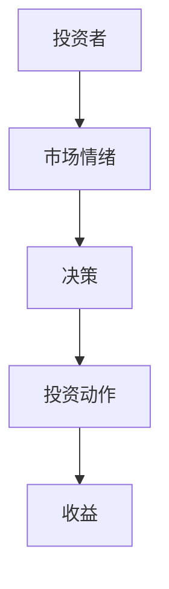
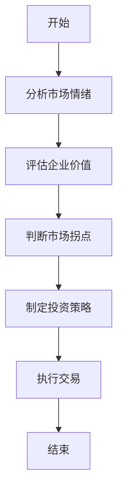
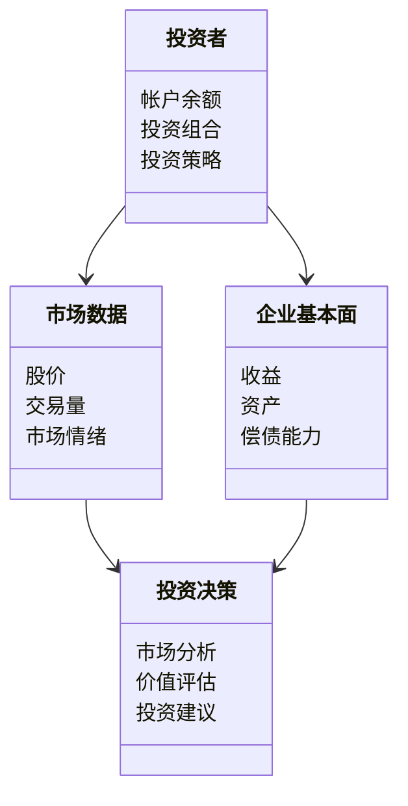
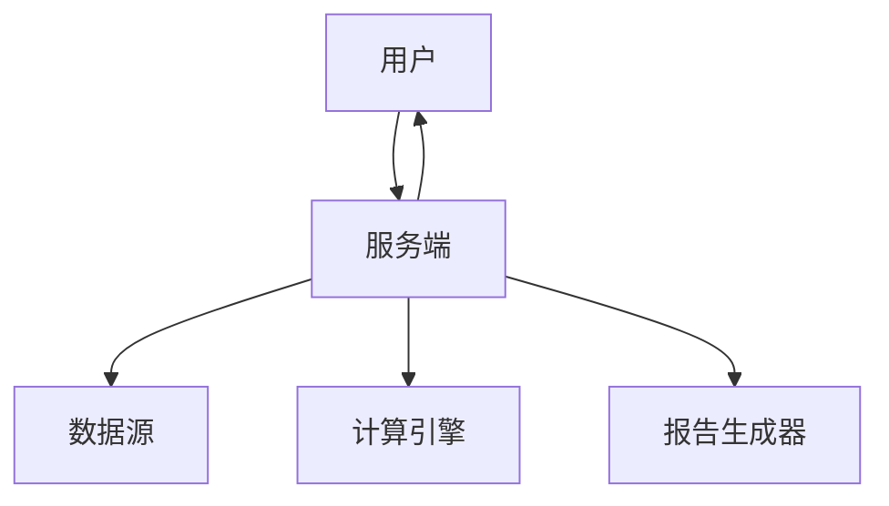
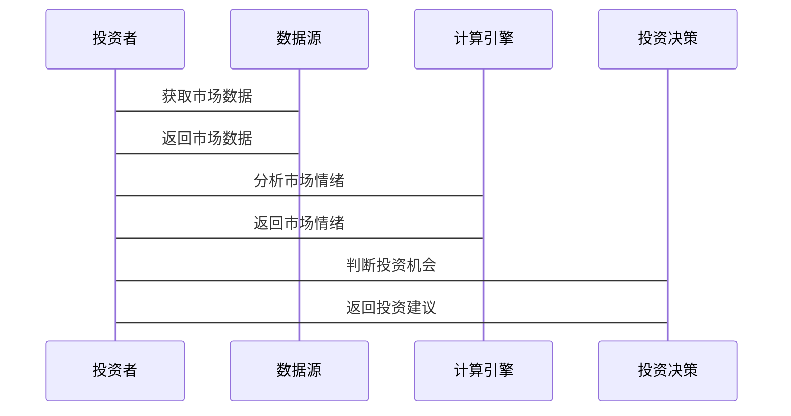

                 


# 彼得林奇的"逆向投资"成功案例分析

> 关键词：逆向投资，彼得林奇，投资策略，价值投资，市场分析

> 摘要：本文通过分析彼得林奇的逆向投资策略，探讨其成功背后的逻辑和方法。文章从逆向投资的定义、核心概念、算法原理、系统架构设计、项目实战案例等方面展开，深入剖析逆向投资的数学模型、决策流程、投资组合优化等关键问题。通过详细解读彼得林奇的经典投资案例，为读者提供实践参考和理论指导。

---

## 第一部分: 逆向投资的背景与核心概念

### 第1章: 逆向投资的定义与背景

#### 1.1 逆向投资的定义

逆向投资是一种与传统投资相反的投资策略。它强调在市场低谷时买入，在市场高点时卖出，通过逆市场情绪进行投资。逆向投资的核心理念是“买别人恐慌，卖别人贪婪”，即在市场恐慌时寻找被低估的资产，在市场狂热时寻找高估的资产。

- 1.1.1 逆向投资的起源与演变

逆向投资并非彼得林奇首创，但他在实践中将其发扬光大。逆向投资的起源可以追溯到价值投资的理念，即寻找市场低估的资产并长期持有。逆向投资的演变过程中，彼得林奇将这一理念与市场情绪分析相结合，形成了独特的投资风格。

- 1.1.2 逆向投资的核心理念

逆向投资的核心理念是：市场情绪的波动性是可预测的，而市场情绪与资产价格之间存在负相关关系。当市场情绪高涨时，资产价格被高估；当市场情绪低落时，资产价格被低估。逆向投资者通过分析市场情绪，寻找价格与价值偏离的资产进行投资。

- 1.1.3 逆向投资与传统投资的区别

传统投资通常跟随市场趋势，而逆向投资则反其道而行之。传统投资者倾向于在市场高点买入，在市场低点卖出；逆向投资者则在市场低点买入，在市场高点卖出。逆向投资强调逆市场情绪进行操作，而传统投资则强调顺势而为。

#### 1.2 彼得林奇与逆向投资的联系

- 1.2.1 彼得林奇的生平简介

彼得·林奇（Peter Lynch）是美国著名的投资经理人，曾管理富达麦哲伦基金（Fidelity Magellan Fund），创造了年均29%的复合回报率。他的投资理念以“逆向投资”和“价值投资”为核心，注重分析企业的基本面，寻找被市场低估的资产。

- 1.2.2 彼得林奇的投资风格

彼得林奇的投资风格以“逆向投资”和“选股”为主。他认为，市场波动为投资者提供了低价买入优质资产的机会。他的投资策略强调长期持有，注重企业基本面分析，寻找具有竞争优势和成长潜力的企业。

- 1.2.3 彼得林奇逆向投资的成功案例

彼得林奇的经典案例包括投资美国航空（American Airlines）和莲花汽车（Lotus Cars）等公司。他通过对企业基本面的深入分析，识别出被市场低估的投资机会，并在市场低谷时买入，最终获得高额回报。

### 第2章: 逆向投资的核心概念与联系

#### 2.1 逆向投资的核心原理

- 2.1.1 市场情绪与投资决策的关系

市场情绪是逆向投资的核心变量。当市场情绪高涨时，投资者倾向于高估资产价格；当市场情绪低落时，投资者倾向于低估资产价格。逆向投资者通过分析市场情绪，寻找价格与价值的偏离点进行投资。

- 2.1.2 逆向投资的逻辑框架

逆向投资的逻辑框架包括以下步骤：
1. 分析市场情绪。
2. 评估资产价值。
3. 判断市场拐点。
4. 制定投资策略。
5. 执行交易。

- 2.1.3 逆向投资的数学模型与公式

逆向投资的数学模型包括价值评估模型和市场情绪分析模型。价值评估模型用于计算资产的真实价值，市场情绪分析模型用于衡量市场的乐观或悲观程度。

#### 2.2 核心概念对比分析

- 2.2.1 逆向投资与价值投资的对比

逆向投资与价值投资的共同点在于寻找被低估的资产，但两者的区别在于投资时机的选择。价值投资者更关注资产的内在价值，而逆向投资者更关注市场情绪与资产价格的偏离。

- 2.2.2 逆向投资与趋势投资的对比

逆向投资与趋势投资是两种截然不同的投资策略。趋势投资者倾向于跟随市场趋势，而逆向投资者倾向于反向操作。逆向投资强调市场情绪的波动性，而趋势投资强调市场的延续性。

- 2.2.3 逆向投资与套利投资的对比

逆向投资与套利投资的区别在于投资策略和风险特征。逆向投资注重长期价值，而套利投资注重短期价差。逆向投资的风险主要来自市场波动，而套利投资的风险主要来自市场流动性。

#### 2.3 逆向投资的ER实体关系图



---

## 第二部分: 逆向投资的算法原理与数学模型

### 第3章: 逆向投资的算法原理

#### 3.1 逆向投资的数学模型

- 3.1.1 价值评估模型

价值评估模型用于计算资产的真实价值，公式为：

$$ V = \frac{E}{P} $$

其中，$E$ 表示企业盈利，$P$ 表示市场预期价格。

- 3.1.2 市场情绪分析模型

市场情绪分析模型用于衡量市场的乐观或悲观程度，公式为：

$$ S = \sum_{i=1}^{n} w_i \cdot m_i $$

其中，$w_i$ 是情绪指标的权重，$m_i$ 是具体情绪指标值。

- 3.1.3 投资组合优化模型

投资组合优化模型用于确定最优的投资组合，公式为：

$$ \text{Maximize} \quad \sum_{i=1}^{n} w_i \cdot r_i $$

$$ \text{Subject to} \quad \sum_{i=1}^{n} w_i = 1 $$

其中，$w_i$ 是投资组合中资产$i$的权重，$r_i$ 是资产$i$的预期收益。

#### 3.2 逆向投资的算法流程图



#### 3.3 逆向投资的数学公式

- 价值评估公式

$$ V = \frac{E}{P} $$

- 市场情绪指数

$$ S = \sum_{i=1}^{n} w_i \cdot m_i $$

---

## 第三部分: 逆向投资的系统分析与架构设计

### 第4章: 投资决策系统的架构设计

#### 4.1 问题场景介绍

投资决策系统的目标是通过分析市场情绪和企业基本面，帮助投资者制定逆向投资策略。系统需要处理大量的市场数据和企业信息，计算资产价值和市场情绪，判断投资机会。

#### 4.2 系统功能设计

- 领域模型



- 系统架构设计



#### 4.3 系统接口设计

- 输入接口：市场数据接口、企业基本面接口
- 输出接口：投资建议接口、投资报告接口

#### 4.4 系统交互设计



---

## 第四部分: 项目实战与案例分析

### 第5章: 逆向投资的项目实战

#### 5.1 美国航空的逆向投资案例

- 案例背景：美国航空在2001年经历了911事件后的市场崩盘，股价被严重低估。

- 分析过程：
  1. 市场情绪分析：市场恐慌情绪高涨，投资者对航空业的未来持悲观态度。
  2. 价值评估：美国航空的股价远低于其实际价值。
  3. 投资决策：彼得林奇在市场低谷时买入美国航空股票。

- 投资结果：美国航空股价回升，彼得林奇获得丰厚回报。

#### 5.2 投资策略实现

- 环境安装：安装金融数据分析工具，获取市场数据和企业基本面数据。

- 核心实现：

```python
def calculate_value(enterprise_value, market_price):
    return enterprise_value / market_price

def analyze_market_mood(price_data):
    # 计算市场情绪指标
    return market_mood

def make_inverse_investment(value, mood):
    if value < mood:
        return "买入"
    else:
        return "卖出"
```

#### 5.3 案例分析与解读

- 美国航空案例的成功在于彼得林奇能够准确判断市场拐点，并在市场低谷时果断买入。

- 该案例展示了逆向投资的核心思想：市场情绪的波动性为投资者提供了低价买入优质资产的机会。

---

## 第五部分: 总结与最佳实践

### 第6章: 逆向投资的最佳实践

#### 6.1 心理与纪律

逆向投资需要投资者具备强大的心理素质和纪律性。在市场恐慌时，投资者需要保持冷静，避免随波逐流。

#### 6.2 风险管理

逆向投资的风险管理至关重要。投资者需要合理分散投资组合，避免过度集中投资。

#### 6.3 持续学习

逆向投资需要投资者不断学习和更新知识。市场环境不断变化，投资者需要与时俱进，调整投资策略。

#### 6.4 案例小结

美国航空案例的成功证明了逆向投资的可行性。投资者需要具备敏锐的市场洞察力和果断的决策能力。

---

## 第六部分: 拓展阅读与深入思考

### 第7章: 逆向投资的未来展望

#### 7.1 数字化与智能化

随着人工智能和大数据技术的发展，逆向投资将更加智能化。投资者可以通过算法分析市场情绪，优化投资决策。

#### 7.2 逆向投资的局限性

逆向投资的局限性在于市场情绪的不可预测性。市场情绪受多种因素影响，投资者难以准确判断市场拐点。

#### 7.3 逆向投资的未来挑战

未来，逆向投资将面临更多挑战，如技术进步、市场全球化、投资者行为变化等。投资者需要不断创新，适应市场变化。

---

## 第八部分: 最佳实践与注意事项

### 第8章: 投资者注意事项

#### 8.1 投资心态

投资者需要保持冷静，避免被市场情绪左右。在市场恐慌时，投资者需要保持理性，寻找投资机会。

#### 8.2 风险控制

投资者需要合理分散投资组合，控制投资风险。逆向投资需要投资者具备较强的风险承受能力。

#### 8.3 投资纪律

投资者需要制定明确的投资策略，并严格遵守。逆向投资需要投资者具备坚定的纪律性，避免随市场波动频繁操作。

---

## 附录: 逆向投资的数学模型与代码实现

### 附录A: 价值评估模型的代码实现

```python
def calculate_value(enterprise_value, market_price):
    return enterprise_value / market_price
```

### 附录B: 市场情绪分析模型的代码实现

```python
def analyze_market_mood(price_data):
    # 计算市场情绪指标
    return market_mood
```

---

通过以上内容，我们深入分析了彼得林奇的逆向投资策略，探讨了其成功背后的逻辑和方法。希望读者能够从本文中获得启发，更好地理解逆向投资的核心思想，并将其应用于实际投资实践中。

