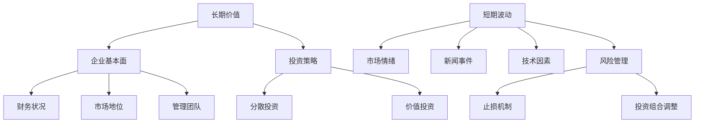
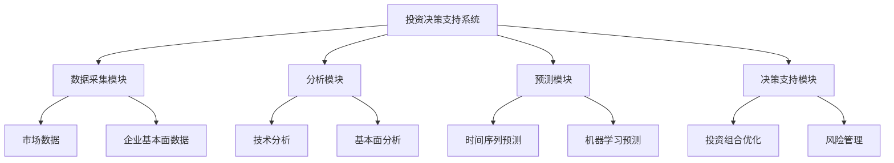
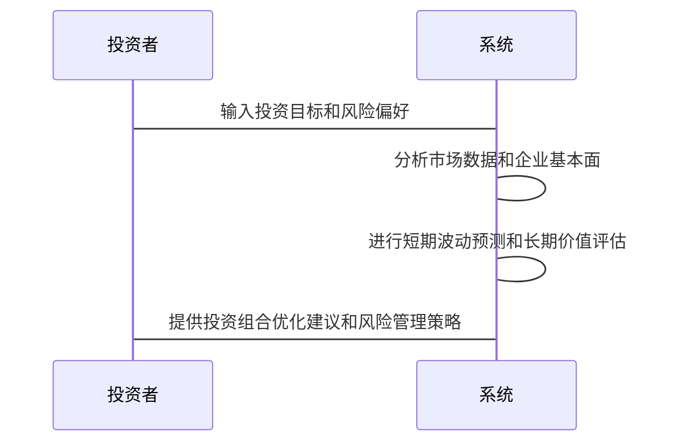

                 


# 彼得林奇的"长期价值"vs"短期波动"

## 关键词：彼得林奇，长期价值，短期波动，投资策略，风险管理，价值投资

## 摘要：本文深入分析了彼得林奇的长期价值投资理念与短期市场波动之间的关系，探讨了如何在投资决策中平衡长期价值与短期波动的影响，提供了系统的投资策略和风险管理方法，帮助投资者在复杂市场环境中做出明智决策。

---

# 第一部分: 引言

## 第1章: 彼得林奇的长期价值投资理念

### 1.1 彼得林奇及其投资哲学

- **1.1.1 彼得林奇的背景与成就**
  - 彼得·林奇是美国著名投资经理人，曾管理麦哲伦基金，创造了卓越的投资业绩。
  - 他强调长期价值投资，认为市场波动是投资机会的来源。
  - 彼得林奇的投资哲学基于对公司基本面的深入分析和长期持有优质股票。

- **1.1.2 彼得林奇的投资哲学概述**
  - 长期价值投资的核心：寻找具有持续增长潜力的公司，关注企业内在价值。
  - 短期波动的应对：市场波动是噪声，投资者应忽略短期波动，专注于长期价值。
  - 投资策略：分散投资、长期持有、定期调整。

- **1.1.3 长期价值投资的基本原则**
  - 买入优质企业：选择具有强大竞争优势、良好管理团队和稳健财务状况的公司。
  - 长期持有：避免频繁交易，减少成本和税收，享受复利效应。
  - 分散投资：降低风险，避免过度集中在单一行业或公司。

### 1.2 长期价值与短期波动的对比

- **1.2.1 长期价值的定义与特征**
  - 长期价值：公司未来现金流的现值，反映其内在价值。
  - 特征：稳定性、可持续性、可预测性。

- **1.2.2 短期波动的定义与特征**
  - 短期波动：市场情绪变化、突发事件等因素引起的股价短期波动。
  - 特征：不可预测性、短期性、情绪驱动性。

- **1.2.3 长期价值与短期波动的相互关系**
  - 长期价值是股价的基础，短期波动是围绕长期价值的波动。
  - 短期波动可能影响投资者情绪，但不应影响长期投资决策。

### 1.3 长期价值投资的优势与局限性

- **1.3.1 长期价值投资的优势**
  - 稳定收益：通过长期持有优质股票，实现财富稳步增长。
  - 风险较低：分散投资降低市场波动带来的风险。
  - 忽略短期波动：减少情绪化决策，避免短期损失。

- **1.3.2 短期波动的潜在影响**
  - 心理影响：短期波动可能导致投资者恐慌性抛售，错过长期收益。
  - 交易成本：频繁交易增加佣金和税收成本。
  - 机会成本：过度关注短期波动可能忽视长期投资机会。

- **1.3.3 长期价值投资的局限性**
  - 短期波动可能掩盖长期价值：在极端市场环境下，长期价值可能无法及时体现。
  - 市场周期影响：市场泡沫或崩盘可能影响长期价值的实现。
  - 选股难度：准确识别具有长期价值的企业需要深入分析和经验。

## 1.4 本章小结

- 彼得林奇的长期价值投资理念强调关注企业内在价值，避免短期波动的干扰。
- 长期价值与短期波动在投资中相互影响，投资者需要在两者之间找到平衡点。
- 长期价值投资具有稳定性高、风险较低的优势，但也面临市场周期和选股难度的挑战。

---

# 第二部分: 长期价值投资的理论基础

## 第2章: 长期价值投资的核心概念

### 2.1 长期价值投资的基本原理

- **2.1.1 长期价值的构成要素**
  - 盈利能力：ROE、ROA等指标反映企业盈利能力。
  - 财务状况：资产负债表健康，现金流稳定。
  - 市场地位：行业龙头或具有竞争优势的企业。
  - 管理团队：优秀的管理层能推动企业持续增长。

- **2.1.2 长期价值与企业基本面的关系**
  - 企业基本面是长期价值的基石，基本面良好企业具有更高的长期价值。
  - 市场情绪和短期波动可能影响股价，但基本面决定长期价值。

- **2.1.3 长期价值的评估方法**
  - 市盈率（P/E）：市盈率低于行业平均水平的企业可能具有长期价值。
  - 市净率（P/B）：市净率低于资产净值的企业可能具有投资价值。
  - 内在价值计算：使用现金流折现法（DCF）估算企业的内在价值。

- **2.1.4 投资组合构建**
  - 分散投资：避免过度集中，降低风险。
  - 价值导向：选择被市场低估的股票。
  - 定期调整：根据市场变化和企业基本面调整投资组合。

- **2.1.5 风险管理**
  - 设置止损：在股价大幅下跌时及时止损。
  - 风险分散：通过投资不同行业和地区的股票降低风险。
  - 定期审查：评估投资组合的风险和收益，及时调整。

### 2.2 短期波动对企业价值的影响

- **2.2.1 短期波动的来源与类型**
  - 市场情绪：投资者情绪波动影响股价。
  - 新闻事件：公司公告、行业动态、经济政策等。
  - 技术因素：市场流动性、交易量变化等。

- **2.2.2 短期波动对企业价值的短期影响**
  - 股价波动：短期内股价可能偏离长期价值。
  - 投资者情绪：短期波动可能导致投资者恐慌性抛售或过度买入。

- **2.2.3 短期波动的长期影响**
  - 长期价值主导：短期波动不影响企业的长期价值。
  - 投资者行为：短期波动可能导致投资决策失误，影响长期收益。

- **2.2.4 投资者心理与行为**
  - 过度反应：投资者可能对短期波动反应过度，导致决策失误。
  - 从众心理：跟随市场潮流可能导致非理性决策。
  - 惧怕亏损：短期波动可能引发恐慌性抛售，错过长期收益。

### 2.3 长期价值与短期波动的对比分析

- **2.3.1 对比分析表格**

| 对比维度       | 长期价值                              | 短期波动                              |
|----------------|---------------------------------------|---------------------------------------|
| 时间框架       | 长期（数年）                          | 短期（数周或数月）                    |
| 影响因素       | 企业基本面、财务状况、行业地位        | 市场情绪、新闻事件、技术因素          |
| 可预测性       | 较高（基于基本面分析）                | 较低（难以预测市场情绪变化）          |
| 投资策略       | 长期持有、价值投资                    | 短期交易、趋势跟踪                    |
| 风险           | 较低（分散投资降低风险）              | 较高（频繁交易增加波动风险）          |
| 投资目标       | 实现长期稳定的收益                    | 追求短期收益或套利机会                |

- **2.3.2 ER实体关系图**

```mermaid
er
  entity 投资者 {
    投资策略
    投资组合
  }
  entity 企业 {
    企业基本面
    市场地位
    管理团队
  }
  entity 市场 {
    市场情绪
    新闻事件
    技术因素
  }
  relation 投资者 与 企业 通过 企业基本面 连接
  relation 投资者 与 市场 通过 市场波动 连接
```

- **2.3.3 Mermaid流程图**



### 2.4 本章小结

- 长期价值与短期波动在投资中相互影响，长期价值是股价的基础，短期波动是市场情绪的反映。
- 投资者需要理解两者的区别和联系，制定合理投资策略，平衡风险与收益。

---

# 第三部分: 长期价值投资的策略与实践

## 第3章: 长期价值投资的策略分析

### 3.1 长期价值投资的策略选择

- **3.1.1 基于基本面的长期价值投资**
  - 选择基本面良好、具有长期增长潜力的企业。
  - 通过深入分析企业财务报表、管理层能力等因素，识别具有长期价值的股票。

- **3.1.2 基于技术分析的短期波动应对**
  - 技术分析：通过分析股价走势、成交量等技术指标，预测短期波动。
  - 结合技术分析与基本面分析，制定短期交易策略。

- **3.1.3 组合投资策略的设计**
  - 分散投资：将资金分配到不同行业和地区的股票，降低风险。
  - 价值导向：优先选择被市场低估的股票。
  - 定期调整：根据市场变化和企业基本面调整投资组合。

### 3.2 长期价值投资的实施步骤

- **3.2.1 确定投资目标与风险偏好**
  - 明确投资目标：财富增长、保值等。
  - 评估风险偏好：保守、稳健或激进。
  - 设定投资期限：长期或短期。

- **3.2.2 选择具有长期价值的企业**
  - 行业分析：选择增长潜力大的行业。
  - 财务分析：分析企业的盈利能力、资产负债表等。
  - 管理层评估：评估管理层的能力和诚信。

- **3.2.3 构建投资组合并进行风险管理**
  - 分散投资：避免集中投资，降低风险。
  - 设置止损：在股价下跌到一定程度时卖出，避免重大损失。
  - 定期审查：定期评估投资组合的表现，及时调整。

### 3.3 长期价值投资的风险管理

- **3.3.1 风险管理的基本原则**
  - 分散投资：降低单一投资的风险。
  - 设置止损：控制最大损失。
  - 定期审查：及时发现并调整投资组合。

- **3.3.2 风险控制的具体措施**
  - 选择具有强大财务状况和良好市场地位的企业。
  - 分散投资到不同行业和地区的股票。
  - 定期审查投资组合，及时调整以应对市场变化。

- **3.3.3 短期波动的应对策略**
  - 忽略短期波动：避免因短期波动影响投资决策。
  - 利用波动：在市场恐慌时买入低估股票。
  - 适度调整：根据市场变化和企业基本面调整投资组合。

### 3.4 本章小结

- 长期价值投资需要制定合理的策略，包括选择具有长期价值的企业、构建分散的投资组合和有效的风险管理。
- 通过分散投资和风险管理，投资者可以在长期价值投资中降低风险，实现稳定收益。

---

## 第4章: 长期价值投资的数学模型与算法

### 4.1 长期价值评估的数学模型

- **4.1.1 企业价值评估公式**
  - 企业价值（EV）= 净利润 × 市盈率（P/E）
  - 或者 EV = 营业收入 × 市售率（P/S）

- **4.1.2 市盈率与市净率的计算**
  - 市盈率（P/E）= 股价 / 每股收益（EPS）
  - 市净率（P/B）= 股价 / 每股净资产（BPS）

- **4.1.3 股票内在价值的计算公式**
  - 内在价值 = 现金流折现（DCF）：将未来现金流折现到当前价值。

### 4.2 短期波动预测的算法原理

- **4.2.1 时间序列分析模型**
  - 使用ARIMA模型预测股价走势。
  - 输入历史股价数据，输出预测的未来股价。

- **4.2.2 机器学习算法**
  - 使用随机森林或神经网络模型，基于技术指标和市场情绪预测短期波动。

### 4.3 本章小结

- 长期价值评估需要使用数学模型，如现金流折现法，帮助投资者判断股票的内在价值。
- 短期波动预测可以通过时间序列分析和机器学习算法，辅助投资者做出短期交易决策。

---

## 第5章: 系统分析与架构设计方案

### 5.1 问题场景介绍

- 投资者需要在长期价值与短期波动之间找到平衡，制定合理投资策略。
- 通过系统分析，构建投资决策支持系统，帮助投资者做出明智决策。

### 5.2 系统功能设计

- **领域模型：** 投资组合管理、风险评估、市场分析。
- **功能模块：** 数据采集、分析、预测、决策支持。

### 5.3 系统架构设计



### 5.4 系统接口设计

- 数据接口：与金融数据供应商连接，获取实时市场数据。
- 用户接口：图形化界面，展示分析结果和决策建议。

### 5.5 系统交互流程图



### 5.6 本章小结

- 系统分析与架构设计为投资者提供了全面的投资决策支持，帮助他们在长期价值与短期波动之间找到平衡。

---

## 第6章: 项目实战

### 6.1 环境安装

- 安装Python和必要的金融分析库（如Pandas、NumPy、Matplotlib）。
- 使用Jupyter Notebook进行数据分析和可视化。

### 6.2 核心实现源代码

```python
import pandas as pd
import numpy as np
import matplotlib.pyplot as plt

# 示例代码：计算股票的内在价值（DCF模型）
def calculate_intrinsic_value(fcf, discount_rate, growth_rate, horizon):
    # 现金流折现
    cash_flows = []
    for i in range(horizon):
        cash_flow = fcf * (1 + growth_rate) ** i
        cash_flows.append(cash_flow)
    # 计算终值
    terminal_value = cash_flows[-1] / (discount_rate - growth_rate)
    # 计算总价值
    total_value = sum([cash_flow / (1 + discount_rate) ** (i+1) for i, cash_flow in enumerate(cash_flows)]) + terminal_value / (1 + discount_rate) ** horizon
    return total_value

# 示例代码：ARIMA模型预测股价
from statsmodels.tsa.arima_model import ARIMA

def predict_stock_price(data, order):
    model = ARIMA(data, order=order)
    model_fit = model.fit()
    forecast = model_fit.forecast(steps=5)
    return forecast
```

### 6.3 代码应用解读与分析

- **DCF模型代码：** 用于计算股票的内在价值，帮助投资者判断股票是否被低估。
- **ARIMA模型代码：** 用于预测股价走势，辅助投资者做出短期交易决策。

### 6.4 案例分析

- **案例1：长期价值投资**
  - 选择一家基本面良好、市盈率低于行业平均水平的公司。
  - 分析其财务状况和市场地位，判断其长期价值。
  - 构建投资组合，定期审查并调整。

- **案例2：短期波动应对**
  - 使用ARIMA模型预测短期股价走势。
  - 根据预测结果制定短期交易策略，如在预测上涨时买入，预测下跌时卖出。

### 6.5 本章小结

- 项目实战通过具体代码实现和案例分析，展示了如何将理论应用于实际投资中。
- 投资者可以利用这些工具和方法，制定合理的投资策略，平衡长期价值与短期波动。

---

## 第7章: 最佳实践 tips、小结、注意事项、拓展阅读

### 7.1 最佳实践 tips

- **长期投资：** 长期持有优质股票，避免频繁交易。
- **分散投资：** 降低风险，避免集中投资。
- **风险管理：** 设置止损，定期审查投资组合。
- **持续学习：** 关注市场动态，提升投资能力。

### 7.2 小结

- 彼得林奇的长期价值投资理念强调关注企业内在价值，避免短期波动的干扰。
- 投资者需要在长期价值与短期波动之间找到平衡，制定合理的投资策略。

### 7.3 注意事项

- **避免情绪化决策：** 投资者应避免因市场波动而做出情绪化决策。
- **保持耐心：** 长期投资需要耐心，等待价值实现。
- **定期调整：** 根据市场变化和企业基本面调整投资组合。

### 7.4 拓展阅读

- 《彼得·林奇的成功投资》：深入理解彼得林奇的投资理念。
- 《股票作手回忆录》：学习投资大师的交易策略。
- 《投资学基础》：掌握投资学的基本理论和方法。

### 7.5 本章小结

- 本文总结了长期价值投资的核心理念和最佳实践，为投资者提供了实用的建议。
- 投资者应结合市场环境和个人情况，制定合理的投资策略，实现长期稳定收益。

---

# 结语

彼得林奇的长期价值投资理念为我们提供了宝贵的投资智慧。在投资过程中，我们需要关注企业的长期价值，同时适当应对短期波动，制定合理的投资策略和风险管理措施。通过系统分析和实际操作，投资者可以在复杂多变的市场中实现长期稳定的收益。

---

# 感谢您的阅读！

