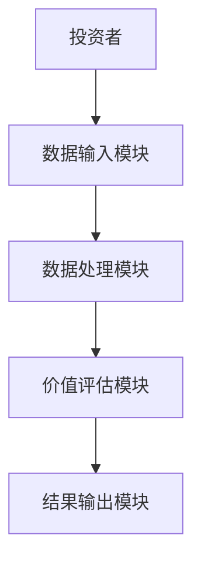
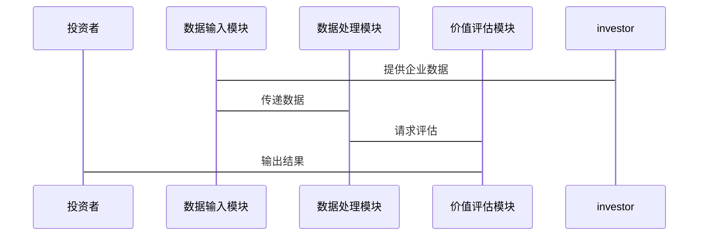

                 

# 彼得林奇的"长期价值创造"在不同行业的衡量标准

> 关键词：长期价值创造，彼得·林奇，投资评估标准，行业分析，投资策略

> 摘要：本文探讨了彼得·林奇的“长期价值创造”理论在不同行业的应用，通过分析其核心概念、数学模型和系统架构，结合实际案例，详细阐述了如何在不同行业中衡量长期价值创造的标准。

---

## 第一部分: 彼得·林奇的"长期价值创造"概述

### 第1章: 长期价值创造的核心概念

#### 1.1 长期价值创造的定义与背景
- **长期价值创造**是指企业在长期经营中为股东、客户和社会创造持续价值的能力。  
- **背景**：现代投资领域强调短期收益，但彼得·林奇认为，真正的投资回报来自企业的长期价值增长。  

#### 1.2 长期价值创造的核心要素
| 核心要素 | 描述 |
|----------|------|
| 企业基本面 | 收入、利润、现金流等 |
| 财务指标 | ROE、市盈率、股息率等 |
| 市场定位 | 市场份额、竞争优势 |

#### 1.3 长期价值创造的衡量标准
- **ROE（净资产收益率）**：衡量企业盈利能力，公式：$$ROE = \frac{\text{净利润}}{\text{净资产}}$$  
- **市盈率（P/E）**：衡量股价与盈利的关系，公式：$$P/E = \frac{\text{股价}}{\text{每股收益}}$$  

### 第2章: 彼得·林奇的长期价值创造理论

#### 2.1 投资哲学
- **价值投资**：寻找被市场低估的企业，长期持有。  
- **长期与短期的平衡**：关注长期价值，同时警惕短期波动。  

#### 2.2 选股标准
- **盈利能力**：ROE高且稳定。  
- **财务健康**：低负债率，高现金流。  
- **竞争优势**：行业龙头，高市场占有率。  

#### 2.3 价值创造模型
- **模型构建**：结合基本面分析和市场估值。  
- **模型优缺点**：优点是稳定性强，缺点是行业适用性有限。  

---

## 第二部分: 数学模型与公式

### 第3章: 基本面分析的数学模型

#### 3.1 净资产收益率（ROE）  
公式：$$ROE = \frac{\text{净利润}}{\text{净资产}}$$  
案例：某企业净利润为1000万元，净资产为5000万元，ROE为20%。  

#### 3.2 资产负债率  
公式：$$\text{资产负债率} = \frac{\text{总负债}}{\text{总资产}}$$  
案例：某企业负债1000万元，资产5000万元，资产负债率为20%。  

### 第4章: 价值评估的数学模型

#### 4.1 市盈率模型  
公式：$$P/E = \frac{\text{股价}}{\text{每股收益}}$$  
案例：某股票价格为50元，每股收益为5元，市盈率为10倍。  

#### 4.2 市净率模型  
公式：$$P/B = \frac{\text{股价}}{\text{每股净资产}}$$  
案例：某股票价格为30元，每股净资产为15元，市净率为2倍。  

---

## 第三部分: 系统分析与架构设计

### 第5章: 价值评估系统的架构设计

#### 5.1 系统功能模块
- **数据输入模块**：接收企业财务数据。  
- **数据处理模块**：计算各项指标。  
- **价值评估模块**：应用模型评估企业价值。  
- **结果输出模块**：显示评估结果。  

#### 5.2 系统架构图

#### 5.3 系统交互图

---

## 第四部分: 项目实战

### 第6章: 行业分析与案例

#### 6.1 科技行业案例
- **企业**：某科技公司  
- **分析**：ROE为15%，市盈率为30倍，高于行业平均水平。  

#### 6.2 消费行业案例
- **企业**：某饮料公司  
- **分析**：ROE为20%，市净率为1.5倍，具有竞争优势。  

#### 6.3 制造业案例
- **企业**：某制造公司  
- **分析**：ROE为10%，市盈率为12倍，财务健康。  

---

## 第五部分: 结论与展望

### 第7章: 结论

- **长期价值创造**是投资的核心，彼得·林奇的理论提供了有效的衡量标准。  
- 不同行业需结合自身特点，灵活应用这些标准。  

### 第8章: 未来展望

- **人工智能**：利用AI优化价值评估模型。  
- **大数据分析**：通过大数据提升行业分析的准确性。  

### 最佳实践 Tips

- **小结**：长期价值创造需要综合分析企业基本面和市场估值。  
- **注意事项**：避免仅依赖单一指标，结合多维度分析。  
- **拓展阅读**：建议阅读彼得·林奇的《投资之道》深入理解价值投资理念。

--- 

# 结语

彼得·林奇的“长期价值创造”理论为投资者提供了科学的衡量标准。通过本文的分析，读者可以在不同行业中灵活应用这些标准，做出更明智的投资决策。未来，随着技术的进步，长期价值创造的评估将更加精准和高效。

