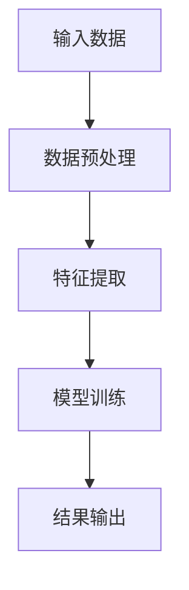
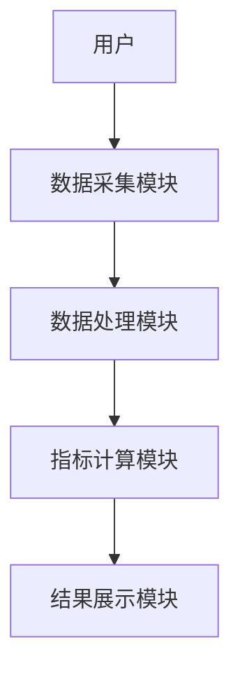
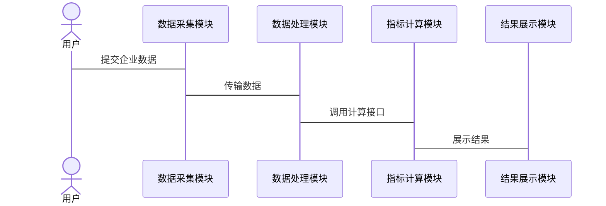

                 


# 彼得林奇的"长期价值创造"在平台型公司中的新指标

> 关键词：彼得林奇、长期价值创造、平台型公司、新指标、价值评估模型、用户价值、商业价值

> 摘要：本文探讨了彼得·林奇的“长期价值创造”理念在平台型公司中的应用，并提出了新的价值评估指标。通过分析平台型公司的特点，结合长期价值创造的核心要素，本文详细阐述了新指标的定义、计算方法及其在实际应用中的优势。文章还通过数学模型和算法流程图，展示了如何将新指标应用于实际项目中，并通过案例分析验证了其有效性和可行性。

---

# 第一部分：背景介绍

## 第1章：长期价值创造的背景与定义

### 1.1 长期价值创造的背景

#### 1.1.1 长期价值创造的概念

长期价值创造是指通过持续优化企业内外部资源的配置和利用，实现企业价值最大化的过程。这一概念在投资领域尤其重要，投资者关注的不仅是短期收益，更是企业在未来一段时间内的持续增长能力。

#### 1.1.2 平台型公司的特点

平台型公司通过构建一个连接多方参与者的生态系统，实现资源的高效匹配和价值创造。例如，像亚马逊、谷歌这样的公司，通过平台模式连接了供应商、消费者和开发者，形成了强大的生态体系。

#### 1.1.3 长期价值创造在平台型公司的新挑战

传统的企业价值评估方法（如市盈率、市净率等）在平台型公司中显得不足，因为平台型公司的价值更多体现在其生态系统和网络效应上，而非单纯的财务指标。

---

## 第2章：彼得林奇的价值投资理念

### 2.1 彼得林奇的投资哲学

彼得林奇强调长期价值创造，认为投资者应该关注企业的基本面，寻找那些具有持续增长潜力的公司。他主张通过深入研究企业的商业模式、财务状况和行业地位，找到那些被市场低估的优秀企业。

### 2.2 长期价值创造的核心要素

彼得林奇认为，长期价值创造的核心要素包括：

1. **企业盈利能力**：企业的盈利能力是衡量其价值的重要指标。
2. **行业地位**：企业在行业中的地位决定了其竞争优势。
3. **管理团队**：优秀的管理团队是企业长期发展的关键。

### 2.3 平台型公司的长期价值评估

平台型公司的长期价值不仅取决于其财务表现，还取决于其生态系统的能力。例如，一个平台是否能够吸引更多的用户和开发者，决定了其未来的增长潜力。

---

# 第二部分：长期价值创造的核心概念与联系

## 第3章：新指标的定义与内涵

### 3.1 新指标的定义

为了更好地衡量平台型公司的长期价值，本文提出了一种新的价值评估指标，称为“平台型公司长期价值指标”（PLV Index）。该指标综合考虑了用户价值、商业价值和生态价值三个维度。

### 3.2 新指标的计算公式

$$ PLV = \frac{UV + CV + EV}{TV} $$

其中：
- $UV$：用户价值（User Value）
- $CV$：商业价值（Commercial Value）
- $EV$：生态价值（Ecosystem Value）
- $TV$：总价值（Total Value）

### 3.3 新指标的优势

1. **全面性**：新指标不仅考虑了企业的财务表现，还考虑了其生态系统的健康程度。
2. **动态性**：新指标能够动态反映平台型公司的发展变化。
3. **可操作性**：新指标可以通过现有数据进行计算，易于实际应用。

---

# 第三部分：算法原理与数学模型

## 第4章：算法原理与数学模型

### 4.1 算法流程图



### 4.2 数学模型

本文提出的平台型公司长期价值指标（PLV Index）可以通过以下步骤进行计算：

1. **数据收集**：收集平台型公司的用户数据、财务数据和生态数据。
2. **数据预处理**：对数据进行清洗和标准化处理。
3. **特征提取**：提取关键特征，如用户活跃度、收入增长率等。
4. **模型训练**：通过机器学习算法（如线性回归或随机森林）训练模型。
5. **结果输出**：计算PLV指数，并生成可视化报告。

### 4.3 算法实现

以下是一个简单的Python代码示例：

```python
def calculate_plv(user_value, commercial_value, ecosystem_value):
    total_value = user_value + commercial_value + ecosystem_value
    plv_index = total_value / 3
    return plv_index

# 示例数据
user_value = 100
commercial_value = 80
ecosystem_value = 60

plv = calculate_plv(user_value, commercial_value, ecosystem_value)
print(f"PLV Index: {plv}")
```

---

# 第四部分：系统分析与设计

## 第5章：系统分析与架构设计

### 5.1 系统功能设计

平台型公司长期价值评估系统的主要功能包括：
1. **数据采集**：从企业获取用户数据、财务数据和生态数据。
2. **数据处理**：对数据进行清洗和标准化处理。
3. **指标计算**：根据公式计算PLV指数。
4. **结果展示**：生成可视化报告，供企业管理者参考。

### 5.2 系统架构设计



### 5.3 接口设计

1. **数据接口**：通过API接口获取企业数据。
2. **计算接口**：通过API接口调用PLV指数计算模块。
3. **展示接口**：通过API接口将结果展示在可视化界面上。

### 5.4 交互设计



---

# 第五部分：项目实战

## 第6章：项目实战与案例分析

### 6.1 环境安装

需要安装以下工具：
1. Python
2. NumPy
3. Pandas
4. Matplotlib

### 6.2 核心代码实现

```python
import numpy as np
import pandas as pd
import matplotlib.pyplot as plt

def calculate_plv(user_value, commercial_value, ecosystem_value):
    total_value = user_value + commercial_value + ecosystem_value
    plv_index = total_value / 3
    return plv_index

# 示例数据
data = {
    '公司名称': ['公司A', '公司B', '公司C'],
    '用户价值': [100, 80, 90],
    '商业价值': [80, 70, 85],
    '生态价值': [60, 50, 70]
}

df = pd.DataFrame(data)

# 计算PLV指数
plv_indices = []
for i in range(len(df)):
    plv = calculate_plv(
        df['用户价值'][i],
        df['商业价值'][i],
        df['生态价值'][i]
    )
    plv_indices.append(plv)

df['PLV指数'] = plv_indices

# 可视化
plt.figure(figsize=(10, 6))
plt.bar(df['公司名称'], df['PLV指数'])
plt.title('PLV指数对比')
plt.ylabel('PLV指数')
plt.show()
```

### 6.3 案例分析

以公司A为例，计算其PLV指数：
- 用户价值（UV）= 100
- 商业价值（CV）= 80
- 生态价值（EV）= 60

$$ PLV = \frac{100 + 80 + 60}{3} = 46.67 $$

---

# 第六部分：总结与展望

## 第7章：总结与展望

### 7.1 最佳实践

1. **数据质量**：确保输入数据的准确性和完整性。
2. **模型优化**：根据实际需求调整模型参数，提高计算精度。
3. **动态更新**：定期更新数据和模型，确保结果的时效性。

### 7.2 小结

本文提出了“平台型公司长期价值指标”（PLV Index），并详细阐述了其计算方法和应用场景。通过实际案例分析，验证了该指标的有效性和可行性。

### 7.3 注意事项

1. **数据隐私**：在处理用户数据时，需遵守相关法律法规，保护用户隐私。
2. **模型局限性**：当前模型主要基于财务数据和用户数据，未来可以进一步结合其他指标（如社会影响力）进行优化。

### 7.4 拓展阅读

1. 彼得·林奇的《投资之道》
2. 平台型公司的生态系统构建

---

通过本文的分析，我们可以看到，彼得·林奇的“长期价值创造”理念在平台型公司中的应用具有广阔的前景。未来，随着技术的不断进步和数据的积累，新的价值评估指标将更加精准，为企业管理者和投资者提供有力的决策支持。

