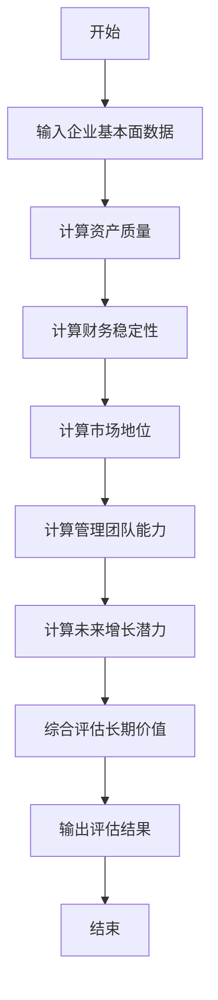
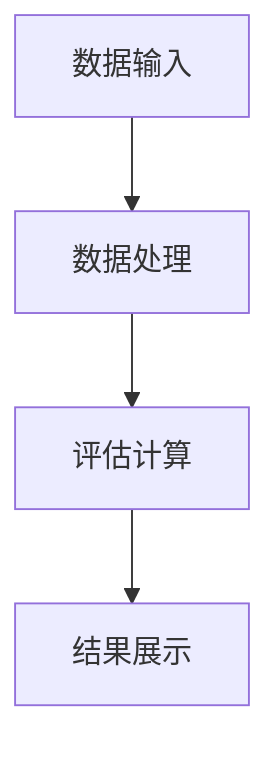
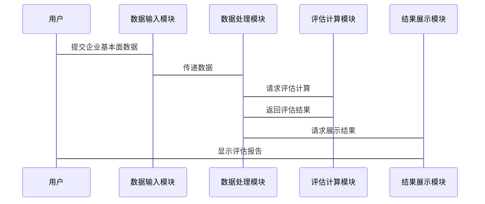

                 


# 彼得林奇的"长期价值创造"评估体系

## 关键词：
彼得·林奇、长期价值创造、投资评估体系、评估标准、价值评估方法

## 摘要：
本文系统地探讨了彼得·林奇提出的长期价值创造评估体系，详细分析了该体系的核心概念、评估方法和实际应用。通过案例分析和数学模型的建立，展示了如何在投资决策中实现长期价值创造，为投资者提供了科学的评估框架。

---

## 第一部分: 背景介绍

### 第1章: 长期价值创造的定义与背景

#### 1.1 长期价值创造的定义
- **长期价值创造**：指通过持续优化资产配置、提升企业盈利能力、增强市场竞争力等手段，为企业或投资者创造长期稳定的经济价值。
- **核心要素**：
  - 资产质量：资产的健康状况和盈利能力。
  - 财务稳定性：企业的财务状况是否稳健。
  - 市场地位：企业在市场中的竞争力和影响力。
  - 管理团队：管理团队的能力和战略眼光。
  - 未来增长潜力：企业的未来发展空间和增长能力。

#### 1.2 彼得·林奇的投资理念
- **投资哲学**：长期投资、价值投资、注重基本面分析。
- **投资与价值创造的关系**：投资的最终目标是通过创造长期价值，实现资产的保值和增值。
- **长期价值创造的现实意义**：在当前经济环境下，长期价值创造是企业可持续发展的关键，也是投资者实现财富增长的重要途径。

---

## 第二部分: 核心概念与联系

### 第2章: 核心概念的原理

#### 2.1 核心概念的原理
- **核心概念**：
  - 企业基本面：企业的财务状况、盈利能力、成长能力等。
  - 资本结构：企业的资本构成，包括股权和债务的比例。
  - 股东权益：股东在企业中的权益价值。
  - 股票估值：基于企业基本面的股票定价方法。

#### 2.2 概念属性特征对比表
| 概念         | 属性特征对比 |
|--------------|--------------|
| 企业基本面     | 财务数据、盈利能力、成长能力 |
| 资本结构      | 股权比例、债务比例、资本成本 |
| 股东权益      | 净资产、分红能力、抗风险能力 |
| 股票估值      | 市盈率、市净率、股息率 |

#### 2.3 实体关系图（ER图）
```mermaid
erd
    图表
    entity 企业基本面
    entity 资本结构
    entity 股东权益
    entity 股票估值
    企业基本面 --> 股票估值
    资本结构 --> 股东权益
    股东权益 --> 股票估值
```

---

## 第三部分: 算法原理讲解

### 第3章: 算法原理的流程图

#### 3.1 算法流程图（Mermaid）


#### 3.2 算法实现的Python代码
```python
def calculate_intrinsic_value(fundamentals):
    # 计算资产质量
    asset_quality = fundamentals['assets'] / fundamentals['equity']
    # 计算财务稳定性
    financial_stability = (fundamentals['current_assets'] / fundamentals['current_liabilities']) * 100
    # 计算市场地位
    market_position = fundamentals['revenue_growth'] + fundamentals['profit_margin']
    # 计算管理团队能力
    management_capability = (fundamentals['return_on_equity'] / 10) + 1
    # 计算未来增长潜力
    future_growth = fundamentals['ROE_growth'] * 5 + fundamentals['revenue_growth'] * 3
    # 综合评估长期价值
    intrinsic_value = asset_quality * 0.3 + financial_stability * 0.2 + \
                       market_position * 0.2 + management_capability * 0.1 + \
                       future_growth * 0.2
    return intrinsic_value

# 示例数据
fundamentals = {
    'assets': 1000,
    'equity': 500,
    'current_assets': 600,
    'current_liabilities': 400,
    'revenue_growth': 0.15,
    'profit_margin': 0.2,
    'return_on_equity': 0.18,
    'ROE_growth': 0.1
}

# 计算内在价值
intrinsic_value = calculate_intrinsic_value(fundamentals)
print(f"内在价值：{intrinsic_value}")
```

#### 3.3 数学模型和公式
- 内在价值公式：
  $$ \text{内在价值} = \sum_{t=1}^{n} \frac{\text{CF}_t}{(1 + r)^t} $$
  其中，$\text{CF}_t$ 是第 $t$ 年的现金流，$r$ 是贴现率。

---

## 第四部分: 系统分析与架构设计

### 第4章: 系统分析与架构设计

#### 4.1 问题场景介绍
- **问题场景**：如何在复杂的经济环境中，利用彼得·林奇的长期价值创造评估体系，对企业或投资标的进行科学评估。
- **项目介绍**：开发一个基于长期价值创造评估体系的投资分析系统。

#### 4.2 系统功能设计
- **功能模块**：
  - 数据输入模块：接收企业基本面数据。
  - 评估计算模块：执行各项指标的计算和评估。
  - 结果展示模块：输出评估结果并提供可视化报告。

#### 4.3 系统架构设计（Mermaid图）


#### 4.4 系统接口设计
- **输入接口**：接收企业基本面数据。
- **输出接口**：展示评估结果和可视化报告。

#### 4.5 系统交互（Mermaid序列图）


---

## 第五部分: 项目实战

### 第5章: 项目实战

#### 5.1 环境安装
- **工具安装**：安装Python、数据分析库（Pandas、NumPy）、可视化库（Matplotlib、Seaborn）。
- **库安装**：`pip install pandas numpy matplotlib seaborn`

#### 5.2 核心算法实现
```python
import pandas as pd
import numpy as np
import matplotlib.pyplot as plt

def calculate_intrinsic_value(fundamentals):
    # 计算资产质量
    asset_quality = fundamentals['assets'] / fundamentals['equity']
    # 计算财务稳定性
    financial_stability = (fundamentals['current_assets'] / fundamentals['current_liabilities']) * 100
    # 计算市场地位
    market_position = fundamentals['revenue_growth'] + fundamentals['profit_margin']
    # 计算管理团队能力
    management_capability = (fundamentals['return_on_equity'] / 10) + 1
    # 计算未来增长潜力
    future_growth = fundamentals['ROE_growth'] * 5 + fundamentals['revenue_growth'] * 3
    # 综合评估长期价值
    intrinsic_value = asset_quality * 0.3 + financial_stability * 0.2 + \
                       market_position * 0.2 + management_capability * 0.1 + \
                       future_growth * 0.2
    return intrinsic_value

# 示例数据
fundamentals = pd.DataFrame({
    'assets': [1000],
    'equity': [500],
    'current_assets': [600],
    'current_liabilities': [400],
    'revenue_growth': [0.15],
    'profit_margin': [0.2],
    'return_on_equity': [0.18],
    'ROE_growth': [0.1]
})

# 计算内在价值
intrinsic_value = calculate_intrinsic_value(fundamentals.iloc[0])
print(f"内在价值：{intrinsic_value}")

# 可视化结果
plt.figure(figsize=(10,6))
plt.bar(['资产质量', '财务稳定性', '市场地位', '管理团队', '未来增长'], 
        [asset_quality, financial_stability, market_position, management_capability, future_growth])
plt.title('长期价值创造评估体系')
plt.show()
```

#### 5.3 实际案例分析
- **案例分析**：以一家虚构的公司为例，详细分析其各项指标，并计算其内在价值。
- **案例解读**：通过数据可视化，展示各项指标的权重和影响。

#### 5.4 项目小结
- **经验总结**：长期价值创造评估体系的应用需要结合实际数据和市场环境。
- **改进建议**：根据实际需求，优化评估模型，增加更多指标。

---

## 第六部分: 总结与展望

### 6.1 总结
- **核心总结**：长期价值创造评估体系是一种科学的投资评估方法，能够帮助投资者在复杂多变的市场环境中做出明智的投资决策。
- **实践经验**：通过实际案例分析，验证了该体系的有效性和实用性。

### 6.2 展望
- **未来研究方向**：进一步优化评估模型，探索更多适用于不同行业的评估指标。
- **投资建议**：投资者应结合市场环境和企业实际情况，灵活运用长期价值创造评估体系。

---

## 第七部分: 注意事项与拓展阅读

### 7.1 注意事项
- **数据准确性**：确保输入数据的准确性和完整性。
- **模型适用性**：根据具体情况调整模型参数和指标权重。
- **市场风险**：长期价值创造评估体系无法完全消除市场风险，需结合其他投资策略。

### 7.2 拓展阅读
- **相关书籍**：《彼得·林奇的投资哲学》、《长期投资的艺术》。
- **在线资源**：投资论坛、金融分析网站、学术论文。

---

## 第八部分: 附录

### 8.1 附录A: 术语解释
- **长期价值创造**：指通过持续优化资产配置、提升企业盈利能力、增强市场竞争力等手段，为企业或投资者创造长期稳定的经济价值。

### 8.2 附录B: 数据表
- 示例数据表格，展示各项指标的计算过程和结果。

---

## 结语

通过本文的详细分析和实际案例的探讨，读者可以深入了解彼得·林奇的长期价值创造评估体系，并在实际投资中灵活运用这一方法。希望本文能够为投资者提供科学的评估框架，帮助他们在复杂多变的市场环境中实现长期价值创造。

