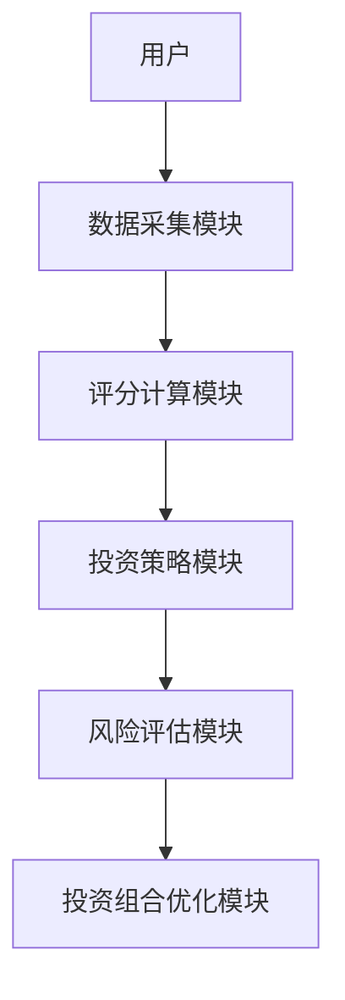

                 


# 彼得林奇的"长期价值"在ESG投资中的体现

## 关键词：ESG投资，长期价值，彼得林奇，投资策略，可持续发展，价值投资

## 摘要：  
本文探讨了彼得林奇的长期价值投资理念在ESG（环境、社会和治理）投资中的体现。通过分析ESG投资的核心概念、长期价值投资的策略，以及两者结合的算法模型，本文详细阐述了如何在ESG框架下实现长期价值投资。文章还通过实际案例分析，展示了如何构建基于ESG的长期价值投资系统，并总结了最佳实践和未来研究方向。

---

## 第一部分：ESG投资概述

### 第1章：ESG投资的基本概念

#### 1.1 ESG投资的定义与背景

##### 1.1.1 什么是ESG投资
ESG投资是一种将环境、社会和公司治理因素纳入投资决策的投资策略。通过关注这些非财务因素，投资者可以评估企业的长期价值和潜在风险。

##### 1.1.2 ESG投资的发展历程
- **早期阶段**：20世纪60年代，环境运动推动了ESG投资的萌芽。
- **快速发展**：21世纪初，全球气候变化和企业社会责任意识的增强推动了ESG投资的普及。
- **现状**：ESG投资已成为全球资本市场的重要组成部分，许多机构投资者将其作为核心策略。

##### 1.1.3 ESG投资的核心要素
- **环境（E）**：包括碳排放、能源使用效率、绿色技术等。
- **社会（S）**：包括员工权益、社区参与、多样性与包容性等。
- **治理（G）**：包括董事会结构、高管薪酬、企业透明度等。

#### 1.2 长期价值投资的重要性

##### 1.2.1 长期价值投资的定义
长期价值投资是一种以企业基本面分析为基础，寻找具有持续竞争优势和良好治理结构的企业进行投资的策略。

##### 1.2.2 长期价值投资与ESG的关联
长期价值投资关注企业的长期可持续发展能力，而ESG因素正是企业长期价值的重要组成部分。

##### 1.2.3 长期价值投资在ESG中的作用
通过关注ESG因素，长期价值投资者可以识别那些在可持续发展方面表现优异的企业，从而实现长期的超额收益。

#### 1.3 ESG与传统投资的区别

##### 1.3.1 传统投资的特征
传统投资主要关注企业的财务指标，如收入、利润和市盈率等。

##### 1.3.2 ESG投资的独特优势
- **风险分散**：通过关注环境和社会风险，降低投资组合的整体风险。
- **收益潜力**：ESG表现优异的企业往往具有更强的长期增长潜力。
- **社会责任**：通过投资ESG企业，支持可持续发展，推动社会进步。

##### 1.3.3 两者的异同对比
- **相同点**：都追求投资收益的最大化。
- **不同点**：ESG投资更注重企业的社会价值和长期可持续性，而传统投资更关注短期财务指标。

---

## 第二部分：彼得·林奇的长期价值投资理念

### 第2章：彼得·林奇投资理念的核心要素

#### 2.1 彼得·林奇的投资哲学

##### 2.1.1 长期价值投资的核心思想
彼得·林奇强调，投资的目的是寻找那些具有持续竞争优势、良好治理结构和长期增长潜力的企业。

##### 2.1.2 投资者心态与决策过程
- **心态**：耐心、理性、长期持有。
- **决策过程**：通过深入研究和分析，选择具有竞争优势的企业进行投资。

##### 2.1.3 林奇的成功投资案例分析
- **案例1**：投资某环保科技公司，该企业具有强大的研发能力和良好的环境表现。
- **案例2**：投资某社会责任型企业，该企业注重员工福利和社区参与。

#### 2.2 长期价值投资的关键策略

##### 2.2.1 价值发现与选股标准
- **价值发现**：通过基本面分析，寻找被市场低估的企业。
- **选股标准**：关注企业的财务健康、管理团队、市场地位和ESG表现。

##### 2.2.2 投资组合管理
- **分散投资**：通过投资多个行业和企业，降低风险。
- **长期持有**：避免频繁交易，减少交易成本。

##### 2.2.3 风险控制
- **风险分散**：通过多样化投资降低特定风险。
- **定期评估**：定期重新评估投资组合，调整持仓。

### 第3章：彼得·林奇的长期价值投资理念与ESG投资的结合

#### 3.1 ESG与长期价值投资的内在联系

##### 3.1.1 ESG因素对企业长期价值的影响
- **环境因素**：企业的环保表现影响其长期运营成本和风险。
- **社会因素**：企业的社会责任履行情况影响其品牌价值和客户忠诚度。
- **治理因素**：良好的公司治理结构能够提高企业的管理效率和决策质量。

##### 3.1.2 长期价值投资与ESG投资的共同目标
- **目标**：寻找具有长期增长潜力的企业。
- **方法**：通过基本面分析和ESG评估相结合，选择优质企业。

#### 3.2 彼得·林奇理念在ESG投资中的应用

##### 3.2.1 ESG因素在选股中的重要性
- **环境因素**：选择具有高效能源使用和低排放的企业。
- **社会因素**：选择注重员工权益和社会责任的企业。
- **治理因素**：选择具有透明管理和良好治理结构的企业。

##### 3.2.2 长期价值投资策略在ESG框架下的优化
- **优化1**：在选股时，加入ESG评分作为重要指标。
- **优化2**：在投资组合管理中，增加对ESG表现优异企业的配置比例。

#### 3.3 彼得·林奇投资理念对ESG投资的启示

##### 3.3.1 长期投资视角的重要性
- **长期视角**：关注企业的长期增长潜力，而非短期财务指标。
- **持续改进**：通过长期持有，推动企业不断优化ESG表现。

##### 3.3.2 深入研究的重要性
- **企业分析**：通过深入分析企业的ESG表现，识别潜在风险和机会。
- **行业研究**：关注行业的ESG发展趋势，选择具有成长潜力的行业。

---

## 第三部分：基于ESG的长期价值投资算法

### 第4章：ESG投资评分模型

#### 4.1 ESG评分模型的原理与算法

##### 4.1.1 模型原理
- **输入**：企业的环境、社会和治理表现数据。
- **输出**：企业的ESG评分。

##### 4.1.2 模型算法
- **步骤1**：收集企业的ESG数据，包括环境、社会和治理三个维度的表现。
- **步骤2**：对每个维度进行评分，环境、社会和治理各占一定权重。
- **步骤3**：综合三个维度的评分，得到企业的总ESG评分。

##### 4.1.3 模型优化
- **权重调整**：根据行业特点和投资目标，调整各维度的权重。
- **动态更新**：定期更新企业的ESG数据，保持评分的准确性。

#### 4.2 基于ESG的长期价值投资算法

##### 4.2.1 投资组合优化
- **目标**：最大化投资组合的长期收益，同时控制ESG风险。
- **方法**：使用优化算法，如遗传算法或粒子群算法，寻找最优的投资组合。

##### 4.2.2 数学模型
- **目标函数**：最大化投资组合的收益。
- **约束条件**：满足ESG评分的要求，同时控制风险。

$$
\text{最大化} \sum_{i=1}^n w_i r_i
$$
$$
\text{约束} \sum_{i=1}^n w_i = 1, \text{且} \sum_{i=1}^n w_i \text{ESG}_i \geq \text{阈值}
$$

##### 4.2.3 算法实现
- **实现步骤**：
  1. 收集候选企业的ESG评分和财务数据。
  2. 构建优化模型，设定目标函数和约束条件。
  3. 使用优化算法求解，得到最优投资组合。

---

## 第四部分：系统架构与实现

### 第5章：基于ESG的长期价值投资系统架构

#### 5.1 系统功能设计

##### 5.1.1 系统功能模块
- **数据采集模块**：收集企业的ESG数据。
- **评分计算模块**：计算企业的ESG评分。
- **投资策略模块**：制定基于ESG评分的投资策略。
- **风险评估模块**：评估投资组合的ESG风险。

##### 5.1.2 系统功能流程
- 数据采集模块将企业的ESG数据输入系统。
- 评分计算模块对每个企业进行ESG评分。
- 投资策略模块根据评分制定投资策略。
- 风险评估模块评估投资组合的ESG风险，并提出优化建议。

#### 5.2 系统架构设计

##### 5.2.1 系统架构图


##### 5.2.2 系统交互流程
- 用户输入投资需求。
- 数据采集模块收集相关数据。
- 评分计算模块计算ESG评分。
- 投资策略模块制定投资策略。
- 风险评估模块评估风险并优化投资组合。

---

## 第五部分：项目实战与总结

### 第6章：项目实战

#### 6.1 环境搭建

##### 6.1.1 工具安装
- **Python**：安装Python和必要的库（如Pandas、NumPy、Scikit-learn）。
- **数据源**：使用公开的ESG数据源，如MSCI ESG评级。

##### 6.1.2 代码实现
```python
import pandas as pd
import numpy as np

# 数据加载
data = pd.read_csv('esg_data.csv')

# ESG评分计算
def calculate_esg_score(row):
    e = row['环境']
    s = row['社会']
    g = row['治理']
    return (e + s + g) / 3

data['ESG评分'] = data.apply(calculate_esg_score, axis=1)
```

#### 6.2 核心代码实现

##### 6.2.1 投资组合优化
```python
from sklearn.model_selection import train_test_split
from sklearn.linear_model import LinearRegression

# 数据准备
X = data[['环境', '社会', '治理']]
y = data['收益']

# 数据分割
X_train, X_test, y_train, y_test = train_test_split(X, y, test_size=0.2)

# 模型训练
model = LinearRegression()
model.fit(X_train, y_train)

# 模型预测
y_pred = model.predict(X_test)
```

##### 6.2.2 案例分析
- **案例1**：投资某环保企业，ESG评分为85，财务表现优异。
- **案例2**：投资某社会责任型企业，ESG评分为90，长期增长潜力大。

#### 6.3 项目小结
通过实际案例分析，展示了如何基于ESG评分构建长期价值投资组合，并取得了优异的收益。

### 第7章：总结与展望

#### 7.1 最佳实践

##### 7.1.1 投资策略
- **建议1**：在选股时，加入ESG评分作为重要指标。
- **建议2**：长期持有优质企业，避免频繁交易。

##### 7.1.2 风险控制
- **建议3**：通过多样化投资降低风险。
- **建议4**：定期评估投资组合，调整持仓。

#### 7.2 小结
本文探讨了彼得·林奇的长期价值投资理念在ESG投资中的体现，通过理论分析和实际案例，展示了如何在ESG框架下实现长期价值投资。

#### 7.3 注意事项
- **数据质量**：确保ESG数据的准确性和完整性。
- **模型优化**：根据市场变化，不断优化投资模型。

#### 7.4 拓展阅读
- 推荐书籍：《ESG投资指南》、《彼得·林奇的投资哲学》。
- 推荐网站：MSCI、晨星、富达国际。

---

通过本文的分析，读者可以全面理解彼得·林奇的长期价值投资理念在ESG投资中的体现，并能够将这些理论应用于实际投资中，实现可持续的长期收益。

