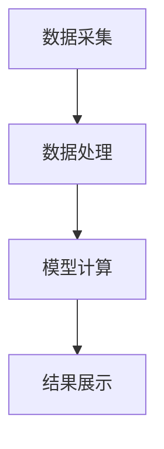

                 


# 彼得林奇的"长期价值"在社会影响力投资中的新定义

> 关键词：长期价值，社会影响力投资，彼得林奇，投资策略，价值评估

> 摘要：本文探讨了彼得林奇的长期价值理论在社会影响力投资中的新定义。通过分析长期价值与社会影响力的联系，提出了基于多因素模型的社会影响力价值评估方法，并结合实际案例进行了系统设计与实现。

---

## # 引言

### 1.1 问题背景与研究意义
长期价值在传统投资中是彼得林奇理论的核心，强调企业基本面分析和长期稳健的收益。然而，随着社会影响力投资的兴起，传统的长期价值定义已无法完全满足新的需求。社会影响力投资要求投资者在追求财务回报的同时，关注社会、环境和治理（ESG）因素，这为长期价值的定义带来了新的挑战和机遇。

### 1.2 问题描述与目标
本文旨在重新定义彼得林奇的长期价值理论，使其适应社会影响力投资的场景。通过分析长期价值与社会影响力的联系，构建一个结合财务回报和社会影响力评估的多因素模型，为投资者提供更全面的决策支持。

### 1.3 本章小结
本文的研究目标是将彼得林奇的长期价值理论与社会影响力投资相结合，提出新的价值评估方法。

---

## # 理论基础

### 2.1 彼得林奇长期价值理论的核心要素
长期价值的核心要素包括企业基本面（如盈利能力、成长性、竞争优势）、行业地位、管理团队和财务健康状况。

### 2.2 社会影响力投资的定义与特点
社会影响力投资是指通过投资实现财务回报和社会价值双重目标的活动，其特点包括双重目标、长期性和社会性。

### 2.3 本章小结
彼得林奇的长期价值理论为社会影响力投资提供了理论基础，但需要在实践中进行创新和扩展。

---

## # 核心概念与联系

### 3.1 长期价值与社会影响力的联系
长期价值是社会影响力的基础，而社会影响力是长期价值的延伸。

### 3.2 长期价值与社会影响力的关系
长期价值是企业可持续发展的核心，而社会影响力是企业对社会的贡献。

### 3.3 本章小结
长期价值与社会影响力密不可分，社会影响力投资要求投资者在评估长期价值时，必须考虑社会、环境和治理因素。

---

## # 算法原理

### 4.1 社会影响力价值评估模型
基于多因素模型的社会影响力价值评估方法，包括财务因素、社会因素、环境因素和治理因素。

### 4.2 算法实现
以下是实现社会影响力价值评估模型的Python代码示例：

```python
def calculate_social_impact_value(factors):
    financial_score = factors['financial']
    social_score = factors['social']
    environmental_score = factors['environmental']
    governance_score = factors['governance']
    
    # 计算加权总分
    weight = {'financial': 0.4, 'social': 0.3, 'environmental': 0.2, 'governance': 0.1}
    total_score = (
        financial_score * weight['financial'] +
        social_score * weight['social'] +
        environmental_score * weight['environmental'] +
        governance_score * weight['governance']
    )
    return total_score

# 示例输入
factors = {
    'financial': 0.8,
    'social': 0.7,
    'environmental': 0.6,
    'governance': 0.5
}

# 计算并输出结果
print(calculate_social_impact_value(factors))
```

### 4.3 本章小结
通过多因素模型，我们可以量化企业长期价值中的社会影响力因素，为投资决策提供支持。

---

## # 系统分析

### 5.1 系统功能设计
社会影响力投资评估系统的功能模块包括数据采集、数据处理、模型计算和结果展示。

### 5.2 系统架构设计
以下是系统的架构图：



### 5.3 系统接口设计
系统接口包括数据输入接口、模型调用接口和结果输出接口。

### 5.4 本章小结
系统架构设计为社会影响力投资评估提供了技术支持。

---

## # 项目实战

### 6.1 项目环境配置
需要安装Python和相关库（如pandas、numpy）。

### 6.2 核心代码实现
以下是实现社会影响力评估的核心代码：

```python
import pandas as pd

def main():
    # 示例数据
    data = {
        '企业名称': ['A', 'B', 'C'],
        '财务得分': [0.8, 0.7, 0.9],
        '社会得分': [0.7, 0.6, 0.8],
        '环境得分': [0.6, 0.5, 0.7],
        '治理得分': [0.5, 0.4, 0.6]
    }
    df = pd.DataFrame(data)
    
    # 计算总分
    df['总分'] = df.apply(lambda x: 
        x['财务得分'] * 0.4 + 
        x['社会得分'] * 0.3 + 
        x['环境得分'] * 0.2 + 
        x['治理得分'] * 0.1, axis=1)
    
    print(df)

if __name__ == "__main__":
    main()
```

### 6.3 项目小结
通过实际案例，我们可以看到社会影响力投资评估的实际应用。

---

## # 结论

### 7.1 总结
彼得林奇的长期价值理论在社会影响力投资中的新定义，为投资者提供了更全面的决策支持。

### 7.2 展望
未来，社会影响力投资将成为主流，长期价值的定义也将不断演变。

### 7.3 本章小结
本文的研究为社会影响力投资提供了新的理论和方法。

---

# 附录

## 附录A: 关键术语解释
- 长期价值：企业在未来一段时间内的盈利能力和发展潜力。
- 社会影响力：企业对社会、环境和治理的贡献。

## 附录B: 参考文献
- 彼得林奇著《选股的艺术》
- 社会影响力投资相关文献

---

以上是文章的完整目录大纲，每章内容可以根据需要进一步扩展和详细阐述。

