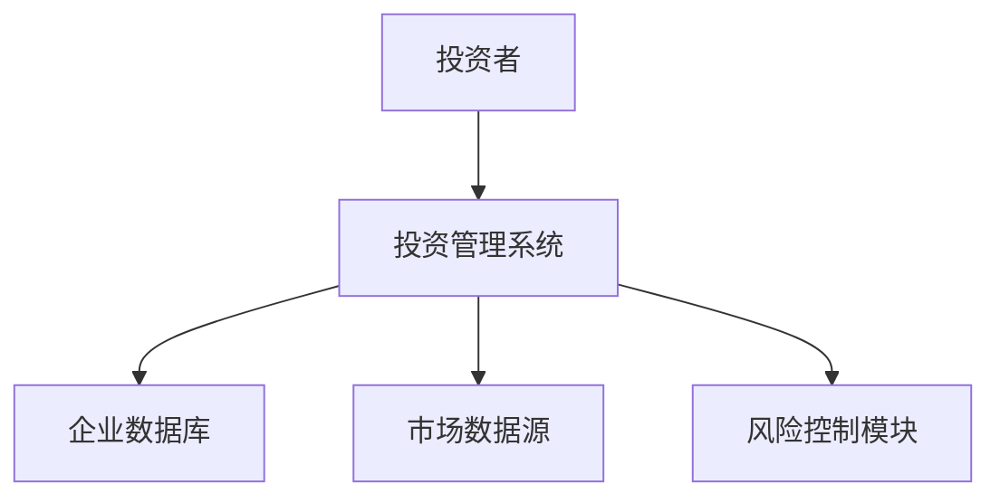
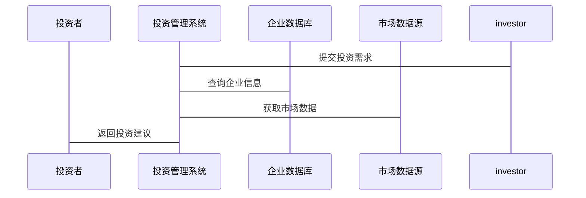

                 

# 彼得林奇的"长期价值"在社会责任投资中的体现

**关键词**：长期价值，社会责任投资，彼得林奇，投资理念，可持续发展，企业价值，社会影响

**摘要**：本文深入探讨彼得林奇的长期价值投资理念在社会责任投资中的体现。通过分析长期价值投资的核心要素、社会责任投资的兴起与现状，以及两者之间的内在联系，结合彼得林奇的投资哲学和成功案例，详细阐述了长期价值投资在社会责任投资中的应用策略与实践路径。文章还讨论了彼得林奇投资理念对社会责任投资的启示，并展望了社会责任投资的未来发展趋势。

---

## 第一章: 长期价值投资的背景与核心理念

### 1.1 长期价值投资的定义与背景

长期价值投资是一种以企业基本面分析为基础，注重企业长期竞争优势和可持续发展的投资理念。其核心在于寻找那些具有持续增长潜力和良好治理结构的企业，并长期持有，以实现资产的稳健增值。彼得林奇作为长期价值投资的代表人物，强调通过深入研究企业财务状况、管理层素质、行业地位等因素，选择那些具有竞争优势和成长潜力的企业进行投资。

### 1.2 彼得林奇的投资风格与成功案例

彼得林奇以其独特的投资风格闻名，他主张通过长期持有优质股票，避免频繁交易，从而降低交易成本并捕捉企业的长期增长潜力。他的成功案例包括投资可口可乐、通用电气等企业，这些企业在长期持有过程中实现了显著的增值。

### 1.3 长期价值投资的核心要素

长期价值投资的核心要素包括：

1. **企业基本面分析**：通过财务报表分析企业的盈利能力、成长能力、偿债能力等。
2. **企业竞争优势**：评估企业在行业中的竞争优势，如技术壁垒、品牌影响力等。
3. **长期价值评估**：预测企业在未来市场环境中的价值增长潜力。

---

## 第二章: 社会责任投资的兴起与现状

### 2.1 社会责任投资的定义与特征

社会责任投资（SRI）是一种以企业的社会、环境和治理表现为核心考量的投资方式。其核心在于选择那些在环境保护、社会责任、公司治理等方面表现良好的企业进行投资，以实现经济效益与社会价值的双重目标。

### 2.2 社会责任投资的市场现状

社会责任投资近年来在全球范围内迅速发展，尤其是在欧洲和北美市场，社会责任投资的规模和影响力不断提升。在中国，随着环保意识的增强和政策的支持，社会责任投资也逐渐兴起，但仍面临市场认知不足、信息披露不完善等挑战。

### 2.3 社会责任投资与传统投资的区别

| 投资类型 | 投资目标 | 核心考量 | 风险收益 |
|----------|----------|----------|----------|
| 传统投资 | 财务回报 | 财务表现 | 高风险高收益 |

| 投资类型 | 投资目标 | 核心考量 | 风险收益 |
|----------|----------|----------|----------|
| 社会责任投资 | 综合效益 | 社会、环境、治理表现 | 中低风险稳健收益 |

---

## 第三章: 长期价值投资与社会责任投资的内在联系

### 3.1 长期价值投资与社会责任投资的共同点

长期价值投资与社会责任投资在以下方面具有共同点：

1. **长期性**：两者均强调长期投资，注重企业的长期价值增长。
2. **基本面分析**：两者都注重对企业基本面的深入分析，尤其是企业的竞争优势和成长潜力。
3. **风险控制**：两者均注重风险控制，通过分散投资和严格筛选降低投资风险。

### 3.2 长期价值投资与社会责任投资的区别

长期价值投资与社会责任投资在目标和策略上存在差异：

1. **目标差异**：长期价值投资注重财务回报，而社会责任投资注重综合效益。
2. **策略差异**：长期价值投资侧重于企业竞争优势和长期增长潜力，而社会责任投资侧重于企业的社会、环境和治理表现。
3. **风险收益差异**：长期价值投资风险较高，收益潜力大，而社会责任投资风险较低，收益较为稳健。

---

## 第四章: 彼得林奇长期价值理念在社会责任投资中的应用

### 4.1 彼得林奇投资理念的核心要素

彼得林奇的投资理念可以总结为以下几个核心要素：

1. **企业基本面分析**：通过深入研究企业的财务状况、管理层素质和行业地位，选择具有竞争优势的企业。
2. **长期持有**：避免频繁交易，降低交易成本，捕捉企业的长期增长潜力。
3. **分散投资**：通过分散投资降低风险，避免过度依赖单一企业或行业。

### 4.2 社会责任投资中的长期价值评估

在社会责任投资中，长期价值评估需要考虑企业的社会、环境和治理表现。具体包括：

1. **环境保护**：企业是否注重环境保护，减少污染物排放，推动绿色生产。
2. **社会责任**：企业是否积极参与社会公益事业，履行社会责任。
3. **公司治理**：企业是否具有良好的治理结构，确保管理层透明和决策科学。

---

## 第五章: 长期价值投资在社会责任投资中的策略与实践

### 5.1 长期价值投资在社会责任投资中的策略选择

在社会责任投资中，长期价值投资的策略选择包括：

1. **投资目标的确定**：选择那些在社会、环境和治理方面表现良好，并具有长期增长潜力的企业。
2. **投资组合的构建**：通过分散投资，将社会责任投资与传统投资相结合，实现风险控制和收益最大化。
3. **风险控制**：通过严格的筛选标准和动态调整投资组合，降低投资风险。

### 5.2 社会责任投资中的长期价值实现路径

实现长期价值在社会责任投资中的路径包括：

1. **企业社会责任表现的持续跟踪**：定期评估企业在社会、环境和治理方面的表现，确保投资标的的可持续性。
2. **长期价值评估的动态调整**：根据市场环境和企业表现的变化，动态调整长期价值评估模型。
3. **投资策略的优化与创新**：结合新的市场趋势和社会责任投资的发展，不断优化投资策略，推动长期价值的实现。

---

## 第六章: 彼得林奇投资理念对社会责任投资的启示与展望

### 6.1 彼得林奇投资理念对社会责任投资的启示

彼得林奇的投资理念对社会责任投资的启示主要体现在以下几个方面：

1. **长期投资理念的借鉴**：社会责任投资应注重长期性，避免短期波动的干扰。
2. **企业基本面分析的借鉴**：社会责任投资需要深入分析企业的社会、环境和治理表现，确保投资标的的可持续性。
3. **投资风险管理的借鉴**：通过分散投资和严格的筛选标准，降低投资风险。

### 6.2 社会责任投资的未来发展趋势

社会责任投资的未来发展趋势包括：

1. **全球社会责任投资的发展趋势**：随着全球环保意识的增强和政策支持的加大，社会责任投资将在全球范围内继续快速发展。
2. **中国社会责任投资的未来方向**：中国社会责任投资将更加注重企业的社会和环境表现，推动经济的可持续发展。
3. **长期价值投资与社会责任投资的深度融合**：未来，长期价值投资与社会责任投资将更加深度融合，实现经济效益与社会价值的双重目标。

---

## 第七章: 项目实战与最佳实践

### 7.1 项目背景与目标

本项目旨在通过彼得林奇的长期价值投资理念，指导社会责任投资的实践。项目目标是选择那些在社会、环境和治理方面表现良好，并具有长期增长潜力的企业进行投资。

### 7.2 系统设计与实现

#### 7.2.1 系统功能设计

- **企业筛选模块**：根据企业的社会、环境和治理表现，筛选符合条件的企业。
- **长期价值评估模块**：对企业进行长期价值评估，预测企业的未来价值增长潜力。
- **投资组合优化模块**：根据评估结果，优化投资组合，实现风险控制和收益最大化。

#### 7.2.2 系统架构设计

#### 7.2.3 系统交互设计

---

## 第八章: 总结与展望

### 8.1 小结

本文深入探讨了彼得林奇的长期价值投资理念在社会责任投资中的体现，分析了长期价值投资与社会责任投资的内在联系，并提出了社会责任投资的未来发展趋势。

### 8.2 注意事项

- **投资风险**：社会责任投资仍存在市场风险、流动性风险等，投资者需谨慎选择。
- **信息不对称**：社会责任投资的信息披露不完善，投资者需加强信息收集和分析能力。
- **政策支持**：政府和社会各界需进一步加强政策支持和宣传推广，推动社会责任投资的发展。

### 8.3 拓展阅读

- **《彼得林奇的投资哲学》**：深入理解彼得林奇的投资理念。
- **《社会责任投资的实践与创新》**：学习社会责任投资的最新实践和创新。

---

通过本文的分析，可以发现，彼得林奇的长期价值投资理念为社会责任投资提供了重要的启示和指导。未来，随着社会责任投资的不断发展，长期价值投资与社会责任投资的深度融合将成为投资领域的重要趋势，为实现可持续发展注入新的动力。

