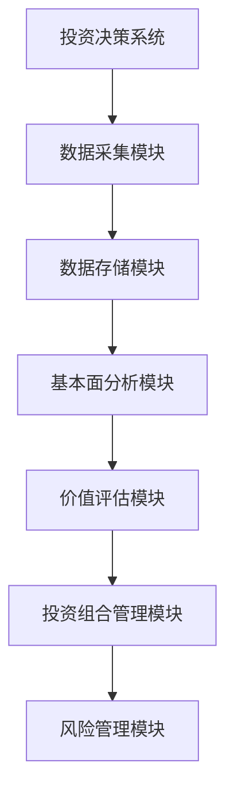

                 


---

# 彼得林奇的"长期价值"投资哲学

> 关键词：长期价值投资，彼得·林奇，投资哲学，价值选股，投资组合管理，风险管理

> 摘要：本文深入分析了彼得·林奇的长期价值投资哲学，探讨了其核心理念、选股策略、投资组合管理方法以及风险管理策略。通过数学模型、系统架构设计和项目实战，详细阐述了长期价值投资的理论与实践结合，为投资者提供了深度的理论支持和实用的工具。

---

## 第1章: 长期价值投资的背景与发展

### 1.1 投资学的演变历程

投资学作为一门重要的经济学分支，经历了从传统到现代的演变。早期的投资理论主要关注市场的短期波动，而随着金融市场的复杂化，长期价值投资逐渐成为主流。长期价值投资强调对企业的基本面分析，关注企业的内在价值，而非市场的短期波动。

### 1.2 彼得·林奇与长期价值投资

彼得·林奇是美国著名的投资专家，以其管理富达麦哲伦基金的辉煌业绩而闻名。他的投资哲学以长期价值为核心，主张通过深入研究企业的财务状况和行业前景，寻找被市场低估的投资标的。

---

## 第2章: 长期价值投资的核心理念

### 2.1 长期价值投资的定义与特征

长期价值投资是一种投资策略，强调以低于企业内在价值的价格买入优质股票，并长期持有，以获得超越市场的收益。其核心特征包括：

1. **注重基本面分析**：关注企业的财务状况、行业地位和竞争优势。
2. **长期持有**：避免频繁交易，减少交易成本和税务负担。
3. **价值导向**：寻找市场低估的股票，关注安全边际。

### 2.2 彼得·林奇的价值投资策略

彼得·林奇的价值投资策略基于以下几个关键点：

1. **深入研究企业**：通过分析企业的财务报表、管理层能力和行业趋势，评估其内在价值。
2. **寻找低估股票**：关注那些市场价格低于内在价值的企业。
3. **分散投资**：通过分散投资降低风险，同时提高收益稳定性。

---

## 第3章: 长期价值投资的数学模型与公式

### 3.1 投资组合的期望收益公式

$$ E(r) = \sum p_i r_i $$

其中，$E(r)$ 是投资组合的期望收益，$p_i$ 是各资产的权重，$r_i$ 是各资产的预期收益率。

### 3.2 风险调整后的收益公式

夏普比率用于衡量投资组合的风险调整后收益：

$$ \text{夏普比率} = \frac{E(r - r_f)}{\sigma} $$

其中，$r_f$ 是无风险利率，$\sigma$ 是投资组合的收益波动率。

### 3.3 马科维茨的有效前沿理论

马科维茨的有效前沿理论表明，最优投资组合是在所有可能的组合中，具有最小风险且达到预期收益的组合。

$$ \text{有效前沿} = \{ \text{Min} \sigma^2 | E(r) \} $$

---

## 第4章: 长期价值投资的系统架构设计

### 4.1 投资决策系统的功能设计

一个完整的长期价值投资决策系统应具备以下功能：

1. **数据采集**：获取企业的财务数据、行业信息和市场数据。
2. **基本面分析**：对企业进行财务评估，计算关键指标如市盈率、市净率等。
3. **价值评估**：通过模型计算企业的内在价值，判断其是否被低估。
4. **投资组合管理**：根据评估结果构建投资组合，并进行风险管理和优化。

### 4.2 系统架构设计

以下是长期价值投资系统的架构图：



---

## 第5章: 长期价值投资的项目实战

### 5.1 实战环境搭建

#### 5.1.1 工具安装与配置

- **Python环境**：安装Python 3.8以上版本。
- **数据获取工具**：使用Yahoo Finance API获取股票数据。
- **数据分析库**：安装Pandas、NumPy和Matplotlib。

### 5.2 核心算法实现

#### 5.2.1 价值选股算法的Python实现

以下是一个简单的价值选股算法：

```python
def value_stock_selector(stocks, financial_ratios):
    selected_stocks = []
    for stock in stocks:
        if stock.value_ratios > threshold:
            selected_stocks.append(stock)
    return selected_stocks
```

### 5.3 实战案例分析

#### 5.3.1 案例分析：某行业低估股票的发现

通过分析某行业的市盈率（P/E）和市净率（P/B）等指标，发现某企业市场价格低于其内在价值，判断其为低估股票。

---

## 第6章: 长期价值投资的风险管理与优化

### 6.1 投资组合的风险管理策略

#### 6.1.1 风险分散化原理

通过投资于不同行业和资产类别，降低单一投资的风险。

#### 6.1.2 风险调整后的投资组合优化

利用夏普比率等指标，优化投资组合的风险收益比。

### 6.2 长期价值投资的未来趋势

#### 6.2.1 数字化投资工具的兴起

随着技术的发展，投资者可以利用大数据和人工智能工具进行更精准的选股和风险评估。

#### 6.2.2 人工智能在价值投资中的应用

人工智能可以通过分析海量数据，发现潜在的投资机会，优化投资策略。

---

## 第7章: 投资者的最佳实践与小结

### 7.1 投资者的最佳实践

#### 7.1.1 长期价值投资的注意事项

- **持续学习**：保持对市场的敏感性和对企业基本面的深入理解。
- **分散投资**：避免过度集中于单一股票或行业。
- **耐心持有**：长期持有优质股票，避免频繁交易。

#### 7.1.2 投资过程中的常见误区

- **过度关注短期波动**：长期价值投资需要忽略市场的短期波动。
- **忽视风险管理**：投资组合需要根据市场变化进行动态调整。

### 7.2 本书总结与展望

#### 7.2.1 核心观点回顾

- 长期价值投资的核心在于对企业基本面的深入分析和市场低估股票的发现。
- 通过分散投资和风险管理，可以实现稳健的收益。

#### 7.2.2 对未来投资者的启示

- 结合技术手段，如大数据和人工智能，优化投资决策。
- 持续学习和实践，不断提升自身的投资能力。

---

## 附录: 长期价值投资相关资源

### 附录A: 彼得·林奇的经典著作推荐

1. 《彼得·林奇的成功投资》
2. 《战胜市场的人》
3. 《投资的智慧》

---

通过本文的系统分析和实践案例，读者可以深入理解彼得·林奇的长期价值投资哲学，并将其应用于实际投资中。希望本文能为投资者提供有价值的参考和启示。

