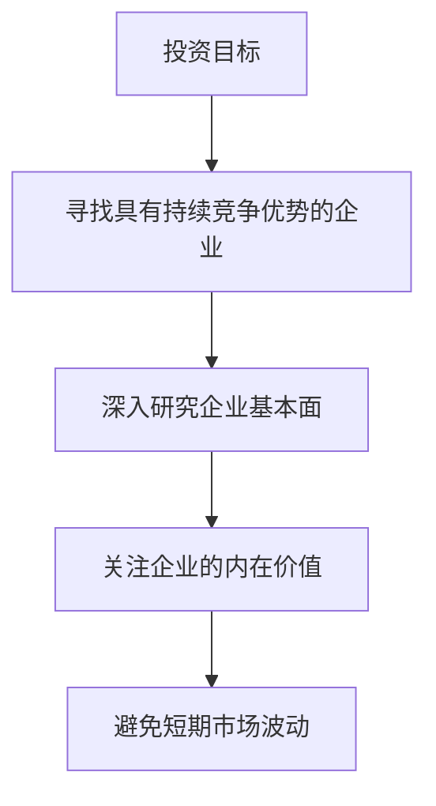
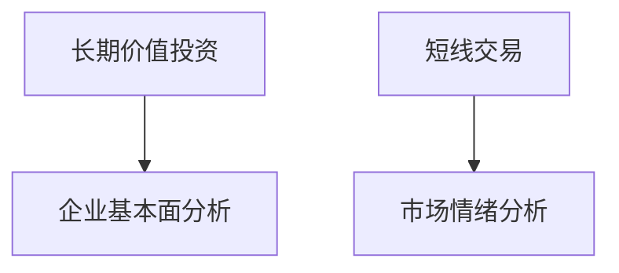

                 


# 彼得林奇的"长期价值"投资案例分析

## 关键词：
彼得林奇，长期价值投资，投资案例，投资策略，价值分析，投资哲学

## 摘要：
本文将深入分析彼得·林奇的长期价值投资理念，通过具体的投资案例，结合系统分析和数学模型，揭示长期价值投资的核心要素和分析框架。同时，本文将从系统架构和算法原理的角度，详细阐述如何将长期价值投资理念应用于实际投资决策中，并通过实战案例展示其有效性。

---

# 第一部分: 彼得林奇的"长期价值"投资背景与核心概念

## 第1章: 彼得林奇与长期价值投资概述

### 1.1 彼得林奇的背景与投资哲学
#### 1.1.1 彼得林奇的生平简介
彼得·林奇（Peter Lynch）是美国著名的投资经理人，被誉为“最伟大的共同基金经理”。他在富达麦哲伦基金（Fidelity Magellan Fund）的管理期间（1977年-1990年）取得了令人瞩目的投资业绩，年平均回报率达到29%。林奇的投资哲学以“长期价值投资”为核心，强调通过深入研究企业基本面，寻找具有持续竞争优势的企业进行投资。

#### 1.1.2 林奇的投资理念与风格
林奇的投资理念可以概括为以下几点：
- **价值发现**：寻找被市场低估的企业，而不是关注市场的短期波动。
- **深入研究**：通过对企业基本面的深入分析，选择具有持续竞争优势的企业。
- **长期持有**：避免频繁交易，长期持有优质企业，分享其成长收益。

#### 1.1.3 林奇投资哲学的核心思想
林奇认为，投资的最终目标是寻找那些能够持续创造价值的企业，而不是追求短期的市场波动。他强调，投资者应该关注企业的内在价值，而不是市场的短期情绪。

**Mermaid流程图：林奇投资哲学的核心思想**


### 1.2 长期价值投资的定义与特点
#### 1.2.1 长期价值投资的定义
长期价值投资是一种投资策略，强调以低于企业内在价值的价格买入并长期持有优质企业，通过企业长期的业绩增长实现投资收益。

#### 1.2.2 长期价值投资的核心特点
- **长期持有**：避免频繁交易，降低交易成本。
- **价值导向**：关注企业的内在价值，而非市场短期波动。
- **基本面分析**：通过对企业财务状况、行业地位、竞争优势等进行深入分析，选择具有长期增长潜力的企业。

#### 1.2.3 长期价值投资与短线交易的区别
| 投资策略 | 长期价值投资 | 短线交易 |
|----------|--------------|----------|
| 时间跨度 | 长期（数年） | 短期（数天或数周） |
| 分析重点 | 企业基本面 | 市场情绪 |
| 风险控制 | 低风险 | 高风险 |

**Mermaid流程图：长期价值投资与短线交易的区别**


### 1.3 彼得林奇长期价值投资的成功因素
#### 1.3.1 对企业的深入研究
林奇强调，投资成功的前提是对企业进行深入研究，包括企业的财务状况、行业地位、竞争优势等。

#### 1.3.2 对市场的深刻理解
林奇认为，市场的短期波动往往由投资者的非理性行为驱动，而长期价值投资需要忽略短期波动，专注于企业的内在价值。

#### 1.3.3 对风险的严格控制
林奇通过选择具有长期竞争优势的企业，避免了短期市场波动带来的风险。

### 1.4 本章小结
---

## 第2章: 长期价值投资的核心要素

### 2.1 长期价值投资的核心要素
#### 2.1.1 企业的基本面分析
- **财务状况**：包括收入、利润、资产负债表等。
- **行业地位**：包括行业集中度、企业的市场占有率等。
- **竞争优势**：包括成本优势、技术优势、品牌优势等。

#### 2.1.2 行业地位与竞争优势
- **行业地位**：企业的行业地位决定了其在市场中的竞争力。
- **竞争优势**：企业的竞争优势是其长期盈利能力的保障。

#### 2.1.3 财务状况与盈利能力
- **财务状况**：包括企业的资产、负债、所有者权益等。
- **盈利能力**：包括净利润率、ROE（净资产收益率）等。

#### 2.1.4 管理团队与公司治理
- **管理团队**：包括管理团队的经验、能力和稳定性。
- **公司治理**：包括董事会结构、公司治理机制等。

### 2.2 长期价值投资的分析框架
#### 2.2.1 企业生命周期模型
- **导入期**：企业处于市场进入阶段，风险较高。
- **成长期**：企业快速增长阶段，投资机会较多。
- **成熟期**：企业进入稳定发展阶段，风险较低。
- **衰退期**：企业进入衰退阶段，投资风险较高。

#### 2.2.2 行业发展趋势分析
- **行业趋势**：包括行业的发展前景、市场需求、技术进步等。
- **行业周期**：包括行业的周期性波动。

#### 2.2.3 经济周期与市场波动
- **经济周期**：包括经济的扩张期和衰退期。
- **市场波动**：包括市场的牛市和熊市。

### 2.3 彼得林奇的选股标准
#### 2.3.1 寻找具有持续竞争优势的企业
- **行业地位**：选择具有较高市场占有率的企业。
- **竞争优势**：选择具有技术、成本、品牌等竞争优势的企业。

#### 2.3.2 选择具有合理估值的股票
- **估值指标**：包括市盈率（P/E）、市净率（P/B）、ROE等。
- **合理估值**：选择估值低于企业内在价值的股票。

#### 2.3.3 避免高风险投资
- **高风险企业**：包括财务状况不佳、行业前景不明朗的企业。
- **高风险投资**：包括杠杆率过高、流动性不足的投资。

### 2.4 本章小结
---

## 第3章: 彼得林奇投资案例分析的系统架构

### 3.1 投资案例分析的系统框架
#### 3.1.1 数据收集与处理模块
- **数据来源**：包括企业的财务报表、行业数据、市场数据等。
- **数据预处理**：包括数据清洗、数据转换等。

#### 3.1.2 基本面分析模块
- **财务分析**：包括收入、利润、资产负债表等的分析。
- **行业分析**：包括行业发展趋势、竞争对手分析等。

#### 3.1.3 估值模型与决策模块
- **估值模型**：包括市盈率模型、DCF模型等。
- **决策支持**：包括投资决策、风险控制等。

### 3.2 系统功能设计
#### 3.2.1 数据收集与预处理
- **数据收集**：通过API、数据库等方式获取企业数据。
- **数据预处理**：清洗数据、填补缺失值等。

#### 3.2.2 企业基本面分析
- **财务分析**：包括利润表、资产负债表、现金流量表的分析。
- **行业分析**：包括行业发展趋势、竞争对手分析。

#### 3.2.3 估值模型的构建与应用
- **估值模型**：包括市盈率模型、DCF模型等。
- **模型应用**：基于估值模型，确定企业的内在价值。

### 3.3 系统架构设计
#### 3.3.1 分层架构设计
- **数据层**：包括数据的存储、管理等。
- **业务逻辑层**：包括数据处理、分析等。
- **用户界面层**：包括数据展示、用户交互等。

#### 3.3.2 模块化设计
- **数据模块**：负责数据的收集与处理。
- **分析模块**：负责企业的基本面分析。
- **决策模块**：负责投资决策的支持。

#### 3.3.3 数据流与交互设计
- **数据流**：数据从数据源流入系统，经过处理后，进入分析模块，最终生成投资决策。
- **交互设计**：用户通过界面与系统交互，获取分析结果。

### 3.4 本章小结
---

## 第4章: 彼得林奇投资案例分析的算法与数学模型

### 4.1 投资案例分析的数学模型
#### 4.1.1 市盈率模型
- **公式**：市盈率 = 股价 / 每股净利润
- **解释**：市盈率反映了市场对企业盈利能力的估值。

#### 4.1.2 DCF模型
- **公式**：企业价值 = 现金流的现值
- **解释**：DCF模型用于评估企业的内在价值。

### 4.2 算法原理讲解
#### 4.2.1 市盈率模型的应用
- **步骤**：
  1. 收集企业的财务数据。
  2. 计算企业的每股净利润。
  3. 计算市盈率。
  4. 对比市场平均市盈率，确定企业的估值。

#### 4.2.2 DCF模型的应用
- **步骤**：
  1. 收集企业的未来现金流预测。
  2. 计算现金流的现值。
  3. 确定企业价值。

### 4.3 本章小结
---

## 第5章: 项目实战

### 5.1 环境安装与数据收集
#### 5.1.1 环境安装
- **工具安装**：安装Python、Pandas、Matplotlib等工具。
- **数据源**：获取企业的财务数据、行业数据等。

#### 5.1.2 数据收集
- **数据获取**：通过API获取企业的财务数据。
- **数据存储**：将数据存储在CSV文件中。

### 5.2 核心代码实现
#### 5.2.1 数据处理
```python
import pandas as pd

# 读取数据
data = pd.read_csv('企业数据.csv')

# 数据清洗
data.dropna(inplace=True)
data = data.drop_duplicates()
```

#### 5.2.2 基本面分析
```python
# 计算市盈率
data['市盈率'] = data['股价'] / data['每股净利润']

# 计算ROE
data['ROE'] = data['净利润'] / data['所有者权益']
```

#### 5.2.3 估值模型
```python
def calculate_intrinsic_value(revenue, cost, margin):
    # 简单的DCF模型
    free_cash_flow = revenue - cost
    discount_rate = 0.1
    intrinsic_value = free_cash_flow / (1 + discount_rate)
    return intrinsic_value

# 应用模型
data['内在价值'] = data.apply(lambda x: calculate_intrinsic_value(x['收入'], x['成本'], x['利润率']))
```

### 5.3 实战案例分析
#### 5.3.1 案例介绍
- **企业名称**：苹果公司
- **行业**：科技
- **财务数据**：收入、利润、ROE等。

#### 5.3.2 数据分析
- **市盈率**：计算苹果公司的市盈率。
- **ROE**：计算苹果公司的ROE。
- **DCF模型**：计算苹果公司的内在价值。

#### 5.3.3 投资决策
- **估值对比**：比较苹果公司的股价与内在价值，判断是否低估。
- **投资建议**：基于分析结果，提出投资建议。

### 5.4 本章小结
---

## 第6章: 最佳实践与总结

### 6.1 最佳实践
#### 6.1.1 投资理念
- **长期持有**：避免短期交易。
- **深入研究**：选择具有竞争优势的企业。

#### 6.1.2 风险管理
- **分散投资**：避免过度集中。
- **严格止损**：设置止损点，控制风险。

### 6.2 小结
长期价值投资是一种有效的投资策略，通过深入研究企业基本面，选择具有长期竞争优势的企业，实现长期稳定的收益。

### 6.3 注意事项
- **市场波动**：长期价值投资需要耐心，避免被短期波动干扰。
- **持续学习**：市场环境不断变化，需要持续学习和调整。

### 6.4 拓展阅读
- **推荐书籍**：
  - 《彼得林奇的成功投资》
  - 《投资学原理》
- **推荐阅读**：学习更多关于长期价值投资的知识。

---

# 结语
彼得林奇的长期价值投资理念为我们提供了一种有效的投资方法，通过深入研究企业基本面，选择具有长期竞争优势的企业，实现长期稳定的收益。本文通过系统分析和实战案例，详细阐述了长期价值投资的核心要素和分析框架，为投资者提供了宝贵的参考。

