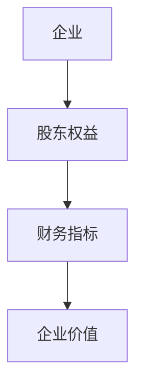
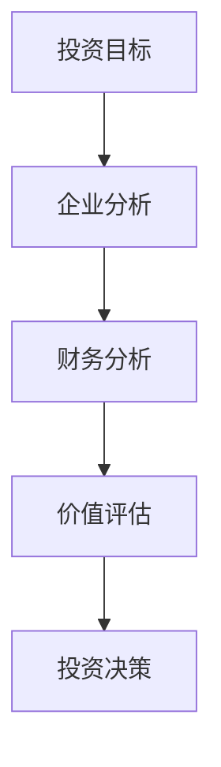
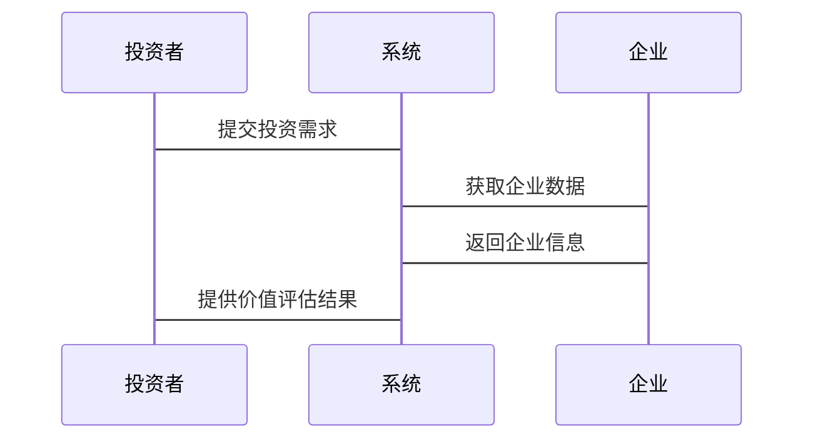

                 


```

# 彼得林奇的"长期价值"投资理念

> 关键词：长期价值投资、彼得林奇、投资理念、基本面分析、企业价值

> 摘要：本文深入探讨了彼得林奇的长期价值投资理念，分析了其核心概念、系统架构、数学模型和实际案例，结合技术语言和专业术语，提供了全面而深入的解读，帮助读者理解并应用这一投资策略。

---

# 第一部分: 长期价值投资的背景与基础

## 第1章: 长期价值投资的定义与核心理念

### 1.1 投资的基本概念

#### 1.1.1 投资的定义与分类

投资是将资源（如资金）投入到某个项目或实体中，以期在未来获得收益的行为。根据时间跨度，投资可分为短期投资和长期投资。短期投资注重短期收益，而长期投资则关注资产的长期增值。

#### 1.1.2 股票投资的核心要素

股票投资涉及购买公司的一部分股权，投资者通过分享公司利润获得收益。核心要素包括公司的盈利能力、财务状况、行业地位和管理团队等。

#### 1.1.3 长期价值投资的起源与发展

长期价值投资起源于20世纪，以本杰明·格雷厄姆和沃伦·巴菲特为代表，强调以内在价值为导向，选择优质企业进行长期持有。

### 1.2 彼得林奇与长期价值投资

#### 1.2.1 彼得林奇的生平简介

彼得·林奇是美国著名投资经理人，曾管理富达麦哲伦基金，创造了辉煌的投资业绩。他的投资理念深受格雷厄姆和巴菲特的影响，但更加注重企业的成长性和竞争优势。

#### 1.2.2 彼得林奇的投资理念

林奇强调深入研究企业基本面，寻找那些具有持续增长潜力的公司，并长期持有。他认为市场波动是投资机会的来源，而非风险。

#### 1.2.3 彼得林奇的投资风格与特点

林奇的投资风格以基本面分析为主，注重企业的财务状况、管理团队和行业前景。他反对短期交易，倡导长期持有的投资策略。

### 1.3 长期价值投资的核心要素

#### 1.3.1 企业的长期价值来源

企业的长期价值来源于其盈利能力、竞争优势和成长潜力。通过分析这些因素，投资者可以识别出那些能够持续创造价值的企业。

#### 1.3.2 长期价值投资的三大支柱

1. **基本面分析**：研究企业的财务报表、行业地位和竞争优势。
2. **估值方法**：通过市盈率、市净率等指标评估企业的内在价值。
3. **长期持有**：避免频繁交易，耐心等待企业的成长。

#### 1.3.3 长期价值投资的边界与外延

长期价值投资的边界在于企业必须具备持续增长的潜力，而其外延则涉及多种投资策略和风险管理方法。

### 1.4 长期价值投资与短期投资的对比

#### 1.4.1 短期投资的定义与特点

短期投资注重市场的短期波动，通过高频交易获利。其特点是风险高、收益不稳定。

#### 1.4.2 长期价值投资与短期投资的区别

长期价值投资注重企业的内在价值，而短期投资关注市场波动。长期投资强调稳定性，短期投资则追求快速收益。

#### 1.4.3 选择长期价值投资的原因

长期价值投资通过选择优质企业，能够在市场波动中实现稳定增长，适合那些追求稳健收益的投资者。

---

## 第2章: 长期价值投资的核心概念与联系

### 2.1 核心概念原理

#### 2.1.1 企业价值的评估方法

企业价值的评估方法包括现金流折现法（DCF）、相对估值法（市盈率、市净率等）和资产重置法。

#### 2.1.2 股东权益与企业价值的关系

股东权益是企业的净资产，企业价值则包括企业的整体价值，包括股权和债权。

#### 2.1.3 财务指标与企业价值的关联

财务指标如净利润率、ROE（净资产收益率）和营业收入增长率等，是评估企业价值的重要依据。

### 2.2 核心概念属性特征对比表格

| 概念       | 特性1       | 特性2       | 特性3       |
|------------|------------|------------|------------|
| 企业价值   | 数值化      | 可比性      | 动态性      |
| 股东权益   | 所有权      | 稳定性      | 可衡量性    |
| 财务指标   | 可量化      | 可分析性     | 预测性      |

### 2.3 ER实体关系图（Mermaid流程图）



---

## 第3章: 长期价值投资的系统分析与架构设计方案

### 3.1 投资决策的系统架构

#### 3.1.1 系统功能设计

系统功能包括数据收集、分析处理、价值评估和投资决策。

#### 3.1.2 系统架构设计（Mermaid架构图）



### 3.2 投资系统的接口设计

#### 3.2.1 数据输入接口

数据输入包括企业的财务报表、行业数据和市场信息。

#### 3.2.2 数据处理接口

数据处理包括清洗、转换和分析。

#### 3.2.3 结果输出接口

结果输出包括价值评估报告和投资建议。

### 3.3 投资系统的交互流程（Mermaid序列图）



---

## 第4章: 长期价值投资的数学模型与算法

### 4.1 企业价值评估的数学模型

#### 4.1.1 现金流折现法（DCF模型）

企业价值（EV）= 现金流入现值

其中，现金流入现值可以通过未来现金流的折现计算得出。

#### 4.1.2 净现值法（NPV）

NPV = ∑(CF_t / (1 + r)^t) - 初始投资

其中，CF_t为第t年的现金流，r为折现率。

### 4.2 企业价值评估的Python实现

```python
def calculate_ev(cash_flows, discount_rate):
    ev = 0
    for t, cf in enumerate(cash_flows):
        ev += cf / (1 + discount_rate) ** t
    return ev

# 示例数据
cash_flows = [100, 150, 200, 250]
discount_rate = 0.08

ev = calculate_ev(cash_flows, discount_rate)
print(f"企业价值为: {ev}")
```

### 4.3 企业价值评估的流程

1. 收集企业的未来现金流预测。
2. 确定合适的折现率。
3. 计算未来现金流的现值。
4. 减去初始投资，得到企业价值。

---

## 第5章: 项目实战——长期价值投资案例分析

### 5.1 项目背景

选择一家成长型企业，分析其基本面和财务状况，评估其长期价值。

### 5.2 项目实施

#### 5.2.1 数据收集

收集企业的财务报表、行业数据和市场信息。

#### 5.2.2 数据分析

使用DCF模型评估企业的内在价值。

#### 5.2.3 投资决策

根据评估结果，决定是否投资。

### 5.3 项目总结

通过案例分析，验证长期价值投资理念的有效性，并总结经验教训。

---

## 第6章: 长期价值投资的风险管理与心理因素

### 6.1 风险管理

#### 6.1.1 风险来源

市场风险、企业风险和流动性风险。

#### 6.1.2 风险评估与管理策略

通过分散投资、定期评估和及时调整来降低风险。

### 6.2 投资心理

#### 6.2.1 常见错误

过度自信、从众心理和情绪化决策。

#### 6.2.2 心理因素的应对策略

保持理性、耐心和纪律性。

---

## 第7章: 长期价值投资的系统构建与优化

### 7.1 系统构建

#### 7.1.1 系统功能模块

数据采集、分析处理、价值评估和投资决策。

#### 7.1.2 系统优化

通过反馈机制和算法优化，提高系统的准确性和效率。

### 7.2 系统优化

#### 7.2.1 算法优化

改进DCF模型的参数估计方法，提高评估精度。

#### 7.2.2 系统扩展

增加更多的分析模块，如行业分析和竞争对手分析。

---

## 第8章: 总结与展望

### 8.1 总结

彼得林奇的长期价值投资理念强调基本面分析和长期持有，通过深入研究企业价值，实现稳健收益。

### 8.2 展望

随着技术的进步，长期价值投资的系统化和智能化将成为未来发展的趋势。

---

## 第9章: 最佳实践 Tips

### 9.1 小结

长期价值投资需要耐心和纪律，通过深入研究和持续学习，才能在市场中获得成功。

### 9.2 注意事项

1. 避免短期波动的影响。
2. 保持对企业的持续关注。
3. 理解并管理投资风险。

### 9.3 拓展阅读

推荐阅读彼得·林奇的书籍，如《彼得林奇的成功投资》和《巴菲特致股东的信》。

---

# 结语

彼得林奇的长期价值投资理念为投资者提供了重要的指导，通过深入分析企业的基本面，选择优质企业进行长期投资，能够在市场波动中实现稳健的收益。希望本文能够帮助读者更好地理解和应用这一投资策略。

```

