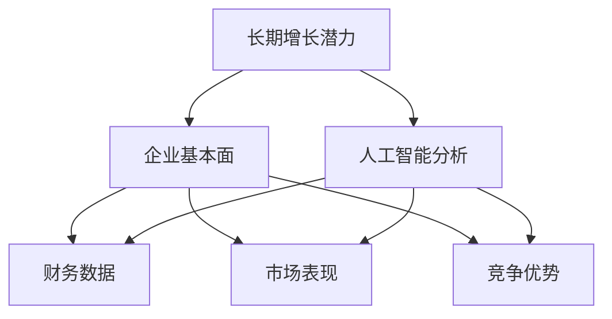
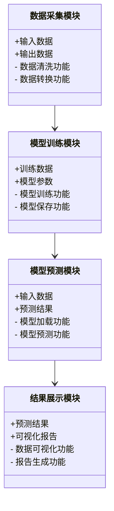
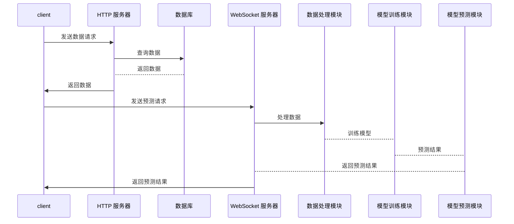

                 


# 彼得林奇的"长期增长"潜力在人工智能行业的识别方法

> 关键词：彼得·林奇，长期增长潜力，人工智能，投资分析，机器学习

> 摘要：本文旨在探讨如何利用人工智能技术来识别彼得·林奇提出的“长期增长”潜力。通过分析长期增长潜力的核心概念、人工智能在投资分析中的应用、机器学习算法在长期增长潜力预测中的作用，以及构建一个基于人工智能的长期增长潜力识别系统的方法。本文将从背景介绍、核心概念、算法原理、系统架构、项目实战等多个方面进行详细阐述，为读者提供一个全面的技术视角。

---

# 第1章：彼得·林奇投资理念与长期增长潜力

## 1.1 彼得·林奇投资理念概述

### 1.1.1 彼得·林奇投资方法的核心思想

彼得·林奇是全球著名投资家，以其独特的投资策略和长期增长型投资理念闻名。他的核心思想是通过深入分析企业的基本面，寻找那些具有长期增长潜力的公司进行投资。他认为，投资者应该关注企业的财务状况、行业地位、管理团队以及市场前景等因素，而不是盲目追随市场的短期波动。

### 1.1.2 长期增长潜力的定义与特点

长期增长潜力是指企业在未来较长一段时间内，能够持续增长并为股东创造价值的可能性。具体表现为：

- **稳定的收入增长**：企业收入持续增长，且增速稳定。
- **健康的盈利能力**：企业净利润率保持在较高水平，并具有提升空间。
- **强大的竞争优势**：企业在市场上具有独特的竞争优势，能够抵御竞争压力。
- **良好的管理团队**：管理团队具有战略眼光和执行力，能够带领企业持续发展。

### 1.1.3 彼得·林奇投资理念对企业价值分析的启示

彼得·林奇的投资理念强调对企业基本面的深入分析，这为人工智能在投资分析中的应用提供了方向。通过对企业财务数据、市场表现、行业趋势等多维度信息的分析，人工智能可以辅助投资者更准确地识别具有长期增长潜力的企业。

---

## 1.2 人工智能在投资分析中的应用背景

### 1.2.1 人工智能技术的发展与投资分析的结合

随着人工智能技术的快速发展，其在投资分析领域的应用逐渐增多。人工智能可以通过大数据分析、自然语言处理、机器学习等技术，帮助投资者更高效地分析企业基本面、市场趋势以及潜在风险。

### 1.2.2 传统投资分析方法的局限性

传统投资分析方法主要依赖于人工分析，存在以下局限性：

- **数据量有限**：传统分析方法通常依赖于有限的财务数据和市场数据，难以捕捉到隐藏在大量非结构化数据中的信息。
- **分析效率低**：人工分析耗时耗力，难以应对海量数据的分析需求。
- **主观性较强**：分析师的主观判断可能会影响分析结果的客观性。

### 1.2.3 人工智能在投资分析中的优势与潜力

人工智能在投资分析中的优势在于其高效的数据处理能力和精准的预测能力。通过机器学习算法，人工智能可以对海量数据进行建模和分析，发现传统方法难以察觉的模式和趋势，从而帮助投资者更准确地识别具有长期增长潜力的企业。

---

## 1.3 本书研究目标与意义

### 1.3.1 研究目标

本文旨在探讨如何利用人工智能技术，特别是机器学习算法，来识别具有长期增长潜力的企业。通过对财务数据、市场表现、行业趋势等多维度数据的分析，构建一个基于人工智能的长期增长潜力识别系统。

### 1.3.2 研究意义

- **提高投资效率**：通过人工智能技术，投资者可以更高效地筛选和分析企业数据，减少人工分析的时间和成本。
- **提升投资准确性**：人工智能可以通过大数据分析和机器学习算法，帮助投资者更准确地识别具有长期增长潜力的企业。
- **提供新的研究方向**：本文的研究成果为投资分析领域的人工智能应用提供了新的思路和方法。

---

# 第2章：长期增长潜力的识别核心概念

## 2.1 长期增长潜力的定义与构成要素

### 2.1.1 长期增长潜力的定义

长期增长潜力是指企业在未来较长一段时间内，能够在市场竞争中保持增长，并为股东创造持续价值的可能性。它不仅关注企业的当前表现，更关注企业的未来发展前景。

### 2.1.2 核心构成要素分析

长期增长潜力的识别需要考虑以下几个核心要素：

| 要素 | 描述 | 影响权重 |
|------|------|----------|
| 财务状况 | 包括收入、利润、现金流等财务指标 | 高 |
| 竞争优势 | 企业在市场中的竞争优势，如技术壁垒、品牌影响力等 | 高 |
| 管理团队 | 管理团队的能力和战略眼光 | 中 |
| 行业趋势 | 行业的发展前景和趋势 | 中 |
| 市场表现 | 股票价格的波动性和市场表现 | 低 |

### 2.1.3 要素之间的关系与影响

长期增长潜力的识别是一个多维度的综合分析过程。财务状况和竞争优势是核心要素，对长期增长潜力的影响权重较高；行业趋势和管理团队是次要要素，对长期增长潜力有一定影响；市场表现则是辅助性要素，主要用于验证和调整分析结果。

---

## 2.2 人工智能在长期增长潜力识别中的作用

### 2.2.1 数据驱动的分析优势

人工智能通过大数据分析，可以整合企业财务数据、行业数据、市场数据等多源数据，发现数据背后隐藏的规律和趋势。

### 2.2.2 机器学习算法的应用场景

机器学习算法可以用于以下场景：

- **数据预处理**：对海量数据进行清洗和特征提取。
- **模型训练**：基于历史数据训练机器学习模型，预测企业的长期增长潜力。
- **实时监控**：对企业的实时数据进行监控，及时发现潜在风险。

### 2.2.3 自然语言处理在企业信息分析中的应用

自然语言处理技术可以用于分析企业的新闻报道、行业报告等非结构化数据，提取有用的信息用于长期增长潜力的评估。

---

## 2.3 核心概念关系图



---

# 第3章：长期增长潜力识别的算法原理

## 3.1 机器学习算法概述

### 3.1.1 常见机器学习算法及其特点

以下是一些常用的机器学习算法及其特点：

| 算法 | 特点 | 适用场景 |
|------|------|----------|
| 线性回归 | 简单，易于解释 | 预测连续型变量 |
| 支持向量机 | 对小数据集表现较好 | 分类和回归 |
| 随机森林 | 抗过拟合能力强 | 分类和回归 |
| 神经网络 | 适合处理复杂非线性关系 | 图像识别、自然语言处理 |

### 3.1.2 监督学习与无监督学习的适用场景

- **监督学习**：适用于有标签的数据，如分类和回归问题。
- **无监督学习**：适用于无标签的数据，如聚类和降维问题。

### 3.1.3 深度学习在投资分析中的应用

深度学习在投资分析中的应用主要体现在以下几个方面：

- **图像识别**：分析公司财务报表中的图表数据。
- **自然语言处理**：分析公司新闻、行业报告等文本数据。
- **时间序列分析**：预测股票价格走势。

---

## 3.2 基于机器学习的长期增长潜力预测模型

### 3.2.1 数据预处理与特征选择

数据预处理是机器学习模型构建的基础。主要步骤包括：

- **数据清洗**：处理缺失值、异常值。
- **特征提取**：从原始数据中提取有用的特征。
- **特征工程**：对特征进行标准化、归一化等处理。

### 3.2.2 模型训练与优化

- **模型选择**：根据数据特点选择合适的机器学习算法。
- **参数调优**：通过交叉验证等方法优化模型参数。
- **模型评估**：使用训练数据和测试数据评估模型性能。

### 3.2.3 模型评估与验证

常用的模型评估指标包括：

- **均方误差（MSE）**：衡量预测值与真实值之间的差异。
- **准确率（Accuracy）**：分类问题中正确预测的比例。
- **召回率（Recall）**：分类问题中正确识别的正例比例。

---

## 3.3 算法实现与代码示例

### 3.3.1 环境搭建与数据准备

#### 环境搭建

- **Python**：安装Python 3.8及以上版本。
- **库依赖**：安装`pandas`、`numpy`、`scikit-learn`等库。

#### 数据准备

以下是一个简单的数据集示例：

```python
import pandas as pd
import numpy as np

# 创建示例数据集
data = {
    '收入': [100, 200, 300, 400, 500],
    '利润': [20, 30, 40, 50, 60],
    '增长潜力': [1, 1, 2, 2, 3]
}

df = pd.DataFrame(data)
```

### 3.3.2 Python代码实现

#### 数据预处理

```python
from sklearn.model_selection import train_test_split
from sklearn.preprocessing import StandardScaler

# 数据分割
X = df.drop('增长潜力', axis=1)
y = df['增长潜力']

X_train, X_test, y_train, y_test = train_test_split(X, y, test_size=0.2, random_state=42)

# 特征标准化
scaler = StandardScaler()
X_train_scaled = scaler.fit_transform(X_train)
X_test_scaled = scaler.transform(X_test)
```

#### 模型训练与预测

```python
from sklearn.ensemble import RandomForestRegressor

# 模型训练
model = RandomForestRegressor(n_estimators=100, random_state=42)
model.fit(X_train_scaled, y_train)

# 模型预测
y_pred = model.predict(X_test_scaled)
```

#### 模型评估

```python
from sklearn.metrics import mean_squared_error, r2_score

# 模型评估
mse = mean_squared_error(y_test, y_pred)
r2 = r2_score(y_test, y_pred)

print(f"均方误差: {mse}")
print(f"R²系数: {r2}")
```

---

## 3.4 算法原理的数学模型和公式

### 3.4.1 随机森林算法

随机森林是一种基于树的集成学习算法，其核心思想是通过构建多个决策树，并将它们的结果进行集成，最终得到一个预测结果。

#### 随机森林的数学模型

随机森林的数学模型可以表示为：

$$
y = \sum_{i=1}^{n} \text{Tree}(x_i)
$$

其中，$y$ 是预测结果，$x_i$ 是第 $i$ 棵树的输入，$n$ 是决策树的数量。

---

## 3.5 通俗易懂的举例说明

假设我们有一个包含企业收入、利润和增长潜力的数据集。我们可以通过随机森林算法，训练一个模型来预测企业的增长潜力。

- **输入数据**：企业的收入、利润。
- **输出数据**：企业的增长潜力（1、2、3）。
- **模型训练**：使用随机森林算法训练模型。
- **模型预测**：输入新的企业的收入和利润，模型输出其增长潜力。

---

# 第4章：系统分析与架构设计方案

## 4.1 问题场景介绍

我们希望通过构建一个基于人工智能的长期增长潜力识别系统，帮助投资者更高效地识别具有长期增长潜力的企业。

## 4.2 项目介绍

本项目旨在开发一个基于机器学习的长期增长潜力识别系统，主要功能包括：

- 数据采集与处理
- 模型训练与预测
- 结果可视化与报告生成

---

## 4.3 系统功能设计

### 4.3.1 领域模型（Mermaid 类图）



---

## 4.4 系统架构设计

### 4.4.1 系统架构图（Mermaid 架构图）

```mermaid
client --> HTTP 服务器
HTTP 服务器 --> 数据库
client --> WebSocket 服务器
WebSocket 服务器 --> 数据处理模块
数据处理模块 --> 模型训练模块
模型训练模块 --> 模型预测模块
模型预测模块 --> 结果展示模块
```

---

## 4.5 系统接口设计

- **数据接口**：提供数据采集和数据处理的接口。
- **模型接口**：提供模型训练和模型预测的接口。
- **展示接口**：提供结果展示和报告生成的接口。

---

## 4.6 系统交互设计（Mermaid 序列图）



---

# 第5章：项目实战

## 5.1 环境安装与配置

### 5.1.1 安装依赖

```bash
pip install pandas numpy scikit-learn matplotlib
```

### 5.1.2 数据集准备

以下是一个简单的数据集示例：

```python
import pandas as pd
import numpy as np

# 创建示例数据集
data = {
    '收入': [100, 200, 300, 400, 500],
    '利润': [20, 30, 40, 50, 60],
    '增长潜力': [1, 1, 2, 2, 3]
}

df = pd.DataFrame(data)
```

---

## 5.2 系统核心实现

### 5.2.1 数据处理模块

```python
from sklearn.model_selection import train_test_split
from sklearn.preprocessing import StandardScaler

# 数据分割
X = df.drop('增长潜力', axis=1)
y = df['增长潜力']

X_train, X_test, y_train, y_test = train_test_split(X, y, test_size=0.2, random_state=42)

# 特征标准化
scaler = StandardScaler()
X_train_scaled = scaler.fit_transform(X_train)
X_test_scaled = scaler.transform(X_test)
```

### 5.2.2 模型训练模块

```python
from sklearn.ensemble import RandomForestRegressor

# 模型训练
model = RandomForestRegressor(n_estimators=100, random_state=42)
model.fit(X_train_scaled, y_train)
```

### 5.2.3 模型预测模块

```python
# 模型预测
y_pred = model.predict(X_test_scaled)
```

### 5.2.4 结果展示模块

```python
from sklearn.metrics import mean_squared_error, r2_score
import matplotlib.pyplot as plt

# 模型评估
mse = mean_squared_error(y_test, y_pred)
r2 = r2_score(y_test, y_pred)

print(f"均方误差: {mse}")
print(f"R²系数: {r2}")

# 结果可视化
plt.scatter(y_test, y_pred)
plt.xlabel('真实值')
plt.ylabel('预测值')
plt.title('预测值与真实值的关系')
plt.show()
```

---

## 5.3 实际案例分析

### 5.3.1 案例背景

假设我们有一个包含多个企业的数据集，包括收入、利润、增长潜力等特征。

### 5.3.2 数据分析与建模

```python
import pandas as pd
import numpy as np
from sklearn.ensemble import RandomForestRegressor
from sklearn.model_selection import train_test_split
from sklearn.metrics import mean_squared_error, r2_score

# 数据加载
df = pd.read_csv('企业数据.csv')

# 数据分割
X = df.drop('增长潜力', axis=1)
y = df['增长潜力']

X_train, X_test, y_train, y_test = train_test_split(X, y, test_size=0.2, random_state=42)

# 特征标准化
from sklearn.preprocessing import StandardScaler

scaler = StandardScaler()
X_train_scaled = scaler.fit_transform(X_train)
X_test_scaled = scaler.transform(X_test)

# 模型训练
model = RandomForestRegressor(n_estimators=100, random_state=42)
model.fit(X_train_scaled, y_train)

# 模型预测
y_pred = model.predict(X_test_scaled)

# 模型评估
mse = mean_squared_error(y_test, y_pred)
r2 = r2_score(y_test, y_pred)

print(f"均方误差: {mse}")
print(f"R²系数: {r2}")
```

### 5.3.3 案例分析与解读

通过上述代码，我们可以得到模型的均方误差和R²系数。均方误差越小，模型的预测精度越高；R²系数越接近1，模型的拟合程度越高。

---

## 5.4 项目小结

通过本项目，我们成功构建了一个基于人工智能的长期增长潜力识别系统。通过机器学习算法，我们可以更高效地分析企业数据，识别具有长期增长潜力的企业，为投资者提供有力的决策支持。

---

# 第6章：总结与注意事项

## 6.1 本章总结

本文通过分析彼得·林奇的长期增长潜力理念，结合人工智能技术，提出了一个基于机器学习的长期增长潜力识别方法。通过数据预处理、模型训练、结果展示等步骤，构建了一个完整的长期增长潜力识别系统。

## 6.2 最佳实践 tips

- **数据质量**：确保数据的准确性和完整性。
- **模型优化**：通过参数调优和特征工程提高模型性能。
- **实时监控**：定期更新数据和模型，确保分析结果的时效性。

## 6.3 注意事项

- **数据隐私**：在处理企业数据时，需要注意数据隐私和合规性。
- **模型解释性**：复杂的模型可能会降低解释性，需要注意模型的可解释性。
- **风险管理**：投资有风险，需谨慎决策。

## 6.4 拓展阅读

- **《彼得·林奇的投资哲学》**：深入理解彼得·林奇的投资理念。
- **《机器学习实战》**：学习更多机器学习算法和实战技巧。
- **《Python机器学习》**：掌握基于Python的机器学习实现方法。

---

# 结语

通过本文的探讨，我们不仅了解了彼得·林奇的长期增长潜力理念，还掌握了如何利用人工智能技术来识别这种潜力。希望本文的内容能够为投资者和人工智能技术爱好者提供有价值的参考和启发。

