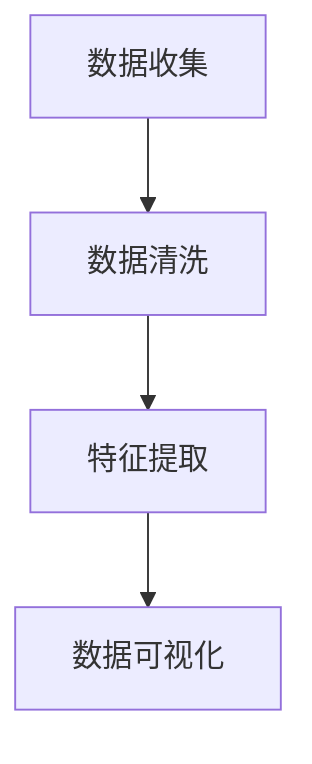
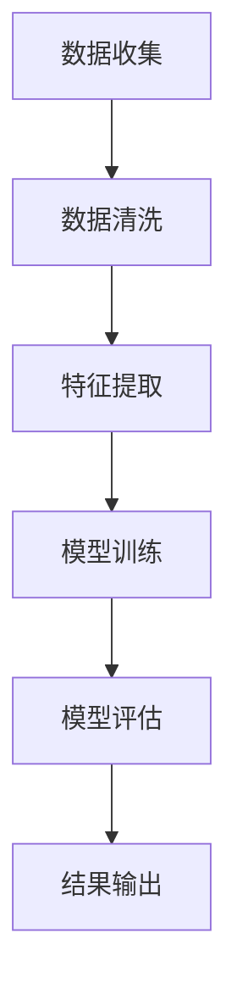
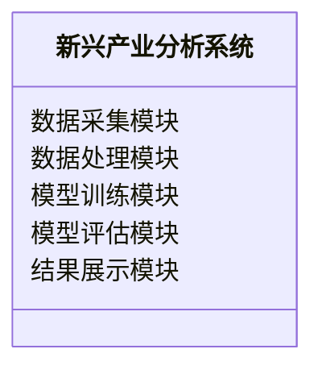
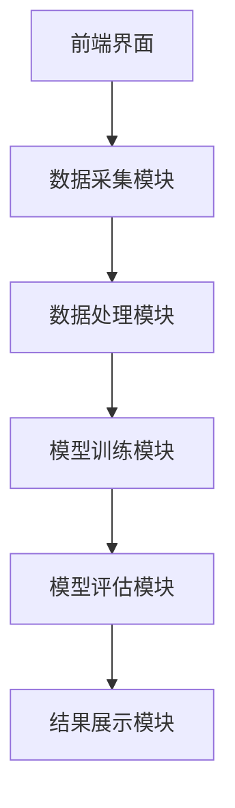
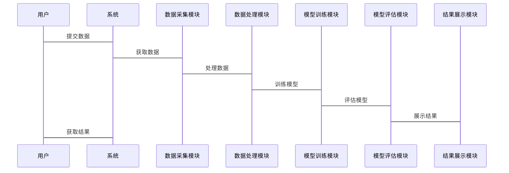

                 


# 彼得林奇的"长期增长"潜力在新兴产业的识别

> 关键词：彼得·林奇，长期增长，新兴产业，投资策略，数据分析，人工智能

> 摘要：本文深入探讨了彼得·林奇提出的“长期增长”潜力在新兴产业中的识别方法。通过分析长期增长的核心概念、算法原理、数学模型以及实际案例，本文为投资者提供了一套系统化的方法论，帮助他们在新兴产业中识别出具备长期增长潜力的投资标的。文章结合了数据分析、人工智能技术以及实际的系统架构设计，提供了从理论到实践的完整解决方案。

---

# 第一部分: 引言

# 第1章: 彼得·林奇的长期增长投资理念

## 1.1 彼得·林奇与长期增长投资
### 1.1.1 彼得·林奇的背景与投资风格
彼得·林奇是全球著名投资专家，以其在长期增长投资领域的卓越成就闻名。他强调通过深入研究公司基本面，寻找那些具备长期增长潜力的企业。林奇的投资理念注重长期价值，而非短期市场波动，这使得他在新兴 industries中尤其成功。

### 1.1.2 长期增长投资的核心理念
长期增长投资的核心在于寻找那些能够在未来十年或更长时间内保持稳定增长的企业。这些企业通常具备强大的竞争优势、广阔的市场前景以及稳定的财务表现。

### 1.1.3 新兴产业在长期增长中的重要性
新兴产业是长期增长的重要来源。这些行业通常处于快速发展的阶段，具备高增长潜力。例如，人工智能、电动汽车、生物技术等领域都可能是长期增长的热点。

## 1.2 长期增长与新兴产业的定义
### 1.2.1 长期增长的定义与特征
长期增长指的是企业在未来较长一段时间内收入和利润的持续增长。其特征包括稳定的市场需求、持续的产品创新、高效的运营能力和强大的财务表现。

### 1.2.2 新兴产业的定义与分类
新兴产业是指那些基于新技术、新商业模式或新市场需求而迅速崛起的行业。例如，人工智能、区块链、清洁能源等都属于新兴产业。

### 1.2.3 长期增长与新兴产业的关系
新兴产业由于其快速发展的特性，为长期增长提供了丰富的投资机会。企业在新兴产业中更容易实现快速增长，从而为投资者带来超额收益。

## 1.3 本章小结
本章介绍了彼得·林奇的长期增长投资理念，明确了长期增长和新兴产业的定义，并分析了两者之间的关系。下一章将深入探讨长期增长潜力的核心概念及其在新兴产业中的具体表现。

---

# 第二部分: 核心概念与联系

# 第2章: 长期增长潜力的核心概念

## 2.1 长期增长潜力的属性特征
### 2.1.1 长期增长潜力的核心要素
长期增长潜力的核心要素包括市场需求、竞争优势、财务表现和创新能力。这些要素共同决定了一个企业是否能够在长期中保持增长。

### 2.1.2 新兴产业的特征对比表
以下是新兴产业与传统产业在长期增长潜力方面的特征对比表：

| 特征               | 新兴产业                     | 传统产业                     |
|--------------------|------------------------------|------------------------------|
| 市场需求           | 高增长                      | 稳定或低增长                 |
| 技术创新           | 高                          | 低                          |
| 竞争格局           | 不稳定，机会较多             | 稳定，竞争激烈               |
| 财务表现           | 可能波动大，但潜力高          | 稳定，但增长有限               |

### 2.1.3 长期增长与新兴产业的ER实体关系图
以下是长期增长与新兴产业的ER实体关系图：

```mermaid
er
    entity 新兴产业 {
        id
        名称
        市场规模
        市场增长率
    }
    entity 长期增长潜力 {
        id
        企业名称
        财务表现
        创新能力
    }
    relationship 长期增长潜力-新兴产业 {
        新兴产业.名称 -> 长期增长潜力.企业名称
        关联度
    }
```

## 2.2 长期增长潜力的识别方法
### 2.2.1 数据驱动的识别方法
通过收集企业的财务数据、市场数据和行业数据，利用数据分析技术识别具备长期增长潜力的企业。

### 2.2.2 财务指标与市场趋势分析
通过分析企业的收入增长率、净利润率、研发投入占比等财务指标，结合行业市场趋势，评估企业的长期增长潜力。

### 2.2.3 竞争优势与壁垒分析
评估企业在行业中的竞争优势，包括技术壁垒、品牌优势、成本优势等，这些因素决定了企业在长期中的发展潜力。

## 2.3 本章小结
本章通过对比分析，明确了长期增长潜力的核心要素，并通过ER实体关系图展示了长期增长与新兴产业的关系。下一章将从算法原理的角度，深入探讨长期增长潜力的识别方法。

---

# 第三部分: 算法原理讲解

# 第3章: 长期增长潜力的算法原理

## 3.1 数据分析与特征提取
### 3.1.1 数据收集与预处理
通过收集企业的财务数据、市场数据和行业数据，进行数据清洗和特征提取，确保数据的准确性和完整性。

### 3.1.2 特征提取方法
以下是特征提取的主要步骤：



### 3.1.3 数据可视化与初步分析
通过数据可视化工具（如Matplotlib、Tableau）对数据进行初步分析，发现潜在的长期增长潜力企业。

## 3.2 长期增长潜力评估模型
### 3.2.1 模型输入与输出
模型输入包括企业的财务数据、市场数据和行业数据，输出为企业的长期增长潜力指数。

### 3.2.2 模型训练与优化
通过机器学习算法（如线性回归、随机森林）对模型进行训练，并通过交叉验证进行优化。

### 3.2.3 模型评估与验证
通过回测和实际案例分析，评估模型的准确性和稳定性。

## 3.3 算法流程图
以下是长期增长潜力评估算法的流程图：



## 3.4 本章小结
本章从算法原理的角度，详细讲解了长期增长潜力的识别方法。下一章将从数学模型的角度，进一步探讨长期增长潜力的评估方法。

---

# 第四部分: 数学模型与公式

# 第4章: 数学模型与长期增长潜力评估

## 4.1 数据分析模型
### 4.1.1 线性回归模型
线性回归模型用于预测企业的收入增长率：

$$ y = \beta_0 + \beta_1 x + \epsilon $$

其中，y为收入增长率，x为研发投入占比，$\beta_0$和$\beta_1$为回归系数，$\epsilon$为误差项。

### 4.1.2 时间序列分析模型
时间序列分析模型用于预测行业市场趋势：

$$ y_t = \alpha y_{t-1} + \beta y_{t-2} + \gamma $$

其中，$y_t$为当期市场增长率，$y_{t-1}$和$y_{t-2}$为前一期和前二期的市场增长率，$\alpha$、$\beta$和$\gamma$为模型参数。

### 4.1.3 聚类分析模型
聚类分析模型用于将企业分为不同类别，识别具备长期增长潜力的企业。

## 4.2 评估模型的数学公式
### 4.2.1 长期增长潜力指数公式
长期增长潜力指数公式如下：

$$ GPI = \alpha \times GR + \beta \times CM + \gamma \times CA $$

其中，GPI为长期增长潜力指数，GR为收入增长率，CM为市场份额占比，CA为竞争优势评分，$\alpha$、$\beta$和$\gamma$为权重系数。

### 4.2.2 市场趋势预测公式
市场趋势预测公式如下：

$$ MT = \theta \times PT + \phi \times GT $$

其中，MT为市场趋势，PT为政策影响，GT为技术进步，$\theta$和$\phi$为权重系数。

### 4.2.3 竞争优势评估公式
竞争优势评估公式如下：

$$ CA = \delta \times TB + \epsilon \times BC $$

其中，CA为竞争优势评分，TB为技术壁垒，BC为品牌影响力，$\delta$和$\epsilon$为权重系数。

## 4.3 公式举例说明
### 4.3.1 长期增长潜力指数计算
假设某企业GR=15%，CM=20%，CA=80%，则：

$$ GPI = 0.5 \times 15 + 0.3 \times 20 + 0.2 \times 80 = 7.5 + 6 + 16 = 29.5 $$

### 4.3.2 市场趋势预测案例
假设政策影响PT=0.8，技术进步GT=0.7，则：

$$ MT = 0.6 \times 0.8 + 0.4 \times 0.7 = 0.48 + 0.28 = 0.76 $$

### 4.3.3 竞争优势评估案例
假设技术壁垒TB=70%，品牌影响力BC=60%，则：

$$ CA = 0.5 \times 70 + 0.5 \times 60 = 35 + 30 = 65 $$

## 4.4 本章小结
本章从数学模型的角度，详细讲解了长期增长潜力的评估方法。下一章将从系统架构的角度，进一步探讨长期增长潜力的识别方法。

---

# 第五部分: 系统分析与架构设计

# 第5章: 系统分析与架构设计

## 5.1 问题场景介绍
本章将从系统架构的角度，设计一个基于长期增长潜力识别的新兴产业投资分析系统。

## 5.2 系统功能设计
以下是系统功能设计的主要模块：



## 5.3 系统架构设计
以下是系统架构设计的总体架构图：



## 5.4 系统接口设计
系统接口设计包括数据接口、模型接口和结果接口，具体如下：



## 5.5 系统交互图
以下是系统交互图：


## 5.6 本章小结
本章从系统架构的角度，设计了一个基于长期增长潜力识别的新兴产业投资分析系统。下一章将从项目实战的角度，进一步探讨长期增长潜力的识别方法。

---

# 第六部分: 项目实战

# 第6章: 项目实战与案例分析

## 6.1 环境安装与配置
以下是项目实战所需的环境安装与配置步骤：

1. 安装Python和相关库（如NumPy、Pandas、Scikit-learn、Matplotlib）。
2. 安装Jupyter Notebook用于数据可视化和分析。
3. 安装数据库管理系统（如MySQL、PostgreSQL）用于数据存储。

## 6.2 核心代码实现
以下是核心代码实现：

```python
import numpy as np
import pandas as pd
from sklearn.linear_model import LinearRegression
from sklearn.metrics import mean_squared_error

# 数据加载
data = pd.read_csv('新兴产业数据.csv')

# 特征提取
X = data[['收入增长率', '研发投入占比', '市场份额占比']]
y = data['长期增长潜力指数']

# 模型训练
model = LinearRegression()
model.fit(X, y)

# 模型评估
y_pred = model.predict(X)
mse = mean_squared_error(y, y_pred)
print('均方误差:', mse)

# 结果输出
print('回归系数:', model.coef_)
print('截距:', model.intercept_)
```

## 6.3 代码解读与分析
以上代码实现了线性回归模型的训练和评估，用于预测企业的长期增长潜力指数。模型的回归系数和截距反映了各特征对长期增长潜力的影响程度。

## 6.4 案例分析
以新能源汽车行业为例，分析其长期增长潜力：

1. **数据收集**：收集新能源汽车行业的市场规模、市场增长率、主要企业的财务数据等。
2. **特征提取**：提取收入增长率、研发投入占比、市场份额占比等特征。
3. **模型训练**：利用线性回归模型训练长期增长潜力指数。
4. **结果分析**：根据模型预测结果，识别具备长期增长潜力的企业。

## 6.5 项目总结
本章通过项目实战，验证了长期增长潜力识别方法的有效性。下一章将从总结与展望的角度，进一步探讨长期增长潜力的识别方法。

---

# 第七部分: 总结与展望

# 第7章: 总结与展望

## 7.1 总结
本文从理论到实践，详细探讨了彼得·林奇的长期增长潜力在新兴产业中的识别方法。通过数据分析、算法原理、数学模型和系统架构的设计，为投资者提供了一套系统化的方法论。

## 7.2 展望
未来，随着人工智能技术的不断发展，长期增长潜力的识别方法将更加精准和高效。投资者可以通过更加智能化的工具和方法，进一步提升投资决策的准确性和效率。

## 7.3 本章小结
本章总结了本文的主要内容，并展望了未来的研究方向。至此，本文圆满结束。

---

# 结语

通过本文的深入探讨，读者可以全面了解彼得·林奇的长期增长潜力在新兴产业中的识别方法，并能够将其应用于实际投资中。希望本文能为投资者提供有价值的参考和启发。

