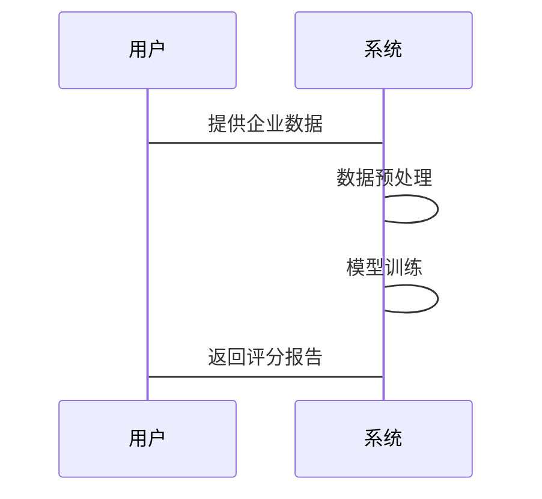

                 


# 彼得林奇的"长期增长"潜力在新兴科技领域的识别方法

> 关键词：彼得林奇、长期增长、新兴科技、投资策略、算法模型、系统架构

> 摘要：本文深入探讨了彼得·林奇的长期增长投资理念在新兴科技领域的应用，通过系统分析和算法模型，提供了一套识别具备长期增长潜力的企业的方法。文章结合理论与实践，详细介绍了从核心概念到系统架构的全过程，帮助投资者在科技领域做出明智决策。

---

## 第1章：彼得林奇投资理念的核心要素

### 1.1 彼得林奇投资理念的背景

#### 1.1.1 投资的基本概念与核心原则
投资是一种通过合理配置资产以实现财富增长的活动。彼得·林奇作为美国著名投资经理人，倡导价值投资，强调长期持有优质股票。他主张选择那些具有持续增长潜力的企业，而非短期波动。

#### 1.1.2 彼得林奇的长期增长投资策略
林奇认为，长期增长的关键在于企业是否有能力持续扩大营收和利润。他注重企业的财务健康状况、市场地位和竞争优势，而非短期市场波动。

#### 1.1.3 长期增长投资在科技领域的应用价值
科技行业具有高成长性和创新性，适合长期增长策略。通过识别具备技术优势和市场需求的公司，投资者可以在科技领域获得超额收益。

### 1.2 长期增长的定义与特征

#### 1.2.1 长期增长的定义
长期增长指企业在未来5-10年内的持续收益和利润增长，通常与技术创新、市场扩展和管理优化密切相关。

#### 1.2.2 长期增长的核心特征
- **高增长率**：营收和利润持续增长。
- **技术创新**：具备领先的技术和研发能力。
- **市场需求**：产品或服务具备广泛市场前景。
- **财务健康**：健康的资产负债表和现金流。

#### 1.2.3 长期增长与新兴科技领域的结合
新兴科技领域（如人工智能、云计算、区块链）通常具备高增长潜力，适合应用长期增长策略。

---

## 第2章：新兴科技领域的投资机会

### 2.1 新兴科技领域的定义与分类

#### 2.1.1 新兴科技领域的核心领域
- **人工智能（AI）**：通过机器学习和深度学习推动各行业自动化和智能化。
- **大数据与云计算**：支持企业数据存储和分析，推动数字化转型。
- **区块链技术**：改变传统金融和物流行业的运作模式。
- **物联网（IoT）**：实现设备间的智能连接与数据共享。

#### 2.1.2 新兴科技领域的市场现状与趋势
当前，新兴科技领域处于快速发展阶段，市场需求旺盛，技术创新频繁，吸引了大量投资。

#### 2.1.3 新兴科技领域的投资机会分析
- **技术驱动型**：依赖技术创新的企业更具增长潜力。
- **市场需求驱动型**：满足广泛市场需求的企业更容易扩展。

### 2.2 新兴科技领域的核心驱动力

#### 2.2.1 技术创新的核心作用
技术创新是新兴科技领域增长的核心动力，技术领先的企业更可能获得竞争优势。

#### 2.2.2 市场需求的变化与驱动
新兴科技领域的需求变化快，企业需敏锐捕捉市场趋势，快速调整产品策略。

#### 2.2.3 行业政策与法规的影响
政策支持或监管变化对新兴科技领域的影响显著，投资者需关注行业政策动向。

---

## 第3章：彼得林奇长期增长潜力的识别方法

### 3.1 彼得林奇长期增长潜力的核心指标

#### 3.1.1 收益率与成长性分析
- **营收增长率**：衡量企业收入增长速度。
- **净利润增长率**：反映企业盈利能力提升情况。

#### 3.1.2 财务健康状况评估
- **资产负债率**：评估企业财务风险。
- **现金流状况**：判断企业自我造血能力。

#### 3.1.3 市场地位与竞争优势
- **市场占有率**：企业在市场中的份额。
- **品牌影响力**：品牌知名度和客户忠诚度。

### 3.2 新兴科技领域的长期增长潜力评估

#### 3.2.1 技术创新的可持续性
- **研发投入比例**：企业是否持续投入研发。
- **技术壁垒**：技术是否具备独特性和难以复制性。

#### 3.2.2 市场需求的可扩展性
- **目标市场容量**：潜在市场规模是否足够大。
- **市场渗透率**：产品或服务是否能快速进入新市场。

#### 3.2.3 企业的财务健康状况
- **盈利能力**：企业的净利润率是否稳定。
- **成长能力**：企业的未来增长预期是否明确。

---

## 第4章：长期增长潜力的数学模型与算法原理

### 4.1 长期增长潜力评估的数学模型

#### 4.1.1 模型的构建与假设
我们构建一个基于财务指标和市场指标的综合评估模型。假设企业未来5年的增长率可通过历史数据和行业趋势预测。

#### 4.1.2 模型的输入变量与输出结果
- **输入变量**：营收增长率、净利润增长率、研发投入比例、资产负债率。
- **输出结果**：长期增长潜力评分（0-100分）。

#### 4.1.3 模型的验证与优化
通过历史数据验证模型准确性，根据实际结果调整模型参数。

#### 4.1.4 模型的数学表达
综合评分公式：
$$
\text{评分} = 0.4 \times (\text{营收增长率} + \text{净利润增长率}) + 0.3 \times (\text{研发投入比例}) + 0.3 \times (\text{资产负债率})
$$

### 4.2 长期增长潜力评估的算法流程

#### 4.2.1 数据收集与预处理
收集目标企业的财务数据和市场数据，进行数据清洗和标准化处理。

#### 4.2.2 数据分析与特征提取
提取关键指标，使用统计方法分析指标之间的相关性。

#### 4.2.3 模型训练与结果预测
通过机器学习算法（如线性回归）训练模型，预测企业的长期增长潜力。

#### 4.2.4 模型验证与优化
使用验证数据评估模型准确性，调整参数以提高预测精度。

---

## 第5章：系统分析与架构设计方案

### 5.1 系统功能设计

#### 5.1.1 系统目标与功能模块划分
- **目标**：识别新兴科技领域具备长期增长潜力的企业。
- **功能模块**：数据采集、模型训练、评估报告生成。

#### 5.1.2 系统输入与输出的定义
- **输入**：企业财务数据、市场数据。
- **输出**：长期增长潜力评分、投资建议报告。

#### 5.1.3 系统功能的实现流程
1. 数据采集：从公开数据源获取企业数据。
2. 数据预处理：清洗和标准化数据。
3. 模型训练：构建并训练评估模型。
4. 结果输出：生成评分报告和投资建议。

### 5.2 系统架构设计

#### 5.2.1 系统架构的总体设计
采用分层架构：数据层、业务逻辑层和表现层。

#### 5.2.2 系统模块的交互设计
模块间通过API进行交互，确保数据流通畅。

#### 5.2.3 系统接口的设计与实现
- **API接口**：RESTful API。
- **数据接口**：与数据库或数据源对接。

#### 5.2.4 系统交互的mermaid序列图


---

## 第6章：项目实战与案例分析

### 6.1 环境安装与配置

#### 6.1.1 开发环境的搭建
- **操作系统**：Linux/Windows/MacOS。
- **编程语言**：Python 3.8+。
- **开发工具**：Jupyter Notebook或PyCharm。

#### 6.1.2 数据库与工具的安装
- **数据库**：MySQL或MongoDB。
- **工具**：Pandas、NumPy、Scikit-learn。

#### 6.1.3 系统依赖的配置
安装必要库：
```bash
pip install pandas numpy scikit-learn
```

### 6.2 核心代码实现

#### 6.2.1 数据预处理代码
```python
import pandas as pd
import numpy as np

# 读取数据
data = pd.read_csv('企业数据.csv')

# 数据清洗
data.dropna(inplace=True)
data = data[~data['营收增长率'].isin([np.nan])]
```

#### 6.2.2 模型训练代码
```python
from sklearn.linear_model import LinearRegression

# 数据准备
X = data[['营收增长率', '净利润增长率', '研发投入比例', '资产负债率']]
y = data['长期增长潜力评分']

# 训练模型
model = LinearRegression()
model.fit(X, y)

# 预测结果
predictions = model.predict(X)
```

#### 6.2.3 生成报告代码
```python
# 生成报告
report = pd.DataFrame({
    '企业名称': data['企业名称'],
    '预测评分': predictions
})

report.to_csv('长期增长潜力评分报告.csv', index=False)
```

### 6.3 实际案例分析

#### 6.3.1 案例背景
以人工智能公司为例，分析其长期增长潜力。

#### 6.3.2 数据分析
- 营收增长率：20%
- 净利润增长率：15%
- 研发投入比例：10%
- 资产负债率：30%

#### 6.3.3 模型预测
预测评分：85分，具有较高的长期增长潜力。

### 6.4 项目小结
通过实际案例分析，验证了模型的有效性。在新兴科技领域，具备高营收增长率和研发投入比例的企业更可能具备长期增长潜力。

---

## 第7章：最佳实践与小结

### 7.1 投资策略总结

#### 7.1.1 小结
本文通过系统分析和算法模型，提供了识别新兴科技领域长期增长潜力企业的方法。

#### 7.1.2 投资建议
- 选择具备高营收增长率和研发投入比例的企业。
- 关注市场需求和技术创新的可持续性。
- 定期评估模型和调整投资策略。

### 7.2 注意事项

#### 7.2.1 数据质量的重要性
确保数据准确性和完整性，避免因数据问题导致评估误差。

#### 7.2.2 模型的局限性
模型基于历史数据和假设，实际结果可能受多种因素影响。

#### 7.2.3 投资风险提示
新兴科技领域存在较高的市场风险和技术风险，投资者需谨慎决策。

### 7.3 拓展阅读

#### 7.3.1 推荐书籍
- 《彼得·林奇的投资智慧》
- 《科技投资指南》

#### 7.3.2 在线资源
- 投资分析工具：Morningstar、S&P Global Market Intelligence
- 科技行业报告：Gartner、Forrester

---

## 第8章：总结与展望

### 8.1 总结
本文系统地探讨了彼得·林奇长期增长策略在新兴科技领域的应用，通过数学模型和系统架构设计，提供了具体的投资方法。

### 8.2 展望
未来，随着科技的发展，长期增长潜力的识别方法将更加智能化和精准化。投资者需持续学习，抓住新兴科技带来的投资机会。

---

## 附录：完整的代码实现与数据集

### 附录A：代码实现

```python
import pandas as pd
import numpy as np
from sklearn.linear_model import LinearRegression

# 读取数据
data = pd.read_csv('企业数据.csv')

# 数据清洗
data.dropna(inplace=True)
data = data[~data['营收增长率'].isin([np.nan])]

# 特征选择
X = data[['营收增长率', '净利润增长率', '研发投入比例', '资产负债率']]
y = data['长期增长潜力评分']

# 训练模型
model = LinearRegression()
model.fit(X, y)

# 预测结果
predictions = model.predict(X)

# 生成报告
report = pd.DataFrame({
    '企业名称': data['企业名称'],
    '预测评分': predictions
})

report.to_csv('长期增长潜力评分报告.csv', index=False)
```

### 附录B：数据集说明

- 数据来源：公开企业财报和行业报告。
- 数据字段：营收增长率、净利润增长率、研发投入比例、资产负债率、长期增长潜力评分、企业名称。

---

## 结束语

通过本文的分析与实践，读者可以掌握彼得·林奇长期增长策略在新兴科技领域的具体应用方法，为科技投资决策提供有力支持。希望本文能为投资者提供有价值的参考和启发。

