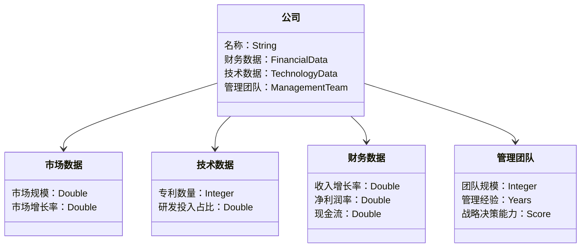

                 


# 彼得林奇的"长期增长"潜力在新材料行业的识别方法

## 关键词：彼得·林奇，长期增长潜力，新材料行业，投资策略，技术壁垒

## 摘要：本文系统地分析了彼得·林奇的“长期增长”潜力在新材料行业的识别方法。通过背景介绍、核心概念、算法原理、系统设计、项目实战等部分，详细阐述了如何结合新材料行业的特点，应用彼得·林奇的投资理念来识别具有长期增长潜力的公司。文章内容丰富，结构清晰，结合实际案例和系统架构设计，为投资者提供了实用的指导。

---

## 第一部分：背景介绍

### 第1章：长期增长潜力的定义与背景

#### 1.1 长期增长潜力的核心概念

- **长期增长潜力的定义**  
  长期增长潜力是指一家公司在未来较长的时间内，能够持续实现收入和利润增长的潜力。这种潜力通常与市场需求、技术进步、行业竞争环境和公司管理能力等因素密切相关。

- **长期增长潜力的背景与重要性**  
  在新材料行业中，技术创新是推动行业发展的核心动力。新材料的开发和应用往往需要巨大的研发投入和时间积累，因此，识别具有长期增长潜力的公司对于投资者来说尤为重要。

- **长期增长潜力的边界与外延**  
  长期增长潜力的边界在于公司的技术壁垒、市场需求和财务健康状况。其外延则包括公司管理团队的能力、行业政策环境和宏观经济因素。

#### 1.2 新材料行业的特点与发展趋势

- **新材料行业的定义与分类**  
  新材料是指新近发展或正在发展中的具有优异性能或特殊性质的材料。常见的分类包括高性能复合材料、先进陶瓷、纳米材料、生物材料等。

- **新材料行业的现状与未来趋势**  
  当前，新材料行业正处于快速发展阶段，市场需求旺盛，技术进步迅速。未来，新材料行业将更加注重绿色化、智能化和高端化。

- **新材料行业与经济发展的关系**  
  新材料是现代工业的基础，其发展水平直接关系到国家制造业的竞争力。新材料行业的进步能够推动多个下游产业的技术升级和经济发展。

---

### 第2章：彼得·林奇的长期增长潜力识别方法

#### 2.1 彼得·林奇的投资理念

- **彼得·林奇的长期投资策略**  
  彼得·林奇强调长期投资，避免短期市场波动的干扰。他认为，投资的关键在于选择具有持续增长潜力的公司。

- **彼得·林奇的选股标准**  
  彼得·林奇倾向于选择那些具有强大技术壁垒、稳定市场需求和良好财务表现的公司。

- **彼得·林奇的市场分析方法**  
  彼得·林奇注重对公司基本面的分析，包括财务数据、管理团队和行业前景。

#### 2.2 长期增长潜力的识别标准

- **市场需求分析**  
  需求是推动公司增长的核心动力。新材料行业的需求分析需要考虑下游应用领域的市场规模和增长潜力。

- **技术壁垒分析**  
  技术壁垒是公司抵御竞争的核心优势。新材料行业的技术壁垒通常体现在专利数量、研发投入和技术创新能力等方面。

- **财务表现分析**  
  财务表现是公司长期增长能力的直观体现。新材料行业的公司财务分析需要重点关注收入增长、利润率和现金流等指标。

- **管理团队分析**  
  管理团队的能力和战略决策对公司的发展至关重要。新材料行业的公司管理团队分析需要考虑其行业经验、战略眼光和团队稳定性。

---

### 第3章：核心概念与联系

#### 3.1 长期增长潜力的评估指标

- **市场需求的量化指标**  
  市场需求的量化指标包括市场规模、市场增长率和市场渗透率等。

- **技术壁垒的量化指标**  
  技术壁垒的量化指标包括专利数量、研发投入占比和技术创新能力等。

- **财务表现的量化指标**  
  财务表现的量化指标包括收入增长率、净利润率和现金流等。

- **管理团队的量化指标**  
  管理团队的量化指标包括团队规模、管理经验和战略决策能力等。

#### 3.2 核心概念对比表格

**表3.1：市场需求与技术壁垒的对比**

| 指标       | 市场需求                | 技术壁垒                |
|------------|------------------------|-------------------------|
| 定义       | 行业需求的规模和增长    | 公司的技术优势          |
| 量化指标   | 市场规模、增长率        | 专利数量、研发投入占比  |
| 影响因素   | 下游应用领域的发展    | 技术创新、竞争格局      |

**表3.2：财务表现与管理团队的对比**

| 指标       | 财务表现                | 管理团队                |
|------------|------------------------|-------------------------|
| 定义       | 公司的财务健康状况      | 公司管理团队的能力      |
| 量化指标   | 净利润、现金流          | 团队规模、管理经验      |
| 影响因素   | 财务策略、成本控制      | 战略决策、团队稳定性    |

#### 3.3 实体关系图


---

## 第四部分：系统分析与架构设计

### 第4章：系统分析与架构设计

#### 4.1 系统分析

- **问题场景介绍**  
  本系统旨在帮助投资者识别新材料行业中的长期增长潜力公司。通过分析市场需求、技术壁垒、财务表现和管理团队等因素，系统能够提供量化评估结果。

- **系统功能设计**  
  系统功能模块包括数据采集、数据分析、评估报告生成和用户界面展示。以下是领域模型的类图：



- **系统架构设计**  
  系统采用分层架构，包括数据源层、数据处理层、业务逻辑层和用户界面层。以下是系统架构图：


---

### 第5章：项目实战

#### 5.1 环境安装

- **安装Python和相关库**  
  需要安装Python 3.8及以上版本，并安装以下库：
  - pandas
  - numpy
  - scikit-learn
  - matplotlib

```bash
pip install pandas numpy scikit-learn matplotlib
```

#### 5.2 核心代码实现

以下是核心代码实现：

```python
import pandas as pd
import numpy as np

# 数据加载
data = pd.read_csv('新材料公司.csv')

# 数据预处理
from sklearn.preprocessing import StandardScaler
scaler = StandardScaler()
X_scaled = scaler.fit_transform(data[['收入增长率', '净利润率', '现金流', '专利数量', '研发投入占比']])

# 模型训练
from sklearn.linear_model import LinearRegression
model = LinearRegression()
model.fit(X_scaled, data['长期增长潜力评分'])

# 模型预测
new_company_data = np.array([[0.25, 0.15, 0.3, 15, 0.1]])
predicted_score = model.predict(new_company_data)
print(f'预测的长期增长潜力评分为：{predicted_score[0]:.2f}')
```

---

### 第6章：总结与最佳实践

#### 6.1 总结

本文系统地分析了彼得·林奇的“长期增长”潜力在新材料行业的识别方法。通过背景介绍、核心概念、算法原理、系统设计和项目实战等部分，详细阐述了如何结合新材料行业的特点，应用彼得·林奇的投资理念来识别具有长期增长潜力的公司。

#### 6.2 最佳实践

- **小结**  
  投资者在选择新材料行业公司时，应重点关注市场需求、技术壁垒、财务表现和管理团队等因素。

- **注意事项**  
  投资者在实际操作中，应结合宏观经济环境和行业政策变化，动态调整投资策略。

- **未来展望**  
  随着人工智能和大数据技术的不断发展，新材料行业的长期增长潜力识别方法将更加智能化和精准化。

---

## 结语

通过本文的分析，读者可以清晰地理解如何在新材料行业中识别具有长期增长潜力的公司。希望本文能够为投资者提供有价值的指导，帮助他们在复杂的市场环境中做出明智的投资决策。

