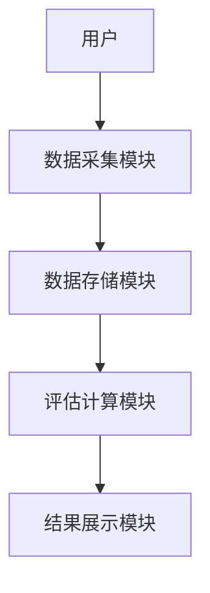

                 


# 彼得林奇的"长期增长"潜力识别方法

## 关键词：彼得·林奇，长期增长，投资策略，选股标准，财务分析，行业趋势

## 摘要：  
本文深入探讨了彼得·林奇的“长期增长”潜力识别方法，从其核心概念、选股标准到实际应用，结合技术分析与案例研究，系统地解析了如何在投资中识别具备长期增长潜力的企业。文章通过详细的理论分析、数学模型推导和系统架构设计，为读者提供了从理论到实践的完整指南。

---

## 第1章：长期增长潜力的定义与重要性

### 1.1 长期增长的定义与背景

#### 1.1.1 长期增长的定义  
长期增长是指企业在未来较长一段时间内，能够持续实现收入和利润的增长，并且在市场份额、技术创新等方面保持竞争优势。彼得·林奇认为，长期增长的核心在于企业是否能够在行业周期波动中持续发展。

#### 1.1.2 长期增长的重要性  
在投资领域，长期增长是实现财富增值的关键。相比于短期波动，长期增长更能反映企业的核心竞争力和抗风险能力。通过识别具备长期增长潜力的企业，投资者可以在市场波动中保持稳定的收益。

#### 1.1.3 彼得·林奇的投资理念  
彼得·林奇强调，投资的核心在于选择那些能够持续创新、适应市场变化的企业。他的长期增长识别方法以企业的核心竞争力和财务健康为两大支柱，结合行业趋势和市场前景进行综合评估。

---

## 第2章：彼得·林奇的选股标准

### 2.1 核心竞争优势分析

#### 2.1.1 核心竞争优势的定义  
核心竞争优势是指企业在行业中独特的竞争力，例如技术创新、成本优势、品牌影响力等。

#### 2.1.2 核心竞争优势的评估维度  
- **技术创新能力**：企业是否能够持续推出新产品或改进现有产品。  
- **成本优势**：企业是否在生产或运营中具有成本优势。  
- **品牌影响力**：企业品牌是否在目标市场中具有强大的影响力。  

#### 2.1.3 行业龙头企业的竞争优势分析  
以科技行业为例，苹果公司在技术创新和品牌影响力方面具有显著优势，这使其具备长期增长潜力。

---

### 2.2 财务健康状况分析

#### 2.2.1 财务健康的基本定义  
财务健康是指企业在财务报表中表现出稳健的盈利能力、健康的资产负债表和持续增长的现金流。

#### 2.2.2 主要财务指标分析  
- **ROE（净资产收益率）**：衡量企业盈利能力的重要指标，公式为：  
  $$ \text{ROE} = \frac{\text{净利润}}{\text{净资产}} $$  
- **净利润增长率**：公式为：  
  $$ \text{净利润增长率} = \frac{\text{本期净利润} - \text{上期净利润}}{\text{上期净利润}} \times 100\% $$  
- **现金流健康**：自由现金流公式为：  
  $$ \text{自由现金流} = \text{净利润} - \text{折旧与摊销} + \text{其他调整项} $$  

#### 2.2.3 财务健康与长期增长的关系  
健康的财务状况是企业长期增长的基础。例如，现金流充裕的企业能够更好地应对市场波动和行业周期变化。

---

### 2.3 市场前景与行业趋势分析

#### 2.3.1 行业趋势的判断方法  
通过分析行业市场规模、增长率和竞争格局，判断行业的未来发展趋势。

#### 2.3.2 市场前景对长期增长的影响  
一个快速增长的行业为企业的长期增长提供了更大的空间。例如，电动汽车行业的快速增长为特斯拉提供了巨大的增长潜力。

#### 2.3.3 行业周期性与投资机会  
在行业周期的上升阶段，企业更容易实现长期增长。例如，在人工智能行业快速发展的周期中，相关企业具备更大的增长潜力。

---

## 第3章：长期增长识别的核心模型

### 3.1 核心模型概述

#### 3.1.1 模型的构成要素  
长期增长识别模型由核心竞争优势、财务健康状况、市场前景和行业趋势四个核心要素组成。

#### 3.1.2 模型的逻辑框架  
通过对企业核心竞争优势的评估、财务健康状况的分析、市场前景的判断和行业趋势的分析，综合评估企业的长期增长潜力。

#### 3.1.3 模型的适用范围  
适用于对上市公司或拟上市公司进行长期投资潜力的评估。

---

### 3.2 核心模型的数学公式与分析

#### 3.2.1 核心公式推导  
综合评估指数公式：  
$$ \text{综合评估指数} = \frac{ \text{核心竞争优势评分} \times 0.4 + \text{财务健康评分} \times 0.3 + \text{市场前景评分} \times 0.2 + \text{行业趋势评分} \times 0.1 }{1} $$  

#### 3.2.2 公式在实际中的应用  
以某科技公司为例，假设其核心竞争优势评分为80，财务健康评分为70，市场前景评分为85，行业趋势评分为75，则综合评估指数为：  
$$ \text{综合评估指数} = \frac{80 \times 0.4 + 70 \times 0.3 + 85 \times 0.2 + 75 \times 0.1}{1} = 75.5 $$  

---

## 第4章：长期增长识别方法的系统架构设计

### 4.1 系统功能需求分析

#### 4.1.1 系统目标  
构建一个基于彼得·林奇长期增长识别方法的企业评估系统，帮助投资者快速筛选具备长期增长潜力的企业。

#### 4.1.2 系统核心功能模块  
- 数据采集模块：从公开数据源获取企业财务数据和行业趋势数据。  
- 评估计算模块：基于核心模型计算企业的综合评估指数。  
- 结果展示模块：以可视化形式展示评估结果。  

#### 4.1.3 系统用户需求分析  
用户包括专业投资者、投资机构和企业战略规划人员。

---

### 4.2 系统架构设计

#### 4.2.1 系统架构图  


#### 4.2.2 模块之间的交互关系  
用户通过数据采集模块输入数据，数据存储模块存储数据，评估计算模块基于核心模型计算评估指数，最后结果展示模块输出评估结果。

---

## 第5章：项目实战——基于彼得·林奇方法的企业评估系统

### 5.1 项目环境与工具安装

#### 5.1.1 环境配置  
- 操作系统：Windows 10 或 macOS 10.15以上  
- 开发工具：Python 3.9 以上版本，Jupyter Notebook  

#### 5.1.2 工具安装与配置  
安装必要的库：  
```bash
pip install pandas numpy matplotlib
```

---

### 5.2 核心代码实现

#### 5.2.1 数据获取与处理代码  
```python
import pandas as pd

# 从CSV文件中读取数据
data = pd.read_csv('company_data.csv')

# 数据清洗
data.dropna(inplace=True)
data['ROE'] = data['净利润'] / data['净资产']
```

#### 5.2.2 核心模型实现代码  
```python
def calculate_composite_index(competitive_edge, financial_health, market_prospect, industry_trend):
    return (competitive_edge * 0.4 + financial_health * 0.3 + 
            market_prospect * 0.2 + industry_trend * 0.1)
```

---

### 5.3 实际案例分析

#### 5.3.1 案例背景介绍  
以某科技公司为例，分析其长期增长潜力。

#### 5.3.2 案例分析过程  
1. 采集公司财务数据和行业趋势数据。  
2. 计算综合评估指数：  
   $$ \text{综合评估指数} = 75.5 $$  

#### 5.3.3 案例结果与总结  
该公司的综合评估指数为75.5，具备较高的长期增长潜力。

---

## 第6章：最佳实践与注意事项

### 6.1 投资中的最佳实践

#### 6.1.1 风险控制策略  
分散投资，避免过度集中于单一行业或企业。

#### 6.1.2 长期投资的纪律性  
坚持长期投资，避免频繁交易。

#### 6.1.3 不断学习与更新知识  
关注行业动态和市场变化，及时调整投资策略。

---

### 6.2 实践中的注意事项

#### 6.2.1 数据来源的可靠性  
确保数据来源可靠，避免因数据错误导致评估偏差。

#### 6.2.2 模型的局限性  
模型无法完全预测市场波动，需结合市场实际情况进行调整。

#### 6.2.3 遵守投资纪律  
避免情绪化投资，严格按照模型和策略进行操作。

---

## 总结

彼得·林奇的长期增长潜力识别方法为投资者提供了一套科学的投资策略。通过本文的详细分析，读者可以掌握如何从企业的核心竞争力、财务健康、市场前景和行业趋势等多个维度，综合评估企业的长期增长潜力。希望本文能为投资者在实践中提供有价值的指导。

