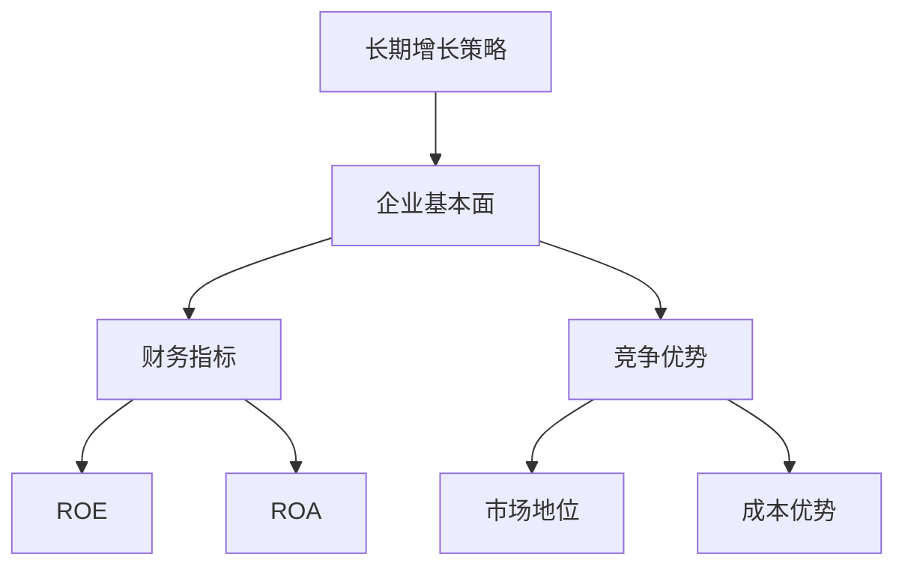
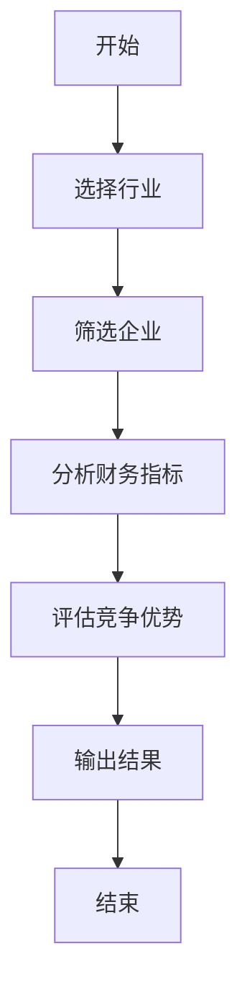

                 


# 彼得林奇的"长期增长"选股策略详解

> 关键词：彼得·林奇，长期增长，选股策略，基本面分析，财务指标，竞争优势

> 摘要：本文详细解析了彼得·林奇的"长期增长"选股策略，从其背景、核心概念、算法原理、系统架构到项目实战，层层剖析，帮助读者全面理解和掌握这一投资策略。

---

## 第一部分: 彼得·林奇“长期增长”选股策略背景与核心理念

### 第1章: 彼得·林奇投资理念概述

#### 1.1 彼得·林奇与“长期增长”选股策略
- **1.1.1 彼得·林奇的生平与投资成就**  
  彼得·林奇（Peter Lynch）是美国著名投资家，曾任富达麦哲伦基金的经理，以出色的长期投资业绩闻名。他主张长期投资优质股票，避免短期波动的干扰。

- **1.1.2 “长期增长”选股策略的提出背景**  
  20世纪80年代，彼得·林奇提出“长期增长”策略，旨在通过筛选具有持续增长潜力的公司，实现长期稳定的收益。

- **1.1.3 该策略在投资领域的意义与价值**  
  该策略强调对企业基本面的深入分析，注重企业的竞争优势和财务健康，为长期投资者提供了系统化的选股方法。

#### 1.2 长期增长策略的核心概念
- **1.2.1 长期增长策略的定义**  
  长期增长策略是指通过投资那些具有持续盈利增长能力的公司，长期持有，以获得超越市场的回报。

- **1.2.2 长期增长策略的核心要素**  
  - 企业基本面分析：关注企业的收入、利润、负债等财务指标。
  - 财务指标分析：通过ROE、ROA等指标评估企业的盈利能力。
  - 企业竞争优势分析：分析企业的市场地位、成本优势等。

- **1.2.3 长期增长与短期投资的区别**  
  长期增长策略注重企业长期发展，而短期投资关注市场波动和短期收益。

#### 1.3 长期增长策略的适用场景与边界
- **1.3.1 适合长期增长策略的市场环境**  
  稳定增长的经济环境，企业具有持续盈利潜力的市场。

- **1.3.2 不适合使用该策略的情况**  
  经济周期性波动较大，企业盈利能力不稳定的情况。

- **1.3.3 长期增长策略的边界与外延**  
  适用于个人投资者和机构投资者，但需根据市场变化进行动态调整。

---

### 第2章: 长期增长策略的核心要素与联系

#### 2.1 核心概念与原理
- **2.1.1 企业基本面分析**  
  通过分析企业的收入、利润、负债等财务指标，评估企业的经营状况。

- **2.1.2 财务指标分析**  
  关注ROE（净资产收益率）、ROA（资产净利率）等指标，评估企业的盈利能力。

- **2.1.3 企业竞争优势分析**  
  分析企业的市场地位、成本优势、品牌影响力等，评估企业的核心竞争力。

#### 2.2 核心概念对比分析
- **2.2.1 长期增长与短期交易的对比**  
  | 对比维度 | 长期增长策略 | 短期交易策略 |
  |----------|--------------|---------------|
  | 投资目标 | 获取长期收益 | 追求短期利润 |
  | 持股时间 | 长期持有 | 短期买卖 |

- **2.2.2 不同财务指标的特征对比**  
  | 指标 | 特征 | 用途 |
  |------|------|------|
  | ROE | 衡量股东权益的回报率 | 评估企业盈利能力 |
  | ROA | 衡量资产的盈利能力 | 评估企业资产使用效率 |

- **2.2.3 企业竞争优势的层次分析**  
  - 市场地位：企业是否是行业领导者。
  - 成本优势：企业在生产或运营中的成本优势。
  - 品牌影响力：企业品牌是否能带来溢价。

#### 2.3 实体关系图


---

### 第3章: 长期增长策略的算法原理

#### 3.1 筛选模型概述
- **3.1.1 基于财务指标的多因子模型**  
  通过多个财务指标的综合评估，筛选出具有长期增长潜力的企业。

- **3.1.2 竞争优势评估的权重分配**  
  根据企业的竞争优势，如市场地位、成本优势等，分配不同的权重。

- **3.1.3 筛选过程的逻辑框架**  
  从企业基本面分析出发，结合财务指标和竞争优势，最终筛选出符合条件的企业。

#### 3.2 算法流程图


#### 3.3 算法实现
```python
def select_growth_stocks(industry):
    stocks = get_stocks_in_industry(industry)
    selected_stocks = []
    for stock in stocks:
        # 分析财务指标
        roe = stock.roe
        roa = stock.roa
        # 评估竞争优势
        market_share = stock.market_share
        cost_advantage = stock.cost_advantage
        # 筛选标准
        if roe > 15 and roa > 10 and market_share > 20 and cost_advantage > 15:
            selected_stocks.append(stock)
    return selected_stocks
```

#### 3.4 数学模型与公式
- **ROE（净资产收益率）**  
  $$ROE = \frac{\text{净利润}}{\text{股东权益}}$$
- **ROA（资产净利率）**  
  $$ROA = \frac{\text{净利润}}{\text{总资产}}$$

---

## 第二部分: 长期增长策略的系统分析与架构设计

### 第4章: 系统分析与架构设计方案

#### 4.1 问题场景介绍
- **4.1.1 投资者需要筛选具有长期增长潜力的企业。**
- **4.1.2 系统需要实现对企业基本面、财务指标和竞争优势的综合评估。**

#### 4.2 系统功能设计
- **4.2.1 数据采集模块**  
  采集企业的财务数据、市场数据等。

- **4.2.2 筛选模块**  
  根据长期增长策略筛选出符合条件的企业。

- **4.2.3 分析模块**  
  对筛选出的企业进行深度分析，生成报告。

#### 4.3 系统架构设计


#### 4.4 系统接口设计
- **输入接口**：企业数据接口。
- **输出接口**：筛选结果接口、分析报告接口。

#### 4.5 系统交互设计


---

## 第三部分: 项目实战与最佳实践

### 第5章: 项目实战

#### 5.1 环境安装
- 安装Python和相关库（Pandas、NumPy、Matplotlib等）。

#### 5.2 核心实现
```python
import pandas as pd

def calculate_roe(data):
    return data['净利润'] / data['股东权益']

def calculate_roa(data):
    return data['净利润'] / data['总资产']

def select_growth_stocks(data):
    roe = calculate_roe(data)
    roa = calculate_roa(data)
    selected = data[(roe > 15) & (roa > 10)]
    return selected

# 示例数据
data = {
    '企业': ['A', 'B', 'C'],
    '净利润': [100, 200, 150],
    '股东权益': [500, 800, 600],
    '总资产': [1000, 1200, 1100]
}

selected = select_growth_stocks(data)
print(selected)
```

#### 5.3 案例分析
- **案例1**：假设市场中有三家企业，根据上述代码筛选出ROE和ROA均超过阈值的企业。

#### 5.4 项目小结
- 通过代码实现长期增长策略，帮助投资者快速筛选出符合条件的企业。

### 第6章: 最佳实践与总结

#### 6.1 投资建议
- 定期复盘，动态调整投资组合。
- 分散投资，降低风险。
- 重视风险管理，避免过度集中。

#### 6.2 总结
- 彼得·林奇的长期增长策略通过对企业基本面的深入分析，帮助投资者筛选出具有长期增长潜力的企业。
- 通过系统化的分析和代码实现，投资者可以更高效地应用这一策略。

#### 6.3 拓展阅读
- 推荐阅读彼得·林奇的书籍，深入理解其投资理念。
- 学习更多财务指标和分析方法，提升选股能力。

---

通过以上步骤，我们可以全面理解和掌握彼得·林奇的“长期增长”选股策略，并在实际投资中灵活运用。

