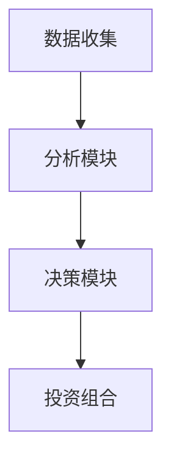

                 


# 彼得林奇的"长期持有"vs"动态调整"在不同市场环境下的选择

## 关键词：彼得林奇，长期持有，动态调整，投资策略，市场环境，股票分析，风险管理

## 摘要：本文探讨了彼得林奇的长期持有和动态调整策略在不同市场环境下的应用，分析了两种策略的核心概念、数学模型、算法原理，通过系统分析和项目实战，展示了如何在实际投资中选择合适的策略，并提供了最佳实践建议。

---

## 第一章：投资的基本概念与彼得林奇的简介

### 1.1 投资的基本概念
- **投资的定义**：将资金投入股票、债券或其他资产以获得收益的行为。
- **股票投资的核心要素**：市场分析、基本面分析、技术分析、风险管理。
- **投资者的类型**：长期投资者、短期投资者、主动管理型投资者、被动管理型投资者。

### 1.2 彼得林奇的生平与投资理念
- **彼得林奇的简介**：著名投资经理，管理富达麦哲伦基金，以长期持有的价值投资策略闻名。
- **投资哲学**：寻找基本面良好、管理优秀、具有持续竞争优势的公司，长期持有，获得复利增长。
- **成功案例**：如可口可乐、迪士尼等长期持有的优质股票，创造显著收益。

---

## 第二章：长期持有与动态调整的定义与区别

### 2.1 长期持有的定义与特点
- **长期持有的核心理念**：买入优质股票，长期持有，不因短期波动而改变投资决策。
- **优势**：减少交易成本，避免短期波动带来的损失，享受复利效应。
- **劣势**：在市场剧烈波动时，可能面临较大回撤，对市场风险的适应能力较弱。

### 2.2 动态调整的定义与特点
- **动态调整的核心理念**：根据市场变化及时调整投资组合，捕捉短期收益，规避市场风险。
- **优势**：灵活性强，能够适应市场变化，减少回撤，提高资金利用率。
- **劣势**：交易成本较高，需要频繁监控市场，对投资者的能力和时间要求较高。

---

## 第三章：长期持有与动态调整的核心概念对比

### 3.1 核心概念对比
- **目标**：长期持有注重长期收益和复利效应，动态调整注重短期收益和风险管理。
- **风险承受**：长期持有能够承受短期波动，动态调整则更注重规避短期风险。
- **适用场景**：长期持有适用于市场稳定、优质股长期增长的环境；动态调整适用于市场波动大、变化快的环境。

---

## 第四章：长期持有的数学模型与算法原理

### 4.1 数学模型
- **股票价值评估模型**：使用DCF模型（ discounted cash flow）计算内在价值。
  $$ V = \frac{CF}{(1+r)^n} $$
- **长期持有收益计算**：考虑复利效应，使用几何平均收益率。
  $$ R = \prod_{i=1}^{n} (1 + r_i) - 1 $$

### 4.2 算法实现
- **数据收集**：收集公司财务数据、行业分析报告、市场趋势等。
- **价值评估**：基于DCF模型评估股票内在价值。
- **投资决策**：根据评估结果，选择具有安全边际的股票进行长期持有。

---

## 第五章：动态调整的数学模型与算法原理

### 5.1 数学模型
- **市场波动预测模型**：使用均值回归模型预测市场短期走势。
  $$ \mu = E[r] $$
- **动态调整收益计算**：根据市场预测结果，调整投资组合权重。

### 5.2 算法实现
- **市场监控**：实时跟踪市场指数、行业趋势和宏观经济指标。
- **信号生成**：根据技术指标（如RSI、MACD）生成买卖信号。
- **组合调整**：根据信号调整投资组合，优化风险收益比。

---

## 第六章：长期持有与动态调整的对比分析

### 6.1 数学模型对比
- **收益预测**：长期持有模型注重长期复利，动态调整模型注重短期波动。
- **风险评估**：长期持有模型使用VaR模型，动态调整模型使用波动率指标。

---

## 第七章：系统分析与架构设计方案

### 7.1 问题场景
- **市场波动剧烈**：动态调整策略更适合。
- **市场稳定**：长期持有策略更具优势。

### 7.2 系统功能设计
- **数据收集模块**：实时收集市场数据和公司基本面信息。
- **分析模块**：使用算法模型进行市场分析和投资建议。
- **决策模块**：根据分析结果，生成投资策略。

### 7.3 系统架构图


---

## 第八章：项目实战

### 8.1 环境配置
- **工具安装**：安装Python、Pandas、Matplotlib等工具。

### 8.2 核心代码实现
```python
import pandas as pd
import numpy as np

# 长期持有的策略实现
def long_term_hold(stocks, years):
    # 计算复利收益
    returns = (1 + stocks['return']).cumprod()
    return returns.rolling(years).apply(lambda x: x[-1])

# 动态调整的策略实现
def dynamic_adjust(stocks, window):
    # 计算均线
    ma = stocks['price'].rolling(window).mean()
    # 生成信号
    signal = (stocks['price'] > ma).map({True:1, False:-1})
    return signal
```

### 8.3 案例分析
- **案例一**：市场稳定时，长期持有策略表现优异。
- **案例二**：市场波动时，动态调整策略有效降低回撤。

---

## 第九章：最佳实践与总结

### 9.1 最佳实践
- **策略选择**：根据市场环境选择合适的策略。
- **风险管理**：结合两者优势，制定动态调整的长期持有策略。
- **工具使用**：利用数据分析工具辅助决策。

### 9.2 小结
- 长期持有和动态调整各有优劣，关键在于市场环境的判断和策略的灵活运用。

### 9.3 注意事项
- 避免过度交易，控制交易成本。
- 定期回顾和调整策略，保持投资组合的健康。

### 9.4 拓展阅读
- 推荐阅读《彼得林奇的成功投资》深入理解长期持有策略。
- 学习技术分析方法，提升动态调整能力。

---

## 结语
在投资过程中，彼得林奇的长期持有和动态调整策略为我们提供了重要的参考。通过数学模型、算法实现和系统分析，我们可以更好地理解这些策略在不同市场环境下的应用。结合实际案例和最佳实践，投资者可以在复杂多变的市场中做出更明智的决策。

