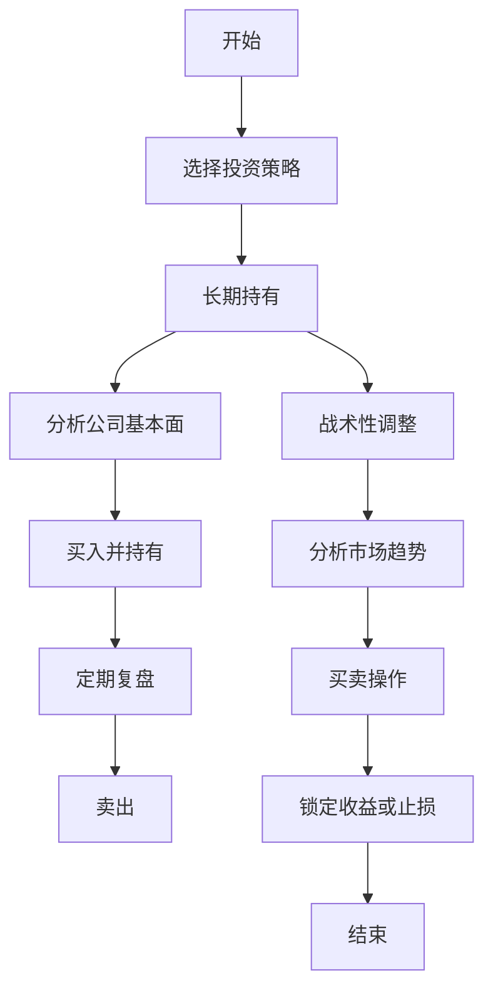
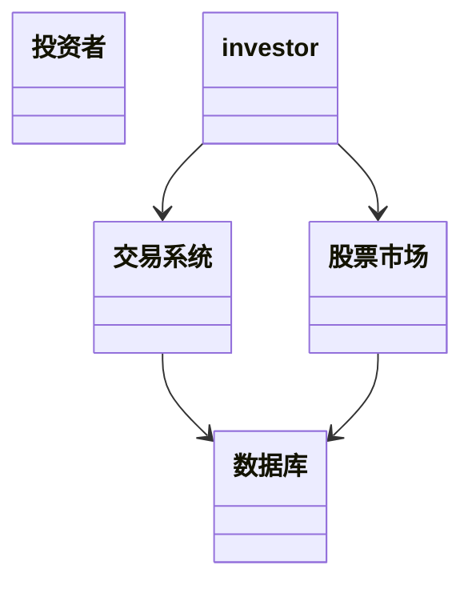
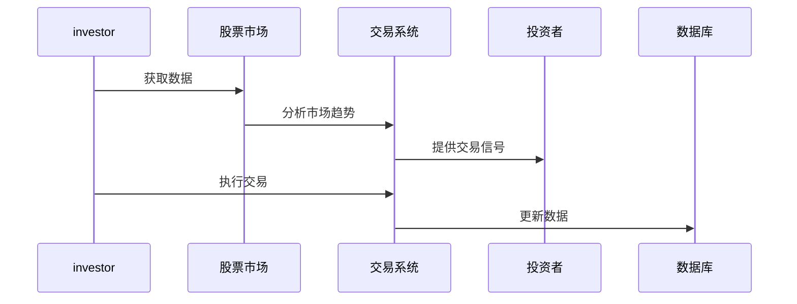

                 


# 彼得林奇的"长期持有"vs"战术性调整"的决策框架

## 关键词：投资策略，长期持有，战术性调整，彼得林奇，股票投资

## 摘要：本文深入探讨了彼得林奇提出的“长期持有”和“战术性调整”两种投资策略，分析了它们的优缺点、应用场景以及如何有机结合。通过数学模型和实际案例，本文详细讲解了这两种策略的决策框架，并为投资者提供了实用的建议。

---

# 正文

## 第一部分：背景介绍

### 第1章：长期持有与战术性调整的背景

#### 1.1 问题背景

投资市场的不确定性是所有投资者面临的最大挑战。股票价格波动频繁，市场环境复杂多变，投资者需要制定有效的策略以应对这些变化。彼得林奇作为著名的基金经理，提出了两种截然不同的投资策略：长期持有和战术性调整。这两种策略各有优劣，关键在于如何根据市场环境和个人目标选择合适的策略。

#### 1.2 问题描述

- **长期持有的定义与特点**：长期持有是指投资者买入优质股票后，长期持有，不因短期波动而改变投资决策。这种策略强调对公司基本面的深入研究和长期价值的判断。
- **战术性调整的定义与特点**：战术性调整是指根据市场短期变化，及时调整投资组合，以应对市场波动。这种策略注重短期市场趋势和交易机会。
- **两种策略的优缺点对比**：
  - 长期持有：优点是避免频繁交易的费用和心理压力，缺点是无法应对市场短期剧烈波动。
  - 战术性调整：优点是能够在市场波动中获利，缺点是需要较高的市场敏感性和交易技巧，容易受到情绪影响。

#### 1.3 问题解决

- **长期持有的应用场景**：适合风险承受能力较强、有长期投资目标的投资者。例如，投资于业绩稳定、分红良好的蓝筹股。
- **战术性调整的应用场景**：适合市场波动较大、短期交易机会较多的情况。例如，在市场下跌时及时止损，或在市场上涨时锁定利润。
- **两种策略的结合使用**：在长期持有优质股票的基础上，根据市场短期变化进行适当的调整，既能捕捉短期机会，又能保持长期收益。

#### 1.4 边界与外延

- **长期持有的边界条件**：需要选择具有持续增长潜力和良好管理的公司，避免投资于周期性波动大的行业。
- **战术性调整的边界条件**：需要对市场趋势有较强的判断能力，避免频繁交易带来的成本和风险。
- **两种策略的适用范围与限制**：长期持有适合稳健型投资者，而战术性调整适合有一定市场经验的投资者。两者结合使用时，需权衡短期收益与长期目标。

#### 1.5 概念结构与核心要素

- **长期持有的核心要素**：公司基本面分析、长期价值判断、风险承受能力。
- **战术性调整的核心要素**：市场趋势分析、短期交易机会、风险控制。
- **两种策略的关系**：长期持有是基础，战术性调整是补充，两者结合能够实现风险控制和收益最大化。

---

## 第二部分：核心概念与联系

### 第2章：核心概念与联系

#### 2.1 核心概念原理

- **长期持有**：基于对公司内在价值的分析，选择具有持续增长潜力的公司，长期持有，忽略短期波动。
- **战术性调整**：基于对市场短期趋势的分析，根据市场波动调整投资组合，捕捉短期收益或规避风险。

#### 2.2 概念属性对比

| 属性 | 长期持有 | 战术性调整 |
|------|---------|------------|
| 时间框架 | 长期 | 短期 |
| 投资目标 | 资产增值 | 资产保值与增值 |
| 风险承受 | 较高 | 较低 |
| 交易频率 | 低 | 高 |
| 适用场景 | 市场稳定 | 市场波动 |

#### 2.3 ER实体关系图

```mermaid
er
actor 投资者
actor 股票市场
actor 交易系统
```

---

## 第三部分：算法原理

### 第3章：算法原理

#### 3.1 算法流程图



#### 3.2 数学模型与公式

##### 长期持有的价值评估模型

$$ V = \frac{D}{r - g} $$

其中：
- \( V \) 表示股票的内在价值
- \( D \) 表示股息
- \( r \) 表示贴现率
- \( g \) 表示股息增长率

##### 战术性调整的交易模型

$$ P = S \times Q \times T $$

其中：
- \( P \) 表示交易价格
- \( S \) 表示买入或卖出信号
- \( Q \) 表示交易量
- \( T \) 表示交易时间

#### 3.3 Python代码示例

##### 长期持有策略

```python
def long_term_hold(stock, years):
    for year in range(years):
        analyze_financials(stock)
        if stock.value > stock.price:
            buy(stock)
        else:
            hold(stock)
    sell(stock)
```

##### 战术性调整策略

```python
def tactical_adjustment(stock, signal):
    if signal == 'buy':
        buy(stock)
    elif signal == 'sell':
        sell(stock)
    else:
        hold(stock)
```

#### 3.4 案例分析

##### 长期持有案例

某投资者买入一家绩优股，持有5年，期间市场波动较大，但公司业绩持续增长，最终实现资产增值。

##### 战术性调整案例

某投资者根据市场信号，及时买入一只股票，在短期内获得收益后卖出，避免了市场下跌的风险。

---

## 第四部分：系统分析与架构设计

### 第4章：系统分析与架构设计

#### 4.1 问题场景介绍

投资者需要一个系统来支持长期持有和战术性调整的决策。系统需要具备数据收集、分析、决策支持和交易执行等功能。

#### 4.2 项目介绍

开发一个智能投资系统，帮助投资者根据市场情况选择合适的策略。

#### 4.3 系统功能设计

##### 领域模型（Mermaid类图）



#### 4.4 系统架构设计

##### 系统架构图


##### 系统接口设计

- API接口：
  - 获取股票数据
  - 分析市场趋势
  - 执行交易

##### 系统交互流程



---

## 第五部分：项目实战

### 第5章：项目实战

#### 5.1 环境安装

安装必要的工具和库：
- Python
- Pandas
- Matplotlib
- TensorFlow

#### 5.2 核心代码实现

##### 长期持有策略代码

```python
import pandas as pd
import matplotlib.pyplot as plt

def analyze_financials(stock_data):
    # 示例分析
    stock_data['value'] = stock_data['revenue'] / stock_data['shares']
    return stock_data

def long_term_hold(symbol, years):
    data = pd.read_csv(f'{symbol}.csv')
    analyzed_data = analyze_financials(data)
    plt.plot(analyzed_data['value'])
    plt.show()

long_term_hold('AAPL', 5)
```

##### 战术性调整策略代码

```python
import pandas as pd

def tactical_adjust(symbol, signal):
    data = pd.read_csv(f'{symbol}.csv')
    if signal == 'buy':
        buy_point = data['close'].shift(1)
        plt.plot(data['close'], 'b')
        plt.plot(buy_point, 'ro')
    elif signal == 'sell':
        sell_point = data['close'].shift(1)
        plt.plot(data['close'], 'b')
        plt.plot(sell_point, 'ro')
    plt.show()

tactical_adjust('AAPL', 'buy')
```

#### 5.3 案例分析

##### 长期持有案例

分析苹果公司（AAPL）的长期趋势，确认其具有长期增长潜力，建议买入并持有。

##### 战术性调整案例

根据市场信号，及时买入一只股票，在短期内获得收益后卖出，避免市场下跌的风险。

---

## 第六部分：最佳实践

### 第6章：最佳实践

#### 6.1 小结

彼得林奇的两种策略各有优劣，投资者应根据自身目标和市场环境选择合适策略，并在必要时结合使用。

#### 6.2 注意事项

- 长期持有需要深入研究公司基本面。
- 战术性调整需要对市场趋势敏感。
- 结合使用时，需平衡短期收益与长期目标。

#### 6.3 拓展阅读

- 彼得林奇的《投资的ogui原则》
- 《股票投资策略》

---

## 附录

### 附录A：数学公式总结

$$ V = \frac{D}{r - g} $$

### 附录B：代码示例

```python
def analyze_financials(stock_data):
    stock_data['value'] = stock_data['revenue'] / stock_data['shares']
    return stock_data

def long_term_hold(symbol, years):
    data = pd.read_csv(f'{symbol}.csv')
    analyzed_data = analyze_financials(data)
    plt.plot(analyzed_data['value'])
    plt.show()
```

---

通过以上步骤，您可以系统地理解和应用彼得林奇的“长期持有”和“战术性调整”策略，结合数学模型和实际案例，制定适合自己的投资决策框架。

