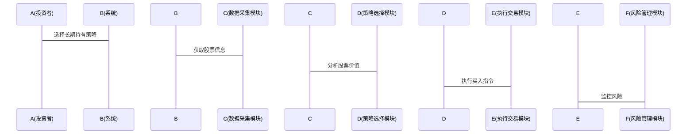
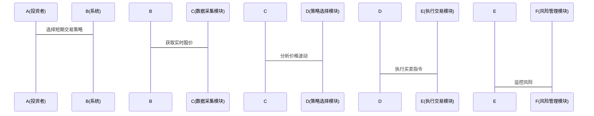

                 


# 彼得林奇的"长期持有"vs"短期交易"

> 关键词：彼得林奇、长期持有、短期交易、投资策略、股票分析、风险管理

> 摘要：本文详细分析了彼得林奇的长期持有策略与短期交易策略的优劣，通过比较两种策略的核心概念、数学模型和实际案例，探讨了在不同市场环境下的适用性，并提出了风险管理的最佳实践。

---

# 第1章: 投资基础与策略概述

## 1.1 投资的基本概念

### 1.1.1 什么是投资
投资是指将资金投入某种资产，以期在未来获得收益的行为。投资的目标是通过资产增值或收入增加来实现财富增长。

### 1.1.2 投资的基本原则
- 分散投资：降低风险。
- 长期视角：时间是投资的朋友。
- 价值分析：寻找被低估的资产。

### 1.1.3 投资的分类与特点
- **长期投资**：注重资产的内在价值，适合价值投资者。
- **短期交易**：关注市场波动，适合技术分析者。

## 1.2 彼得林奇的投资理念

### 1.2.1 彼得林奇的生平简介
彼得·林奇是美国著名的投资经理，以管理富达麦哲伦基金而闻名，长期持有策略使他取得了卓越的业绩。

### 1.2.2 彼得林奇的投资哲学
- 买入优秀企业的股票，长期持有。
- 避免频繁交易，减少成本。

### 1.2.3 经典投资案例
- 投资于具有持续增长潜力的公司。

## 1.3 长期持有与短期交易的定义

### 1.3.1 长期持有的定义与特点
- 长期持有：买入并持有优质资产，等待其价值增长。
- 特点：低交易成本、高复利效应。

### 1.3.2 短期交易的定义与特点
- 短期交易：频繁买卖资产，利用价格波动获利。
- 特点：高流动性、高风险。

### 1.3.3 两种策略的优缺点对比

| 策略 | 优点 | 缺点 |
|------|------|------|
| 长期持有 | 稳定收益、低交易成本 | 忽略短期波动、需长期看好标的 |
| 短期交易 | 灵活、捕捉短期机会 | 高成本、高风险 |

## 1.4 本章小结
本章介绍了投资的基本概念，彼得林奇的投资理念，并对比了长期持有和短期交易的优缺点。

---

# 第2章: 长期持有的策略分析

## 2.1 长期持有的核心理念

### 2.1.1 长期持有的投资逻辑
- 买入优质资产，等待其内在价值的增长。

### 2.1.2 长期持有的优势
- 复利效应显著，降低交易成本。

### 2.1.3 长期持有的风险与挑战
- 忽略短期波动可能导致心理压力。

## 2.2 彼得林奇的长期持有策略

### 2.2.1 彼得林奇的选股标准
- 选择具有持续增长潜力的企业。

### 2.2.2 彼得林奇的经典投资案例
- 投资于具有强大竞争优势的公司。

### 2.2.3 彼得林奇策略的优缺点
- 优点：稳定收益、低风险。
- 缺点：需要长期看好标的。

## 2.3 长期持有策略的数学模型

### 2.3.1 投资收益的计算公式
$$ \text{收益} = \text{最终价值} - \text{初始价值} $$

### 2.3.2 复利计算公式
$$ \text{最终价值} = P \times (1 + r)^n $$

## 2.4 本章小结
本章详细分析了长期持有策略的核心理念、优势与风险，并通过彼得林奇的案例进行了说明。

---

# 第3章: 短期交易的策略分析

## 3.1 短期交易的核心理念

### 3.1.1 短期交易的投资逻辑
- 利用市场波动，频繁买卖获利。

### 3.1.2 短期交易的优势
- 灵活应对市场变化。

### 3.1.3 短期交易的风险与挑战
- 高交易成本、高市场风险。

## 3.2 短期交易的策略类型

### 3.2.1 日内交易
- 当天买入并卖出，规避隔夜风险。

### 3.2.2 波动交易
- 利用价格波动，多次买卖。

### 3.2.3 事件驱动交易
- 基于公司事件（如并购）进行交易。

## 3.3 短期交易的数学模型

### 3.3.1 短期收益的计算公式
$$ \text{短期收益} = \sum_{i=1}^{n} (\text{卖出价}_i - \text{买入价}_i) $$

### 3.3.2 风险评估公式
$$ \text{风险} = \text{波动率} \times \text{交易次数} $$

## 3.4 本章小结
本章分析了短期交易的策略类型和数学模型，指出了其优缺点。

---

# 第4章: 长期持有与短期交易的比较分析

## 4.1 策略选择的影响因素

### 4.1.1 市场环境
- 牛市适合长期持有，熊市适合短期交易。

### 4.1.2 投资者类型
- 长期投资者适合长期持有，短期投资者适合短期交易。

### 4.1.3 资金规模
- 小资金适合短期交易，大资金适合长期持有。

## 4.2 策略选择的数学模型

### 4.2.1 策略选择逻辑图


### 4.2.2 优缺点对比表
| 策略 | 收益潜力 | 风险 | 交易成本 | 适用场景 |
|------|----------|------|-----------|-----------|
| 长期持有 | 高      | 低   | 低        | 稳定市场   |
| 短期交易 | 中高     | 高   | 高        | 波动市场   |

## 4.3 本章小结
本章通过比较分析，帮助读者理解在不同情况下选择哪种策略更优。

---

# 第5章: 策略选择与风险管理

## 5.1 根据个人情况选择策略

### 5.1.1 风险承受能力
- 高风险承受能力适合短期交易，低风险承受能力适合长期持有。

### 5.1.2 资金规模
- 小资金适合短期交易，大资金适合长期持有。

### 5.1.3 投资目标
- 长期目标适合长期持有，短期目标适合短期交易。

## 5.2 风险管理方法

### 5.2.1 设置止损点
- 短期交易中，止损点是控制风险的关键。

### 5.2.2 分散投资
- 通过投资多个标的降低风险。

### 5.2.3 定期复盘
- 分析策略的有效性，及时调整。

## 5.3 本章小结
本章讨论了如何根据个人情况选择策略，并提出了风险管理的方法。

---

# 第6章: 长期持有与短期交易的系统分析

## 6.1 投资系统架构设计

### 6.1.1 系统功能模块
- 数据采集：收集股票信息。
- 策略选择：根据市场情况选择策略。
- 执行交易：执行买卖指令。
- 风险管理：监控风险。

### 6.1.2 系统架构图


## 6.2 系统接口设计

### 6.2.1 数据接口
- 股票数据接口：提供实时股价数据。

### 6.2.2 交易接口
- 买卖指令接口：执行交易操作。

## 6.3 系统交互流程

### 6.3.1 长期持有策略交互流程


### 6.3.2 短期交易策略交互流程


## 6.4 本章小结
本章通过系统架构设计，展示了如何实现长期持有和短期交易策略的自动化操作。

---

# 第7章: 项目实战与案例分析

## 7.1 环境安装与配置

### 7.1.1 数据源选择
- 使用Yahoo Finance获取股票数据。

### 7.1.2 工具安装
- 安装Python、Pandas、Matplotlib。

## 7.2 核心代码实现

### 7.2.1 长期持有策略代码
```python
import pandas as pd
import matplotlib.pyplot as plt

# 获取股票数据
data = pd.read_csv('stock.csv')

# 计算复利
initial = 1000
years = 10
growth_rate = 0.1

final = initial * (1 + growth_rate) ** years
print(f"最终价值: {final}")
```

### 7.2.2 短期交易策略代码
```python
import pandas as pd
import matplotlib.pyplot as plt

# 获取股票数据
data = pd.read_csv('stock.csv')

# 简单移动平均线策略
short_window = 10
long_window = 20

data['SMA_short'] = data['Close'].rolling(short_window).mean()
data['SMA_long'] = data['Close'].rolling(long_window).mean()

# 生成交易信号
data['signal'] = 0
data['signal'][data['SMA_short'] > data['SMA_long']] = 1
data['signal'][data['SMA_short'] < data['SMA_long']] = -1

# 计算收益
data['profit'] = data['signal'].shift(1) * data['Close'].pct_change()

print(data.tail())
```

## 7.3 实际案例分析

### 7.3.1 长期持有案例
- 投资于苹果公司股票，长期持有。

### 7.3.2 短期交易案例
- 根据技术指标进行买卖决策。

## 7.4 本章小结
本章通过实际项目，展示了如何实现长期持有和短期交易策略，并分析了实际案例。

---

# 第8章: 总结与注意事项

## 8.1 策略总结

### 8.1.1 长期持有与短期交易的优劣
- 长期持有：稳定收益、低风险。
- 短期交易：灵活、高风险。

## 8.2 投资建议

### 8.2.1 根据市场环境选择策略
- 牛市适合长期持有，熊市适合短期交易。

### 8.2.2 风险管理的重要性
- 设置止损点、分散投资。

## 8.3 小结与注意事项

### 8.3.1 小结
- 长期持有适合长期稳定的市场环境，短期交易适合波动大的市场环境。

### 8.3.2 注意事项
- 避免频繁交易，降低交易成本。
- 根据自身情况选择策略，合理控制风险。

## 8.4 拓展阅读
- 《彼得林奇的成功投资》
- 《短线交易秘诀》

---

# 附录: 关键术语解释

- **长期持有**：买入并持有优质资产，等待其内在价值增长。
- **短期交易**：频繁买卖资产，利用价格波动获利。
- **复利效应**：资金在投资中滚雪球式增长的现象。
- **风险管理**：控制和减少投资中的潜在损失。

---

# 结语
通过本文的分析，读者可以更好地理解彼得林奇的长期持有策略与短期交易策略的优缺点，并根据实际情况选择适合自己的投资策略。无论是长期持有还是短期交易，合理的风险管理都是投资成功的关键。

