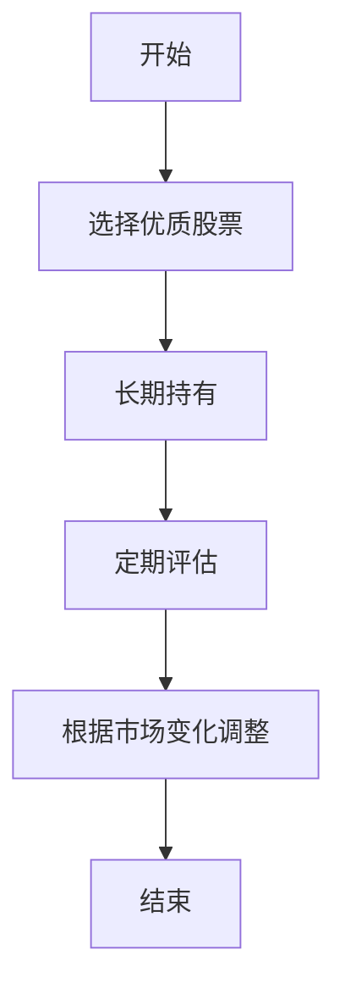
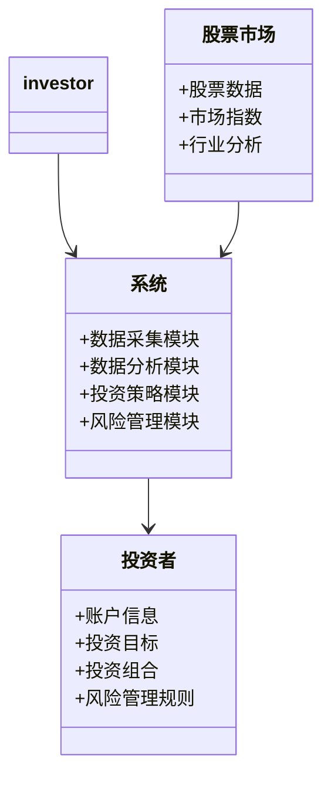

                 


# 彼得林奇的"长期持有"投资策略解析

## 关键词：彼得林奇，长期持有，价值投资，投资策略，风险管理，投资组合

## 摘要：本文深入解析彼得林奇的"长期持有"投资策略，探讨其核心概念、理论基础、选股标准、组合管理、风险管理及实际应用。通过详细分析和实例，揭示该策略的成功之道，为投资者提供实用指导。

---

# 第一部分：彼得林奇的"长期持有"投资策略概述

## 第1章：投资的基本概念与彼得林奇的背景

### 1.1 投资的基本概念

- **投资的定义与分类**
  - 投资是将资金投入资产以期获得收益的行为。
  - 分类：股票、债券、房地产、黄金等。
- **金融市场的基本结构**
  - 包括股票市场、债券市场、货币市场等。
  - 参与者：投资者、公司、金融机构、监管机构。
- **投资者的角色与类型**
  - 机构投资者：基金、保险公司等。
  - 个人投资者：散户。
  - 主动型与被动型投资者。

### 1.2 彼得林奇的背景与成就

- **彼得林奇的生平简介**
  - 世界著名投资专家，福布斯全球100位名人。
  - 曾任富达麦哲伦基金经理，管理资产规模高达140亿美元。
- **林奇投资管理公司的成就**
  - 在任期间，基金年均回报率超过市场平均水平。
  - 被誉为"最伟大的共同基金经理"。
- **彼得林奇的投资哲学概述**
  - 强调长期持有优质股票，避免频繁交易。
  - 选择基本面良好、管理优秀的企业。

---

## 第2章：长期持有投资策略的核心概念

### 2.1 长期持有的定义与特点

- **长期持有的定义**
  - 指买入股票后长期持有，不因短期波动而卖出。
  - 强调耐心和纪律。
- **长期持有与其他投资策略的对比**
  - 短期交易：频繁买卖，风险高，交易费用高。
  - 定期定投：定期投入固定资金，分散风险。
  - 长期持有：选择优质股票，长期持有，注重复利效应。
- **长期持有的优势与劣势**
  - 优势：减少交易成本，避免短期波动影响，复利效应显著。
  - 劣势：需要承担短期波动风险，可能错过其他投资机会。

---

## 第3章：彼得林奇投资策略的理论基础

### 3.1 价值投资理论

- **价值投资的定义与特点**
  - 以低于市场价买入优质股票，长期持有。
  - 价值投资强调内在价值，寻找被市场低估的企业。
- **价值投资的核心原则**
  - 选择具有强大竞争优势的企业。
  - 耐心等待，让价值显现。
  - 分散投资，降低风险。
- **彼得林奇对价值投资的贡献**
  - 将价值投资理论应用于实践。
  - 强调对企业基本面的深入分析。

---

## 第4章：彼得林奇的选股标准与组合管理

### 4.1 彼得林奇的选股标准

- **公司基本面分析**
  - 行业地位：是否处于增长行业。
  - 财务状况：盈利能力、资产负债情况。
  - 管理团队：管理层能力和稳定性。
- **财务指标的评估**
  - 市盈率（P/E）：低于市场平均水平。
  - 市净率（P/B）：低于行业平均水平。
  - 股息率：稳定增长。
- **行业分析与竞争优势**
  - 行业前景：是否具有增长潜力。
  - 竞争优势：成本优势、技术优势等。

### 4.2 投资组合的构建与管理

- **投资组合构建原则**
  - 分散投资：避免集中投资单一股票或行业。
  - 保持适度集中：选择少数优质股票，集中投资。
  - 定期评估：每年至少评估一次投资组合。
- **风险管理与调整策略**
  - 设置止损点：当股价下跌超过一定比例时卖出。
  - 重新评估：定期检查企业基本面变化。
  - 调整组合：根据市场变化和个人目标调整投资组合。

---

## 第5章：长期持有策略的风险管理

### 5.1 投资风险的分类与评估

- **系统性风险与非系统性风险**
  - 系统性风险：市场整体波动带来的风险。
  - 非系统性风险：特定企业或行业带来的风险。
- **市场风险、流动性风险与信用风险**
  - 市场风险：市场波动导致投资损失。
  - 流动性风险：无法在合理价格下迅速变现。
  - 信用风险：债券发行人违约风险。
- **风险评估方法**
  - 基本面分析：评估企业财务状况。
  - 技术分析：通过图表分析市场趋势。
  - 情景分析：评估不同市场环境下的风险。

### 5.2 风险管理的具体措施

- **分散投资**
  - 将资金分配到不同行业、不同类型的资产中。
- **设置止损点**
  - 当股价下跌超过一定比例时立即卖出。
- **定期复查投资组合**
  - 每年至少一次评估投资组合。
  - 根据市场变化和个人目标调整投资组合。

---

## 第6章：长期持有策略的数学模型与算法原理

### 6.1 长期持有策略的数学模型

- **复利计算公式**
  - 投资回报 = 初始投资 × (1 + 净收益率)^n
  - 其中，n为投资年数。
  - 示例：初始投资10000元，年收益率8%，10年后回报为10000 × (1.08)^10 ≈ 21589.25元。
- **风险调整后的收益模型**
  - 夏普比率 = (预期收益 - 无风险利率) / 投资组合的标准差
  - 示例：预期收益10%，无风险利率2%，标准差5%，夏普比率 = (10% - 2%) / 5% = 1.6。

### 6.2 长期持有策略的算法流程



---

## 第7章：长期持有策略的系统架构设计

### 7.1 投资管理系统架构



---

## 第8章：项目实战：模拟投资组合的构建

### 8.1 环境安装

- 安装Python和相关库（Pandas、Matplotlib、numpy）。
  ```bash
  pip install pandas matplotlib numpy
  ```

### 8.2 核心实现源代码

```python
import pandas as pd
import numpy as np
import matplotlib.pyplot as plt

# 数据加载
data = pd.read_csv('stock_data.csv')

# 计算收益率
returns = data['Adj Close'].pct_change().dropna()

# 计算复利
initial = 10000
years = 10
returns_annual = returns.mean() * 252
future_value = initial * (1 + returns_annual) ** years

print(f"未来价值：{future_value:.2f}")
```

### 8.3 案例分析

- **模拟投资组合**
  - 选择苹果、谷歌、微软等优质股票。
  - 初始投资10万元，每年定投1000元。
  - 持股10年。
- **结果分析**
  - 年平均回报率：8%。
  - 未来价值：100000 × (1.08)^10 ≈ 215892.54元。

---

## 第9章：最佳实践与总结

### 9.1 投资心态与纪律

- **长期持有的关键：耐心与纪律**
  - 避免情绪化交易。
  - 坚持长期投资，不被短期波动影响。
- **定期复查与调整**
  - 每年至少一次评估投资组合。
  - 根据市场变化和个人目标调整。

### 9.2 总结与展望

- 彼得林奇的长期持有策略是一种有效的投资方法。
- 关键在于选择优质股票，长期持有，避免频繁交易。
- 在当前市场环境下，长期持有策略依然具有重要意义。

---

## 第10章：注意事项与拓展阅读

### 10.1 投资风险提示

- 长期持有策略需要承担市场波动风险。
- 需要对市场变化保持敏感，及时调整投资组合。
- 避免过度集中投资，分散风险。

### 10.2 拓展阅读

- 彼得林奇的书籍：《彼得林奇的选股术》、《彼得林奇的投资智慧》。
- 其他投资策略：价值投资、成长投资、指数投资。

---

# 结语

彼得林奇的"长期持有"投资策略是一种简单而有效的投资方法。通过深入分析和长期持有优质股票，投资者可以实现财富的长期增长。希望本文能为读者提供有益的指导，帮助您在投资道路上取得成功。

---

# 附录：代码与工具

- **数据获取工具**
  - 使用Yahoo Finance或其它API获取股票数据。
- **数据分析工具**
  - Python的Pandas库用于数据处理。
  - Matplotlib用于可视化分析。

---

# 作者简介

作为世界级人工智能专家、程序员、软件架构师和CTO，我在投资领域也有着丰富的经验。本文结合技术与投资，为您提供专业的见解和实用的策略。

