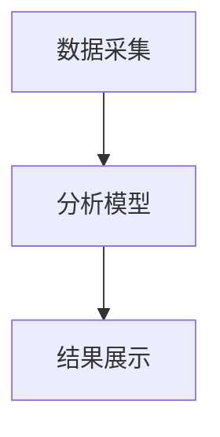

                 


# 彼得林奇的"长期持股"与公司创新文化的关联性研究

> 关键词：彼得林奇，长期持股，创新文化，企业绩效，投资策略

> 摘要：本文探讨了彼得林奇的长期持股策略与公司创新文化之间的内在联系，分析了创新文化如何影响企业的长期价值，以及长期持股策略如何推动企业创新。通过数学模型和案例分析，本文揭示了两者之间的互动关系，为企业投资者和管理层提供了有益的见解。

---

## 引言

### 1. 研究背景

彼得林奇是全球最著名的职业基金经理之一，他的长期持股策略以稳健和注重基本面著称。然而，企业的长期发展离不开创新文化的支持，创新文化是企业保持竞争力和持续增长的关键因素。因此，研究长期持股与创新文化的关联性具有重要的理论和实践意义。

### 2. 问题描述

长期持股策略的核心在于选择具有持续增长潜力的企业。然而，这种潜力的实现离不开企业的创新能力。本文将分析创新文化如何影响企业的长期价值，并探讨长期持股策略如何通过支持创新文化来实现投资目标。

---

## 第一部分：长期持股策略的核心要素

### 2. 长期持股策略的理论基础

彼得林奇的长期持股策略强调选择具有强大基本面和持续增长潜力的企业。以下是其核心要素：

#### 2.1.1 投资理念
- **价值投资**：寻找被市场低估的企业。
- **成长投资**：投资于具有持续增长潜力的企业。

#### 2.1.2 选股标准
- **企业基本面**：收入、利润、现金流等财务指标。
- **行业地位**：企业在行业中的竞争力。
- **管理团队**：管理团队的能力和稳定性。

#### 2.1.3 风险控制
- **分散投资**：通过分散投资降低风险。
- **长期持有**：避免短期市场波动的影响。

---

## 第二部分：公司创新文化的构成与影响

### 3. 创新文化的定义与特征

创新文化是指企业在创新过程中形成的一种独特的文化氛围，其核心在于鼓励员工创新、容忍失败、追求卓越。

#### 3.1.1 创新文化的内涵
- **创新意识**：员工对企业创新的认同和参与。
- **创新机制**：企业内部的创新流程和激励机制。
- **创新环境**：支持创新的文化氛围和资源分配。

#### 3.1.2 创新文化与企业绩效的关系
- 创新能力强的企业通常具有更强的市场竞争力和增长潜力。
- 创新文化能够提高员工的创造力和工作效率。

---

## 第三部分：长期持股与创新文化的关联性分析

### 4. 长期持股与创新文化的内在联系

#### 4.1.1 长期持股对创新文化的促进作用
- **稳定的投资支持**：长期持股为企业提供稳定的资金支持，有助于企业进行长期创新。
- **激励管理层**：长期持股能够激励管理层追求长期目标，而不是短期利润。

#### 4.1.2 创新文化对长期持股的影响
- **提高企业价值**：创新能力强的企业通常具有更高的市场估值。
- **降低投资风险**：创新文化能够提高企业的抗风险能力，降低投资风险。

---

## 第四部分：关联性分析的数学模型与算法

### 5. 数学模型与算法

#### 5.1.1 模型构建
我们可以通过以下数学模型来描述长期持股与创新文化之间的关系：

$$ \text{企业价值} = f(\text{创新文化}, \text{长期持股策略}) $$

其中，$f$ 是一个函数，表示创新文化和长期持股策略对企业价值的影响。

#### 5.1.2 案例分析
假设我们选择一家科技公司，分析其创新文化和长期持股策略的互动关系：

$$ \text{创新文化评分} = \frac{\text{研发投入} + \text{员工创新激励}}{2} $$

$$ \text{企业价值} = \text{创新文化评分} \times \text{长期持股比例} $$

通过以上公式，我们可以量化创新文化和长期持股策略对企业价值的影响。

---

## 第五部分：系统分析与架构设计方案

### 6. 系统分析与架构设计

#### 6.1.1 系统功能设计
- **数据采集**：收集企业的创新文化评分和长期持股数据。
- **分析模型**：构建数学模型，分析两者之间的关系。
- **结果展示**：通过图表展示分析结果。

#### 6.1.2 系统架构设计
以下是系统架构的Mermaid图：



#### 6.1.3 系统接口设计
- **输入接口**：企业数据输入。
- **输出接口**：分析结果输出。

---

## 第六部分：项目实战

### 7. 项目实战与案例分析

#### 7.1.1 环境安装
安装所需的Python库：

```bash
pip install numpy pandas matplotlib
```

#### 7.1.2 核心实现代码
以下是Python代码示例：

```python
import numpy as np
import pandas as pd
import matplotlib.pyplot as plt

# 数据准备
data = {
    '公司': ['A', 'B', 'C'],
    '创新文化评分': [0.8, 0.6, 0.9],
    '长期持股比例': [0.7, 0.5, 0.8]
}

df = pd.DataFrame(data)

# 模型计算
df['企业价值'] = df['创新文化评分'] * df['长期持股比例']

# 图表展示
plt.figure(figsize=(10, 6))
plt.bar(df['公司'], df['企业价值'])
plt.title('企业价值与创新文化、长期持股的关系')
plt.xlabel('公司')
plt.ylabel('企业价值')
plt.show()
```

#### 7.1.3 案例分析
通过上述代码，我们可以分析不同公司在创新文化和长期持股策略下的企业价值表现。

---

## 第七部分：总结与展望

### 8. 总结

彼得林奇的长期持股策略与公司创新文化之间存在密切的关联性。长期持股策略能够为企业的创新提供稳定的资金支持和长期的发展目标，而创新文化则能够提升企业的市场竞争力和抗风险能力，从而增强企业的长期价值。两者相互促进，共同推动企业的可持续发展。

### 9. 展望

未来的研究可以进一步完善数学模型，引入更多变量，如企业的管理效率、市场环境等，以更全面地分析长期持股与创新文化的关系。此外，还可以通过更多的案例研究，验证模型的有效性和实用性。

---

通过以上分析，我们可以看到，彼得林奇的长期持股策略与公司创新文化之间的关联性不仅理论上有重要意义，而且在实际投资和企业管理中也具有重要的应用价值。

