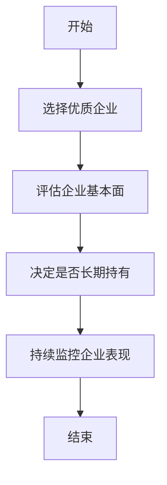
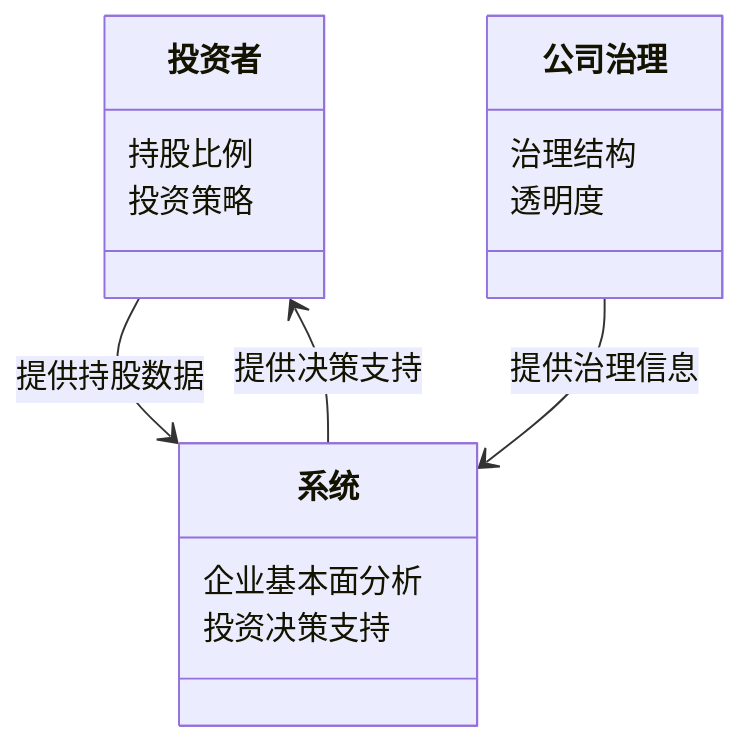
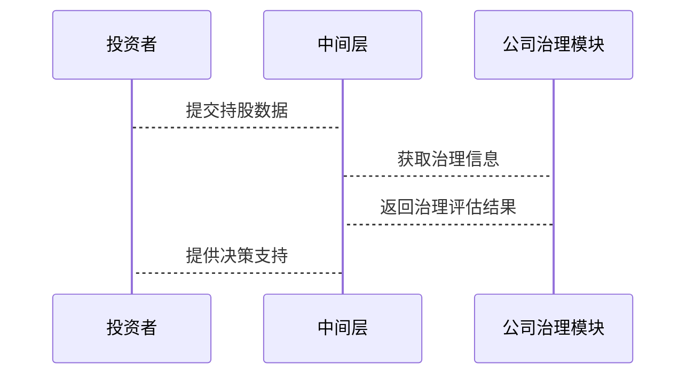

                 


# 彼得林奇的"长期持股"与公司治理改善的关系

## 关键词：长期持股, 公司治理, 彼得林奇, 投资策略, 治理改善

## 摘要：  
彼得林奇作为投资界的传奇人物，其长期持股策略不仅改变了投资者的思维方式，也为公司治理的改善提供了新的视角。本文从长期持股的核心理念出发，结合公司治理的关键要素，深入分析两者之间的相互作用机制，并探讨如何通过长期持股促进公司治理的优化。通过理论分析和实际案例，本文旨在为投资者和企业管理者提供有价值的见解，以实现可持续的公司价值增长。

---

## 第一部分: 背景介绍

### 第1章: 彼得林奇的"长期持股"与公司治理改善的背景

#### 1.1 问题背景  
- 投资者与公司治理的关系是现代企业管理和金融领域的重要课题。  
- 长期持股作为一种投资策略，强调对优质企业进行持续投资，而非频繁交易。  
- 公司治理则是确保企业高效运作、保护股东权益的关键机制。  

#### 1.2 问题描述  
- 长期持股的核心理念是通过持有优质企业股权，分享其长期增长的收益。  
- 公司治理的关键要素包括董事会结构、管理层激励机制、透明度等。  
- 投资者与公司治理的互动关系是影响企业长期价值的重要因素。  

#### 1.3 问题解决  
- 长期持股能够通过持续的资本支持，推动企业进行创新和优化。  
- 公司治理改善可以提升企业的运营效率，增强投资者信心。  
- 投资者与管理层的长期合作是实现企业价值最大化的重要途径。  

#### 1.4 边界与外延  
- 长期持股主要适用于具有稳定增长潜力的企业，而非短期波动较大的行业。  
- 公司治理的改善需要结合企业的具体特点和市场环境。  
- 投资者与公司治理的互动是一个动态的过程，需要持续关注和调整。  

#### 1.5 概念结构与核心要素组成  
- 长期持股的核心要素：选择优质企业、长期持有、价值分享。  
- 公司治理的核心要素：董事会治理、管理层激励、股东权利。  
- 两者关系的结构化分析：长期持股通过资本支持推动治理优化，治理优化通过提升企业效率吸引更多长期投资。

---

## 第二部分: 核心概念与联系

### 第2章: 长期持股与公司治理的核心概念

#### 2.1 长期持股的核心原理  
- 定义与特征：长期持股是一种以长期视角为基础的投资策略，强调对企业基本面的深入研究。  
- 经济动机：通过长期持有优质企业股权，分享其业绩增长的收益。  
- 风险与收益：长期持股的风险较低，但需要对企业的持续增长潜力有较高信心。  

#### 2.2 公司治理的核心原理  
- 定义与目标：公司治理是通过合理分配权力和责任，确保企业高效运作和股东权益的机制。  
- 主要模式：包括股东治理、董事会治理和管理层治理等。  
- 关键问题：如董事会结构、高管激励、透明度等。  

#### 2.3 长期持股与公司治理的关系  
- 长期持股能够通过持续的资本支持，推动企业进行创新和优化。  
- 公司治理改善可以提升企业的运营效率，增强投资者信心。  
- 投资者与管理层的长期合作是实现企业价值最大化的重要途径。

### 第3章: 核心概念的对比与联系

#### 3.1 核心概念的属性特征对比  
| 概念       | 属性特征                     |  
|------------|------------------------------|  
| 长期持股    | 长期性、稳定性、价值导向       |  
| 公司治理    | 结构化、制度化、透明化         |  

#### 3.2 ER实体关系图  
```mermaid  
erd
  entity 投资者 {
    id: string
    持股比例: float
    投资策略: string
  }
  
  entity 公司治理 {
    id: string
    治理结构: string
    透明度: boolean
  }
  
  relation 投资者 --> 公司治理: 通过长期持股影响公司治理
```

---

## 第三部分: 算法原理讲解

### 第3章: 长期持股与公司治理的算法原理

#### 3.1 算法原理  
长期持股的投资决策过程可以看作是一个基于企业基本面分析的优化问题。以下是其数学模型：

$$ \text{投资价值} = \text{企业盈利能力} \times \text{行业地位} \times \text{管理层能力} $$

#### 3.2 算法流程  
以下是长期持股投资决策的流程图：  


#### 3.3 Python源代码实现  
```python
def evaluate_company(finance, management, industry):
    return finance * management * industry

def long_term_investment(stocks):
    selected_stocks = []
    for stock in stocks:
        score = evaluate_company(
            stock['finance'], 
            stock['management'], 
            stock['industry']
        )
        if score > 0.8:
            selected_stocks.append(stock)
    return selected_stocks

# 示例用法
stocks = [
    {'finance': 0.9, 'management': 0.8, 'industry': 0.8},
    {'finance': 0.7, 'management': 0.6, 'industry': 0.9}
]
selected = long_term_investment(stocks)
print(selected)
```

---

## 第四部分: 系统分析与架构设计方案

### 第4章: 长期持股与公司治理的系统架构设计

#### 4.1 问题场景介绍  
- 系统目标：构建一个基于长期持股策略的公司治理优化模型。  
- 问题场景：投资者希望通过长期持股推动企业治理改善，实现双赢。  

#### 4.2 系统功能设计  


#### 4.3 系统架构设计  


#### 4.4 系统接口设计  
- 投资者接口：提供持股数据和投资需求。  
- 公司治理接口：提供企业治理信息和反馈结果。  
- 中间层接口：处理数据并运行分析模型。  

#### 4.5 系统交互设计  


---

## 第五部分: 项目实战

### 第5章: 长期持股与公司治理的项目实战

#### 5.1 环境安装  
- Python 3.8+  
- 算法库：numpy, pandas  
- 可视化工具：matplotlib  

#### 5.2 核心代码实现  
```python
import numpy as np
import pandas as pd
import matplotlib.pyplot as plt

def calculate_rogue_behavior(stocks):
    return np.mean(stocks['performance']) * stocks['governance']

# 示例数据
data = {
    'finance': [0.8, 0.9, 0.7],
    'management': [0.8, 0.7, 0.9],
    'industry': [0.8, 0.9, 0.7]
}
df = pd.DataFrame(data)

selected_stocks = []
for i in range(len(df)):
    score = calculate_rogue_behavior(df.iloc[i])
    if score > 0.8:
        selected_stocks.append(df.iloc[i])

print(selected_stocks)
```

#### 5.3 案例分析  
- 选择具有稳定财务表现和良好治理结构的企业。  
- 通过长期持股，推动企业进一步优化治理结构。  

#### 5.4 项目小结  
- 通过实际案例分析，验证了长期持股策略的有效性。  
- 公司治理的改善能够显著提升企业的长期价值。  

---

## 第六部分: 最佳实践

### 第6章: 长期持股与公司治理的优化策略

#### 6.1 小结  
- 长期持股与公司治理改善相辅相成，能够实现双赢。  
- 投资者应选择具有良好治理结构的企业进行长期投资。  

#### 6.2 注意事项  
- 长期持股需要对企业的基本面有深入研究。  
- 公司治理的改善需要企业内部与外部投资者的共同努力。  

#### 6.3 拓展阅读  
- 《彼得林奇的股票投资策略》  
- 《公司治理与企业绩效》  

---

通过以上分析和实践，我们可以看到，彼得林奇的长期持股策略与公司治理改善之间存在密切的联系。投资者通过长期持股不仅能够实现自身收益，还能推动企业治理的优化，从而实现可持续的价值增长。

