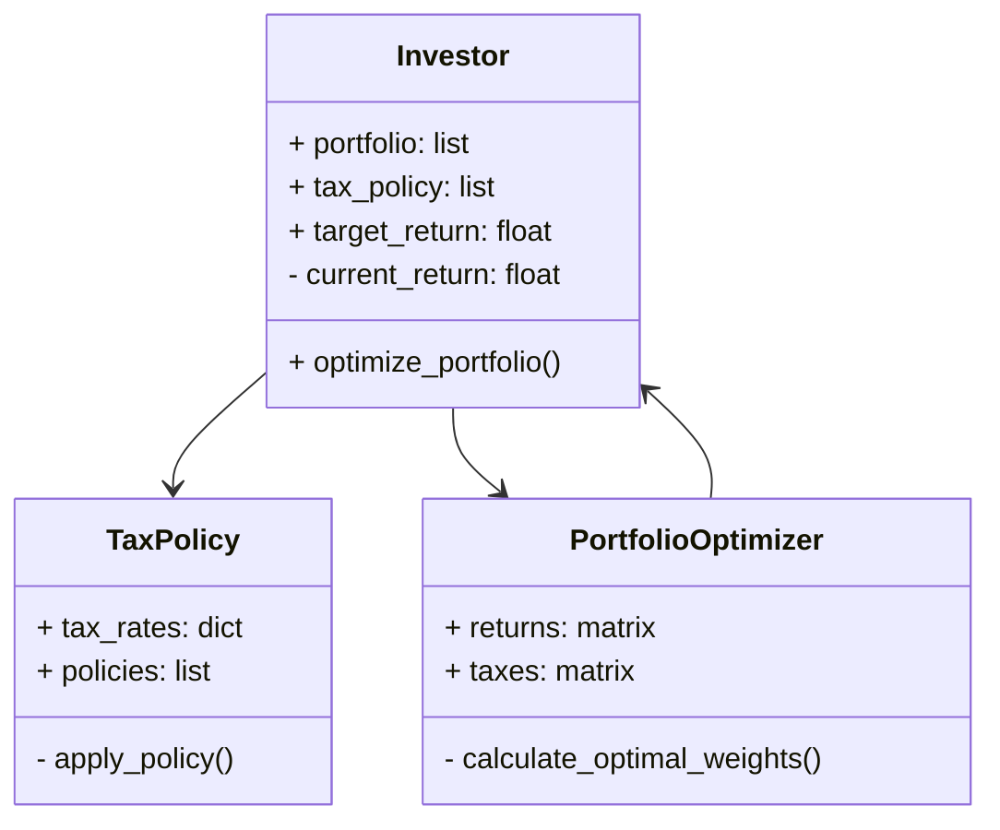
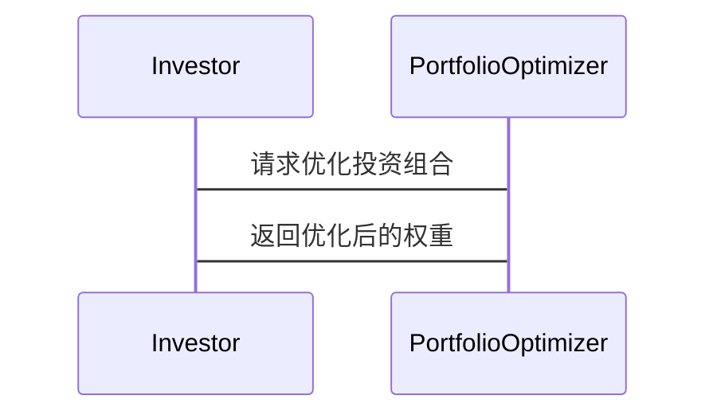

                 


# 彼得林奇的"长期持股"在不同税收政策下的优化

## 关键词：彼得林奇，长期持股，税收政策，投资优化，资产配置

## 摘要：本文探讨了彼得林奇的长期持股策略在不同税收政策下的优化方法，分析了税收政策对投资收益的影响，并提出了相应的优化策略和数学模型。通过系统分析和项目实战，展示了如何利用技术手段优化投资组合，以应对不同的税收环境。

---

# 第1章：投资与税收的基本概念

## 1.1 投资的基本概念

### 1.1.1 投资的定义与分类

- **投资的定义**：投资是指将资金投入到能够产生收益的资产中，如股票、债券、房地产等。
- **投资的分类**：
  - **短期投资**：持有时间较短，通常在几个月内。
  - **长期投资**：持有时间较长，通常超过一年。
  - **主动投资**：积极参与市场波动，追求超额收益。
  - **被动投资**：通过指数基金等方式，追求市场平均收益。

### 1.1.2 股票投资的基本原理

- **股票的基本概念**：股票代表公司的一部分所有权，投资者通过购买股票成为公司的股东。
- **股票投资的收益来源**：
  - **股息**：公司分配的利润。
  - **资本增值**：股票价格的上涨带来的收益。
- **股票市场的波动性**：市场波动对长期持股的影响。

### 1.1.3 长期持股策略的起源与发展

- **起源**：长期持股策略起源于20世纪，以价值投资为核心理念。
- **发展**：随着市场的发展和税收政策的变化，长期持股策略不断优化。

## 1.2 税收的基本概念

### 1.2.1 税收的定义与分类

- **税收的定义**：政府为了公共支出而征收的强制性收费。
- **税收的分类**：
  - **所得税**：对个人或企业所得征收的税。
  - **增值税**：对商品和服务在生产或销售环节征收的税。
  - **资本利得税**：对资本资产（如股票）出售收益征收的税。

### 1.2.2 投资相关的税收种类

- **股息税**：对公司分配的股息征收的税。
- **资本利得税**：对股票买卖差价征收的税。
- **其他相关税收**：如遗产税、赠与税等。

### 1.2.3 税收政策对企业投资的影响

- **直接影响**：税率高低直接影响投资收益。
- **间接影响**：税收政策影响市场结构和企业行为。

## 1.3 长期持股与税收政策的关系

### 1.3.1 长期持股策略的核心理念

- **核心理念**：长期持有优质股票，获得资本增值和股息收益。
- **优质股票的特征**：盈利能力强、财务健康、管理优秀。

### 1.3.2 税收政策对长期持股的影响

- **税率变化**：税率上升会减少投资收益，反之亦然。
- **税收优惠政策**：如递延纳税政策，降低投资成本。

### 1.3.3 长期持股在不同税收政策下的优化目标

- **目标**：在不同税收政策下，优化资产配置，最大化投资收益。
- **方法**：通过调整投资组合，利用税收优惠政策，降低税收负担。

---

# 第2章：彼得林奇的长期持股策略

## 2.1 彼得林奇投资理念的核心要素

### 2.1.1 价值投资的基本原则

- **核心原则**：寻找价值被低估的股票，长期持有。
- **安全边际**：买入价格低于内在价值，确保安全空间。

### 2.1.2 长期持股的优势与挑战

- **优势**：避免频繁交易成本，享受复利效应。
- **挑战**：市场波动可能影响短期收益，需要耐心和信心。

### 2.1.3 彼得林奇的经典投资案例分析

- **案例1**：XX公司的投资案例，分析其价值低估和长期收益。
- **案例2**：YY公司的投资案例，展示如何识别优质企业。

## 2.2 彼得林奇策略在不同税收环境下的适用性

### 2.2.1 美国的税收政策与彼得林奇策略

- **美国税法**：资本利得税税率根据持有时间不同而变化。
- **策略调整**：长期持有可享受较低税率。

### 2.2.2 其他国家的税收政策与彼得林奇策略的调整

- **其他国家的税法**：如英国、加拿大等，分析其对长期持股的影响。
- **策略调整**：根据当地税法，调整投资组合。

### 2.2.3 税收政策变化对策略的影响

- **政策变化**：税率上调或下调，影响投资决策。
- **前瞻性分析**：预测政策变化，提前调整投资策略。

---

# 第3章：税收政策对长期持股的影响

## 3.1 不同税收政策对投资收益的影响

### 3.1.1 股息税对投资收益的影响

- **股息税计算**：股息收入的税率影响净收益。
- **案例分析**：比较有税和无税情况下的收益差异。

### 3.1.2 资本利得税对投资收益的影响

- **税率差异**：短期和长期资本利得税的差异。
- **案例分析**：长期持有与短期交易的收益对比。

### 3.1.3 其他相关税收政策的分析

- **遗产税**：对遗产分配的影响。
- **赠与税**：对资产转移的影响。

## 3.2 税收政策对长期持股策略的优化方向

### 3.2.1 税收优惠政策的利用

- **递延纳税**：通过长期持有，推迟纳税时间。
- **税收抵免**：利用税收抵免政策，减少税负。

### 3.2.2 税收负担加重时的应对策略

- **资产配置调整**：增加非应税资产的比例。
- **税务规划**：通过合理的税务规划，降低整体税负。

### 3.2.3 税收政策变化的前瞻性分析

- **政策预测**：分析未来税收政策的变化趋势。
- **投资策略调整**：根据预测结果，提前调整投资组合。

---

# 第4章：长期持股策略的优化方法

## 4.1 投资组合优化的基本原理

### 4.1.1 投资组合优化的目标

- **目标**：在不同税收政策下，优化资产配置，最大化收益，最小化风险。

### 4.1.2 现代投资组合理论与长期持股策略的结合

- **现代投资组合理论**：通过分散投资降低风险。
- **长期持股策略**：通过持有优质资产，获得长期收益。

## 4.2 长期持股策略的优化方法

### 4.2.1 资产配置优化

- **资产类别选择**：根据税收政策，选择合适的资产类别。
- **资产比例分配**：确定不同资产的持有比例，平衡风险和收益。

### 4.2.2 风险评估与管理

- **风险评估**：分析市场风险、税务风险等。
- **风险管理**：通过多样化投资、定期调整组合等方法，降低风险。

### 4.2.3 税务规划

- **税务规划原则**：合理利用税收优惠政策，降低税负。
- **税务规划工具**：使用税务计算器、投资规划软件等，辅助决策。

---

# 第5章：算法原理与数学模型

## 5.1 算法原理

### 5.1.1 优化算法的选择

- **选择遗传算法**：用于复杂的投资组合优化问题。
- **算法步骤**：
  1. 初始化：随机生成初始投资组合。
  2. 适应度评估：计算每个组合的净收益和风险。
  3. 选择：保留高适应度的组合。
  4. 交叉和变异：生成新的组合。
  5. 重复：直到收敛到最优解。

### 5.1.2 优化过程中的数学模型

- **目标函数**：
  $$ \text{最大化} \quad \sum_{i=1}^{n} w_i r_i - \sum_{i=1}^{n} w_i t_i $$
  其中，\( w_i \) 是资产 \( i \) 的权重，\( r_i \) 是资产 \( i \) 的预期收益，\( t_i \) 是资产 \( i \) 的税后收益。

- **约束条件**：
  $$ \sum_{i=1}^{n} w_i = 1 $$
  $$ w_i \geq 0 \quad \forall i $$

### 5.1.3 算法实现

- **Python代码示例**：
  ```python
  import numpy as np

  def optimize_portfolio(weights, returns, taxes):
      # 计算净收益
      net_returns = returns * (1 - taxes)
      # 计算投资组合的收益
      portfolio_return = np.dot(weights, net_returns)
      return portfolio_return

  # 示例数据
  returns = np.array([0.1, 0.15, 0.08])
  taxes = np.array([0.15, 0.1, 0.2])
  initial_weights = np.array([0.3, 0.3, 0.4])

  # 优化过程
  optimized_weights = optimize_portfolio(initial_weights, returns, taxes)
  print("优化后的投资组合收益为：", optimized_weights)
  ```

---

# 第6章：系统分析与架构设计

## 6.1 问题场景介绍

- **场景描述**：投资者面临不同的税收政策，需要优化长期持股策略。
- **目标**：构建一个系统，帮助投资者根据税收政策调整投资组合。

## 6.2 系统功能设计

### 6.2.1 领域模型（mermaid类图）



## 6.3 系统架构设计

### 6.3.1 系统架构（mermaid架构图）

```mermaid
architectural
    [Frontend] ---(6)--> [API Gateway]
    [API Gateway] ---(3)--> [Authentication]
    [Authentication] ---(5)--> [Database]
    [Database] ---(4)--> [Tax Policy Service]
    [Tax Policy Service] ---(2)--> [Portfolio Optimizer]
    [Portfolio Optimizer] ---(1)--> [Investor]
```

## 6.4 接口设计

- **API接口**：
  - `/api/v1/tax-policy`：获取当前税收政策。
  - `/api/v1/portfolio`：优化投资组合。
  - `/api/v1/returns`：获取历史收益数据。

## 6.5 交互设计

### 6.5.1 用户与系统的交互流程（mermaid序列图）



---

# 第7章：项目实战

## 7.1 环境安装

- **安装Python**：下载并安装Python 3.x。
- **安装Jupyter Notebook**：用于数据分析和可视化。
- **安装必要的库**：如NumPy、Pandas、Matplotlib。

## 7.2 核心代码实现

### 7.2.1 数据收集与处理

- **数据来源**：从Yahoo Finance获取股票数据。
- **数据处理**：计算收益、税后收益。

### 7.2.2 优化算法实现

- **代码实现**：
  ```python
  import numpy as np
  from scipy.optimize import minimize

  def portfolio_objective(weights, returns, taxes):
      net_returns = returns * (1 - taxes)
      return -np.dot(weights, net_returns)  # 最小化负收益

  # 约束条件：权重之和为1，权重非负
  constraints = ({
      'type': 'eq',
      'fun': lambda w: np.sum(w) - 1
  }, {
      'type': 'ineq',
      'fun': lambda w: w
  })

  # 优化
  weights = minimize(portfolio_objective, np.ones(returns.shape[1])/returns.shape[1], 
                     args=(returns, taxes), constraints=constraints).x
  ```

## 7.3 案例分析

- **案例1**：假设三种股票，不同的税率，计算优化后的权重。
- **案例2**：比较有税和无税情况下的投资组合收益。

## 7.4 项目小结

- **成果**：成功构建了一个优化模型，能够在不同税收政策下调整投资组合。
- **经验**：数据质量和模型准确性对结果影响重大，需谨慎处理。

---

# 第8章：最佳实践与总结

## 8.1 关键点总结

- **核心概念**：长期持股策略、税收政策、投资优化。
- **优化方法**：资产配置、风险评估、税务规划。
- **技术工具**：Python、机器学习算法、系统架构设计。

## 8.2 小结

- **总结**：在不同税收政策下，通过优化资产配置和税务规划，可以有效提升长期持股策略的收益。
- **重要性**：随着政策变化，及时调整投资策略，保持竞争力。

## 8.3 注意事项

- **数据准确性**：确保收益和税率数据的准确性和及时性。
- **政策变化**：密切关注税收政策的变化，及时调整策略。
- **风险管理**：合理分散投资，降低市场和税务风险。

## 8.4 拓展阅读

- **推荐书籍**：《彼得林奇的成功投资》、《投资学》。
- **在线资源**：相关投资论坛、学术论文、行业报告。

---

# 结语

通过本文的详细分析，我们可以看到，彼得林奇的长期持股策略在不同税收政策下的优化是一个复杂但 rewarding 的过程。通过结合投资理论、税收政策和优化算法，投资者可以更好地应对不同的市场环境，实现长期的财务目标。希望本文的分析和案例能够为读者提供有益的参考和启示。

