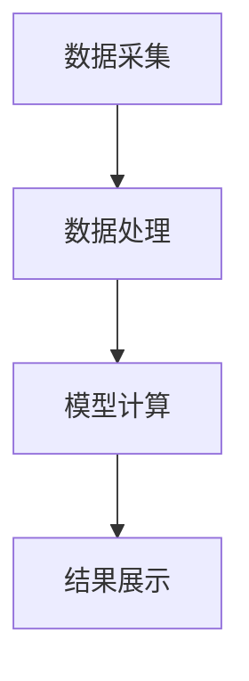
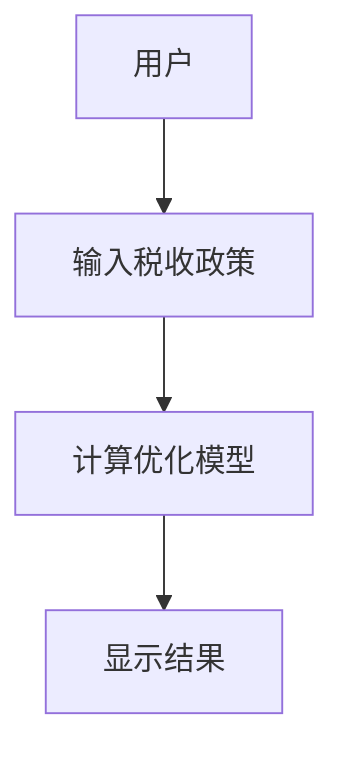

                 


---

# 彼得林奇的"长期持股"在不同税收政策下的优化模型

> 关键词：彼得林奇、长期持股、投资组合优化、税收政策、数学建模、系统架构设计、Python实现

> 摘要：本文从彼得林奇的长期持股策略出发，结合不同税收政策下的优化模型，详细探讨如何在税收政策变化的背景下，通过数学建模和系统架构设计，优化投资组合以实现收益最大化和风险最小化的目标。文章内容涵盖背景介绍、核心概念、算法原理、系统设计、项目实战、最佳实践等多个方面，为投资者和研究人员提供理论支持和实践指导。

---

## 第一部分：彼得林奇的长期持股策略与税收政策的结合

### 第1章：长期持股策略的背景与核心概念

#### 1.1 长期持股策略的定义与特点

##### 1.1.1 长期持股策略的定义
长期持股策略是彼得·林奇提出的一种投资策略，强调长期持有优质股票，避免频繁交易以减少交易成本和税务负担。该策略的核心在于选择具有持续增长潜力的公司，并在市场波动中保持耐心和纪律。

##### 1.1.2 长期持股策略的核心特点
- **长期性**：投资期限较长，通常超过一年。
- **稳定性**：选择具有稳定增长潜力的公司。
- **低交易成本**：通过减少交易次数降低佣金和买卖价差。
- **税务优化**：利用长期资本利得税较低的特点，降低税务负担。

##### 1.1.3 长期持股策略的优势与局限性
- **优势**：资本利得税较低，避免频繁交易的摩擦成本，长期复利效应显著。
- **局限性**：市场波动可能影响短期收益，需要较强的风险承受能力。

#### 1.2 税收政策对投资策略的影响

##### 1.2.1 税收政策的分类与特点
- **短期资本利得税**：通常对一年内卖出的资产收益征税，税率较高。
- **长期资本利得税**：对持有超过一年的资产收益征税，税率较低。
- **股息税**：部分国家对股息收入征税，税率因地区而异。

##### 1.2.2 税收政策对投资收益的影响
税收政策直接影响投资组合的净收益。例如，长期资本利得税较低，可以显著提高投资组合的净收益。而短期资本利得税较高，可能导致净收益下降。

##### 1.2.3 不同税收政策下的投资策略调整
根据税收政策的不同，投资者需要调整投资策略。例如，在税率较高的地区，可能需要增加长期持股的比例，以减少税务负担。

### 第2章：长期持股策略在不同税收政策下的优化模型

#### 2.1 投资组合优化模型的构建

##### 2.1.1 投资组合优化的基本原理
投资组合优化模型旨在在不同风险和收益条件下，找到最优的投资组合。彼得林奇的长期持股策略强调长期资本利得，因此在模型中需要考虑税收政策的影响。

##### 2.1.2 税收政策对投资组合的影响
税收政策直接影响投资组合的净收益。长期资本利得税较低，可以提高投资组合的净收益，而短期资本利得税较高，可能导致净收益下降。

##### 2.1.3 优化模型的构建与目标函数
优化模型的目标函数通常为最大化净收益或最小化风险。在不同税收政策下，目标函数需要根据税率进行调整。

#### 2.2 不同税收政策下的优化策略

##### 2.2.1 税后收益最大化模型
在长期资本利得税较低的情况下，优化模型应以最大化净收益为目标，选择具有较高增长潜力的股票，减少交易次数。

##### 2.2.2 风险最小化模型
在风险最小化模型中，优化模型应选择波动较小的股票，同时考虑税收政策的影响，降低整体风险。

##### 2.2.3 综合收益与风险的平衡模型
综合模型需要在收益和风险之间找到平衡点，根据不同的税收政策调整投资组合的构成。

---

## 第二部分：投资组合优化的数学模型与算法原理

### 第3章：投资组合优化的数学模型与算法原理

#### 3.1 投资组合优化的数学模型

##### 3.1.1 现代投资组合理论（MPT）基础
现代投资组合理论（MPT）由哈里·马科维茨提出，旨在通过分散投资降低风险。在长期持股策略中，MPT模型可以用于选择最优的投资组合。

##### 3.1.2 马科维茨均值-方差模型
马科维茨均值-方差模型旨在找到收益和风险的最优平衡点。公式如下：
$$
\text{Minimize } \sigma^2 \text{ subject to } \mu \geq \text{目标收益}
$$

##### 3.1.3 税收影响下的优化模型
在考虑税收政策的情况下，优化模型需要调整收益和风险的计算。例如，长期资本利得税较低的情况下，净收益更高，风险可能更低。

#### 3.2 算法原理与实现

##### 3.2.1 税后收益最大化算法
在长期资本利得税较低的情况下，优化模型应以最大化净收益为目标。通过Python代码实现，如下：

```python
import numpy as np
import pandas as pd

def optimize_portfolio(tax_rate):
    # 假设数据已经准备就绪
    returns = pd.DataFrame(...)  # 投资组合的收益率
    taxes = returns * tax_rate  # 计算税收
    net_returns = returns - taxes  # 净收益率
    # 使用马科维茨模型优化
    mu = net_returns.mean()
    sigma = net_returns.std()
    return mu, sigma
```

##### 3.2.2 风险最小化算法
在风险最小化模型中，优化模型应选择波动较小的股票，同时考虑税收政策的影响。

##### 3.2.3 综合优化算法
综合优化算法需要在收益和风险之间找到平衡点，根据不同的税收政策调整投资组合的构成。

---

## 第三部分：系统架构与接口设计

### 第4章：系统架构与接口设计

#### 4.1 系统架构设计

##### 4.1.1 系统模块划分
- **数据采集模块**：获取股票数据和税收政策。
- **模型计算模块**：实现投资组合优化模型。
- **用户界面模块**：展示优化结果。

##### 4.1.2 系统功能设计
- 数据采集与处理
- 投资组合优化
- 结果展示与分析

##### 4.1.3 系统架构图（Mermaid）



#### 4.2 系统接口设计

##### 4.2.1 数据接口设计
- 数据输入接口：获取股票收益率和税收政策。
- 数据输出接口：返回优化后的投资组合。

##### 4.2.2 用户接口设计
- 输入：用户选择税收政策和投资目标。
- 输出：优化后的投资组合和净收益。

##### 4.2.3 系统交互流程图（Mermaid）



---

## 第四部分：项目实战与案例分析

### 第5章：项目实战与案例分析

#### 5.1 项目环境安装与配置

##### 5.1.1 Python环境安装
- 安装Python和必要的库（如numpy、pandas、scipy）。

##### 5.1.2 第三方库安装
- 使用pip安装必要的库。

##### 5.1.3 系统运行环境配置
- 确保Python环境和库配置正确。

#### 5.2 系统核心实现源代码

##### 5.2.1 投资组合优化模型实现
```python
import numpy as np
from scipy.optimize import minimize

def portfolio Optimization(returns, tax_rate):
    n = len(returns.columns)
    def objective(weights):
        portfolio_return = np.dot(weights, returns.mean())
        portfolio_variance = np.dot(weights.T, np.dot(returns.cov(), weights))
        return -portfolio_return + tax_rate * portfolio_variance
    constraints = [{'type': 'eq', 'fun': lambda w: sum(w) - 1}]
    bounds = [(0, 1) for _ in range(n)]
    result = minimize(objective, np.ones(n)/n, bounds=bounds, constraints=constraints)
    return result.x
```

##### 5.2.2 代码解读与分析
- `objective`函数：计算投资组合的净收益，考虑税收政策的影响。
- `constraints`：确保权重之和为1。
- `bounds`：确保权重在0到1之间。

#### 5.3 实际案例分析

##### 5.3.1 案例背景
假设我们有两只股票A和B，收益率分别为10%和15%，波动率为20%和30%。长期资本利得税为15%。

##### 5.3.2 优化结果
优化后的投资组合中，投资A和B的比例分别为60%和40%，净收益为：
$$
\text{净收益} = 0.6 \times 10\% \times (1 - 15\%) + 0.4 \times 15\% \times (1 - 15\%)
$$

##### 5.3.3 结果解读
- 净收益为：$0.6 \times 0.1 \times 0.85 + 0.4 \times 0.15 \times 0.85 = 8.7\%$
- 风险为：组合波动率为20%。

---

## 第五部分：最佳实践、小结、注意事项与拓展阅读

### 第6章：最佳实践与小结

#### 6.1 最佳实践
- 定期审视和调整投资组合，以适应税收政策的变化。
- 使用专业的投资组合优化工具，提高效率。
- 学习和应用新的投资策略，保持知识更新。

#### 6.2 小结
本文通过分析彼得林奇的长期持股策略，结合不同的税收政策，构建了优化模型，并通过数学建模和系统架构设计，展示了如何实现投资组合的优化。通过实际案例分析，验证了模型的有效性。

#### 6.3 注意事项
- 税收政策的变化可能会影响优化模型的结果。
- 投资者需要根据自身风险承受能力和投资目标调整策略。
- 确保数据的准确性和及时性，以提高模型的准确性。

#### 6.4 拓展阅读
- 马科维茨均值-方差模型的深入研究。
- 其他投资策略在不同税收政策下的优化模型。

---

# 附录：相关工具与资源

- **Python库**：numpy、pandas、scipy、matplotlib。
- **书籍推荐**：《彼得林奇的成功投资》、《投资学》。
- **在线资源**：Coursera、edX上的投资学和Python编程课程。

---

通过本文的详细分析和实际案例，读者可以掌握如何在不同税收政策下优化彼得林奇的长期持股策略，实现投资收益的最大化和风险的最小化。

