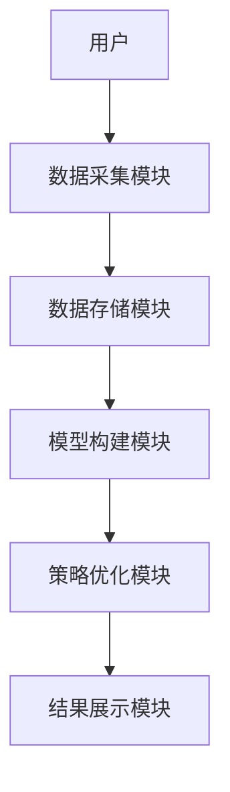
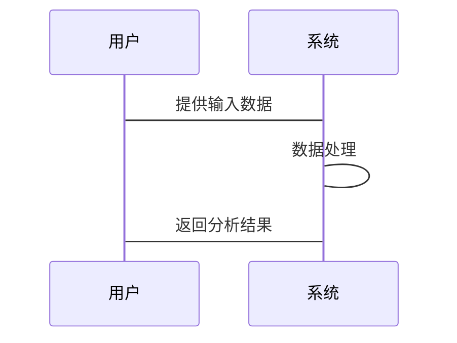

                 


# 彼得林奇的"长期持股"在不同税收环境下的策略

## 关键词：彼得林奇，长期持股，税收环境，投资策略，价值投资

## 摘要：本文探讨了彼得·林奇的长期持股策略在不同税收环境下的应用。通过分析美国、欧洲和亚洲市场的税收政策，结合数学模型和系统架构，阐述了税收对投资决策的影响，并提供实际案例和代码实现，为投资者提供优化策略的参考。

---

## 第1章：彼得林奇投资理念与长期持股策略

### 1.1 彼得林奇投资理念的核心要素

#### 1.1.1 价值投资的基本原则

彼得·林奇是价值投资的代表人物，他强调以合理价格投资于具有强大基本面的企业。他的投资理念基于以下原则：

- **长期视角**：投资不是短期交易，而是长期持有的过程。
- **基本面分析**：关注企业的财务状况、管理层能力和行业地位。
- **分散投资**：通过分散投资降低风险，避免过度集中。

#### 1.1.2 长期持股的核心理念

林奇认为，长期持股的核心在于**耐心**和**专注**。投资者应选择具有持续增长潜力的企业，长期持有，避免频繁交易带来的成本和风险。

#### 1.1.3 彼得林奇投资风格的形成背景

林奇的投资风格深受本杰明·格雷厄姆的影响，同时结合了成长股投资的特点。他通过长期持有优质股票，捕捉企业的成长价值，而非短期市场波动。

### 1.2 长期持股策略的定义与特点

#### 1.2.1 长期持股的定义

长期持股是指投资者买入股票后，持有数年甚至更长时间，以获得企业的成长收益，而非通过频繁交易获利。

#### 1.2.2 长期持股与短期投资的区别

| 特性 | 长期持股 | 短期投资 |
|------|----------|----------|
| 持股时间 | 数年或更长 | 数周或数月 |
| 投资目标 | 企业成长 | 市场波动 |
| 风险 | 较低 | 较高 |
| 成本 | 交易成本低 | 交易成本高 |

#### 1.2.3 彼得林奇策略的独特性

林奇的独特之处在于他结合了**价值投资**和**成长股投资**，即寻找具有低估价值且具备成长潜力的企业。

### 1.3 策略的边界与外延

#### 1.3.1 投资的边界条件

- **市场周期**：经济周期对投资策略有重大影响。
- **行业选择**：不同行业受税收政策影响不同。
- **个人风险承受能力**：影响投资期限和策略选择。

#### 1.3.2 策略的适用范围

- 适用于具有稳定增长潜力的企业。
- 适用于对市场波动不敏感的投资者。
- 适用于长期投资环境较为稳定的市场。

#### 1.3.3 策略的局限性与改进空间

- **市场波动**：短期波动可能影响长期收益。
- **税收政策变化**：税收政策的变化可能影响投资收益。
- **选股难度**：选择优质企业需要专业的分析能力。

---

## 第2章：税收环境对投资策略的影响

### 2.1 税收环境的定义与分类

#### 2.1.1 税收环境的定义

税收环境指不同国家或地区的税收政策对投资活动的影响，包括所得税、资本利得税、股息税等。

#### 2.1.2 不同国家的税收政策对比

| 国家 | 税率 | 税收特点 |
|------|------|----------|
| 美国 | 0%-20%（资本利得税） | 税收优惠政策多，对长期持股有利 |
| 欧洲 | 15%-30% | 税率较高，但部分国家有优惠 |
| 亚洲 | 0%-20% | 税收政策差异大，部分国家税率低 |

#### 2.1.3 税收环境对企业投资决策的影响

税收政策直接影响投资成本和收益，从而影响投资者的决策。例如，较低的资本利得税率会鼓励长期持股。

### 2.2 税收对长期持股策略的具体影响

#### 2.2.1 股息税与资本利得税的差异

- **股息税**：股息收入需缴纳所得税，税率高于资本利得税。
- **资本利得税**：资本利得税率低于股息税，鼓励长期持股。

#### 2.2.2 税收对投资收益的实际影响

例如，假设投资回报率为10%，税率分别为20%和15%，实际收益分别为8%和8.5%。

#### 2.2.3 税收政策的变化对投资策略的影响

税收政策的变化可能导致投资策略的调整，例如增加短期交易以规避高税率。

### 2.3 长期持股策略在不同税收环境下的应用

#### 2.3.1 美国市场中的长期持股策略

- **税收政策**：美国对长期资本利得税较低，鼓励长期持股。
- **策略应用**：选择低税率的州或行业，减少税收负担。

#### 2.3.2 欧洲市场中的长期持股策略

- **税收政策**：欧洲税率较高，但部分国家提供税收优惠。
- **策略应用**：利用税收抵免或优惠，降低整体税负。

#### 2.3.3 亚洲市场中的长期持股策略

- **税收政策**：亚洲税率差异大，部分国家税率低。
- **策略应用**：选择税率低的地区，优化投资组合。

---

## 第3章：数学模型与税收影响的定量分析

### 3.1 投资收益的数学模型

#### 3.1.1 税后收益的计算公式

假设投资回报率为r，税率为t，则税后收益为：

$$
\text{税后收益} = (1 - t) \times r
$$

#### 3.1.2 投资期限与收益的关系

长期投资的复利效应：

$$
\text{终值} = P \times (1 + r)^n
$$

其中，P为初始投资，n为投资期限。

#### 3.1.3 税率对收益的影响分析

税率t对投资收益的影响：

$$
\text{税后终值} = P \times (1 - t) \times (1 + r)^n
$$

### 3.2 税收对投资组合的影响

#### 3.2.1 投资组合的构建模型

构建投资组合时，需考虑税收对不同资产的影响。

#### 3.2.2 税收对投资组合风险的影响

税率的变化会影响投资组合的波动性。

#### 3.2.3 数学模型的实证分析

通过实证分析验证税收对投资收益的影响。

### 3.3 税收环境下的最优投资策略

#### 3.3.1 最优化模型的建立

建立数学模型，寻找最优投资组合。

#### 3.3.2 不同税率下的策略选择

通过比较不同税率下的收益，选择最优策略。

#### 3.3.3 税收对投资组合的影响的数学证明

通过数学公式证明税收对投资组合的影响。

---

## 第4章：系统分析与架构设计方案

### 4.1 投资策略分析系统的构建

#### 4.1.1 系统功能设计

- 数据采集：收集不同市场的税收政策和企业数据。
- 模型构建：建立数学模型，分析税收影响。
- 策略优化：根据分析结果，优化投资策略。

#### 4.1.2 系统架构设计

使用Mermaid图展示系统架构：



#### 4.1.3 系统接口设计

- 数据接口：与数据源对接，获取实时数据。
- 用户接口：展示分析结果，供用户决策。

#### 4.1.4 系统交互设计

使用Mermaid图展示系统交互流程：



---

## 第5章：项目实战

### 5.1 环境安装

安装必要的工具和库，例如Python、Pandas、Matplotlib等。

### 5.2 系统核心实现源代码

#### 5.2.1 数据采集与处理代码

```python
import pandas as pd

# 数据采集
data = pd.read_csv('tax_data.csv')
```

#### 5.2.2 模型构建与分析代码

```python
import numpy as np

def calculate_tax_impact(r, t):
    return (1 - t) * r

# 示例计算
r = 0.1  # 投资回报率
t = 0.2  # 税率
impact = calculate_tax_impact(r, t)
print(f"税后收益：{impact}")
```

### 5.3 案例分析

以美国和欧洲市场为例，分析税收政策对投资策略的影响。

### 5.4 项目总结

总结项目的实现过程，提出改进建议。

---

## 第6章：最佳实践与总结

### 6.1 最佳实践 tips

- 了解当地税收政策。
- 合理分散投资组合。
- 定期评估和调整策略。

### 6.2 小结

本文通过分析不同税收环境下的长期持股策略，结合数学模型和系统设计，为投资者提供了优化投资策略的参考。

### 6.3 注意事项

- 税收政策可能变化，需及时调整。
- 投资需结合市场环境和企业基本面。

### 6.4 拓展阅读

推荐阅读彼得·林奇的相关书籍，深入理解长期持股策略。

---

通过以上结构，文章详细探讨了彼得林奇的长期持股策略在不同税收环境下的应用，结合理论分析和实际案例，为投资者提供了实用的指导。

