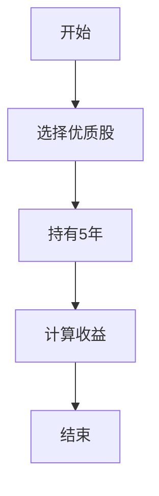
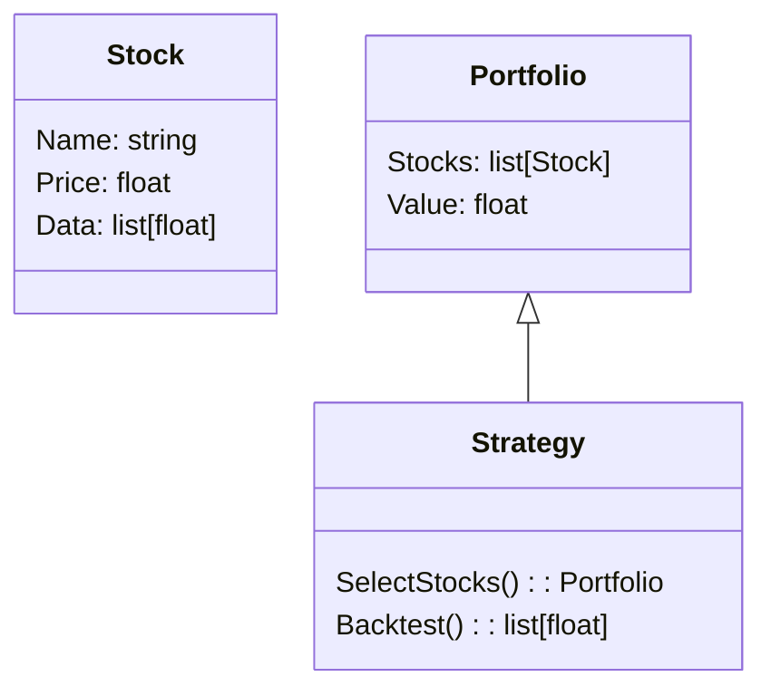
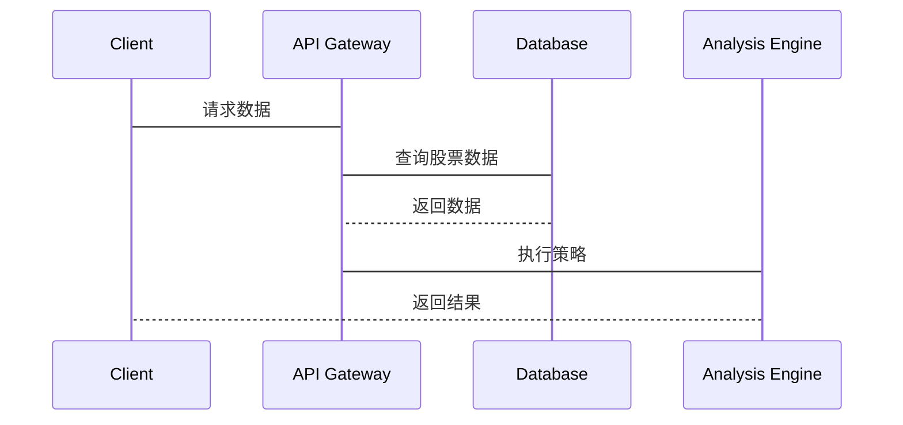

                 


# 彼得林奇的"长期持股"心理准备

> **关键词**：彼得林奇，长期持股，投资心理学，选股策略，风险管理，心理模型  
> **摘要**：本文深入分析彼得林奇的长期持股策略，探讨其背后的心理准备与投资哲学。通过构建心理模型、分析系统架构、模拟算法实现和案例分析，为投资者提供从理论到实践的全面指导。

---

## 第1章: 彼得林奇的长期持股投资哲学

### 1.1 彼得林奇的背景与投资理念

#### 1.1.1 彼得林奇的个人简介
彼得·林奇（Peter Lynch）是全球最著名的股票投资经理之一，曾管理富达麦哲伦基金，创造了辉煌的投资业绩。他的投资理念强调长期持有优质股票，注重公司基本面分析和管理层评估。

#### 1.1.2 彼得林奇的投资哲学与核心理念
林奇的核心理念是“长期持有优质股票”，他认为市场短期波动不可预测，但优质公司长期必涨。他的投资策略强调深入研究公司，寻找具有竞争优势、管理层优秀且估值合理的公司。

#### 1.1.3 长期持股在彼得林奇投资策略中的地位
长期持股是林奇策略的核心，他主张投资者应耐心持有优质股，避免频繁交易，以获得长期复利收益。

---

### 1.2 长期持股的核心概念与背景

#### 1.2.1 长期持股的定义与特征
长期持股是指投资者在较长的时间内持有股票，不因短期市场波动而改变投资策略。其特征包括：注重公司基本面、长期价值、低交易频率。

#### 1.2.2 长期持股与短期投资的对比分析
长期持股强调价值投资，注重公司长期发展；短期投资关注市场波动，追求短期收益。两者在风险承受、交易频率和投资目标上有显著差异。

#### 1.2.3 彼得林奇长期持股的背景与问题背景
20世纪80年代，美国股市经历了剧烈波动，林奇的长期持股策略在动荡中表现出色，证明了优质股长期持有的可行性。

---

## 第2章: 长期持股的心理准备与心态管理

### 2.1 投资者心态对长期持股的影响

#### 2.1.1 心理因素对投资决策的干扰
投资者的心理偏差，如贪婪和恐惧，常导致短期交易，破坏长期持股策略。心理因素影响判断，需加以管理。

#### 2.1.2 长期持股中的常见心理陷阱
常见陷阱包括过度关注短期波动、缺乏耐心、情绪化决策。这些陷阱使投资者偏离长期目标。

#### 2.1.3 如何克服短期波动的心理影响
投资者应通过知识学习、心理训练和模拟操作，培养抗压能力，避免短期波动干扰。

---

### 2.2 彼得林奇的决策框架与心理准备

#### 2.2.1 彼得林奇的选股标准与心理准备
林奇选股注重公司基本面、管理层、竞争优势。心理准备包括对公司长期价值的信心和对短期波动的容忍。

#### 2.2.2 长期持股中的耐心与信心管理
投资者需保持耐心，不因市场下跌而恐慌，对优质股保持信心，避免短期抛售。

#### 2.2.3 风险管理与心理压力应对
林奇强调分散投资、设定止损，有效管理心理压力，保持理性决策。

---

## 第3章: 彼得林奇的选股策略与长期持有

### 3.1 彼得林奇选股的核心要素

#### 3.1.1 公司基本面分析
林奇重视收入、利润、ROE等财务指标，选择基本面健康、增长稳定的公司。

#### 3.1.2 管理层素质评估
他强调管理层的诚信、能力和战略眼光，认为优秀管理层能带领公司持续增长。

#### 3.1.3 行业地位与竞争优势
林奇偏好行业龙头，具有强大竞争优势和定价能力的公司。

---

### 3.2 长期持股中的动态调整与心理准备

#### 3.2.1 长期持股中的定期评估
定期评估公司基本面变化，确保投资标的持续符合选股标准。

#### 3.2.2 个股与整体组合的动态平衡
根据市场变化和个人风险承受能力，动态调整投资组合，保持合理配置。

#### 3.2.3 风险管理与心理调适
通过分散投资、设定止损等方式控制风险，保持心理平衡。

---

## 第4章: 长期持股的心理模型与系统架构

### 4.1 投资者心理模型的构建

#### 4.1.1 心理模型的定义与作用
心理模型是投资者对市场的认知框架，影响投资决策。合理的心理模型帮助投资者保持理性。

#### 4.1.2 彼得林奇心理模型的构建步骤
林奇的心理模型包括：市场认知、选股标准、风险管理、耐心持有。

#### 4.1.3 心理模型与长期持股策略的结合
心理模型指导投资者在市场波动中坚持长期策略，避免短期干扰。

---

### 4.2 长期持股的心理系统架构

#### 4.2.1 系统架构的层次划分
包括输入层（市场信息）、处理层（心理评估）、输出层（投资决策）。

#### 4.2.2 系统各模块的交互关系
信息输入→心理评估→决策输出，模块间相互影响，形成闭环。

#### 4.2.3 系统架构对投资决策的影响
合理的系统架构帮助投资者保持理性，坚持长期策略。

---

## 第5章: 算法原理与数学模型

### 5.1 长期持股的算法模拟

#### 5.1.1 算法概述
模拟长期持有优质股的收益，通过历史数据验证策略的有效性。

#### 5.1.2 算法流程图


#### 5.1.3 代码实现
```python
import pandas as pd
import yfinance as yf

def backtest(stocks, start, end):
    returns = {}
    for stock in stocks:
        data = yf.download(stock, start, end)
        data['Return'] = data['Close'].pct_change()
        total_return = (data['Return'].sum() + 1) * 100
        returns[stock] = total_return
    return returns

stocks = ['AAPL', 'MSFT']
start = '2010-01-01'
end = '2015-01-01'
results = backtest(stocks, start, end)
print(results)
```

---

### 5.2 数学模型与公式

#### 5.2.1 复利公式
$$ \text{复利收益} = (1 + r)^n - 1 $$

#### 5.2.2 市盈率公式
$$ \text{市盈率} = \frac{\text{股价}}{\text{每股收益}} $$

---

## 第6章: 系统分析与架构设计

### 6.1 项目介绍与系统功能设计

#### 6.1.1 项目背景
开发一个长期持股模拟系统，帮助投资者评估长期策略的有效性。

#### 6.1.2 系统功能设计
包括数据采集、分析、模拟交易、结果展示。

#### 6.1.3 领域模型类图


---

### 6.2 系统架构设计

#### 6.2.1 系统架构图
```mermaid
graph LR
    Client --> API Gateway
    API Gateway --> Database
    Database --> Analysis Engine
    Analysis Engine --> Results
```

#### 6.2.2 系统接口设计
定义API接口，实现数据获取、策略执行、结果展示功能。

#### 6.2.3 系统交互序列图


---

## 第7章: 项目实战

### 7.1 环境安装与配置

#### 7.1.1 安装Python环境
安装Python和必要的库（pandas, yfinance）。

#### 7.1.2 安装开发工具
安装IDE（如PyCharm）和版本控制工具（如Git）。

---

### 7.2 核心实现与代码解读

#### 7.2.1 核心代码实现
实现股票数据下载、收益计算、结果展示功能。

#### 7.2.2 代码解读与分析
详细解释代码逻辑和功能模块，帮助读者理解实现过程。

---

### 7.3 案例分析与结果解读

#### 7.3.1 案例分析
模拟投资组合，选择几只股票，计算长期收益。

#### 7.3.2 结果解读
分析模拟结果，验证长期持股策略的有效性。

---

## 第8章: 最佳实践与注意事项

### 8.1 最佳实践 tips

#### 8.1.1 保持耐心，避免短期波动干扰。
#### 8.1.2 定期评估投资组合，动态调整。
#### 8.1.3 选择优质股，注重基本面分析。

### 8.2 小结

彼得林奇的长期持股策略强调耐心和对优质公司的信心，投资者需具备强大的心理素质和正确的选股标准。

### 8.3 注意事项

#### 8.3.1 风险管理
设定止损，分散投资，避免过度集中。

#### 8.3.2 心理调适
保持理性，避免情绪化决策，定期反思和调整。

---

## 第9章: 拓展阅读与深入思考

### 9.1 拓展阅读

#### 9.1.1 推荐书籍
- 《彼得·林奇的选股术》
- 《投资最重要的事情》

#### 9.1.2 相关文献
研究长期投资策略的心理学和行为学文献。

---

### 9.2 深入思考与总结

长期持股不仅是投资策略，更是一种心理修炼。投资者需在市场波动中保持冷静，坚持优质股的选择，最终实现长期稳健收益。

---

通过以上结构和内容，我们可以全面了解彼得林奇的长期持股心理准备，从理论到实践，为投资者提供系统的指导和启示。

