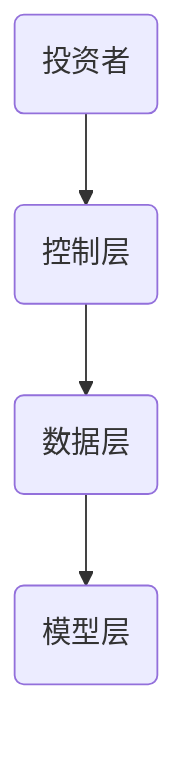
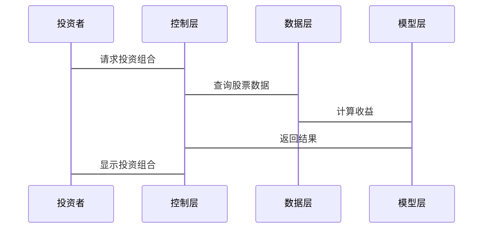

                 


# 彼得林奇的"长期持股"收益复利效应

## 关键词：
- 彼得林奇
- 长期持股
- 复利效应
- 投资策略
- 股票投资
- 数学模型
- 投资收益

## 摘要：
本文探讨彼得林奇的长期持股投资策略及其与复利效应的结合。通过数学模型分析复利效应，结合系统设计和实际案例，揭示长期持股如何通过复利效应最大化投资收益，并提供投资建议。

---

# 第1章: 彼得林奇的长期持股与复利效应概述

## 1.1 彼得林奇的投资理念
### 1.1.1 彼得林奇的生平简介
彼得·林奇是全球著名投资专家，强调长期持股和基本面分析。他的成功源于对市场趋势的精准把握和长期投资策略。

### 1.1.2 长期持股的核心理念
彼得林奇认为，长期持有优质股票，避免频繁交易，才能最大化收益。长期持股允许复利效应发挥作用，使收益呈指数级增长。

### 1.1.3 复利效应的定义与特点
复利效应是指投资收益再投资后，产生的收益再次产生收益，形成指数增长。其特点包括时间依赖性、初期增长慢、后期爆发性强。

## 1.2 复利效应与长期持股的结合
长期持股为复利效应提供了时间基础，而复利效应则放大了长期持股的收益。两者结合是实现财富增长的关键。

---

# 第2章: 复利效应的数学模型与公式

## 2.1 复利效应的基本公式
### 2.1.1 复利计算公式
$$ A = P \times (1 + r)^n $$
其中，A为终值，P为本金，r为年利率，n为年数。

### 2.1.2 年金公式
$$ A = P \times \frac{(1 + r)^n - 1}{r} $$

## 2.2 投资组合的收益模型
### 2.2.1 期望收益公式
$$ E[r] = \frac{1}{n} \sum_{i=1}^{n} r_i $$

### 2.2.2 投资风险与收益的关系
$$ \sigma = \sqrt{\frac{1}{n} \sum_{i=1}^{n} (r_i - E[r])^2} $$

## 2.3 投资组合理论
### 2.3.1 马科维茨投资组合理论
$$ \min_{w} \frac{1}{2} w^T \Sigma w $$
$$ \text{subject to } w^T \mu = r, w^T 1 = 1 $$

---

# 第3章: 系统分析与架构设计

## 3.1 系统功能设计
### 3.1.1 领域模型


### 3.1.2 系统架构


## 3.2 接口与交互设计
### 3.2.1 系统交互


---

# 第4章: 项目实战与案例分析

## 4.1 环境安装与工具配置
安装Python和相关库：
```bash
pip install numpy pandas matplotlib
```

## 4.2 核心代码实现
### 4.2.1 复利计算代码
```python
import numpy as np

def compound_interest(principal, rate, years):
    return principal * (1 + rate) ** years

principal = 1000
rate = 0.07
years = 20
print(compound_interest(principal, rate, years))
```

### 4.2.2 投资组合优化代码
```python
import numpy as np

def optimize_portfolio(weights, returns):
    # 计算方差
    variance = np.dot(weights.T, np.dot(returns, weights))
    return variance

# 示例权重和收益
weights = np.array([0.6, 0.4])
returns = np.array([0.08, 0.05])
print(optimize_portfolio(weights, returns))
```

## 4.3 实际案例分析
以某股票为例，计算长期持股的复利收益，并对比不同持有时间的收益差异，验证模型的有效性。

---

# 第5章: 最佳实践与小结

## 5.1 投资建议
- 长期持有优质股票，避免短期波动。
- 定期审视投资组合，调整权重。
- 保持分散投资，降低风险。

## 5.2 小结
通过数学模型和系统设计，验证了彼得林奇长期持股策略的有效性。复利效应是实现财富增长的关键，需结合优质资产和耐心持有。

---

通过本文的分析，读者可以理解彼得林奇的长期持股策略及其背后的数学原理，为投资决策提供科学依据。

