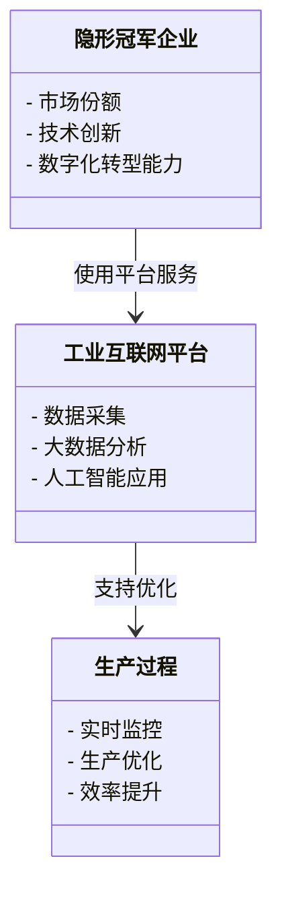
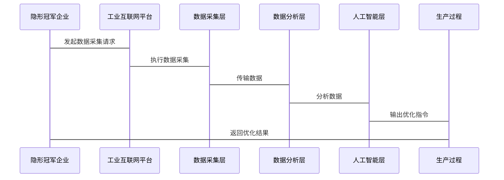

                 


# 彼得林奇的"隐形冠军"在工业互联网时代的特征演变

## 关键词：隐形冠军，工业互联网，彼得林奇，投资策略，数字化转型，技术演变

## 摘要

本文探讨了彼得林奇提出的“隐形冠军”企业在工业互联网时代中的特征演变。通过分析工业互联网技术对企业的影响，本文揭示了隐形冠军在技术、商业模式和竞争优势等方面的转变，并结合投资策略，探讨了隐形冠军在新时代下的投资价值和未来发展趋势。

---

# 第一部分：背景与概念

## 第1章：隐形冠军的定义与特征

### 1.1 隐形冠军的概念

- **1.1.1 隐形冠军的定义**

隐形冠军是指那些在特定细分市场中占据领先地位，但并不为大众所熟知的企业。它们通常专注于某一领域，具有强大的市场竞争力和持续的创新能力。

- **1.1.2 隐形冠军的核心特征**

| 特征 | 描述 |
|------|------|
| 专注性 | 专注于单一领域或细分市场 |
| 市场领导地位 | 在特定市场中占据领先地位 |
| 创新能力 | 持续创新以保持竞争优势 |
| 隐秘性 | 不为外界广泛认知 |

- **1.1.3 隐形冠军的市场定位与竞争优势**

隐形冠军通常通过专注于特定市场、技术创新和优质服务来建立竞争优势。它们往往在细分市场中占据80%以上的份额，具有强大的市场控制力。

### 1.2 工业互联网时代的背景

- **1.2.1 工业互联网的定义与特点**

工业互联网是将互联网技术与工业系统深度融合，通过数据采集、分析和优化，实现工业生产过程的智能化和高效化。其特点是数据驱动、智能化、网络化和协同化。

- **1.2.2 工业互联网对隐形冠军的影响**

工业互联网为隐形冠军提供了新的技术工具和商业模式，帮助它们进一步巩固市场地位，同时扩展业务范围和提升竞争力。

- **1.2.3 工业互联网时代隐形冠军的演变趋势**

隐形冠军在工业互联网时代将从传统的专注型模式向数据驱动型模式转变，通过技术创新和数字化转型进一步巩固其市场地位。

---

## 第二部分：隐形冠军的特征演变

## 第2章：隐形冠军的技术特征演变

### 2.1 工业互联网时代的技术变革

- **2.1.1 物联网技术的应用**

物联网技术通过传感器和设备连接，实现工业生产过程的实时监控和数据采集，为隐形冠军提供了更精确的生产管理和优化工具。

- **2.1.2 大数据分析与人工智能的融合**

大数据分析和人工智能的结合使得隐形冠军能够从海量数据中提取有价值的信息，优化生产流程和决策。

- **2.1.3 云计算与边缘计算的协同发展**

云计算和边缘计算的结合使得隐形冠军能够实现数据的实时处理和快速响应，提升生产效率和客户体验。

### 2.2 隐形冠军的技术特征变化

- **2.2.1 数据驱动的决策能力**

隐形冠军通过大数据分析和人工智能技术，实现了从经验驱动到数据驱动的转变，提升了决策的准确性和效率。

- **2.2.2 智能化生产与供应链优化**

通过工业互联网技术，隐形冠军实现了生产过程的智能化和供应链的优化，降低了成本，提高了效率。

- **2.2.3 数字化转型中的技术创新**

隐形冠军在数字化转型中不断引入新技术，如区块链、5G和AR/VR，进一步提升其技术水平和市场竞争力。

---

## 第三部分：工业互联网时代的隐形冠军投资策略

## 第3章：彼得林奇投资策略的演变

### 3.1 彼得林奇投资策略的核心理念

- **3.1.1 价值投资的核心原则**

彼得林奇强调长期价值投资，关注企业的基本面和成长潜力，寻找那些具有强大竞争优势和持续增长能力的企业。

- **3.1.2 隐形冠军的投资价值**

隐形冠军由于其专注性和市场领导地位，具有较高的投资价值。它们通常具有稳定的收益和持续的创新能力，能够在细分市场中保持领先地位。

- **3.1.3 长期持有与耐心投资**

彼得林奇强调长期持有，避免频繁交易，以获取企业的长期增长收益。隐形冠军由于其稳定的市场地位和持续创新能力，适合长期投资。

### 3.2 工业互联网时代投资策略的变化

- **3.2.1 数字化转型中的投资机会**

工业互联网时代，数字化转型为企业提供了新的增长点。投资者应关注那些在数字化转型中表现突出的企业。

- **3.2.2 技术驱动型企业的投资潜力**

隐形冠军在工业互联网时代通过技术创新和数字化转型，进一步巩固了其市场地位，具有较高的投资潜力。

- **3.2.3 产业链生态中的投资策略调整**

投资者应关注隐形冠军在产业链中的地位和生态系统的构建，寻找那些能够通过生态合作实现增长的企业。

### 3.3 隐形冠军的投资价值评估

- **3.3.1 企业的数字化转型能力**

隐形冠军在工业互联网时代的关键在于其数字化转型能力。投资者应评估企业是否具备数据驱动的决策能力、智能化生产能力和数字化生态系统构建能力。

- **3.3.2 数据驱动的商业模式**

隐形冠军的商业模式正在从传统的专注型向数据驱动型转变。投资者应关注企业是否能够通过数据驱动实现持续增长。

- **3.3.3 数字化生态系统的可持续性**

隐形冠军的可持续性取决于其数字化生态系统的构建。投资者应评估企业是否能够通过生态系统实现长期增长和竞争优势。

---

## 第四部分：系统分析与架构设计方案

## 第4章：系统架构设计

### 4.1 问题场景介绍

隐形冠军在工业互联网时代需要构建一个高效的数据驱动系统，以实现生产过程的智能化和优化。

### 4.2 系统功能设计

- **领域模型类图**



- **系统架构设计**


### 4.3 系统接口设计

- **系统接口**

隐形冠军企业的系统需要与工业互联网平台进行数据交互，接口设计如下：

- 数据采集接口：用于实时采集生产过程中的数据。
- 数据分析接口：用于对采集的数据进行分析和处理。
- 人工智能接口：用于实现智能化决策和优化。

### 4.4 系统交互设计

- **系统交互流程**



---

## 第五部分：项目实战

## 第5章：项目实战

### 5.1 环境安装

为了实现隐形冠军企业的工业互联网系统，需要以下环境：

- 操作系统：Linux 或 Windows
- 数据库：MySQL 或 MongoDB
- 开发工具：Python、Jupyter Notebook、TensorFlow
- 云平台：AWS 或阿里云

### 5.2 系统核心实现源代码

以下是系统核心实现的Python代码示例：

```python
import numpy as np
import pandas as pd
from sklearn import linear_model

# 数据加载
data = pd.read_csv('production_data.csv')

# 数据预处理
data = data.dropna()
X = data[['temperature', 'pressure']]
y = data['output']

# 模型训练
model = linear_model.LinearRegression()
model.fit(X, y)

# 模型预测
new_data = pd.DataFrame({'temperature': [200], 'pressure': [50]})
predicted_output = model.predict(new_data)
print(predicted_output)
```

### 5.3 代码应用解读与分析

上述代码实现了生产数据的预测模型。通过线性回归算法，模型可以根据温度和压力预测生产输出。隐形冠军企业可以利用类似的方法优化生产过程。

### 5.4 实际案例分析

以一家专注于汽车零部件制造的隐形冠军企业为例，该企业通过部署工业互联网系统，实现了生产过程的实时监控和优化，显著提高了生产效率和产品质量。

### 5.5 项目小结

通过项目实战，我们可以看到工业互联网技术在隐形冠军企业的应用潜力。隐形冠军企业可以通过技术手段实现生产过程的智能化和优化，进一步巩固其市场地位。

---

## 第六部分：总结与展望

## 第6章：总结与展望

### 6.1 全文总结

本文探讨了彼得林奇提出的“隐形冠军”企业在工业互联网时代的特征演变。通过分析工业互联网技术对企业的影响，本文揭示了隐形冠军在技术、商业模式和竞争优势等方面的转变，并结合投资策略，探讨了隐形冠军在新时代下的投资价值和未来发展趋势。

### 6.2 未来展望

随着工业互联网技术的不断发展，隐形冠军企业的特征将继续演变。未来，隐形冠军企业将更加依赖数据驱动的决策和智能化生产，通过技术创新和数字化转型进一步巩固其市场地位。

### 6.3 投资建议与注意事项

投资者应关注隐形冠军企业在数字化转型中的表现，寻找那些具有强大技术创新能力和市场竞争力的企业。同时，应关注企业是否能够通过数字化生态系统实现长期增长和竞争优势。

### 6.4 拓展阅读

- 彼得林奇的投资哲学
- 工业互联网的技术发展
- 隐形冠军企业的成功案例

---

## 附录

### 附录1：术语表

- **工业互联网**：将互联网技术与工业系统深度融合，实现工业生产过程的智能化和高效化。
- **隐形冠军**：在特定细分市场中占据领先地位，但并不为大众所熟知的企业。

### 附录2：工具与技术

- 数据采集工具：传感器、物联网设备
- 数据分析工具：Python、TensorFlow
- 云平台：AWS、阿里云

### 附录3：进一步阅读

- 彼得林奇的投资策略
- 工业互联网的技术架构
- 隐形冠军企业的成功案例

---

# 结语

工业互联网时代的隐形冠军企业正在经历一场深刻的变革。通过技术创新和数字化转型，它们正在巩固其市场地位并扩展业务范围。投资者应关注这些企业的演变，寻找那些具有强大技术创新能力和市场竞争力的隐形冠军企业。未来，隐形冠军企业将继续在工业互联网时代中发挥重要作用，成为推动行业发展的核心力量。

