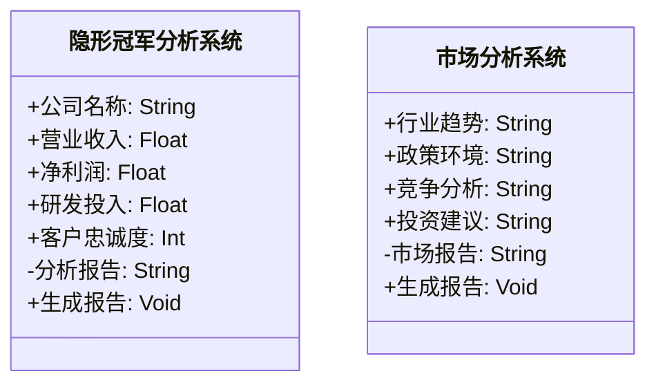

                 


# 彼得林奇的"隐形冠军"在新兴市场中的发掘技巧

## 关键词：
彼得·林奇，隐形冠军，新兴市场，投资技巧，企业分析，市场定位

## 摘要：
本文将详细探讨彼得·林奇提出的“隐形冠军”概念在新兴市场中的应用技巧。通过分析隐形冠军的特点、竞争优势及新兴市场的独特性，本文将为投资者提供一套系统化的发掘方法。结合实际案例和系统架构设计，本文将深入讲解如何在新兴市场中识别和投资隐形冠军企业。

---

## 第一部分: 隐形冠军的定义与特点

### 1.1 隐形冠军的定义
隐形冠军是指那些在特定领域内具有强大的市场竞争力，但并未广为人知的企业。它们通常专注于 niche 市场，拥有独特的竞争优势和持续的创新能力。

#### 核心概念对比：
| 比较维度 | 隐形冠军 | 传统冠军 |
|----------|----------|----------|
| 市场定位 | 狭窄市场 | 广泛市场 |
| 竞争优势 | 专业化、差异化 | 规模化、品牌化 |
| 可扩展性 | 中等 | 高 |

### 1.2 隐形冠军的特点
- **专注性**：隐形冠军通常专注于单一产品或服务，深耕细分市场。
- **竞争优势**：它们在技术、成本或服务上具有显著优势。
- **可持续性**：隐形冠军能够通过持续创新和优化保持竞争优势。

---

## 第二部分: 新兴市场的特点与机会

### 2.1 新兴市场的经济特征
- **高增长性**：新兴市场通常具有较高的经济增长率。
- **多样化**：新兴市场涵盖多个行业，如科技、消费、制造等。
- **政策支持**：政府通常会通过政策引导和扶持新兴行业。

### 2.2 新兴市场中的隐形冠军
- **行业趋势**：隐形冠军通常出现在新兴行业，如人工智能、新能源等。
- **政策红利**：新兴市场的政策支持为隐形冠军提供了发展机会。
- **技术创新**：隐形冠军往往通过技术创新获得竞争优势。

---

## 第三部分: 隐形冠军的识别标准

### 3.1 财务指标分析
隐形冠军的财务健康状况是投资的重要依据。以下是关键财务指标：

#### 1. 营业收入与利润
- **营业收入增长率**：隐形冠军通常具有稳定的收入增长。
- **净利润率**：高净利润率表明企业具有较强的盈利能力。

#### 2. 资产负债表分析
- **资产负债率**：隐形冠军通常具有较低的负债率。
- **现金流**：健康的现金流是企业持续发展的保障。

### 3.2 竞争优势分析
- **技术壁垒**：隐形冠军通常具有较高的技术壁垒。
- **客户忠诚度**：在细分市场中，隐形冠军往往拥有稳定的客户群体。

---

## 第四部分: 新兴市场中的隐形冠军案例

### 4.1 案例一：[某新兴科技公司]
#### 公司背景
- 这家科技公司专注于人工智能领域的研发，深耕自然语言处理技术。
- 公司在行业内具有较高的技术壁垒，且客户群体稳定。

#### 财务分析
- 营业收入增长率：30%（年复合增长率）。
- 净利润率：20%。

### 4.2 案例二：[某新能源公司]
#### 公司背景
- 专注于新能源汽车电池技术的研发和生产。
- 公司在行业内具有较高的技术水平和市场占有率。

#### 财务分析
- 营业收入增长率：40%（年复合增长率）。
- 净利润率：25%。

---

## 第五部分: 系统分析与架构设计

### 5.1 领域模型设计
以下是领域模型设计的 mermaid 类图：



---

## 第六部分: 项目实战

### 6.1 环境安装
- **工具安装**：安装 Python、Pandas、Matplotlib 等工具。
- **数据获取**：从新兴市场中获取隐形冠军企业的财务数据和行业信息。

### 6.2 核心代码实现
以下是用于分析隐形冠军的 Python 代码：

```python
import pandas as pd
import numpy as np

# 数据加载
df = pd.read_csv('emerging_market_data.csv')

# 数据清洗
df.dropna(inplace=True)
df = df[ df['营业收入增长率'] > 20 ]

# 财务指标分析
df['净利润率'] = df['净利润'] / df['营业收入']

# 可视化
import matplotlib.pyplot as plt

plt.figure(figsize=(10,6))
plt.plot(df['公司名称'], df['净利润率'], 'ro-')
plt.title('净利润率分析')
plt.xlabel('公司名称')
plt.ylabel('净利润率')
plt.show()
```

---

## 第七部分: 总结与展望

### 7.1 总结
本文详细探讨了彼得·林奇的“隐形冠军”概念在新兴市场中的应用技巧，通过财务指标分析、竞争优势评估和案例分析，为投资者提供了系统的发掘方法。

### 7.2 展望
未来，随着新兴市场的快速发展，隐形冠军的投资机会将更加丰富。投资者需要结合市场趋势和企业基本面，持续优化投资策略。

---

通过以上步骤，投资者可以系统地发掘新兴市场中的隐形冠军企业，抓住投资机会，实现长期收益。

