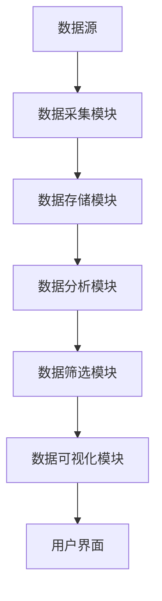

                 


# 彼得林奇的"高增长低估值"在不同市场环境下的筛选

> 关键词：彼得林奇，高增长低估值，投资策略，市场环境，股票筛选

> 摘要：本文深入探讨了彼得·林奇的高增长低估值投资策略在不同市场环境下的筛选方法。通过分析市场环境的变化，如牛市、熊市和震荡市，本文详细阐述了如何调整筛选标准以适应不同市场条件。文章结合理论与实践，提供了具体的筛选算法、系统架构设计和项目实战案例，帮助读者更好地理解和应用这一策略。

---

## 第1章：彼得·林奇投资理念概述

### 1.1 彼得·林奇的背景与投资风格
- **1.1.1 彼得·林奇的生平简介**  
  彼得·林奇（Peter Lynch）是美国著名的职业基金经理人，以其在富达麦哲伦基金（Fidelity Magellan Fund）的卓越表现而闻名。他强调长期投资和基本面分析，倡导寻找那些具有持续增长潜力且估值合理的公司。

- **1.1.2 林奇的投资哲学与核心理念**  
  林奇认为，成功的投资在于找到那些能够持续增长的企业，并在市场低估时买入。他的策略强调对企业基本面的深入研究，尤其是企业的收入和利润增长能力。

- **1.1.3 高增长低估值策略的起源与发展**  
  高增长低估值策略起源于对成长型企业的关注。林奇发现，许多高增长企业早期可能估值较低，但随着业绩的增长，其股价也会随之上升。

---

### 1.2 高增长低估值策略的核心概念
- **1.2.1 高增长的定义与衡量标准**  
  高增长通常指公司在过去几年中收入和净利润持续以较高速度增长。常见的衡量指标包括收入增长率（Revenue Growth Rate）和净利润增长率（Net Income Growth Rate）。

- **1.2.2 低估值的定义与衡量标准**  
  低估值意味着公司的股票价格相对于其内在价值被市场低估。常用的估值指标包括市盈率（P/E Ratio）、市净率（P/B Ratio）和企业价值与息税折旧及摊销前利润之比（EV/EBITDA）。

- **1.2.3 高增长与低估值的结合逻辑**  
  林奇认为，高增长企业如果估值合理或偏低，未来有更大的上涨空间。这种组合能够在市场上涨时提供超额收益，同时在市场下跌时具有一定的防御性。

---

## 第2章：高增长低估值策略的理论基础

### 2.1 高增长企业的识别标准
- **2.1.1 收入增长率的计算与分析**  
  收入增长率 = （本年收入 - 上年收入）/ 上年收入 × 100%  
  例如，某公司去年收入为1000万元，今年收入为1200万元，收入增长率为20%。

- **2.1.2 净利润增长率的计算与分析**  
  净利润增长率 = （本年净利润 - 上年净利润）/ 上年净利润 × 100%  
  净利润增长是企业盈利能力提升的体现，也是高增长的重要标志。

- **2.1.3 市场地位与竞争优势分析**  
  高增长企业通常具有较强的市场地位和竞争优势，能够在行业中持续扩大市场份额。

---

### 2.2 低估值股票的识别标准
- **2.2.1 市盈率（P/E）的计算与分析**  
  市盈率 = 股票价格 / 每股净利润（EPS）  
  低市盈率通常意味着股票价格相对便宜，但需结合行业和企业盈利情况综合判断。

- **2.2.2 市净率（P/B）的计算与分析**  
  市净率 = 股票价格 / 每股净资产（BPS）  
  低市净率表明公司资产价值被市场低估，尤其适用于金融和制造业等重资产行业。

- **2.2.3 其他估值指标（如EV/EBITDA）的分析**  
  EV/EBITDA = 企业价值（EV） / 息税折旧及摊销前利润（EBITDA）  
  该指标常用于评估企业整体估值，尤其适用于亏损或新成立的企业。

---

### 2.3 高增长与低估值的平衡点
- **2.3.1 高增长与低估值的动态关系**  
  高增长企业通常会伴随着估值的上升，但若增长潜力大，当前估值可能仍低于合理水平。

- **2.3.2 市场环境对平衡点的影响**  
  在牛市中，市场可能给予高增长企业更高的估值；而在熊市中，低估值企业可能更具吸引力。

- **2.3.3 投资者风险偏好与策略选择**  
  高风险偏好投资者可能更倾向于选择高增长高估值的股票，而保守投资者则更关注低估值企业。

---

## 第3章：高增长低估值策略在不同市场环境下的应用

### 3.1 牛市环境下的策略调整
- **3.1.1 牛市环境的特点与风险**  
  牛市中市场情绪高涨，股票估值普遍较高，但高增长企业仍可能获得资金青睐。

- **3.1.2 高增长低估值策略的优化**  
  在牛市中，可适当提高对市盈率的容忍度，但需确保企业的增长潜力和竞争优势。

- **3.1.3 典型案例分析**  
  例如，科技公司在牛市中可能估值较高，但若收入和利润持续高增长，仍可被视为高增长低估值标的。

---

### 3.2 熊市环境下的策略调整
- **3.2.1 熊市环境的特点与风险**  
  熊市中市场情绪低落，股票估值普遍下降，但部分高增长企业可能被市场错杀。

- **3.2.2 高增长低估值策略的防御性调整**  
  在熊市中，可优先选择那些收入和利润持续增长，且估值明显低于合理水平的企业。

- **3.2.3 典型案例分析**  
  例如，在2008年金融危机期间，一些优质的成长型企业因市场恐慌而被低估，为投资者提供了较好的买入机会。

---

### 3.3 震荡市环境下的策略调整
- **3.3.1 震荡市环境的特点与风险**  
  震荡市中市场波动较大，股票价格短期波动可能掩盖企业的长期价值。

- **3.3.2 高增长低估值策略的灵活性调整**  
  在震荡市中，投资者需更加关注企业的基本面，避免被短期市场波动影响判断。

- **3.3.3 典型案例分析**  
  例如，在2020年新冠疫情引发的市场震荡中，一些线上经济企业因需求激增而表现出高增长，但估值可能仍处于较低水平。

---

## 第4章：高增长低估值策略的核心概念与联系

### 4.1 高增长与低估值的核心概念
- **4.1.1 高增长企业的识别标准**  
  - 收入增长率 ≥ 20%  
  - 净利润增长率 ≥ 15%  
  - 市场地位稳固，竞争优势明显  

- **4.1.2 低估值股票的衡量标准**  
  - 市盈率 ≤ 行业平均值  
  - 市净率 ≤ 行业平均值  
  - EV/EBITDA ≤ 行业平均值  

---

### 4.2 核心概念的联系
- **4.2.1 高增长与低估值的动态关系**  
  高增长企业可能因市场忽视而估值较低，但随着业绩释放，估值会逐步上升。

- **4.2.2 市场环境对高增长低估值策略的影响**  
  不同市场环境下，高增长低估值策略的实现路径可能不同，但核心逻辑不变。

---

## 第5章：高增长低估值策略的算法原理

### 5.1 筛选算法的设计思路
- **5.1.1 算法目标**  
  通过量化指标筛选出高增长且估值合理的股票。

- **5.1.2 算法步骤**  
  1. 筛选出收入增长率和净利润增长率均高于行业平均水平的企业。  
  2. 计算这些企业的市盈率、市净率和EV/EBITDA等估值指标。  
  3. 比较估值指标与行业平均值，筛选出估值低于行业平均的高增长企业。

---

### 5.2 算法的数学模型
- **5.2.1 收入增长率计算**  
  $$ \text{收入增长率} = \frac{\text{本年收入} - \text{上年收入}}{\text{上年收入}} \times 100\% $$

- **5.2.2 净利润增长率计算**  
  $$ \text{净利润增长率} = \frac{\text{本年净利润} - \text{上年净利润}}{\text{上年净利润}} \times 100\% $$

- **5.2.3 市盈率计算**  
  $$ \text{市盈率} = \frac{\text{股票价格}}{\text{每股净利润}} $$

---

### 5.3 算法的实现代码
```python
import pandas as pd

# 假设df是包含股票数据的DataFrame，包含以下列：
# '收入增长率', '净利润增长率', '市盈率', '市净率', 'EV/EBITDA'

# 筛选条件：收入增长率 ≥ 20%，净利润增长率 ≥ 15%，市盈率 ≤ 行业平均值
# 假设行业平均市盈率为20
high_growth = df[df['收入增长率'] >= 20]
high_growth_profit = high_growth[high_growth['净利润增长率'] >= 15]
low_valuation = high_growth_profit[high_growth_profit['市盈率'] <= 20]

# 输出结果
print(low_valuation)
```

---

## 第6章：高增长低估值策略的系统架构设计

### 6.1 系统功能设计
- **6.1.1 数据采集模块**  
  从金融数据源获取股票的基本面数据，包括收入、利润和估值指标。

- **6.1.2 数据分析模块**  
  对数据进行清洗、计算和筛选，生成高增长低估值股票列表。

- **6.1.3 数据可视化模块**  
  将筛选结果以图表形式展示，便于投资者理解和决策。

---

### 6.2 系统架构图


---

### 6.3 接口设计与交互流程
- **6.3.1 数据接口设计**  
  使用API从金融数据供应商获取实时股票数据。

- **6.3.2 用户交互流程**  
  1. 用户输入筛选条件。  
  2. 系统根据条件筛选股票并生成报告。  
  3. 用户查看报告并做出投资决策。

---

## 第7章：高增长低估值策略的项目实战

### 7.1 环境安装与配置
- **7.1.1 安装Python环境**  
  使用Anaconda或Miniconda安装Python 3.8及以上版本。

- **7.1.2 安装所需库**  
  ```bash
  pip install pandas matplotlib requests
  ```

---

### 7.2 核心代码实现
```python
import pandas as pd
import requests

# 获取股票数据
def get_stock_data(ticker):
    url = f'https://api.example.com/stock/{ticker}'
    response = requests.get(url)
    return pd.DataFrame(response.json())

# 筛选高增长低估值股票
def screen_stocks(tickers):
    selected = []
    for ticker in tickers:
        data = get_stock_data(ticker)
        if data['收入增长率'].values[0] >= 20 and data['净利润增长率'].values[0] >= 15:
            if data['市盈率'].values[0] <= 20:
                selected.append(ticker)
    return selected

# 示例运行
tickers = ['AAPL', 'MSFT', 'GOOGL']
print(screen_stocks(tickers))
```

---

### 7.3 案例分析与解读
- **7.3.1 案例背景**  
  以科技行业为例，筛选收入和利润均持续高增长，且市盈率低于行业平均的股票。

- **7.3.2 实施步骤**  
  1. 收集目标行业股票的财务数据。  
  2. 计算各股票的收入增长率和净利润增长率。  
  3. 筛选出高增长且估值合理的股票。  

---

## 第8章：总结与展望

### 8.1 策略总结
- 彼得·林奇的高增长低估值策略强调对企业基本面的深入分析，尤其关注收入和利润的持续增长。
- 不同市场环境下，策略的实施需要灵活调整，但核心逻辑不变。

### 8.2 未来展望
- 随着技术进步，大数据和人工智能将为高增长低估值策略的实施提供更多支持。
- 投资者需持续关注市场变化，不断优化策略以应对新的挑战。

### 8.3 最佳实践 Tips
- 定期回顾和调整筛选标准，以适应市场变化。
- 结合技术分析和基本面分析，制定更加全面的投资策略。

---

## 结语
彼得·林奇的高增长低估值策略为投资者提供了一种有效的选股方法。通过本文的详细分析，读者可以更好地理解该策略的理论基础、算法原理和实际应用。未来，随着市场环境的变化和技术的进步，这一策略将继续为投资者提供宝贵的指导。

