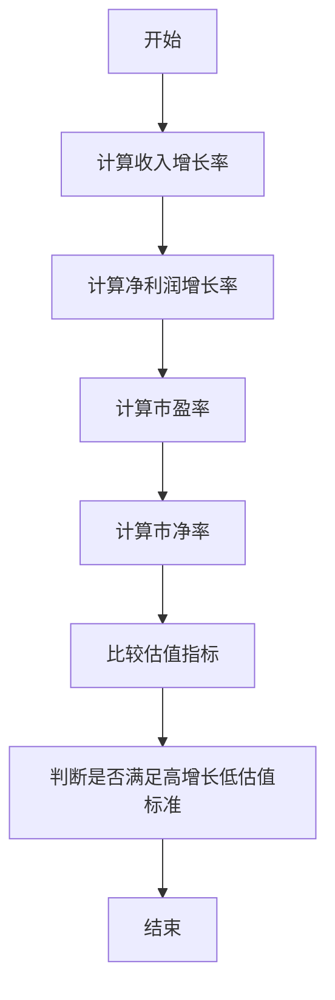
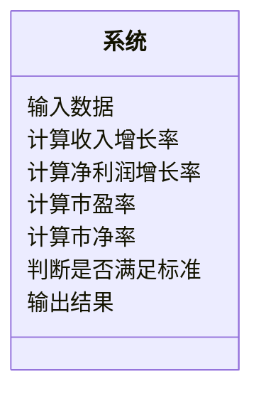
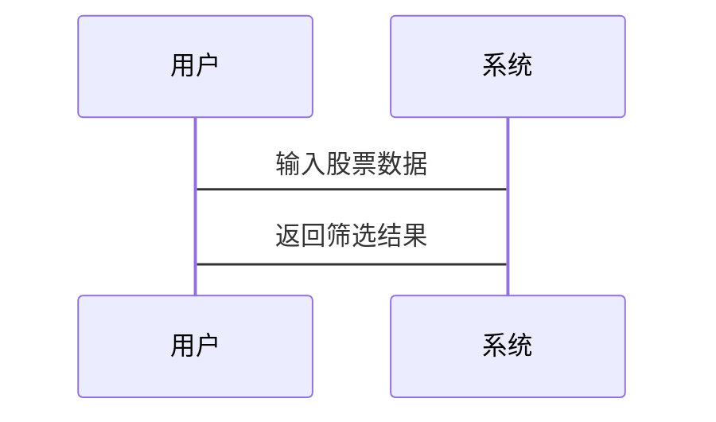

                 


# 彼得林奇的"高增长低估值"在新兴科技股中的筛选标准

## 关键词：彼得·林奇，高增长低估值，新兴科技股，投资策略，筛选标准

## 摘要：本文深入探讨了彼得·林奇的“高增长低估值”投资策略在新兴科技股中的应用。通过分析高增长与低估值的核心概念，结合数学模型和算法原理，本文提出了适用于科技股筛选的标准，并通过实际案例展示了如何在新兴科技股中识别出具有高增长潜力且估值合理的投资标的。

---

# 第一部分: 彼得·林奇的“高增长低估值”投资理念

## 第1章: 彼得·林奇与“高增长低估值”投资策略

### 1.1 彼得·林奇的背景与投资理念

彼得·林奇（Peter Lynch）是美国著名投资家，曾任富达麦哲伦基金的经理，以其卓越的投资业绩和独特的方法论闻名。他的投资理念强调长期增长潜力和合理估值，尤其是“高增长低估值”策略，成为其成功的关键之一。

#### 1.1.1 彼得·林奇的生平简介
彼得·林奇于1942年出生于美国波士顿，毕业于波士顿学院和宾夕法尼亚大学沃顿商学院。1971年，他加入富达投资，开始管理麦哲伦基金，创造了年均29%的回报率，成为投资界的传奇。

#### 1.1.2 彼得·林奇的投资哲学
林奇的投资哲学以“买 cheap, sell expensive”为核心，强调长期持有和深入研究。他认为，投资者应关注公司基本面，寻找那些未来几年内有高增长潜力且当前估值合理的企业。

#### 1.1.3 高增长低估值策略的核心思想
高增长低估值策略的核心在于寻找那些收入和利润增长迅速，但估值（如市盈率、市净率）相对较低的公司。这种策略在新兴科技股中尤其有效，因为科技行业的增长率通常较高，但估值波动较大。

### 1.2 高增长与低估值的定义与特征

#### 1.2.1 高增长公司的定义与特征
高增长公司通常具有较高的收入增长率和净利润增长率。以下是高增长公司的关键特征：

- **收入增长率**：过去几年收入持续增长，且未来几年有明确的增长预期。
- **净利润增长率**：净利润增长速度快于收入增长速度，显示公司盈利能力在提升。
- **行业地位**：公司在行业中具有领先地位，或有潜力在未来成为领导者。
- **创新能力强**：公司研发投入较高，产品更新迭代快，能够持续满足市场需求。

#### 1.2.2 低估值公司的定义与特征
低估值公司通常具有较低的市盈率（P/E）或市净率（P/B），相对于其资产或盈利水平来说，股价被低估。以下是低估值公司的关键特征：

- **市盈率低**：市盈率低于行业平均水平，表明股价相对于盈利水平较低。
- **市净率低**：市净率低于行业平均水平，表明股价相对于资产价值较低。
- **市场关注度低**：公司可能未被市场充分关注，导致股价被低估。
- **财务健康**：公司财务状况稳健，负债率低，现金流充足。

#### 1.2.3 高增长与低估值的对比分析

表1展示了高增长公司和低估值公司的主要区别：

| **特征** | **高增长公司** | **低估值公司** |
|----------|----------------|----------------|
| 收入增长率 | 高             | 无特别要求    |
| 净利润增长率 | 高             | 无特别要求    |
| 市盈率   | 高             | 低             |
| 市净率   | 中等           | 低             |
| 风险     | 高             | 中等           |

图1展示了高增长公司与低估值公司在市场中的位置：


---

## 第2章: 新兴科技股的定义与特点

### 2.1 新兴科技股的定义

#### 2.1.1 新兴科技股的行业界定
新兴科技股主要指那些在科技行业新兴领域（如人工智能、区块链、云计算、大数据等）的公司。这些公司通常处于成长期，市场潜力大，但尚未达到成熟阶段。

#### 2.1.2 新兴科技股的市场特征
新兴科技股具有高增长潜力，但市场波动较大，风险较高。这类股票通常集中在创业板或新兴市场，投资者需要具备较高的风险承受能力。

#### 2.1.3 新兴科技股的投资风险
新兴科技股的风险主要体现在市场波动、技术不确定性、竞争激烈以及政策变化等方面。投资者需要充分评估这些风险。

### 2.2 新兴科技股的核心驱动因素

#### 2.2.1 技术创新的核心作用
技术创新是新兴科技股增长的核心驱动力。公司通过不断推出新产品或技术升级，保持竞争优势，推动收入增长。

#### 2.2.2 市场需求的增长潜力
新兴科技行业往往伴随着巨大的市场需求，如人工智能、5G技术等领域的需求增长，为公司提供了广阔的增长空间。

#### 2.2.3 竞争格局的动态变化
新兴科技行业的竞争格局变化快，公司需要不断创新和调整战略，以应对竞争压力。

### 2.3 新兴科技股的估值方法

#### 2.3.1 市盈率法
市盈率法（P/E Ratio）是衡量股票估值的重要指标，公式为：

$$
市盈率 = \frac{股价}{每股净利润}
$$

#### 2.3.2 市净率法
市净率法（P/B Ratio）是另一种常用的估值方法，公式为：

$$
市净率 = \frac{股价}{每股净资产}
$$

#### 2.3.3 现金流折现法
现金流折现法（DCF）通过将未来现金流折现，评估公司当前的合理估值。

---

## 第3章: 高增长低估值策略在新兴科技股中的应用

### 3.1 高增长低估值策略的核心逻辑

#### 3.1.1 高增长公司的识别标准
高增长公司的识别标准包括：

- 收入增长率：过去三年收入年均增长率超过行业平均水平。
- 净利润增长率：过去三年净利润年均增长率超过行业平均水平。
- 市场份额：公司在目标市场中占据领先地位或有潜力成为领导者。

#### 3.1.2 低估值公司的识别标准
低估值公司的识别标准包括：

- 市盈率低于行业平均水平。
- 市净率低于行业平均水平。
- 股价与账面价值比（P/B）低于行业平均水平。

#### 3.1.3 高增长与低估值的平衡点
高增长与低估值的平衡点在于找到那些增长潜力大，但估值相对较低的公司。这种平衡可以通过以下方式实现：

1. 优先选择收入和利润均高速增长的公司。
2. 确保公司的估值指标（P/E、P/B）低于行业平均水平。
3. 考虑公司的未来增长潜力，而不仅仅是当前的财务指标。

### 3.2 新兴科技股的筛选标准

#### 3.2.1 收入增长率
收入增长率是衡量公司增长潜力的重要指标。公式为：

$$
收入增长率 = \frac{今年收入 - 去年收入}{去年收入} \times 100\%
$$

#### 3.2.2 净利润增长率
净利润增长率是衡量公司盈利能力的重要指标。公式为：

$$
净利润增长率 = \frac{今年净利润 - 去年净利润}{去年净利润} \times 100\%
$$

#### 3.2.3 市盈率与市净率的对比
市盈率与市净率的对比可以帮助投资者更好地评估公司的估值水平。例如，如果一家公司的市盈率为20，市净率为2，而行业平均水平为25和3，则该公司的估值相对较低。

#### 3.2.4 未来增长潜力的评估
未来增长潜力的评估需要结合行业趋势、公司战略和管理层能力等因素。例如，如果一家公司处于人工智能行业，且管理层有丰富的行业经验，未来增长潜力较大。

### 3.3 高增长低估值策略的风险与挑战

#### 3.3.1 市场波动的风险
新兴科技股的市场波动较大，投资者可能面临短期股价波动的风险。

#### 3.3.2 估值偏差的可能性
由于市场波动和公司业绩变化，估值指标可能偏离实际值，导致投资决策失误。

#### 3.3.3 高增长公司的可持续性问题
高增长公司可能面临增长不可持续的风险，例如市场需求饱和或竞争加剧可能导致增长率下降。

---

## 第4章: 高增长低估值策略的数学模型与算法原理

### 4.1 高增长低估值策略的数学模型

#### 4.1.1 收入增长率的计算公式
收入增长率的计算公式为：

$$
收入增长率 = \frac{今年收入 - 去年收入}{去年收入} \times 100\%
$$

#### 4.1.2 净利润增长率的计算公式
净利润增长率的计算公式为：

$$
净利润增长率 = \frac{今年净利润 - 去年净利润}{去年净利润} \times 100\%
$$

#### 4.1.3 市盈率与市净率的计算公式
市盈率的计算公式为：

$$
市盈率 = \frac{股价}{每股净利润}
$$

市净率的计算公式为：

$$
市净率 = \frac{股价}{每股净资产}
$$

#### 4.1.4 增长潜力的评估模型
增长潜力的评估模型可以通过将收入增长率、净利润增长率和行业趋势等因素综合考虑。

### 4.2 算法原理

图2展示了高增长低估值策略的算法流程：



---

## 第5章: 系统分析与架构设计方案

### 5.1 系统功能设计

图3展示了高增长低估值筛选系统的功能模块：



### 5.2 系统架构设计

图4展示了高增长低估值筛选系统的架构：

```mermaid
rectangle 数据层 {
    数据库
}
rectangle 业务逻辑层 {
    收入增长率计算
    净利润增长率计算
    市盈率计算
    市净率计算
}
rectangle 表现层 {
    输入界面
    输出界面
}
```

### 5.3 系统接口设计

系统接口设计包括数据输入接口和结果输出接口。数据输入接口接收股票的基本数据，结果输出接口返回筛选结果。

### 5.4 系统交互设计

图5展示了系统的交互流程：



---

## 第6章: 项目实战

### 6.1 环境安装

投资者需要安装以下工具：

- Python编程语言
- 数据分析库（如Pandas、NumPy）
- 数据可视化库（如Matplotlib）
- 数据获取工具（如Yahoo Finance API）

### 6.2 系统核心实现源代码

以下是Python代码示例：

```python
import pandas as pd
import numpy as np

# 获取股票数据
data = pd.read_csv('股票数据.csv')

# 计算收入增长率
data['收入增长率'] = (data['今年收入'] - data['去年收入']) / data['去年收入'] * 100

# 计算净利润增长率
data['净利润增长率'] = (data['今年净利润'] - data['去年净利润']) / data['去年净利润'] * 100

# 计算市盈率
data['市盈率'] = data['股价'] / data['每股净利润']

# 计算市净率
data['市净率'] = data['股价'] / data['每股净资产']

# 筛选高增长低估值股票
筛选结果 = data[(data['收入增长率'] > 行业平均水平) & (data['市盈率'] < 行业平均水平)]
```

### 6.3 代码应用解读与分析

上述代码通过读取股票数据，计算收入增长率、净利润增长率、市盈率和市净率，然后筛选出符合高增长低估值标准的股票。

### 6.4 实际案例分析

以人工智能行业为例，假设行业平均水平的市盈率为25，市净率为3。通过上述代码，我们可以筛选出收入增长率超过行业平均水平且市盈率和市净率低于行业平均水平的公司。

### 6.5 项目小结

通过实际案例分析，我们验证了高增长低估值策略的有效性。投资者可以根据具体行业和市场环境，调整筛选标准，以实现最佳投资效果。

---

## 第7章: 最佳实践

### 7.1 小结

本文详细探讨了彼得·林奇的高增长低估值策略在新兴科技股中的应用，提出了具体的筛选标准和数学模型，并通过实际案例进行了验证。

### 7.2 注意事项

投资者在应用高增长低估值策略时，需要注意以下几点：

- 市场波动风险：新兴科技股的市场波动较大，投资者需做好风险管理工作。
- 估值偏差：估值指标可能会因市场变化而偏离实际，投资者需持续监控。
- 竞争风险：新兴科技行业的竞争激烈，投资者需关注公司的竞争优势。

### 7.3 拓展阅读

以下书籍和文章可供进一步阅读：

- 《彼得·林奇的成功投资法则》
- 《价值投资：从理念到实践》
- 《新兴科技行业的投资机会与挑战》

---

# 结语

通过本文的分析，投资者可以更好地理解高增长低估值策略在新兴科技股中的应用，并能够在实际投资中灵活运用这些筛选标准，找到具有高增长潜力且估值合理的投资标的。

