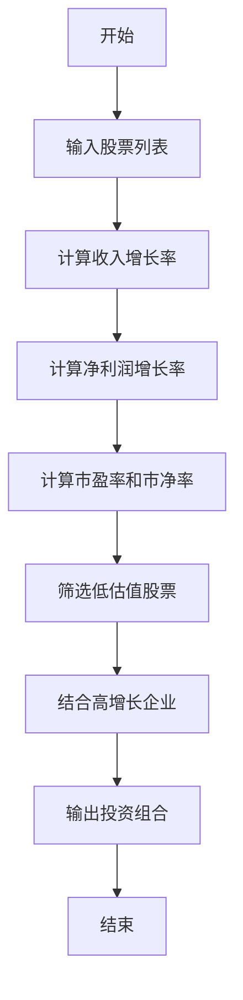
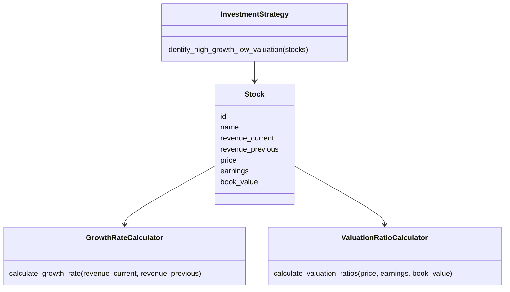
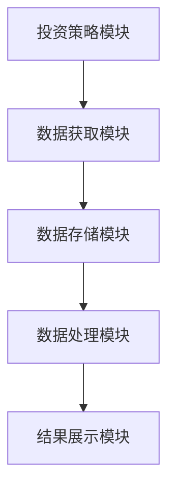

                 


# 彼得林奇的"高增长低估值"案例分析

## 关键词：彼得林奇、高增长低估值、投资策略、股票分析、案例研究

## 摘要：本文分析了彼得林奇的“高增长低估值”投资策略，探讨了该策略的核心概念、算法原理、系统设计以及实际案例。通过详细的技术分析和案例解读，揭示了该策略的有效性和实际应用中的注意事项。

---

## 第1章：彼得林奇投资哲学概述

### 1.1 彼得林奇的生平与投资成就
彼得·林奇是美国著名投资经理，以其在富达投资管理公司管理麦哲伦基金期间的卓越表现闻名。他通过深入研究和挑选高增长低估值的公司，实现了基金的长期优异回报。

### 1.2 "高增长低估值"策略的定义与特点
该策略关注两类公司：高增长企业（收入和利润快速增长）和低估值股票（市盈率、市净率低于行业平均水平）。通过结合两者，寻找被市场低估的潜力股。

---

## 第2章：高增长低估值策略的背景与问题背景

### 2.1 高增长低估值企业的背景介绍
高增长企业通常处于成长期，具备强劲的收入增长能力。低估值股票可能因市场误解或经济周期波动而被低估。

### 2.2 高增长低估值策略的核心问题描述
识别高增长企业与低估值股票的矛盾在于，高增长企业可能估值偏高，而低估值股票可能增长潜力有限。

### 2.3 高增长低估值策略的解决思路
通过基本面分析识别高增长企业，运用估值指标筛选低估值股票，结合行业趋势和市场环境进行综合判断。

---

## 第3章：高增长低估值策略的核心概念与联系

### 3.1 高增长与低估值的核心概念原理
高增长企业具有强劲的收入和利润增长，而低估值股票则价格相对市场平均水平低。

### 3.2 高增长与低估值的核心概念属性特征对比
| 特性       | 高增长企业         | 低估值股票         |
|------------|--------------------|--------------------|
| 收入增长    | 高                 | -                  |
| 利润增长    | 高                 | -                  |
| 市盈率      | 通常较高           | 低于行业平均        |
| 市净率      | 通常较高           | 低于行业平均        |

### 3.3 高增长低估值策略的ER实体关系图
```mermaid
erDiagram
    company {
        id
        name
        industry
        revenue
        growth_rate
        market_cap
        pe_ratio
        pb_ratio
    }
    company_note
    {
        id
        content
        date
        analyst
    }
    company -->
    company_note
```

---

## 第4章：高增长低估值策略的算法原理

### 4.1 高增长低估值策略的算法流程图


### 4.2 算法的数学模型与公式
高增长企业的筛选标准：
$$ \text{收入增长率} = \frac{\text{当年收入} - \text{上年收入}}{\text{上年收入}} \times 100\% $$
低估值股票的筛选标准：
$$ \text{市盈率} = \frac{\text{股价}}{\text{每股收益}} $$

### 4.3 算法实现的Python代码
```python
import pandas as pd

def calculate_growth_rate(revenue_current, revenue_previous):
    return ((revenue_current - revenue_previous) / revenue_previous) * 100

def calculate_valuation_ratios(price, earnings, book_value):
    pe_ratio = price / earnings
    pb_ratio = price / book_value
    return pe_ratio, pb_ratio

def identify_high_growth_low_valuation(stocks):
    high_growth = []
    low_valuation = []
    for stock in stocks:
        gr = calculate_growth_rate(stock.revenue_current, stock.revenue_previous)
        pe, pb = calculate_valuation_ratios(stock.price, stock.earnings, stock.book_value)
        if gr > 20:
            high_growth.append(stock)
        if pe < 15 and pb < 1.5:
            low_valuation.append(stock)
    return high_growth, low_valuation

# 示例数据
class Stock:
    def __init__(self, name, revenue_current, revenue_previous, price, earnings, book_value):
        self.name = name
        self.revenue_current = revenue_current
        self.revenue_previous = revenue_previous
        self.price = price
        self.earnings = earnings
        self.book_value = book_value

stocks = [
    Stock("公司A", 100, 80, 20, 5, 10),
    Stock("公司B", 150, 120, 30, 6, 15),
    Stock("公司C", 90, 90, 18, 4, 8)
]

high_growth, low_valuation = identify_high_growth_low_valuation(stocks)
print("高增长公司:", [s.name for s in high_growth])
print("低估值公司:", [s.name for s in low_valuation])
```

---

## 第5章：高增长低估值策略的系统分析与架构设计

### 5.1 系统设计背景与目标
构建一个投资分析系统，用于识别高增长低估值企业。

### 5.2 系统功能设计


### 5.3 系统架构设计


---

## 第6章：高增长低估值策略的项目实战

### 6.1 环境安装与数据准备
安装必要的Python库，如pandas、numpy，并收集相关股票数据。

### 6.2 核心实现源代码
如上文中的Python代码，展示如何筛选高增长低估值企业。

### 6.3 案例分析
以苹果和微软为例，分析其是否符合高增长低估值标准。

### 6.4 总结与经验
强调长期投资的重要性，定期调整投资组合，避免短期波动影响。

---

## 第7章：总结与展望

### 7.1 总结
彼得林奇的高增长低估值策略通过深入分析企业基本面和市场估值，帮助投资者发现价值。

### 7.2 展望
随着市场变化，该策略需结合新技术和数据分析工具不断优化。

---

## 附录

### 附录A：术语表
- 高增长企业：收入和利润持续增长的企业。
- 低估值股票：市盈率和市净率低于行业平均水平的股票。

### 附录B：数据来源
包括股票数据来源和工具推荐。

### 附录C：参考文献
列出相关书籍和文献。

---

通过以上结构，文章详细分析了彼得林奇的高增长低估值策略，从理论到实践，结合技术分析和实际案例，为读者提供了全面的见解。

