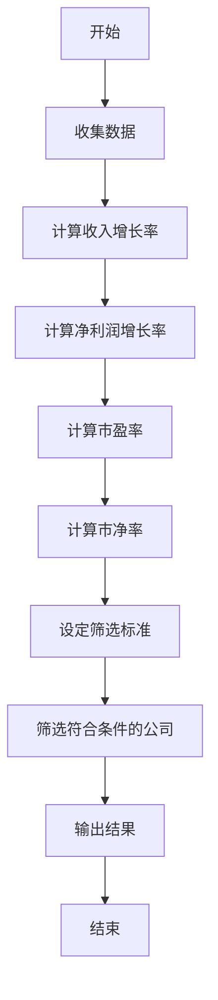
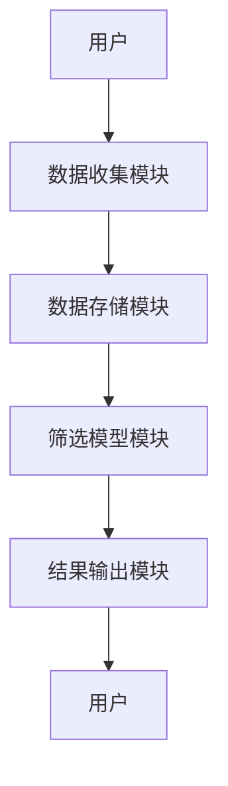

                 


# 彼得林奇的"高增长低估值"筛选技巧

## 关键词：高增长、低估值、彼得林奇、股票筛选、投资策略、基本面分析、相对估值

## 摘要：
本文详细探讨了彼得·林奇的“高增长低估值”股票筛选技巧，通过理论分析、数学建模和实际案例，系统地介绍了如何识别具有高增长潜力但市场估值较低的公司。文章首先阐述了高增长和低估值的定义与特征，接着分析了两者之间的内在联系，提出了具体的筛选标准和流程。随后，构建了一个完整的股票筛选系统，包括数据收集、筛选模型和结果输出模块。最后，通过Python代码实现了一个筛选模型，并结合实际案例进行了详细分析，总结了筛选技巧的应用注意事项和未来研究方向。

---

## 第1章：彼得林奇与高增长低估值投资理念

### 1.1 彼得林奇的背景与投资风格
彼得·林奇是美国著名的投资家，曾任富达麦哲伦基金的经理，创造了该基金13年平均年收益率29%的神话。他主张长期投资，注重企业基本面，尤其是高增长企业的挖掘。他的投资理念强调通过深入研究企业基本面，寻找那些增长速度快、估值合理的公司。

### 1.2 高增长低估值投资的背景与意义
高增长企业通常指的是那些收入和利润快速增长的公司，而低估值股票则是指市场价格低于其内在价值的股票。两者的结合意味着投资者可以以较低的价格买入具有高速增长潜力的企业，从而在长期获得超额收益。

### 1.3 本书的核心内容与目标
本书的核心内容在于系统地介绍彼得林奇的“高增长低估值”筛选技巧，包括理论分析、数学建模、系统设计和实战案例。目标是帮助读者掌握这一筛选方法，并能够在实际投资中灵活运用。

---

## 第2章：高增长低估值的核心概念与联系

### 2.1 高增长企业的定义与特征
高增长企业通常具有以下特征：
- **收入增长率高**：过去3-5年的收入增长率超过行业平均水平。
- **净利润增长稳定**：净利润增长率与收入增长率相匹配。
- **行业地位突出**：行业领先或具有竞争优势。
- **管理团队优秀**：管理层经验丰富且稳定。

### 2.2 低估值股票的定义与特征
低估值股票通常具有以下特征：
- **市盈率（P/E）低**：市盈率低于行业平均水平或历史平均水平。
- **市净率（P/B）低**：市净率低于行业平均水平。
- **股息率高**：股息率较高，且股息支付稳定。

### 2.3 高增长与低估值的内在联系
高增长企业为何会出现低估值？原因可能包括市场对公司未来增长潜力的忽视，或者市场对公司增长能力的质疑。低估值股票为何具有高增长潜力？因为市场尚未充分认识到其增长能力，或者公司未来有更大的增长空间。

---

## 第3章：高增长低估值筛选技巧的数学模型与算法原理

### 3.1 高增长低估值筛选模型的构建
高增长低估值筛选模型可以分为以下几个步骤：
1. **数据收集**：收集目标公司的财务数据，包括收入、利润、市盈率、市净率等。
2. **基本面分析**：计算公司的收入增长率、净利润增长率等指标。
3. **相对估值法**：计算市盈率、市净率等指标，与行业平均水平进行比较。
4. **筛选标准**：设定高增长和低估值的具体标准，筛选符合条件的公司。

### 3.2 高增长低估值筛选模型的数学公式
#### 3.2.1 收入增长率公式
$$ \text{收入增长率} = \frac{\text{当年收入} - \text{上年收入}}{\text{上年收入}} \times 100\% $$

#### 3.2.2 净利润增长率公式
$$ \text{净利润增长率} = \frac{\text{当年净利润} - \text{上年净利润}}{\text{上年净利润}} \times 100\% $$

#### 3.2.3 市盈率公式
$$ \text{市盈率} = \frac{\text{股价}}{\text{每股净利润}} $$

#### 3.2.4 市净率公式
$$ \text{市净率} = \frac{\text{股价}}{\text{每股净资产}} $$

### 3.3 高增长低估值筛选模型的流程图


---

## 第4章：高增长低估值筛选技巧的系统分析与架构设计

### 4.1 系统功能设计
高增长低估值筛选系统需要实现以下功能：
- 数据收集模块：收集目标公司的财务数据。
- 筛选模型模块：根据筛选标准，筛选出符合条件的公司。
- 结果输出模块：输出筛选结果，并提供可视化展示。

### 4.2 系统架构设计


---

## 第5章：高增长低估值筛选技巧的项目实战

### 5.1 环境安装
需要安装Python和相关库（如Pandas、NumPy、Matplotlib）。

### 5.2 核心实现代码
```python
import pandas as pd
import numpy as np

def calculate_growth_rate(revenue, years):
    growth_rates = []
    for i in range(1, years):
        gr = (revenue[i] - revenue[i-1]) / revenue[i-1] * 100
        growth_rates.append(gr)
    return np.mean(growth_rates)

def calculate_pe_ratio(price, eps):
    return price / eps

# 示例数据
data = {
    '收入': [100, 120, 150, 180, 200],
    '净利润': [20, 25, 30, 35, 40],
    '股价': [10, 15, 20, 25, 30],
    '每股净利润': [2, 2.5, 3, 3.5, 4]
}

df = pd.DataFrame(data)

# 计算收入增长率
revenue_growth = calculate_growth_rate(df['收入'], len(df))
# 计算净利润增长率
net_profit_growth = calculate_growth_rate(df['净利润'], len(df))
# 计算市盈率
pe_ratio = calculate_pe_ratio(df['股价'][0], df['每股净利润'][0])

print(f"收入增长率：{revenue_growth}%")
print(f"净利润增长率：{net_profit_growth}%")
print(f"市盈率：{pe_ratio}")
```

### 5.3 案例分析
以某公司为例，通过代码计算其收入增长率、净利润增长率和市盈率，判断其是否符合高增长低估值的标准。

---

## 第6章：总结与展望

### 6.1 总结
彼得林奇的“高增长低估值”筛选技巧是一种有效的投资策略，通过结合企业的基本面和市场估值，筛选出具有高增长潜力但估值合理的公司。

### 6.2 注意事项
- 数据来源的可靠性。
- 模型的适用性和局限性。
- 市场环境的变化对筛选结果的影响。

### 6.3 未来研究方向
- 结合人工智能技术，优化筛选模型。
- 研究不同市场环境下的筛选策略。
- 探讨高增长低估值策略在不同类型企业中的应用。

---

## 第7章：最佳实践 tips

### 7.1 选择优质企业
在筛选过程中，除了关注财务指标，还要关注企业的行业地位、管理团队等因素。

### 7.2 长期投资
高增长低估值策略适合长期投资，避免短期市场波动的影响。

### 7.3 定期调整
定期审视筛选结果，根据市场变化和企业基本面的变化进行调整。

---

通过以上内容，您可以系统地掌握彼得林奇的“高增长低估值”筛选技巧，并将其应用于实际投资中。

