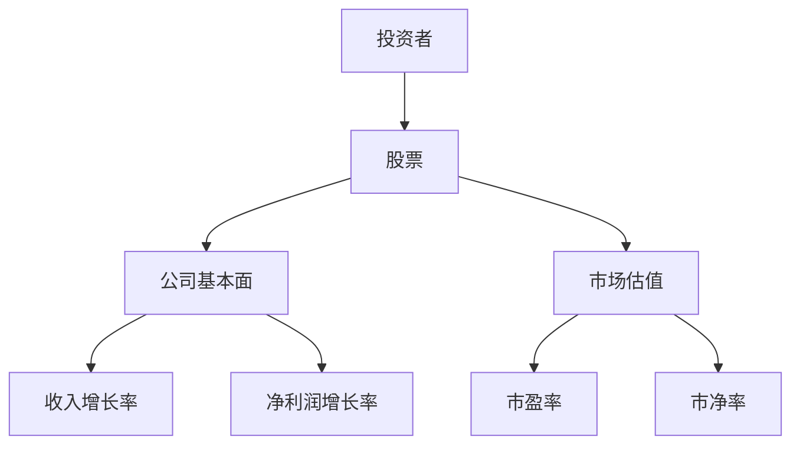
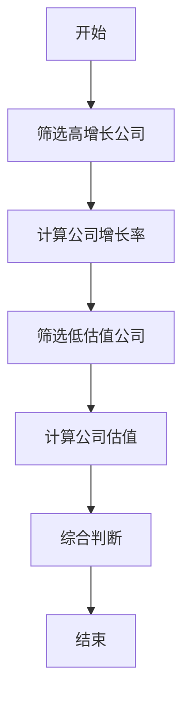
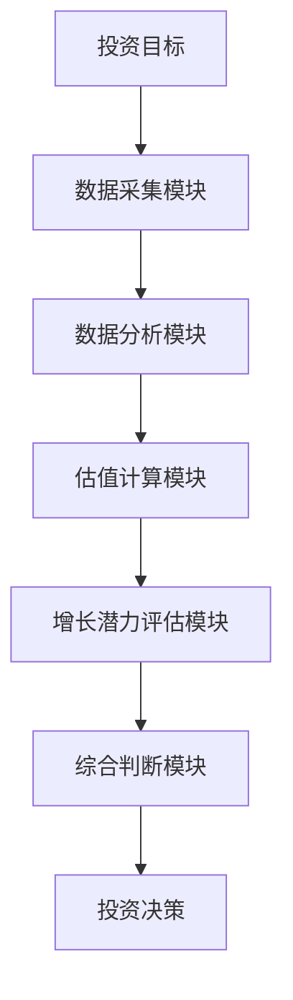
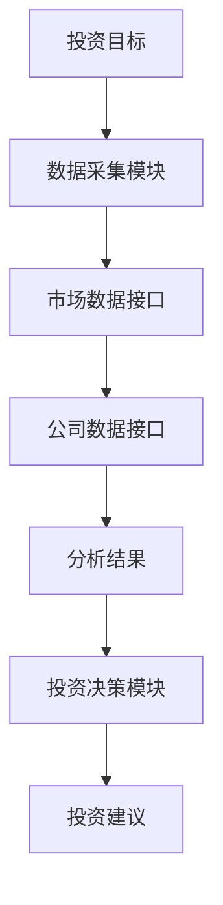
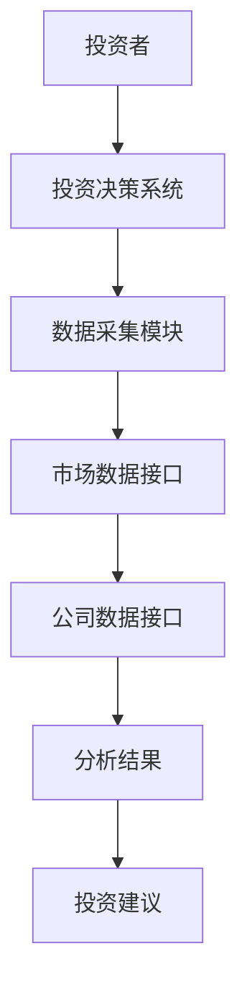

                 


# 彼得林奇的"高增长低估值"选股法

## 关键词：彼得·林奇，高增长低估值，选股法，投资策略，股票分析，风险管理

## 摘要：  
彼得·林奇的“高增长低估值”选股法是一种通过寻找高增长潜力但估值较低的公司来实现超额收益的投资策略。本文从理论基础、数学模型、系统架构、项目实战等多个维度详细解析这一选股法，并通过实际案例分析和最佳实践为投资者提供实用的指导。文章内容涵盖背景介绍、核心概念、算法原理、系统设计、代码实现、风险管理和投资心理学等方面，帮助读者全面掌握这一经典投资方法。

---

# 第1章: 高增长低估值选股法的背景与核心概念

## 1.1 高增长低估值选股法的定义与背景  
### 1.1.1 什么是高增长低估值选股法  
高增长低估值选股法是由著名投资家彼得·林奇提出的，旨在通过寻找具有高增长潜力但市场估值较低的公司，实现长期超额收益的投资策略。这种方法强调对公司基本面的深入分析，同时关注市场的估值水平，以捕捉那些被市场低估的增长型股票。

### 1.1.2 彼得·林奇的投资理念与选股方法  
彼得·林奇认为，投资者应关注那些具有强大竞争优势、良好管理团队和持续增长潜力的公司。他强调，市场情绪往往会导致优质股票的估值偏离其真实价值，因此在市场低迷时买入优质股票可以获得超额收益。

### 1.1.3 高增长低估值选股法的适用场景  
- 经济低迷或市场调整期：此时许多优质股票被低估，适合采用该策略。  
- 初创期或高成长行业的公司：这些公司的增长潜力大，但估值相对较低。  
- 中小盘股：相对于大盘股，中小盘股的估值更容易被低估，且增长空间更大。

## 1.2 核心概念与联系  
### 1.2.1 高增长与低估值的定义与特征  
- **高增长**：公司收入和利润持续增长，且增速高于行业平均水平。  
- **低估值**：股票的市场价格低于其内在价值，通常表现为市盈率（P/E）或市净率（P/B）低于行业平均水平。

### 1.2.2 高增长与低估值的对比分析  
| 特性 | 高增长 | 低估值 |
|------|--------|--------|
| 核心指标 | 收入增长率、净利润增长率 | 市盈率、市净率 |
| 适用场景 | 经济繁荣期、行业增长期 | 市场低迷期、行业低谷期 |
| 风险 | 市场波动可能导致增长预期落空 | 估值修复可能较慢 |

### 1.2.3 高增长低估值选股法的ER实体关系图  


---

# 第2章: 高增长低估值选股法的数学模型与算法原理  

## 2.1 核心算法原理  
### 2.1.1 高增长低估值选股法的数学模型  
- 市盈率（P/E）：衡量股票的相对估值。  
- 市净率（P/B）：衡量股票的资产估值。  
- 增长率（Growth Rate）：衡量公司的收入和利润增长速度。  

公式：  
$$\text{市盈率} = \frac{\text{股价}}{\text{每股净利润}}$$  
$$\text{市净率} = \frac{\text{股价}}{\text{每股净资产}}$$  
$$\text{收入增长率} = \frac{\text{本期收入} - \text{上期收入}}{\text{上期收入}} \times 100\%$$  

### 2.1.2 估值与增长的数学关系  
高增长低估值选股法的核心是寻找满足以下条件的公司：  
- 市盈率低于行业平均水平。  
- 收入和利润增长率高于行业平均水平。  

### 2.1.3 市盈率与市净率的计算公式  
- $$\text{市盈率} = \frac{\text{股价}}{\text{每股净利润}}$$  
- $$\text{市净率} = \frac{\text{股价}}{\text{每股净资产}}$$  

---

## 2.2 算法流程图  


---

# 第3章: 高增长低估值选股法的系统分析与架构设计  

## 3.1 系统分析  
### 3.1.1 投资决策系统的功能需求  
- 数据采集：获取公司财务数据和市场数据。  
- 数据分析：计算市盈率、市净率、收入增长率等指标。  
- 估值判断：筛选出符合高增长低估值条件的公司。  

### 3.1.2 系统的输入与输出  
- 输入：公司财务数据、市场数据。  
- 输出：符合条件的股票列表、投资建议。  

### 3.1.3 系统的模块划分  
- 数据采集模块：负责获取公司和市场数据。  
- 数据分析模块：计算各项指标。  
- 估值判断模块：筛选出符合条件的公司。  

---

## 3.2 系统架构设计  


---

## 3.3 系统接口设计  


---

## 3.4 系统交互序列图  


---

# 第4章: 高增长低估值选股法的项目实战  

## 4.1 项目环境与工具安装  
### 4.1.1 数据来源与获取方法  
- 数据来源：金融数据平台（如Yahoo Finance、 Bloomberg）。  
- 工具安装：Python、Pandas、NumPy、Matplotlib。  

### 4.1.2 数据分析工具的安装与配置  
- Python安装：确保安装最新版本的Python。  
- 库安装：使用pip安装Pandas、NumPy、Matplotlib。  

### 4.1.3 投资决策系统的开发框架  
- 使用Python开发一个简单的投资决策系统，基于命令行或图形界面。  

---

## 4.2 核心实现代码  
### 4.2.1 数据清洗与预处理代码  
```python
import pandas as pd

# 读取数据
data = pd.read_csv('stock_data.csv')

# 删除缺失值
data.dropna(inplace=True)

# 去重
data = data.drop_duplicates()
```

### 4.2.2 增长率与估值计算代码  
```python
# 计算收入增长率
data['收入增长率'] = (data['收入'] - data['上期收入']) / data['上期收入'] * 100

# 计算市盈率
data['市盈率'] = data['股价'] / data['每股净利润']

# 计算市净率
data['市净率'] = data['股价'] / data['每股净资产']
```

---

## 4.3 代码解读与分析  
### 4.3.1 数据分析模块的实现细节  
- 使用Pandas进行数据清洗和预处理。  
- 使用NumPy进行数组运算和数据分析。  

### 4.3.2 投资决策模块的实现细节  
- 基于预处理后的数据，筛选出符合高增长低估值条件的公司。  
- 输出投资建议和股票列表。  

---

## 4.4 案例分析与解读  
### 4.4.1 案例分析  
假设我们有一个包含以下数据的股票列表：  

| 公司名称 | 收入（万元） | 上期收入（万元） | 每股净利润 | 每股净资产 | 股价（元） |
|----------|--------------|------------------|-----------|------------|----------|
| 公司A    | 1000         | 900              | 10        | 20         | 100      |
| 公司B    | 1200         | 1000             | 15        | 25         | 120      |

### 4.4.2 案例解读  
- 公司A的收入增长率为：$$\frac{1000 - 900}{900} \times 100\% = 11.11\%$$  
- 公司A的市盈率为：$$\frac{100}{10} = 10$$  
- 公司A的市净率为：$$\frac{100}{20} = 5$$  

根据高增长低估值选股法，公司A符合高增长低估值的条件，可以考虑买入。

---

## 4.5 项目小结  
- 通过代码实现，我们可以快速筛选出符合高增长低估值条件的公司。  
- 实际操作中，需要结合市场环境和公司基本面进行综合判断。  

---

# 第5章: 高增长低估值选股法的风险管理与策略优化  

## 5.1 风险管理  
### 5.1.1 风险评估  
- 市场风险：市场波动可能导致股票价格下跌。  
- 估值风险：低估值股票的估值修复可能较慢。  

### 5.1.2 风险控制措施  
- 分散投资：避免将所有资金投入单一行业或公司。  
- 定期复检：定期评估投资组合，及时调整。  

---

## 5.2 策略优化  
### 5.2.1 优化方向  
- 结合技术分析：利用K线图、均线等技术指标辅助判断。  
- 增加行业分散：选择不同行业的高增长低估值公司。  

### 5.2.2 优化后的效果  
- 提高投资组合的抗风险能力。  
- 增强收益的稳定性。  

---

## 5.3 实战中的注意事项  
- 避免追涨杀跌：严格按照选股标准进行操作。  
- 保持耐心：低估值股票的估值修复可能需要较长时间。  

---

# 第6章: 高增长低估值选股法的投资心理学  

## 6.1 心理学分析  
- 投资者常见心理偏差：贪婪、恐惧、从众心理。  
- 彼得·林奇的建议：保持理性，避免情绪化决策。  

---

## 6.2 心理学策略  
- 定期回顾投资决策：避免盲目跟风。  
- 保持学习：不断优化自己的知识结构。  

---

## 6.3 实战中的心理调适  
- 设置止损：避免亏损过大。  
- 建立投资计划：制定明确的投资目标和时间表。  

---

# 第7章: 高增长低估值选股法的总结与展望  

## 7.1 总结  
- 高增长低估值选股法是一种有效的投资策略，通过寻找被市场低估的高成长公司，实现超额收益。  
- 实际操作中，需要结合市场环境和公司基本面进行综合判断。  

## 7.2 展望  
- 随着大数据和人工智能技术的发展，高增长低估值选股法将更加精准和高效。  
- 投资者应不断提升自己的知识和能力，抓住市场机会。  

---

## 结语  
彼得·林奇的高增长低估值选股法为我们提供了一种寻找优质投资标的的有效方法。通过本文的详细解析，读者可以更好地理解这一策略的核心思想，并在实际操作中加以应用。投资有风险，入市需谨慎。

