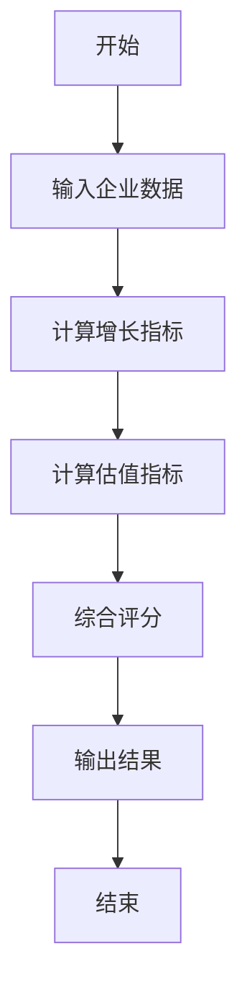
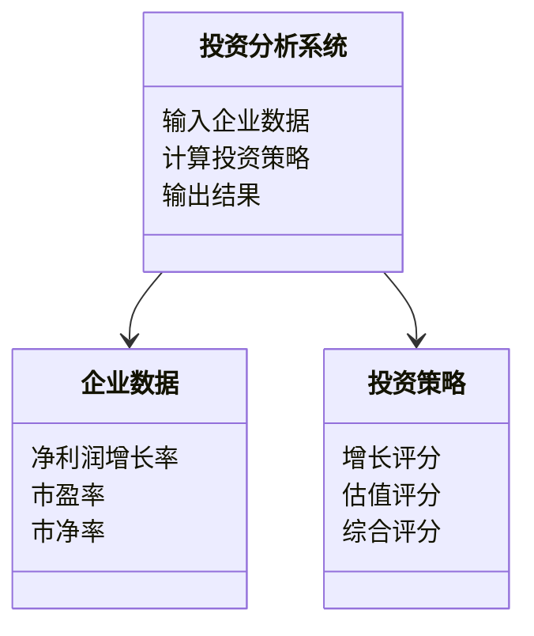
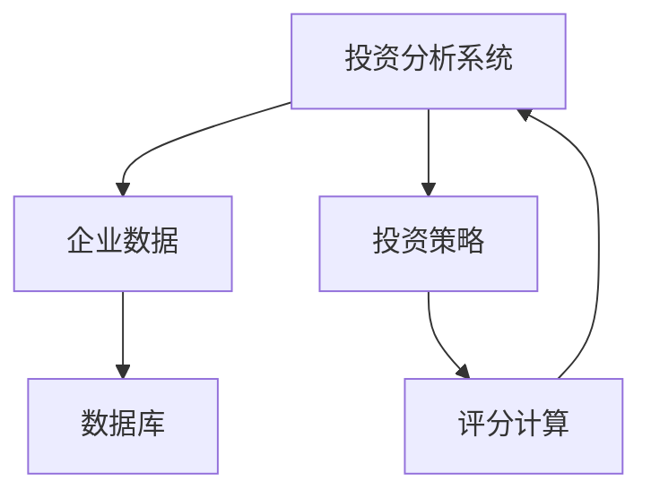
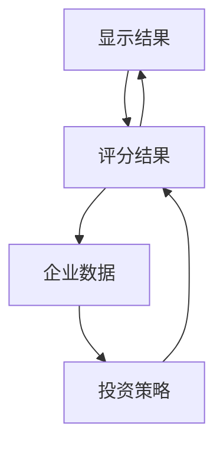

                 


## 第三章: 高增长低估值策略的算法原理

### 3.1 算法流程图


### 3.2 算法实现代码
```python
def growth_score(company_data):
    # 计算增长率
    growth = (company_data['净利润增长率'] / 100)
    return growth

def valuation_score(company_data):
    # 计算市盈率和市净率
    pe = company_data['市盈率']
    pb = company_data['市净率']
    return (pe + pb) / 2

def high_growth_low_valuation(company_data):
    growth = growth_score(company_data)
    valuation = valuation_score(company_data)
    return {'growth_score': growth, 'valuation_score': valuation}
```

### 3.3 算法数学模型与公式
#### 3.3.1 增长评分公式
$$\text{增长评分} = \frac{\text{净利润增长率}}{100}$$

#### 3.3.2 估值评分公式
$$\text{估值评分} = \frac{\text{市盈率} + \text{市净率}}{2}$$

#### 3.3.3 综合评分公式
$$\text{综合评分} = \frac{\text{增长评分} + \text{估值评分}}{2}$$

### 3.4 算法实现步骤
1. 输入企业数据，包括净利润增长率、市盈率、市净率等指标。
2. 计算企业增长评分。
3. 计算企业估值评分。
4. 综合计算企业的综合评分。
5. 根据综合评分判断企业是否符合高增长低估值策略。

### 3.5 算法实现示例
假设某企业的净利润增长率为50%，市盈率为15，市净率为2：
- 增长评分：$$\text{增长评分} = \frac{50}{100} = 0.5$$
- 估值评分：$$\text{估值评分} = \frac{15 + 2}{2} = 8.5$$
- 综合评分：$$\text{综合评分} = \frac{0.5 + 8.5}{2} = 4.5$$
该企业的综合评分为4.5，符合高增长低估值策略。

## 第四章: 高增长低估值策略的系统分析与架构设计

### 4.1 系统分析
#### 4.1.1 问题场景介绍
高增长低估值策略的应用需要一个完整的系统架构来支持，包括数据收集、数据分析、策略实施和结果展示。

### 4.2 项目介绍
#### 4.2.1 项目目标
开发一个基于彼得林奇高增长低估值策略的投资分析系统。

### 4.3 系统功能设计
#### 4.3.1 领域模型类图


### 4.4 系统架构设计
#### 4.4.1 系统架构图


### 4.5 系统接口设计
#### 4.5.1 数据接口
- 输入接口：企业数据输入接口。
- 输出接口：投资策略评分输出接口。

### 4.6 系统交互设计
#### 4.6.1 交互流程图


## 第五章: 高增长低估值策略的项目实战

### 5.1 环境安装
#### 5.1.1 安装Python
```bash
# 安装Python
sudo apt-get install python3
```

#### 5.1.2 安装必要的库
```bash
# 安装Pandas和Matplotlib
pip install pandas matplotlib
```

### 5.2 系统核心实现源代码
```python
import pandas as pd
import matplotlib.pyplot as plt

def calculate_scores(data):
    growth_score = data['净利润增长率'] / 100
    valuation_score = (data['市盈率'] + data['市净率']) / 2
    return growth_score, valuation_score

def main():
    # 读取企业数据
    data = pd.read_csv('企业数据.csv')
    # 计算评分
    growth_score, valuation_score = calculate_scores(data)
    data['增长评分'] = growth_score
    data['估值评分'] = valuation_score
    data['综合评分'] = (growth_score + valuation_score) / 2
    # 可视化
    plt.figure(figsize=(10,6))
    plt.scatter(data['综合评分'], data['净利润增长率'], c='blue')
    plt.xlabel('综合评分')
    plt.ylabel('净利润增长率')
    plt.title('高增长低估值策略评分分布')
    plt.show()

if __name__ == "__main__":
    main()
```

### 5.3 代码应用解读与分析
#### 5.3.1 代码功能
1. 读取企业数据。
2. 计算企业增长评分和估值评分。
3. 绘制综合评分分布图。

### 5.4 实际案例分析
假设企业数据如下：
| 企业名称 | 净利润增长率 | 市盈率 | 市净率 |
|----------|--------------|--------|--------|
| 企业A    | 50           | 15     | 2      |
| 企业B    | 30           | 20     | 1      |
| 企业C    | 40           | 10     | 3      |

计算结果：
| 企业名称 | 增长评分 | 估值评分 | 综合评分 |
|----------|----------|----------|----------|
| 企业A    | 0.5      | 8.5      | 4.5      |
| 企业B    | 0.3      | 10.5     | 5.4      |
| 企业C    | 0.4      | 7        | 3.7      |

### 5.5 项目小结
通过上述代码实现，我们可以清晰地看到高增长低估值策略在实际应用中的效果。企业B虽然增长评分较低，但其估值评分较高，整体综合评分较高，符合高增长低估值策略的投资标准。

## 第六章: 总结与扩展

### 6.1 总结
彼得林奇的高增长低估值选股策略通过结合企业的增长潜力和估值水平，帮助投资者找到具有长期投资价值的企业。本文从策略背景、数学模型、算法实现、系统设计和项目实战等多个方面进行了详细分析。

### 6.2 最佳实践 tips
- 定期更新企业数据，确保评分的准确性。
- 结合其他投资策略进行综合判断。
- 风险控制是投资成功的关键。

### 6.3 注意事项
- 高增长低估值策略适用于长期投资，需耐心持有。
- 避免过度依赖单一指标，结合多维度分析。

### 6.4 拓展阅读
建议阅读彼得林奇的《击败市场的人》和《投资的智慧》，深入了解他的投资哲学和策略。

### 6.5 小结
高增长低估值策略不仅是一种选股方法，更是一种投资哲学，需要投资者具备耐心和信心，长期持有优质企业，才能实现财富的稳健增长。

