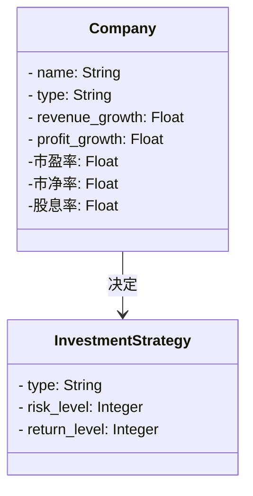
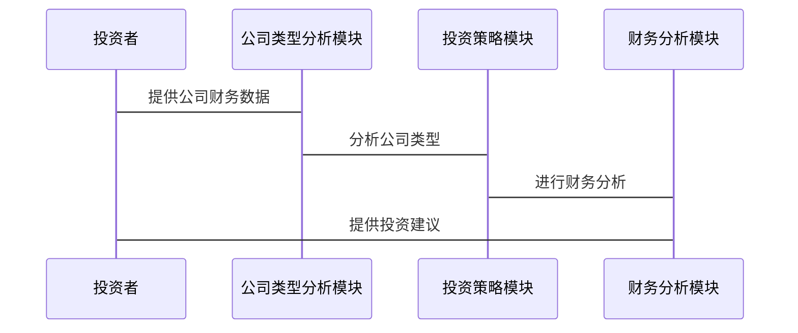

                 


# 彼得林奇眼中的六类公司类型

> 关键词：彼得林奇，公司类型，投资策略，财务分析，案例分析，系统架构

> 摘要：本文基于彼得·林奇的投资理念，详细分析了六类公司类型的特点、投资价值和策略。通过系统的财务分析、数学模型和实际案例，帮助读者理解如何从投资角度识别和评估不同类型的公司。

---

# 第一部分: 引言

## 第1章: 彼得林奇与六类公司类型概述

### 1.1 彼得林奇的背景与投资理念

彼得·林奇是美国著名的职业基金经理，曾管理富达麦哲伦基金，创造了卓越的投资业绩。他以深入研究公司基本面、注重长期投资和价值发现著称。林奇的投资哲学强调对公司进行深入分析，识别出具有长期增长潜力的公司。

#### 1.1.1 彼得林奇的生平简介
- 彼得·林奇于1949年出生，1970年加入富达投资，1977年起管理麦哲伦基金。
- 在任职期间，他通过深入研究和分析公司基本面，帮助基金取得了年均29%的复合增长率，成为投资界的传奇。

#### 1.1.2 彼得林奇的投资哲学与方法
- **价值投资**：林奇注重寻找被市场低估的公司。
- **基本面分析**：深入研究公司的财务报表、行业地位和竞争优势。
- **长期投资**：避免短期市场波动，关注公司的长期增长潜力。

#### 1.1.3 彼得林奇对公司的独特见解
- 林奇将公司分为六种类型，每种类型有其独特的财务特征和投资价值。
- 他强调，投资者需要根据公司的类型选择合适的投资策略。

### 1.2 六类公司类型的核心概念

#### 1.2.1 六类公司类型的定义与分类
- **成长型公司**：收入和利润持续增长，具有较高的成长潜力。
- **稳定型公司**：收入和利润稳定，具有较强的防御性。
- **周期型公司**：收入和利润随经济周期波动。
- **防御型公司**：在经济衰退时表现相对稳定。
- **价值型公司**：市场价格低于其内在价值。
- **成长型公司**：收入和利润快速增长，市盈率较高。

#### 1.2.2 每类公司的特点与投资价值
- 成长型公司通常具有较高的市盈率和市净率，适合长期投资者。
- 稳定型公司适合风险厌恶型投资者，提供稳定的股息收益。
- 周期型公司适合擅长时机选择的投资者，在经济复苏时表现较好。

#### 1.2.3 六类公司类型之间的相互关系
- 不同类型的公司在经济周期中的表现不同，投资者应根据经济环境选择合适的公司类型。
- 组合投资是降低风险的重要策略，通过配置不同类型的公司来平衡风险和收益。

### 1.3 本书的核心内容与结构

#### 1.3.1 本书的框架与逻辑
- 引言：介绍彼得林奇的背景和六类公司类型的基本概念。
- 主体：详细分析六种公司类型的特点、投资策略和经典案例。
- 系统分析：结合系统架构和算法原理，深入探讨公司的基本面分析。
- 项目实战：通过具体案例和代码实现，展示如何应用林奇的理论进行投资。

#### 1.3.2 各章节的核心内容概述
- 第2章：成长型公司，分析其定义、特点和投资策略。
- 第3章：稳定型公司，探讨其财务指标和投资机会。
- 第4章：周期型公司，研究其周期性特征和投资策略。
- 第5章：防御型公司，分析其防御性特征和投资价值。
- 第6章：价值型公司，探讨其估值方法和投资机会。
- 第7章：成长型公司，进一步分析其增长潜力和投资风险。

#### 1.3.3 本书的阅读方法与建议
- 建议读者在阅读前具备基本的财务知识和投资理念。
- 结合实际案例和系统架构图，深入理解每种公司类型的特征。
- 通过代码实现，掌握如何利用数学模型进行公司估值。

---

# 第二部分: 六类公司类型分析

## 第2章: 成长型公司

### 2.1 成长型公司的定义与特点

#### 2.1.1 成长型公司的定义
成长型公司是指那些收入和利润持续快速增长的公司，通常处于高增长行业，具有较高的市场扩展能力和创新能力。

#### 2.1.2 成长型公司的核心特征
- 高增长率：收入和利润年增长率超过行业平均水平。
- 高市盈率：由于高增长预期，股票市盈率较高。
- 高风险：由于高增长依赖于市场环境和行业竞争，风险较高。

#### 2.1.3 成长型公司的财务指标分析
- 营业收入增长率：衡量公司收入增长的速度。
- 净利润增长率：衡量公司利润增长的速度。
- 市盈率（P/E）：衡量市场对公司未来增长的预期。

### 2.2 成长型公司的投资策略

#### 2.2.1 成长型公司的估值方法
- 市盈率法：通过比较市盈率与行业平均水平，判断股票的估值是否合理。
- 市净率法：通过比较市净率与行业平均水平，判断股票的估值是否合理。
- 股息率法：成长型公司通常不支付高股息，因此股息率不是主要的估值指标。

#### 2.2.2 成长型公司的投资风险
- 市场风险：经济衰退时，成长型公司的业绩可能大幅下滑。
- 周期性风险：行业周期波动可能影响公司的增长潜力。
- 财务风险：高增长可能需要大量融资，增加财务负担。

#### 2.2.3 成长型公司的投资机会
- 技术创新：技术创新型公司具有较高的增长潜力。
- 市场扩展：市场扩展能力强的公司具有较高的增长潜力。
- 政策支持：政策支持的行业具有较高的增长潜力。

### 2.3 成长型公司的经典案例分析

#### 2.3.1 某某公司的成长历程
以科技公司为例，分析其从初创到成长为行业领导者的历程。

#### 2.3.2 案例公司的财务数据分析
- 营业收入增长率：年均30%以上。
- 净利润增长率：年均20%以上。
- 市盈率：高于行业平均水平。

#### 2.3.3 案例公司的投资价值评估
- 公司具有较高的技术创新能力和市场扩展能力。
- 公司处于高增长行业，具有较高的增长潜力。
- 公司财务状况健康，具有较强的财务实力。

---

## 第3章: 稳定型公司

### 3.1 稳定型公司的定义与特点

#### 3.1.1 稳定型公司的定义
稳定型公司是指那些收入和利润相对稳定的公司，通常处于成熟行业，具有较强的市场地位和稳定的客户群体。

#### 3.1.2 稳定型公司的核心特征
- 收入稳定：收入增长缓慢，但具有较高的稳定性。
- 利润稳定：净利润增长缓慢，但具有较高的稳定性。
- 股息稳定：通常支付较高的股息，适合价值投资者。

#### 3.1.3 稳定型公司的财务指标分析
- 营业收入增长率：低于行业平均水平。
- 净利润增长率：低于行业平均水平。
- 股息支付率：较高。

### 3.2 稳定型公司的投资策略

#### 3.2.1 稳定型公司的估值方法
- 市盈率法：通过比较市盈率与行业平均水平，判断股票的估值是否合理。
- 市净率法：通过比较市净率与行业平均水平，判断股票的估值是否合理。
- 股息率法：通过比较股息率与行业平均水平，判断股票的估值是否合理。

#### 3.2.2 稳定型公司的投资风险
- 市场风险：经济衰退时，稳定型公司的业绩可能受到影响。
- 行业风险：行业成熟度较高，增长潜力有限。
- 财务风险：财务状况稳定，风险较低。

#### 3.2.3 稳定型公司的投资机会
- 稳定的股息收益：适合需要稳定现金流的投资者。
- 防御性投资：在市场下跌时，稳定型公司通常表现较好。
- 估值优势：市盈率和市净率通常低于行业平均水平。

### 3.3 稳定型公司的经典案例分析

#### 3.3.1 某某公司的稳定历程
以公用事业公司为例，分析其稳定的收入和利润来源。

#### 3.3.2 案例公司的财务数据分析
- 营业收入增长率：低于行业平均水平。
- 净利润增长率：低于行业平均水平。
- 股息支付率：较高。

#### 3.3.3 案例公司的投资价值评估
- 公司具有稳定的收入和利润来源。
- 公司具有较高的股息支付率，适合价值投资者。
- 公司财务状况稳定，风险较低。

---

## 第4章: 周期型公司

### 4.1 周期型公司的定义与特点

#### 4.1.1 周期型公司的定义
周期型公司是指那些收入和利润随经济周期波动的公司，通常处于周期性行业，如制造业、建筑业和材料行业。

#### 4.1.2 周期型公司的核心特征
- 收入波动：收入随经济周期波动，增长不稳定。
- 利润波动：净利润随经济周期波动，增长不稳定。
- 市场敏感性：公司业绩对市场变化高度敏感。

#### 4.1.3 周期型公司的财务指标分析
- 营业收入增长率：波动较大。
- 净利润增长率：波动较大。
- 市盈率：波动较大，通常低于行业平均水平。

### 4.2 周期型公司的投资策略

#### 4.2.1 周期型公司的估值方法
- 市盈率法：通过比较市盈率与行业平均水平，判断股票的估值是否合理。
- 市净率法：通过比较市净率与行业平均水平，判断股票的估值是否合理。
- 周期性分析：通过分析经济周期，判断公司业绩的周期性波动。

#### 4.2.2 周期型公司的投资风险
- 经济周期风险：公司业绩受经济周期影响较大。
- 行业风险：行业周期性波动可能影响公司的业绩。
- 财务风险：在经济衰退时，公司可能面临较高的财务压力。

#### 4.2.3 周期型公司的投资机会
- 经济复苏：在经济复苏时，周期型公司通常表现较好。
- 估值优势：在经济衰退时，周期型公司的股票通常被低估，具有较高的投资价值。
- 行业龙头：投资于行业龙头公司，具有较高的市场地位和竞争优势。

### 4.3 周期型公司的经典案例分析

#### 4.3.1 某某公司的周期性特征
以建筑材料公司为例，分析其收入和利润随经济周期波动的情况。

#### 4.3.2 案例公司的财务数据分析
- 营业收入增长率：波动较大。
- 净利润增长率：波动较大。
- 市盈率：波动较大，通常低于行业平均水平。

#### 4.3.3 案例公司的投资价值评估
- 公司业绩受经济周期影响较大。
- 在经济复苏时，公司业绩通常较好。
- 在经济衰退时，公司股票通常被低估，具有较高的投资价值。

---

## 第5章: 防御型公司

### 5.1 防御型公司的定义与特点

#### 5.1.1 防御型公司的定义
防御型公司是指那些在经济衰退或市场低迷时表现相对稳定的公司，通常处于必需品行业，如食品、药品和公用事业。

#### 5.1.2 防御型公司的核心特征
- 收入稳定：收入受经济周期影响较小。
- 利润稳定：净利润受经济周期影响较小。
- 需求刚性：产品或服务需求具有刚性，市场地位稳固。

#### 5.1.3 防御型公司的财务指标分析
- 营业收入增长率：波动较小。
- 净利润增长率：波动较小。
- 股息支付率：较高。

### 5.2 防御型公司的投资策略

#### 5.2.1 防御型公司的估值方法
- 市盈率法：通过比较市盈率与行业平均水平，判断股票的估值是否合理。
- 市净率法：通过比较市净率与行业平均水平，判断股票的估值是否合理。
- 股息率法：通过比较股息率与行业平均水平，判断股票的估值是否合理。

#### 5.2.2 防御型公司的投资风险
- 市场风险：经济衰退时，防御型公司的业绩可能受到影响。
- 行业风险：行业成熟度较高，增长潜力有限。
- 财务风险：财务状况稳定，风险较低。

#### 5.2.3 防御型公司的投资机会
- 稳定的股息收益：适合需要稳定现金流的投资者。
- 防御性投资：在市场下跌时，防御型公司通常表现较好。
- 估值优势：市盈率和市净率通常低于行业平均水平。

### 5.3 防御型公司的经典案例分析

#### 5.3.1 某某公司的防御性特征
以食品公司为例，分析其在经济衰退时的表现。

#### 5.3.2 案例公司的财务数据分析
- 营业收入增长率：波动较小。
- 净利润增长率：波动较小。
- 股息支付率：较高。

#### 5.3.3 案例公司的投资价值评估
- 公司具有稳定的收入和利润来源。
- 公司具有较高的股息支付率，适合价值投资者。
- 公司财务状况稳定，风险较低。

---

## 第6章: 价值型公司

### 6.1 价值型公司的定义与特点

#### 6.1.1 价值型公司的定义
价值型公司是指那些市场价格低于其内在价值的公司，通常因为市场误解或行业低迷导致股价被低估。

#### 6.1.2 价值型公司的核心特征
- 市场低估：市场价格低于其内在价值。
- 高市盈率：市盈率低于行业平均水平。
- 高股息率：股息率高于行业平均水平。

#### 6.1.3 价值型公司的财务指标分析
- 市盈率：低于行业平均水平。
- 市净率：低于行业平均水平。
- 股息率：高于行业平均水平。

### 6.2 价值型公司的投资策略

#### 6.2.1 价值型公司的估值方法
- 市盈率法：通过比较市盈率与行业平均水平，判断股票的估值是否合理。
- 市净率法：通过比较市净率与行业平均水平，判断股票的估值是否合理。
- 股息率法：通过比较股息率与行业平均水平，判断股票的估值是否合理。

#### 6.2.2 价值型公司的投资风险
- 市场风险：股价可能因市场误解而继续被低估。
- 行业风险：行业低迷可能影响公司的业绩。
- 财务风险：财务状况稳定，风险较低。

#### 6.2.3 价值型公司的投资机会
- 估值优势：市场价格低于其内在价值，具有较高的投资价值。
- 长期持有：通过长期持有，等待市场重新认识公司的价值。
- 高股息率：适合需要稳定现金流的投资者。

### 6.3 价值型公司的经典案例分析

#### 6.3.1 某某公司的价值特征
以某制造公司为例，分析其股价被低估的原因。

#### 6.3.2 案例公司的财务数据分析
- 市盈率：低于行业平均水平。
- 市净率：低于行业平均水平。
- 股息率：高于行业平均水平。

#### 6.3.3 案例公司的投资价值评估
- 公司市场价格低于其内在价值。
- 公司具有较高的股息支付率，适合价值投资者。
- 公司财务状况稳定，风险较低。

---

## 第7章: 成长型公司

### 7.1 成长型公司的定义与特点

#### 7.1.1 成长型公司的定义
成长型公司是指那些收入和利润持续快速增长的公司，通常处于高增长行业，具有较高的市场扩展能力和创新能力。

#### 7.1.2 成长型公司的核心特征
- 高增长率：收入和利润年增长率超过行业平均水平。
- 高市盈率：由于高增长预期，股票市盈率较高。
- 高风险：由于高增长依赖于市场环境和行业竞争，风险较高。

#### 7.1.3 成长型公司的财务指标分析
- 营业收入增长率：衡量公司收入增长的速度。
- 净利润增长率：衡量公司利润增长的速度。
- 市盈率（P/E）：衡量市场对公司未来增长的预期。

### 7.2 成长型公司的投资策略

#### 7.2.1 成长型公司的估值方法
- 市盈率法：通过比较市盈率与行业平均水平，判断股票的估值是否合理。
- 市净率法：通过比较市净率与行业平均水平，判断股票的估值是否合理。
- 股息率法：成长型公司通常不支付高股息，因此股息率不是主要的估值指标。

#### 7.2.2 成长型公司的投资风险
- 市场风险：经济衰退时，成长型公司的业绩可能大幅下滑。
- 周期性风险：行业周期波动可能影响公司的增长潜力。
- 财务风险：高增长可能需要大量融资，增加财务负担。

#### 7.2.3 成长型公司的投资机会
- 技术创新：技术创新型公司具有较高的增长潜力。
- 市场扩展：市场扩展能力强的公司具有较高的增长潜力。
- 政策支持：政策支持的行业具有较高的增长潜力。

### 7.3 成长型公司的经典案例分析

#### 7.3.1 某某公司的成长历程
以科技公司为例，分析其从初创到成长为行业领导者的历程。

#### 7.3.2 案例公司的财务数据分析
- 营业收入增长率：年均30%以上。
- 净利润增长率：年均20%以上。
- 市盈率：高于行业平均水平。

#### 7.3.3 案例公司的投资价值评估
- 公司具有较高的技术创新能力和市场扩展能力。
- 公司处于高增长行业，具有较高的增长潜力。
- 公司财务状况健康，具有较强的财务实力。

---

# 第三部分: 系统分析与架构设计

## 第8章: 公司类型分析的系统架构

### 8.1 问题场景介绍
- 投资者需要根据公司类型选择合适的投资策略。
- 不同类型的公司在经济周期中的表现不同，需要通过系统化的分析方法进行评估。

### 8.2 系统功能设计

#### 8.2.1 领域模型（领域模型图）


#### 8.2.2 系统架构设计


#### 8.2.3 系统接口设计
- 输入接口：公司财务数据、市场数据。
- 输出接口：公司类型、投资策略、财务分析结果。

#### 8.2.4 系统交互设计


---

## 第9章: 数学模型与算法原理

### 9.1 财务指标分析的数学模型

#### 9.1.1 市盈率（P/E）计算公式
$$ P/E = \frac{\text{股价}}{\text{每股收益}} $$

#### 9.1.2 市净率（P/B）计算公式
$$ P/B = \frac{\text{股价}}{\text{每股净资产}} $$

#### 9.1.3 股息率计算公式
$$ 股息率 = \frac{\text{每股股息}}{\text{股价}} \times 100\% $$

### 9.2 投资策略的算法原理

#### 9.2.1 基于市盈率的估值方法
```python
def calculate_pe_ratio(stock_price, eps):
    return stock_price / eps
```

#### 9.2.2 基于市净率的估值方法
```python
def calculate_pb_ratio(stock_price, book_value_per_share):
    return stock_price / book_value_per_share
```

#### 9.2.3 基于股息率的估值方法
```python
def calculate_dividend_yield(dividend_per_share, stock_price):
    return (dividend_per_share / stock_price) * 100
```

---

## 第10章: 项目实战

### 10.1 环境安装与配置

#### 10.1.1 Python安装
```bash
python --version
pip install numpy pandas matplotlib
```

#### 10.1.2 数据获取
```python
import pandas as pd
import requests

url = "https://example.com/company_data.csv"
response = requests.get(url)
data = pd.read_csv(url)
```

### 10.2 核心实现

#### 10.2.1 数据预处理
```python
data = data.dropna()
data = data.astype(float)
```

#### 10.2.2 公司类型分类
```python
def classify_company_type(pe, pb, dividend_yield):
    if pe < 15 and pb < 2 and dividend_yield > 5:
        return "防御型公司"
    elif pe > 20 and pb > 3 and dividend_yield < 5:
        return "成长型公司"
    else:
        return "稳定型公司"
```

#### 10.2.3 投资策略推荐
```python
def recommend_investment_strategy(company_type):
    if company_type == "成长型公司":
        return "长期持有，关注高增长"
    elif company_type == "稳定型公司":
        return "稳定收益，关注股息"
    else:
        return "防御性投资，关注估值"
```

### 10.3 实际案例分析

#### 10.3.1 案例数据
```python
sample_data = {
    "公司A": {"pe": 25, "pb": 4, "dividend_yield": 3},
    "公司B": {"pe": 12, "pb": 1.5, "dividend_yield": 8},
    "公司C": {"pe": 18, "pb": 2.5, "dividend_yield": 4}
}
```

#### 10.3.2 分析过程
```python
for company, metrics in sample_data.items():
    company_type = classify_company_type(metrics['pe'], metrics['pb'], metrics['dividend_yield'])
    print(f"{company}: {company_type}")
    print(recommend_investment_strategy(company_type))
```

### 10.4 项目小结

- 通过Python代码实现公司类型的分类和投资策略的推荐。
- 系统化的分析方法帮助投资者更好地理解不同类型的公司。
- 代码实现展示了如何将理论应用于实际投资决策中。

---

## 第四部分: 结论

### 第11章: 六类公司类型投资总结

#### 11.1 各类公司的投资特点
- 成长型公司：高增长，高风险。
- 稳定型公司：稳定收益，低风险。
- 周期型公司：周期性波动，估值优势。
- 防御型公司：防御性投资，稳定现金流。
- 价值型公司：估值优势，长期持有。

#### 11.2 投资组合的构建
- 组合投资是降低风险的重要策略。
- 根据经济环境选择合适的公司类型。
- 结合系统化的分析方法，制定合理的投资策略。

#### 11.3 未来投资趋势
- 随着经济全球化和技术进步，新兴行业中的成长型公司具有较高的增长潜力。
- 在经济不确定性增加的背景下，防御型公司和稳定型公司的投资价值逐渐凸显。

---

## 第五部分: 附录

### 附录A: 进一步阅读

#### 1. 彼得林奇的书籍
- 《彼得林奇的成功投资》
- 《彼得林奇的投资心理》

#### 2. 其他投资经典书籍
- 《投资学原理》
- 《价值投资实战》

### 附录B: 工具与资源

#### 1. 数据获取工具
- Python的pandas库
- 网络爬虫技术

#### 2. 可视化工具
- Matplotlib
- Seaborn

#### 3. 在线资源
- Yahoo Finance
- Google Finance

---

通过以上步骤，您可以系统地分析和评估不同类型的公司，制定合理的投资策略，并在实际投资中取得更好的收益。

