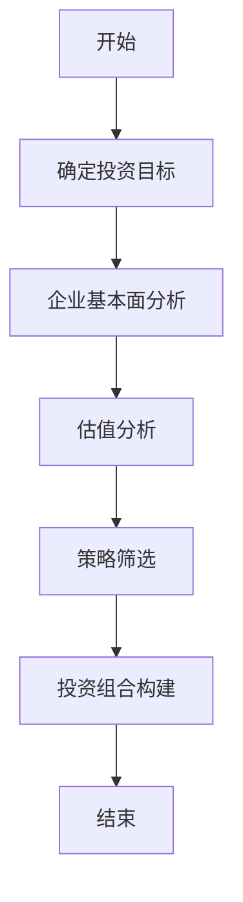
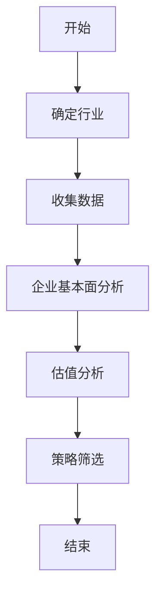
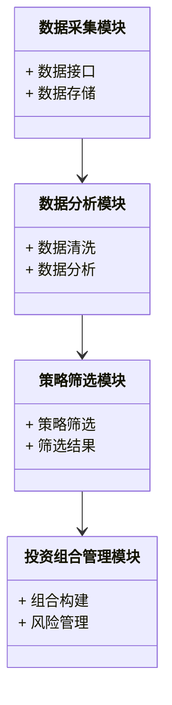

                 


# 彼得林奇选股策略解析

**关键词**：彼得林奇、选股策略、投资分析、股票筛选、价值投资、成长型投资

**摘要**：本文将深入解析彼得·林奇的选股策略，从其核心理念、策略框架到具体实施步骤，逐一展开分析。通过对比成长型投资与价值型投资，结合实际案例，详细阐述彼得林奇选股策略的逻辑与实现方法。本文还通过系统架构设计、算法实现与案例分析，帮助读者全面理解并掌握彼得林奇选股策略的精髓。

---

## 第一部分: 彼得林奇选股策略背景与核心理念

### 第1章: 彼得林奇与选股策略概述

#### 1.1 彼得林奇及其投资理念
##### 1.1.1 彼得林奇的生平简介
彼得·林奇（Peter Lynch）是美国著名的职业基金经理，曾任富达麦哲伦基金的经理，管理资产规模高达140亿美元。他以卓越的投资业绩闻名，长期投资收益率超过市场平均水平，被誉为“最成功的股票基金经理之一”。

##### 1.1.2 彼得林奇的投资哲学
彼得林奇的投资哲学强调“长期投资”与“价值发现”。他认为，成功的投资不仅需要分析企业的财务数据，还需要深入研究企业的商业模式、竞争优势以及管理层的稳定性。他主张寻找那些具有持续增长潜力的企业，并长期持有。

##### 1.1.3 彼得林奇选股策略的核心思想
彼得林奇的核心思想是：选股策略的核心在于找到那些具有强大竞争优势、管理优秀且估值合理的公司。他主张避免短期市场波动的干扰，专注于企业的长期价值。

#### 1.2 选股策略的背景与重要性
##### 1.2.1 选股策略的定义与分类
选股策略是投资者在股票市场中选择投资标的的方法和流程。常见的选股策略包括成长型投资、价值型投资、趋势投资等。彼得林奇的选股策略属于成长型投资的一种，强调企业基本面的分析。

##### 1.2.2 彼得林奇选股策略的适用场景
彼得林奇选股策略适用于长期投资，特别适合那些希望在股票市场中获得超额收益的投资者。该策略尤其适合那些愿意花时间研究企业基本面，并能够长期持有的投资者。

##### 1.2.3 选股策略在投资中的作用
选股策略是投资组合的核心，决定了投资收益的高低。科学的选股策略能够帮助投资者规避投资风险，抓住投资机会，实现资产的长期增值。

#### 1.3 本书的核心目标与框架
##### 1.3.1 本书的核心目标
本文旨在深入解析彼得林奇的选股策略，结合理论与实践，帮助读者掌握彼得林奇选股策略的核心思想，并能够将其应用于实际投资中。

##### 1.3.2 本书的框架与内容安排
本书分为三个主要部分：背景与核心理念、核心概念与算法原理、系统分析与实战案例。

##### 1.3.3 本书的阅读方法与注意事项
读者在阅读本书时，应结合实际案例，注重理论与实践的结合。建议读者在阅读过程中，随时记录自己的理解和疑问，并结合实际的股票市场数据进行验证。

---

## 第二部分: 彼得林奇选股策略的核心概念与原理

### 第2章: 选股策略的核心概念

#### 2.1 核心概念与定义
##### 2.1.1 什么是选股策略
选股策略是指投资者在股票市场中选择投资标的的方法和流程。它包括对企业基本面、行业地位、财务数据、管理层能力等多方面的分析。

##### 2.1.2 彼得林奇选股策略的定义
彼得林奇选股策略是一种以企业基本面分析为核心的成长型投资策略。它强调选择那些具有强大竞争优势、管理优秀且估值合理的公司。

##### 2.1.3 选股策略的核心要素
- 企业基本面：包括收入、利润、毛利率、资产负债率等财务指标。
- 行业地位：包括企业在行业中的市场份额、竞争优势等。
- 管理层能力：包括管理层的稳定性、决策能力等。
- 估值合理性：包括市盈率、市净率等估值指标。

#### 2.2 彼得林奇选股策略的属性特征对比
##### 2.2.1 成长型投资与价值型投资的对比
| 对比维度         | 成长型投资                     | 价值型投资                     |
|------------------|-------------------------------|-------------------------------|
| 投资目标         | 寻找高增长潜力的公司           | 寻找被市场低估的公司           |
| 投资期限         | 长期投资                     | 中长期投资                   |
| 风险水平         | 较高                         | 中等                         |
| 估值指标         | 市盈率（P/E）                 | 市净率（P/B）                 |

##### 2.2.2 长期投资与短期投资的对比
| 对比维度         | 长期投资                     | 短期投资                     |
|------------------|-------------------------------|-------------------------------|
| 投资目标         | 获取企业的长期增长收益       | 利用市场波动赚取短期收益     |
| 投资期限         | 3年以上                     | 1年以内                     |
| 风险水平         | 较低                         | 较高                         |
| 操作频率         | 较低                         | 较高                         |

##### 2.2.3 高风险投资与低风险投资的对比
| 对比维度         | 高风险投资                   | 低风险投资                   |
|------------------|-------------------------------|-------------------------------|
| 投资标的         | 新兴行业、成长型企业         | 蓝筹股、红利股               |
| 风险来源         | 市场波动、企业基本面变化     | 市场波动、经济周期变化       |
| 风险控制         | 严格的风险管理               | 较松的风险管理               |

#### 2.3 实体关系图（ER图）架构
```mermaid
erDiagram
    actor 投资者 {
        <属性> 投资目标
        <属性> 投资期限
        <属性> 风险承受能力
    }
    actor 企业 {
        <属性> 财务数据
        <属性> 行业地位
        <属性> 管理层能力
    }
    actor 市场 {
        <属性> 市场波动
        <属性> 市场情绪
    }
    relation 选股策略 {
        <关系> 投资者 -> 选股策略 : 选择策略
        <关系> 企业 -> 选股策略 : 分析企业
        <关系> 市场 -> 选股策略 : 影响策略
    }
```

---

### 第3章: 彼得林奇选股策略的算法原理

#### 3.1 算法原理概述
##### 3.1.1 选股策略的基本算法
彼得林奇选股策略的基本算法包括以下几个步骤：
1. 确定投资目标：明确投资期限、风险承受能力及收益目标。
2. 企业基本面分析：分析企业的财务数据、行业地位及管理层能力。
3. 估值分析：通过市盈率、市净率等指标评估企业的估值合理性。
4. 策略筛选：根据上述分析结果，筛选出符合投资条件的股票。
5. 投资组合构建：根据筛选结果，构建投资组合并进行风险分散。

##### 3.1.2 彼得林奇选股策略的算法特点
- 以企业基本面分析为核心。
- 强调成长型投资。
- 适合长期投资。

##### 3.1.3 算法的优缺点分析
优点：
- 策略简单易懂，易于操作。
- 适合长期投资者。
缺点：
- 短期市场波动可能影响策略的实施效果。
- 需要较高的研究成本。

#### 3.2 算法流程图


#### 3.3 算法实现的Python代码
##### 3.3.1 选股策略的Python代码实现
```python
def peter Lynch_strategy():
    # 定义投资目标
    investment_horizon = "长期"
    risk_tolerance = "低"
    
    # 企业基本面分析
    import pandas as pd
    df = pd.read_csv('stock_data.csv')
    df = df[(df['市盈率'] < 15) & (df['毛利率'] > 20)]
    
    # 估值分析
    selected_stocks = df[df['市净率'] < 2]
    
    return selected_stocks
```

##### 3.3.2 彼得林奇选股策略的Python代码实现
```python
def select_stocks():
    # 筛选成长型企业
    growth_stocks = df[df['收入增长率'] > 10]
    
    # 筛选管理优秀的公司
    good_management = growth_stocks[growth_stocks['管理层稳定性'] > 80]
    
    return good_management
```

##### 3.3.3 代码实现的详细注释与说明
- `peter Lynch_strategy()`函数：根据市盈率和毛利率筛选股票。
- `select_stocks()`函数：根据收入增长率和管理层稳定性筛选股票。

---

## 第三部分: 彼得林奇选股策略的系统分析与架构设计

### 第4章: 选股策略的系统分析

#### 4.1 系统分析概述
##### 4.1.1 选股策略的系统分析目标
通过对彼得林奇选股策略的系统分析，帮助投资者更好地理解和应用该策略。

##### 4.1.2 选股策略的系统分析方法
包括定性分析和定量分析两种方法。定性分析主要是对企业基本面、管理层能力等进行分析；定量分析主要是通过财务指标进行筛选。

##### 4.1.3 选股策略的系统分析工具
常用的工具包括Excel、Python、SQL等。

#### 4.2 系统分析的案例分析
##### 4.2.1 案例分析的目标
以某行业为例，分析该行业中的公司是否符合彼得林奇选股策略的要求。

##### 4.2.2 案例分析的步骤
1. 确定行业：选择一个具体行业，如科技行业。
2. 收集数据：收集该行业内的公司数据。
3. 企业基本面分析：分析企业的财务数据、行业地位等。
4. 估值分析：计算市盈率、市净率等指标。
5. 策略筛选：根据彼得林奇选股策略筛选出符合条件的公司。

##### 4.2.3 案例分析的结果与总结
通过案例分析，验证彼得林奇选股策略的有效性，并总结经验教训。

#### 4.3 系统分析的Mermaid流程图


### 第5章: 选股策略的系统架构设计

#### 5.1 系统架构设计概
##### 5.1.1 系统架构设计目标
设计一个基于彼得林奇选股策略的投资管理系统。

##### 5.1.2 系统架构设计方法
采用分层架构，包括数据层、业务逻辑层和用户界面层。

##### 5.1.3 系统架构设计工具
常用的工具包括UML图、ER图等。

#### 5.2 系统功能设计
##### 5.2.1 系统功能模块
- 数据采集模块：采集股票数据。
- 数据分析模块：进行企业基本面分析。
- 策略筛选模块：根据彼得林奇选股策略筛选股票。
- 投资组合管理模块：管理投资组合。

##### 5.2.2 系统功能的详细说明
- 数据采集模块：通过API获取股票数据。
- 数据分析模块：使用Python进行数据分析。
- 策略筛选模块：根据彼得林奇选股策略筛选股票。
- 投资组合管理模块：根据筛选结果构建投资组合。

#### 5.3 系统架构的Mermaid图


---

## 第四部分: 项目实战与总结

### 第6章: 项目实战

#### 6.1 环境安装与配置
##### 6.1.1 安装Python环境
安装Python和相关库，如Pandas、NumPy等。

##### 6.1.2 数据获取与处理
通过API获取股票数据，并进行清洗和处理。

#### 6.2 系统核心实现
##### 6.2.1 代码实现
```python
import pandas as pd
import requests

# 数据获取
def get_stock_data(ticker):
    url = f"https://api.example.com/stock/{ticker}"
    response = requests.get(url)
    return pd.DataFrame(response.json())

# 数据分析
def analyze_stock(data):
    return data[(data['市盈率'] < 15) & (data['毛利率'] > 20)]

# 策略筛选
def select_stocks():
    df = get_stock_data("科技行业")
    filtered_df = analyze_stock(df)
    return filtered_df
```

##### 6.2.2 代码应用解读与分析
通过对代码的解读，帮助读者理解彼得林奇选股策略的实现过程。

#### 6.3 实际案例分析
##### 6.3.1 案例介绍
以科技行业为例，分析该行业中的公司是否符合彼得林奇选股策略的要求。

##### 6.3.2 案例分析与解读
通过代码实现，筛选出符合条件的公司，并分析其投资价值。

#### 6.4 项目小结
总结项目实施过程中的经验和教训，为读者提供参考。

### 第7章: 总结与最佳实践

#### 7.1 核心内容回顾
##### 7.1.1 彼得林奇选股策略的核心思想
彼得林奇选股策略的核心思想是：选择那些具有强大竞争优势、管理优秀且估值合理的公司。

##### 7.1.2 策略的优缺点分析
- 优点：策略简单易懂，适合长期投资。
- 缺点：短期市场波动可能影响策略的实施效果。

#### 7.2 最佳实践 tips
##### 7.2.1 小结
彼得林奇选股策略是一种以企业基本面分析为核心的成长型投资策略，适合长期投资者。

##### 7.2.2 注意事项
- 选择公司时，需综合考虑企业基本面、行业地位、管理层能力等因素。
- 需要定期复盘和调整投资组合。

##### 7.2.3 拓展阅读
推荐阅读彼得·林奇的书籍，如《彼得林奇选股的艺术》。

---

通过本文的详细解析，读者可以全面理解彼得林奇选股策略的核心思想，并能够将其应用于实际投资中。

