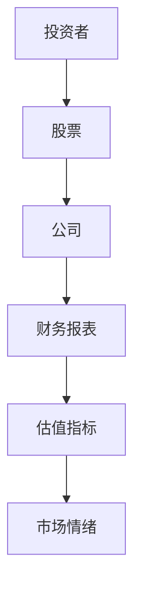
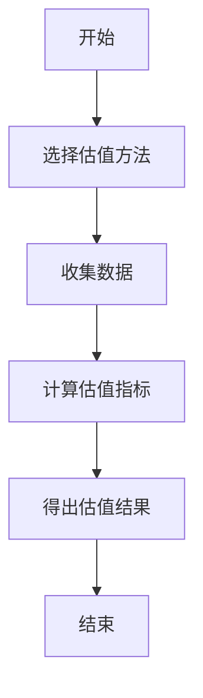
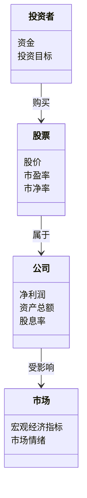

                 


# 德国股市估值: 欧洲经济引擎的投资前景

## 关键词
德国股市, 股市估值, 投资前景, DAX指数, 财务分析, 风险管理

## 摘要
德国股市作为欧洲经济的重要引擎，其估值和投资前景备受关注。本文通过分析德国股市的核心概念、估值方法、影响因素及投资策略，为投资者提供深度见解和实战指导。文章结合技术分析和实际案例，帮助读者掌握德国股市的投资机会和风险管理技巧。

---

## 第一部分: 德国股市估值的背景与核心概念

### 第1章: 德国股市的概述与重要性

#### 1.1 德国股市的定义与特点
##### 1.1.1 德国股市的定义
德国股市是全球最重要的股票市场之一，主要指数为DAX指数，涵盖德国最大的蓝筹股公司。

##### 1.1.2 德国股市在欧洲经济中的地位
作为欧洲最大的经济体，德国的股市对整个欧洲市场的影响力巨大，是全球投资者关注的焦点。

##### 1.1.3 德国股市的主要参与者
包括个人投资者、机构投资者、外国投资者和公司内部员工等。

#### 1.2 德国股市的核心指数
##### 1.2.1 DAX指数的定义与组成
DAX指数由德国法兰克福证券交易所的30家最大公司组成，是衡量德国股市表现的重要指标。

##### 1.2.2 其他重要指数的介绍
如MDAX、SDAX和CDAX等，分别代表不同规模和行业的公司。

##### 1.2.3 指数与股市估值的关系
指数的变化反映了整体市场的估值水平，投资者通过指数分析市场趋势。

#### 1.3 德国股市的历史演变
##### 1.3.1 德国股市的发展历程
从战后重建到20世纪末的稳步增长，再到21世纪的波动与复苏。

##### 1.3.2 重要历史事件对股市的影响
如德国 reunification、欧债危机和新冠疫情对股市的冲击。

##### 1.3.3 当前德国股市的现状
近年来，德国股市表现稳健，受益于德国强大的制造业和出口能力。

---

### 第2章: 德国股市估值的核心概念与联系

#### 2.1 估值的基本原理
##### 2.1.1 估值的定义与目的
估值是通过分析公司财务状况和市场环境，确定其股票的合理价格。

##### 2.1.2 估值的核心要素
包括公司基本面、市场情绪、宏观经济指标等。

##### 2.1.3 估值与投资回报的关系
合理的估值是实现超额收益的前提，过高或过低的估值都可能导致投资亏损。

#### 2.2 核心概念的属性特征对比
##### 2.2.1 财务指标对比表格
| 指标 | 定义 | 重要性 |
|------|------|--------|
| 市盈率 | 股价/每股收益 | 反映市场对公司的盈利能力的评价 |
| 市净率 | 股价/每股净资产 | 适用于资产密集型行业 |
| 股息率 | 每股股息/股价 | 反映分红能力 |

##### 2.2.2 市盈率与市净率的对比
市盈率适用于成长型企业，市净率适用于周期性行业。

##### 2.2.3 公司基本面与市场情绪的对比
基本面决定长期价值，市场情绪影响短期波动。

#### 2.3 ER实体关系图架构


---

### 第3章: 德国股市估值的算法原理

#### 3.1 常用估值方法
##### 3.1.1 市盈率法
通过比较公司市盈率与行业平均水平，判断其估值是否合理。

##### 3.1.2 市净率法
适用于资产密集型行业，评估公司资产的市场价值。

##### 3.1.3 股息率法
通过股息率判断公司的分红能力和吸引力。

#### 3.2 估值模型的构建
##### 3.2.1 DCF模型的原理
通过预测公司未来现金流，折现计算其现值。

##### 3.2.2 市盈率模型的实现
通过行业平均市盈率和公司净利润，计算目标股价。

##### 3.2.3 综合估值模型的设计
结合多种估值方法，综合分析得出更准确的估值。

#### 3.3 算法流程图


#### 3.4 数学模型与公式
##### 市盈率计算公式
$$市盈率 = \frac{股价}{每股收益}$$

##### DCF模型的核心公式
$$企业价值 = \sum_{t=1}^{n} \frac{现金流}{(1 + r)^t}$$

---

### 第4章: 德国股市估值的系统分析与架构设计

#### 4.1 问题场景介绍
##### 投资者面临的估值挑战
如何在复杂市场环境中准确评估公司价值，避免投资风险。

#### 4.2 系统功能设计
##### 领域模型mermaid类图


#### 4.3 系统架构设计
##### mermaid架构图


---

## 第五部分: 项目实战与投资策略

### 第5章: 项目实战

#### 5.1 环境安装与数据收集
##### 安装必要的工具和数据源
- 数据来源：Yahoo Finance、Bloomberg等。
- 工具：Python、Pandas、Matplotlib等。

#### 5.2 核心代码实现
##### 代码实现
```python
import pandas as pd
import yfinance as yf

# 下载数据
msft = yf.download('DAX', start='2020-01-01', end='2023-12-31')

# 计算市盈率
msft['PE'] = msft['Close'] / msft['EPS']

# 可视化
import matplotlib.pyplot as plt
plt.plot(msft.index, msft['PE'])
plt.title('DAX Index PE Ratio')
plt.xlabel('Date')
plt.ylabel('PE Ratio')
plt.show()
```

#### 5.3 案例分析
##### 案例：分析某德国企业的估值
- 数据来源：公司财务报表和市场数据。
- 分析步骤：计算市盈率、市净率，结合行业平均水平和宏观经济指标，得出估值结果。

#### 5.4 代码应用解读
##### 代码解读
```python
import pandas as pd
import yfinance as yf
import matplotlib.pyplot as plt

# 下载数据
data = yf.download('AAPL', start='2020-01-01', end='2023-12-31')

# 计算DAX指数的市盈率
data['PE'] = data['Close'] / data['EPS']

# 可视化
plt.figure(figsize=(12, 6))
plt.plot(data.index, data['PE'], label='PE Ratio')
plt.title('AAPL PE Ratio Analysis')
plt.xlabel('Date')
plt.ylabel('PE Ratio')
plt.legend()
plt.show()
```

#### 5.5 项目小结
##### 实战总结
通过实际案例分析，掌握德国股市估值的实战技巧，提升投资决策能力。

---

## 第六部分: 总结与展望

### 第6章: 总结与最佳实践

#### 6.1 最佳实践 tips
##### 投资者注意事项
- 定期更新估值模型，及时调整投资策略。
- 保持对宏观经济和行业动态的关注。
- 分散投资，降低风险。

#### 6.2 小结
德国股市作为欧洲经济的引擎，其估值和投资前景具有重要意义。通过本文的学习，读者可以掌握德国股市的估值方法和投资策略，为实现稳健的投资回报奠定基础。

#### 6.3 未来展望
随着全球经济的复苏和德国经济的持续发展，德国股市的投资前景广阔，值得投资者长期关注。

---

## 结语
通过本文的详细分析，读者可以全面了解德国股市的估值方法和投资策略，为在欧洲经济引擎中的投资提供有力支持。希望本文的内容能为投资者提供有价值的参考和启发。

