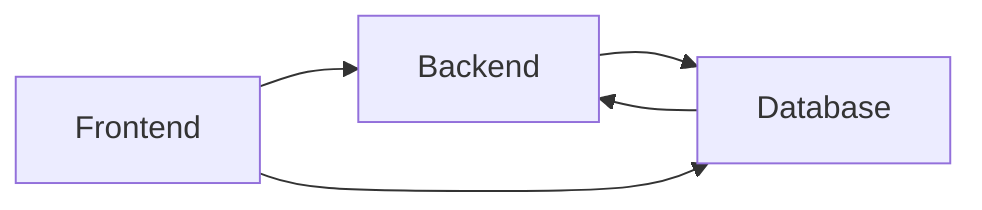
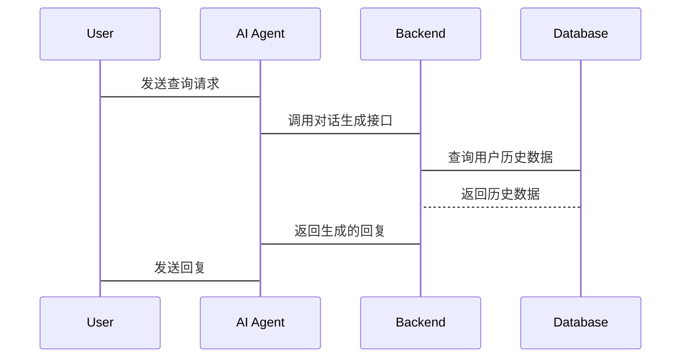

                 


# 心理咨询 AI Agent：LLM 在心理健康领域的应用

---

## 关键词：  
心理健康、AI Agent、大语言模型、LLM、心理咨询、人工智能

---

## 摘要：  
随着人工智能技术的快速发展，大语言模型（LLM）在心理健康领域的应用逐渐成为研究热点。本文深入探讨了如何利用大语言模型构建心理咨询 AI Agent，分析了其核心原理、系统设计及实际应用案例。文章从背景介绍、核心概念、算法原理、系统架构、项目实战等多个维度展开，详细阐述了LLM在心理健康咨询中的潜力与挑战，为相关领域的研究和实践提供了有价值的参考。

---

# 第一部分: 心理咨询 AI Agent 的背景与概念

## 第1章: 心理咨询 AI Agent 的背景与现状

### 1.1 心理健康领域的数字化转型

#### 1.1.1 传统心理咨询的发展历程  
心理健康问题日益受到关注，传统心理咨询主要依赖于专业心理医生或咨询师，服务范围有限，且成本较高。随着数字化技术的普及，心理健康服务逐渐从线下转移到线上，形成了数字化心理健康服务的新模式。

#### 1.1.2 数字化心理健康服务的兴起  
近年来，基于人工智能的数字化心理健康服务逐渐兴起。通过智能算法和大语言模型，用户可以随时随地获得心理咨询支持。这种模式不仅提高了服务的便捷性，还降低了成本。

#### 1.1.3 AI 在心理健康领域的潜力与挑战  
AI技术的引入，特别是大语言模型（LLM），为心理健康服务带来了新的可能性。然而，AI心理咨询的效果依赖于模型的训练数据、算法精度以及对用户需求的准确理解，这些都面临一定的挑战。

### 1.2 大语言模型（LLM）的基本概念

#### 1.2.1 什么是大语言模型  
大语言模型是一种基于深度学习的人工智能模型，能够理解和生成自然语言文本。其核心是基于Transformer架构的神经网络，通过大量数据的训练，模型能够捕捉语言的规律和语义信息。

#### 1.2.2 LLM 的核心特点与技术优势  
- **大规模数据训练**：LLM 通过海量文本数据的训练，能够理解复杂的语言模式。  
- **生成能力强**：LLM 可以生成连贯且自然的文本，适用于对话生成、内容创作等多种任务。  
- **可扩展性**：LLM 可以通过微调适应不同领域的任务，具有较强的通用性。

#### 1.2.3 LLM 在心理咨询中的应用前景  
LLM 在心理咨询中的应用前景广阔，尤其是在对话生成、情感分析和意图识别方面具有显著优势。通过结合专业知识，LLM 可以辅助心理咨询师或直接为用户提供心理支持。

### 1.3 心理咨询 AI Agent 的定义与特征

#### 1.3.1 心理咨询 AI Agent 的定义  
心理咨询 AI Agent 是一种基于大语言模型的人工智能系统，能够通过自然语言对话为用户提供心理健康支持和咨询服务。

#### 1.3.2 心理咨询 AI Agent 的核心功能  
- **对话交互**：通过自然语言处理技术与用户进行实时对话。  
- **情感分析**：识别用户情绪，提供情感支持。  
- **意图识别**：理解用户需求，提供针对性建议。  
- **知识库支持**：基于专业知识库，提供心理健康相关的信息和资源。

#### 1.3.3 心理咨询 AI Agent 的优势与局限性  
**优势**：  
- 24/7 可用性：用户可以随时获得支持。  
- 高效性：快速响应用户需求。  
- 隐私性：用户可以在匿名环境中获得帮助。  

**局限性**：  
- 情感理解的深度有限，无法完全替代专业心理咨询师。  
- 对模型的训练数据和算法精度要求较高。  

### 1.4 本章小结  
本章从心理健康领域的数字化转型入手，介绍了大语言模型的基本概念及其在心理咨询中的应用前景，明确了心理咨询 AI Agent 的定义和核心功能。

---

## 第2章: 大语言模型在心理健康领域的核心原理

### 2.1 大语言模型的训练与优化

#### 2.1.1 基于Transformer的模型结构  
大语言模型通常基于Transformer架构，包括编码器和解码器两个部分。编码器用于理解输入文本，解码器用于生成输出文本。  

**模型结构图**：  
```mermaid
graph LR
    Encoder -> TokenEmbedding
    TokenEmbedding -> PositionalEncoding
    PositionalEncoding -> MultiHeadAttention
    MultiHeadAttention -> FFN
    FFN -> Output
    Decoder -> TokenEmbedding
    TokenEmbedding -> PositionalEncoding
    PositionalEncoding -> MultiHeadAttention
    MultiHeadAttention -> FFN
    FFN -> Output
```

#### 2.1.2 监督微调与适应性优化  
在心理健康领域，大语言模型需要通过监督微调（Fine-tuning）来适应特定任务。例如，可以使用心理健康相关的对话数据对模型进行微调，以提高其在心理咨询任务中的性能。  

#### 2.1.3 强化学习与对话生成  
通过强化学习（Reinforcement Learning）可以进一步优化对话生成的效果。模型通过与虚拟用户或真实用户的互动，不断优化对话策略，使其更加符合人类对话的模式。

### 2.2 心理咨询对话的特征与挑战

#### 2.2.1 心理咨询对话的复杂性  
心理咨询对话通常涉及情感、意图和上下文的理解。对话内容可能包含复杂的心理状态和隐含的需求，这对模型的理解能力提出了更高的要求。

#### 2.2.2 对话中的情感分析与意图识别  
情感分析是理解用户情绪的重要手段，而意图识别则是理解用户需求的关键。在心理咨询中，准确的情感分析和意图识别能够帮助AI Agent 提供更精准的支持。

#### 2.2.3 对话生成的可解释性问题  
AI Agent 的对话生成需要具备可解释性，以便用户和专业人员能够理解其建议的依据。然而，大语言模型的黑箱特性使其生成结果的可解释性成为一个挑战。

### 2.3 基于LLM的心理咨询 AI Agent 架构

#### 2.3.1 输入处理与需求分析  
AI Agent 首先需要对用户的输入进行处理，包括分词、词性标注和句法分析。通过这些步骤，AI Agent 可以准确理解用户的需求和情绪。

#### 2.3.2 对话生成与反馈优化  
基于用户的输入，AI Agent 使用大语言模型生成回复，并通过反馈机制不断优化对话内容。反馈机制可以基于用户满意度、对话流畅性等指标进行调整。

#### 2.3.3 多模态信息的整合与应用  
为了提高心理咨询的效果，AI Agent 可以整合多模态信息，例如用户的表情、语气和行为数据，从而更全面地理解用户的心理状态。

### 2.4 本章小结  
本章详细介绍了大语言模型的训练与优化过程，分析了心理咨询对话的特征与挑战，并提出了基于LLM的心理咨询 AI Agent 的架构。

---

## 第3章: 心理咨询 AI Agent 的系统设计与实现

### 3.1 心理咨询 AI Agent 的功能模块

#### 3.1.1 用户输入处理模块  
用户输入处理模块负责接收用户的输入，并将其转化为模型可以处理的形式。这包括文本的分词、情感分析和意图识别。

#### 3.1.2 情感分析与意图识别模块  
情感分析模块用于识别用户情绪，意图识别模块用于理解用户的需求。这两个模块可以通过预训练模型或自定义模型实现。

#### 3.1.3 对话生成与反馈优化模块  
对话生成模块基于用户的输入生成回复，反馈优化模块通过用户反馈不断优化对话内容。

#### 3.1.4 知识库与上下文管理模块  
知识库模块包含心理健康相关的知识和资源，上下文管理模块用于维护对话的上下文信息，确保对话的连贯性。

### 3.2 系统架构设计

#### 3.2.1 分层架构设计  
系统架构采用分层设计，包括前端、后端和数据库三个部分。前端负责用户交互，后端负责业务逻辑处理，数据库负责数据存储。

#### 3.2.2 模块间的交互关系  


#### 3.2.3 高可用性与扩展性设计  
为了确保系统的高可用性，可以采用分布式架构和负载均衡技术。同时，系统设计需要考虑扩展性，以便未来的功能扩展和性能优化。

### 3.3 系统接口设计

#### 3.3.1 API 接口  
系统可以通过 RESTful API 提供服务，支持文本输入、情感分析和对话生成等功能。  

#### 3.3.2 数据接口  
系统需要与数据库进行交互，存储用户数据和对话历史。数据库可以采用关系型数据库或NoSQL数据库，具体取决于数据结构和查询需求。

### 3.4 系统交互设计

#### 3.4.1 用户与 AI Agent 的交互流程  


### 3.5 本章小结  
本章详细描述了心理咨询 AI Agent 的功能模块和系统架构设计，分析了系统接口和交互流程。

---

## 第4章: 项目实战——基于 LLM 的心理咨询 AI Agent 实现

### 4.1 环境安装

#### 4.1.1 安装 Python 和相关库  
```bash
pip install python transformers torch
```

#### 4.1.2 下载预训练模型  
使用 Hugging Face 提供的预训练模型，例如 GPT-2 或 GPT-3。

### 4.2 核心代码实现

#### 4.2.1 对话生成模块  
```python
from transformers import AutoModelForCausalLM, AutoTokenizer

model_name = "gpt2"
tokenizer = AutoTokenizer.from_pretrained(model_name)
model = AutoModelForCausalLM.from_pretrained(model_name)

def generate_response(input_text):
    inputs = tokenizer.encode(input_text, return_tensors="pt")
    outputs = model.generate(inputs, max_length=50, num_beams=5, temperature=0.7)
    response = tokenizer.decode(outputs[0], skip_special_tokens=True)
    return response
```

#### 4.2.2 情感分析模块  
```python
from transformers import pipeline

sentiment_analyzer = pipeline("sentiment-analysis")

def analyze_sentiment(text):
    result = sentiment_analyzer(text)
    return result[0]["label"]
```

### 4.3 项目小结  
本章通过实际案例展示了如何基于大语言模型构建心理咨询 AI Agent，详细介绍了环境安装和核心代码的实现。

---

## 第5章: 最佳实践与总结

### 5.1 小结  
本文系统地介绍了心理咨询 AI Agent 的背景、核心原理和系统设计，分析了大语言模型在心理健康领域的应用潜力。

### 5.2 注意事项  
- 数据隐私和用户隐私保护是心理健康服务的重要问题。  
- 心理咨询 AI Agent 的结果需要与专业心理咨询师的建议相结合，不能完全替代专业服务。  

### 5.3 未来趋势  
随着技术的发展，大语言模型在心理健康领域的应用将更加广泛。未来的研究方向包括提高模型的可解释性、优化对话生成算法以及探索多模态信息的整合。

### 5.4 拓展阅读  
- 《Large Language Models in Healthcare》  
- 《AI in Mental Health: Opportunities and Challenges》  

---

## 结语  
大语言模型为心理健康服务带来了新的可能性，心理咨询 AI Agent 作为其中的重要应用，正在逐步改变传统的心理咨询模式。未来，随着技术的不断进步，心理咨询 AI Agent 将在心理健康领域发挥更大的作用。

--- 

**END**

