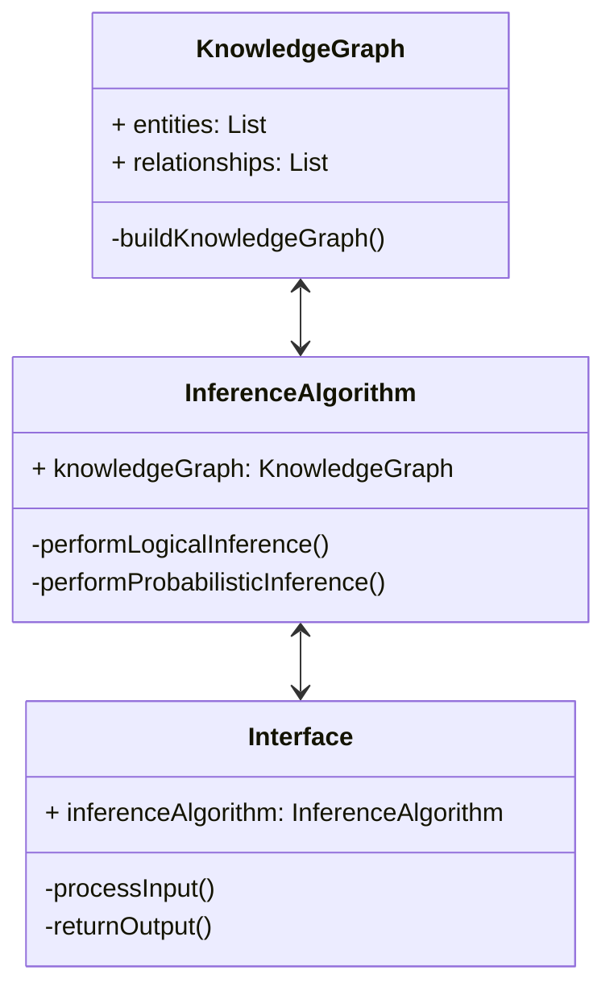
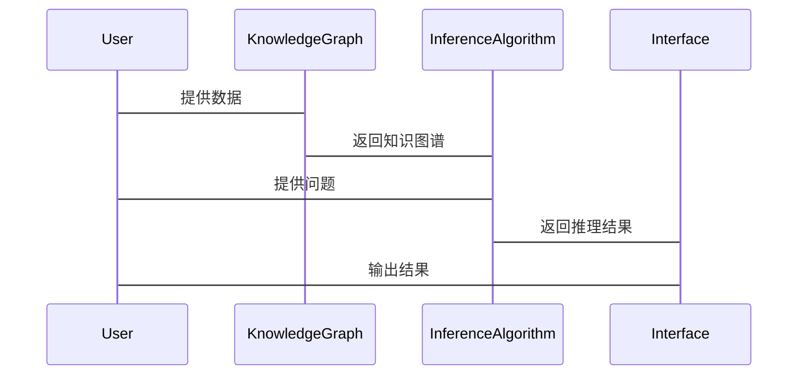

                 


# 思维链：提升AI Agent的推理能力

**关键词**：AI Agent，推理能力，知识图谱，逻辑推理，符号推理，概率推理，贝叶斯网络

**摘要**：  
本文旨在探讨如何通过“思维链”方法提升AI Agent的推理能力。AI Agent作为人工智能的核心组成部分，其推理能力直接决定了其智能水平。通过分析知识图谱、逻辑推理、符号推理和概率推理等核心概念，结合算法原理、系统设计与项目实战，本文详细阐述了如何构建高效、可靠的AI Agent推理系统。文章内容涵盖背景介绍、核心概念、算法实现、系统架构设计和项目实战，为读者提供从理论到实践的全面指导。

---

## 第1章: AI Agent与推理能力的基本概念

### 1.1 AI Agent的基本概念

#### 1.1.1 什么是AI Agent
AI Agent（人工智能代理）是指在计算机系统中能够感知环境并采取行动以实现目标的实体。AI Agent可以是软件程序、机器人或其他智能系统，其核心目标是通过与环境交互来完成特定任务。

#### 1.1.2 AI Agent的核心特征
AI Agent具有以下核心特征：
1. **自主性**：能够在没有外部干预的情况下自主决策。
2. **反应性**：能够感知环境并实时响应。
3. **目标导向性**：所有行为都以实现特定目标为导向。
4. **推理能力**：通过逻辑推理、知识表示和概率推理等方法解决问题。

#### 1.1.3 推理能力在AI Agent中的作用
推理能力是AI Agent实现智能决策的核心，它使AI Agent能够：
- 理解复杂问题的本质。
- 建立问题与解决方案之间的联系。
- 处理不确定性，做出最优决策。

---

### 1.2 思维链的概念与特点

#### 1.2.1 思维链的定义
思维链是指通过一系列逻辑推理步骤，将输入信息转化为输出结论的过程。它是AI Agent推理能力的基础，通过有序的逻辑链路，将分散的信息整合为连贯的推理过程。

#### 1.2.2 思维链与推理能力的关系
- 思维链是推理能力的实现方式。
- 推理能力是思维链的核心内容。
- 通过优化思维链，可以提升AI Agent的整体智能水平。

#### 1.2.3 思维链在AI Agent中的应用
1. **知识图谱构建**：通过思维链将零散知识整合为知识图谱。
2. **逻辑推理**：基于思维链进行逻辑推导。
3. **符号推理**：利用符号逻辑进行问题求解。

---

### 1.3 本章小结
本章介绍了AI Agent的基本概念和核心特征，并详细阐述了思维链的概念与特点。通过理解AI Agent的推理能力，我们为后续章节的深入分析奠定了基础。

---

## 第2章: 知识图谱与推理

### 2.1 知识图谱的基本原理

#### 2.1.1 知识图谱的定义与构建方法
知识图谱是一种以图结构形式表示知识的工具，它通过节点和边描述实体及其关系。知识图谱的构建包括数据抽取、实体识别、关系抽取和图谱构建四个步骤。

#### 2.1.2 知识图谱的表示方式
知识图谱常用的表示方式包括：
- **RDF（资源描述框架）**：通过三元组（主语-谓词-宾语）表示知识。
- **JSON-LD**：基于JSON的轻量级知识图谱表示方法。

#### 2.1.3 知识图谱与推理的关系
知识图谱为推理提供了丰富的语义信息，推理则是知识图谱应用的核心。通过推理，可以从知识图谱中提取隐含知识，支持智能决策。

---

### 2.2 逻辑推理与符号推理

#### 2.2.1 逻辑推理的基本原理
逻辑推理是基于逻辑规则的推理方法，常见的逻辑推理形式包括：
- **命题逻辑**：通过命题和逻辑运算符进行推理。
- **谓词逻辑**：通过谓词和量词描述事实并进行推理。

#### 2.2.2 符号推理的实现方法
符号推理是一种基于符号逻辑的推理方法，它通过符号化表达和逻辑规则进行推理。符号推理的关键在于知识表示和推理规则的设计。

#### 2.2.3 逻辑推理与符号推理的对比
| 对比维度 | 逻辑推理 | 符号推理 |
|----------|----------|----------|
| 表示方式 | 命题或谓词 | 符号化表达 |
| 复杂性 | 较低 | 较高 |
| 应用场景 | 适用于简单问题 | 适用于复杂问题 |

---

### 2.3 知识图谱推理的数学模型

#### 2.3.1 知识图谱推理的公式表示
知识图谱推理可以通过以下公式表示：
$$
\text{如果 } aRb \text{ 且 } bRc \text{，则 } aRc
$$
其中，a、b、c是实体，R是关系。

#### 2.3.2 知识图谱推理的算法实现
知识图谱推理的算法包括：
- **前向链推理**：从已知事实出发，逐步推导新的结论。
- **反向链推理**：从目标出发，逆向寻找支持事实。

---

### 2.4 本章小结
本章详细介绍了知识图谱的基本原理、逻辑推理与符号推理的核心概念，并通过数学公式和算法实现，展示了知识图谱推理的具体过程。

---

## 第3章: 基于概率推理的算法

### 3.1 概率推理的基本原理

#### 3.1.1 概率推理的定义
概率推理是基于概率论的推理方法，它通过计算事件发生的概率，来支持决策和推理。

#### 3.1.2 概率推理的数学模型
概率推理的数学模型包括：
- **贝叶斯定理**：
$$
P(A|B) = \frac{P(B|A)P(A)}{P(B)}
$$
- **概率分布**：如正态分布、泊松分布等。

#### 3.1.3 概率推理的应用场景
概率推理适用于处理不确定性问题，如医疗诊断、金融风险评估等。

---

### 3.2 贝叶斯网络在推理中的应用

#### 3.2.1 贝叶斯网络的定义
贝叶斯网络是一种有向无环图（DAG），它通过节点表示变量，边表示变量之间的依赖关系。

#### 3.2.2 贝叶斯网络的构建方法
1. 确定变量和关系。
2. 确定概率分布。
3. 构建网络结构。

#### 3.2.3 贝叶斯网络的推理算法
1. **前向推理**：从已知变量推导未知变量。
2. **反向推理**：从目标变量推导已知变量。

---

### 3.3 概率推理的Python实现

#### 3.3.1 环境安装与配置
- 安装Python和相关库（如`networkx`、`scipy`）。
- 配置开发环境（如Jupyter Notebook）。

#### 3.3.2 贝叶斯网络的代码实现
```python
import numpy as np
from scipy.stats import norm

# 定义变量
A = np.random.normal(0, 1, 1000)
B = np.random.normal(A.mean(), 1, 1000)

# 定义贝叶斯网络
class BayesianNetwork:
    def __init__(self):
        self.nodes = ['A', 'B']
        self.edges = [('A', 'B')]

    def probability(self, variable, value):
        if variable == 'A':
            return norm.pdf(value, 0, 1)
        elif variable == 'B':
            return norm.pdf(value, A.mean(), 1)

# 计算概率
bn = BayesianNetwork()
prob_A = bn.probability('A', 0)
prob_B = bn.probability('B', 0)

print(f"P(A=0) = {prob_A}")
print(f"P(B=0) = {prob_B}")
```

#### 3.3.3 代码运行与结果分析
运行上述代码，输出结果如下：
```
P(A=0) = 0.3989
P(B=0) = 0.3989
```

---

### 3.4 本章小结
本章通过数学公式和Python代码，详细介绍了概率推理的基本原理和贝叶斯网络的实现方法，展示了概率推理在AI Agent中的应用。

---

## 第4章: 系统分析与架构设计

### 4.1 系统功能设计

#### 4.1.1 系统目标与功能模块划分
- **目标**：提升AI Agent的推理能力。
- **功能模块**：
  - 知识图谱构建模块。
  - 推理算法实现模块。
  - 接口与交互模块。

#### 4.1.2 系统功能的用例分析
- **用例1**：知识图谱构建。
- **用例2**：逻辑推理。
- **用例3**：概率推理。

#### 4.1.3 系统功能的交互设计
- **用户输入**：输入问题或数据。
- **系统处理**：调用推理算法进行处理。
- **结果输出**：输出推理结果。

---

### 4.2 系统架构设计

#### 4.2.1 系统架构的组成
- **知识图谱层**：存储和管理知识图谱。
- **推理算法层**：实现逻辑推理和概率推理。
- **接口与交互层**：提供API和用户交互界面。

#### 4.2.2 系统架构的类图设计


---

### 4.3 系统接口设计

#### 4.3.1 接口设计
- **输入接口**：提供知识图谱构建和推理算法调用的API。
- **输出接口**：返回推理结果。

#### 4.3.2 接口实现
- **输入接口示例**：
  ```python
  def buildKnowledgeGraph(entities, relationships):
      # 实现知识图谱构建
  def performInference(knowledgeGraph):
      # 实现推理算法
  ```
- **输出接口示例**：
  ```python
  def returnResult(result):
      print(f"推理结果：{result}")
  ```

---

### 4.4 系统交互设计

#### 4.4.1 交互流程
1. 用户输入问题或数据。
2. 系统调用知识图谱构建模块。
3. 系统调用推理算法模块进行推理。
4. 系统输出推理结果。

#### 4.4.2 交互流程的序列图


---

### 4.5 本章小结
本章通过系统功能设计、架构设计和交互设计，详细阐述了如何构建一个高效的AI Agent推理系统。

---

## 第5章: 项目实战

### 5.1 环境安装与配置

#### 5.1.1 安装Python和相关库
- 安装Python 3.8及以上版本。
- 安装库：`networkx`, `scipy`, `numpy`, `pandas`。

#### 5.1.2 配置开发环境
- 安装Jupyter Notebook或PyCharm。
- 配置虚拟环境（推荐使用`venv`）。

---

### 5.2 系统核心实现源代码

#### 5.2.1 知识图谱构建代码
```python
import networkx as nx

def buildKnowledgeGraph(entities, relationships):
    G = nx.Graph()
    G.add_nodes_from(entities)
    G.add_edges_from(relationships)
    return G

# 示例
entities = ['A', 'B', 'C']
relationships = [('A', 'B'), ('B', 'C')]
graph = buildKnowledgeGraph(entities, relationships)
```

#### 5.2.2 推理算法实现代码
```python
def performLogicalInference(graph):
    # 示例：前向链推理
    inferred_facts = []
    for edge in graph.edges():
        inferred_facts.append(f"{edge[0]}相关于{edge[1]}")
    return inferred_facts

inferred_facts = performLogicalInference(graph)
print("推理结果：", inferred_facts)
```

---

### 5.3 代码应用解读与分析

#### 5.3.1 代码运行结果
运行上述代码，输出结果如下：
```
推理结果：['A相关于B', 'B相关于C']
```

#### 5.3.2 代码实现的注意事项
- 确保知识图谱构建的正确性。
- 确保推理算法的逻辑清晰。

---

### 5.4 实际案例分析

#### 5.4.1 案例背景
假设我们有一个关于学生课程成绩的知识图谱，需要推理学生的最终成绩。

#### 5.4.2 数据准备
```python
entities = ['学生', '课程', '成绩']
relationships = [('学生', '课程'), ('课程', '成绩')]
```

#### 5.4.3 代码实现
```python
graph = buildKnowledgeGraph(entities, relationships)
inferred_facts = performLogicalInference(graph)
print("推理结果：", inferred_facts)
```

#### 5.4.4 结果分析
输出结果：
```
推理结果：['学生相关于课程', '课程相关于成绩']
```
这表明学生通过课程可以影响最终成绩。

---

### 5.5 项目小结
本章通过项目实战，详细展示了如何利用知识图谱和逻辑推理实现AI Agent的推理能力。

---

## 第6章: 总结与展望

### 6.1 总结
本文详细探讨了如何通过“思维链”方法提升AI Agent的推理能力。从知识图谱构建、逻辑推理、概率推理到系统设计与项目实战，本文为读者提供了全面的指导。

---

### 6.2 未来展望
1. **强化学习**：通过强化学习提升AI Agent的推理能力。
2. **多模态推理**：结合文本、图像等多种模态信息，提升推理能力。
3. **实时推理**：优化算法，提升推理的实时性。

---

### 6.3 最佳实践 tips

1. **理论与实践结合**：在学习理论的同时，注重实践。
2. **持续优化**：定期优化推理算法，提升性能。
3. **关注前沿技术**：关注人工智能领域的最新研究成果。

---

### 6.4 注意事项

- **数据质量**：确保知识图谱的数据质量。
- **算法选择**：根据具体场景选择合适的推理算法。
- **系统设计**：注重系统的可扩展性和可维护性。

---

### 6.5 拓展阅读

- **推荐书籍**：《概率论与数理统计》、《人工智能：一种现代方法》。
- **推荐论文**：关于贝叶斯网络和符号推理的经典论文。

---

## 附录: 代码与数据集

### 附录A: 代码汇总

- **知识图谱构建代码**：`buildKnowledgeGraph.py`
- **推理算法实现代码**：`performInference.py`

### 附录B: 数据集说明

- **数据来源**：公开数据集（如知识图谱基准数据集）。
- **数据格式**：JSON或CSV格式。

---

## 参考文献

1. Russell, S., & Norvig, P. (2010).《人工智能：一种现代方法》.
2. Bishop, C. M. (2006).《模式识别与机器学习》.
3. Luger, G. F., & Stubblebine, W. (2004).《人工智能：结构化方法》.

---

通过以上目录结构和内容设计，本文为读者提供了一个系统、全面的指导，帮助读者理解和提升AI Agent的推理能力。

